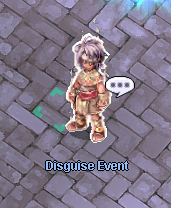

---
hide:
  - toc
---
# Auto Events
## **Contents**
1. [Disguise Event](#disguise-event)
2. [Find the Mushroom Event](#find-the-mushroom-event)

# Disguise Event

## Description
This event is quite simple. When the event starts, you will see an announcement:

At the start of the event, the Disguise Event NPC in Prontera (`/navi prontera 139/163`) disguises as a random monster. Your task is to shout out the monster's name. If you're correct, you will receive a prize:  **Poring Coin**. If not, keep trying! That’s all there is to this event.

## Event Details
- **Rounds:** 10
- **Frequency:** Daily
- **Rewards:** 5x  **Poring Coin**

## In-Game Example

Good luck and have fun!

# Find the Mushroom Event

## Description
During this event, **Black Mushrooms** will be randomly summoned in one of the cities. Kill the mushrooms to receive a  **Poring Coin** for each mushroom you defeat. The event will end once all mushrooms are killed; otherwise, it will continue indefinitely.

When the event starts, an announcement will appear:

## How to Check the Event's Status
To check the event’s current status, go to Prontera and find the **Find the Mushroom NPC** at `/navi prontera 142/228`.

### In-Game Example
  

Good luck and have fun!