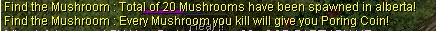
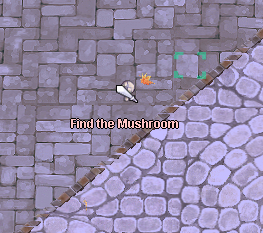
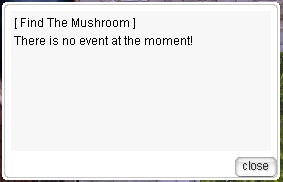

---
hide:
  - toc
---

# 🤖 Auto Events

**uaRO** features automated events that run throughout the day, giving players fun ways to earn rewards and take a break from regular gameplay.

These events require no manual hosting and are available to all players.

---

## 🎭 Disguise Event

When the event starts, you will see a global announcement:

At the start of the event, the **Disguise Event NPC** in Prontera  
(`/navi prontera 139/163`) disguises itself as a random monster.

Your task is to **shout the monster’s name**.

- If your answer is correct, you will receive **5x Poring Coins**
- If not, you can keep trying until the round ends

### 📋 Event Details

- **Rounds:** 10  
- **Frequency:** Every 2 hours  
- **Rewards:**  **5x Poring Coins** per correct answer

### In-Game Example

Good luck and have fun!

---

## 🍄 Find the Mushroom Event

When the event starts, you will see a global announcement:

During this event, **Black Mushrooms** are randomly summoned in one of the cities.

- Defeat the mushrooms to earn rewards
- The event ends when:
  - All mushrooms are defeated, or
  - **1 hour** passes and remaining mushrooms despawn

### 📋 Event Details

- **Duration:** 1 hour  
- **Frequency:** Every hour  
- **Rewards:**  **4x Poring Coins** per mushroom killed

### 🔍 Check Event Status

You can check whether the event is currently active by talking to the  
**Find the Mushroom NPC** in Prontera  
(`/navi prontera 142/228`).

### In-Game Example

  

Good luck and happy hunting!

---

## 🎲 Dice Event

**Dice Event** is a fast-paced elimination event where players rely on luck and quick decisions.

Only **one winner** can remain — or the event may end with **no winner**.

---

### 🏆 Winner & Rewards

- **Maximum winners:** 1 player  
- **Reward:** 🪙 **75 Poring Coins**
- Rewards are **automatically mailed** to the winner upon victory

---

### ⏰ Schedule

- The event starts **every even hour**

---

### 🎟 Participation

Join the event using the command: @dice

#### 📋 Requirements

- **Minimum participants:** 4 players  
- If **3 or fewer players** join, the event is **cancelled**

---

### ⚙️ Event Mechanics

#### 🎯 Main Event

1. An NPC rolls a number from **1 to 4**
2. Each player chooses **one box**
3. Players who selected the **rolled number** advance
4. All other players are **warped out**
5. The event ends when:
   - Only **1 player remains**, or
   - **No players remain**

---

#### 🧠 Bonus Quiz Round

- After **3 rounds**, a **Quiz Round** begins
- The NPC asks a **True or False** question
- Players must move to the correct **True / False box**
- Incorrect answers result in elimination

If **two or more players remain**, the event continues from the **Main Event**.

---

Good luck, and may RNG be on your side! 🍀