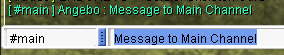
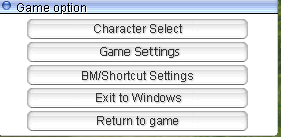
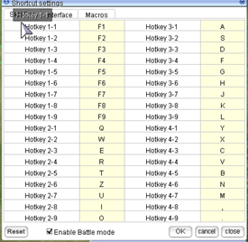

# uaRO Beginner's Info & Quick Start Guide
This is a player-written guide for new uaRO players.

**Original Author**: Angebo  
**Author Discord**: angebo (formerly Angebo#0332)  

## 📘 About this Guide  
This guide will contain basic information on how to have a good start at uaRO. It provides an overview about important features and where to find information. There is a short class overview and a Quick Starter guide which can push you up to 60+ within a short time. It ends with some suggestions where to make your first small funds.

## 🛠️ Important uaRO Features  

### Autoloot
An important feature to know about is `@autoloot`. If you want to know more about how to configure it, look in the **[commands list](Commands.md#database-commands)**. This feature really boosts the farming ability and efficiency of ranged and or AoE based classes a lot: After killing a target, they do not need to close the distance to collect the loot. This is 1-4 seconds less time to spend after killing.

### Increased Sight
The sight range is increased so you are allowed to scroll out further than usually.
This allows you to use ranged skills like DS to its fullest, buffing Bow classes. In addition it's easier to mob and avoid enemies you dislike.

!!! note
     For Archer and Rogue: DS has a 3 cells higher range than your auto attacks. If you DS on max range and then try to AA, your character will run “weird” because your target is out of range.

### Rodex Mail System
You can send Items from and to everywhere for a small fee of 2.5k per item stack. So you can restock consumables and send your loot away wherever you want. You have to care less for weight limit because your solution is only a few seconds away. You can send more than one mail and open them one after the other when you want, they are stored for 14 days. You can only send tradeable items this way, not account bound ones.

!!! note
     It is said that it is possible to lose the items in the mail system. If this happens, go to the Discord, and use the Channel `#submit-ticket`. Do not send important or expensive items this way.

!!! note
     You can not send Great Nature this way.

###  [Poring Coins (PC)](Poring_Coins_System.md)
Most enemies have a 5% Chance to drop an item called Poring Coin, making high kill count valuable by itself. They have various use cases.  

#### Money
They sell well to players and always will. Sell them whenever you need some money fast.

####  Field Manual  
Doubles your base exp. A great help while leveling. They double exp gained through quests as well, important for repeatable EXP quests. 

####  Infinite Fly Wing  
0 Weight, account bound, can be used infinite amount and time. A lot of people name the IFW a “game changer”. Tho none was ever able to explain what it actually changes. You still can use normal Fly Wings from the NPC and transfer them easily with the rodex mail system. As a beginner, getting some equipment is more important than a QOL (quality of life) item.

#### [Quest Headgears](Dimonka_Headgear_Quest.md)
There are various powerful headgears you can craft using Poring Coins, for example Rideword and Chick Hat.  

### [Elemental Converter](https://irowiki.org/w/index.php?title=Create_Elemental_Converter&oldid=47391)
The item “Elemental Converter” endows your weapon with one of the four elements, fire, water, wind or earth - like Endow. Other than the item description they last for 30 minutes and are sold by players for around 10k. These allow you to not care for elemental weapons or arrows, except some rare use cases (or f.e. Holy).  

### [Card Exchanger](Card_Exchange.md)
Cards can be traded for points and exchanged for Bloody Branches or Old Card Album. So any card has at least a basic value.  

### Myst Case card 
The drop chance for  Gift boxes from Myst Case card is increased, making it a good farming item - the more you kill, the better.

### [Warper System](Warper_System.md)
Once you finish a Dungeon access quest you can unlock a Warpra helper. This allows you to always warp there with all your characters of this account for a fee of 5k.  
 

### [Inn Buffs](Improvements.md#superior-inns)
Using an Inn costs 10k and gives you Agi Up and Blessing 10 for 10 Minutes. This is very useful if you level on maps you can access very fast, close to a town, with a warp if you are Aco Class, or with Warpra.  

### [Sitting Regeneration](Improvements.md#increased-natural-recovery)
If you sit, after 10 seconds you have a super regeneration that fills your HP / SP very fast. This values SP pool over SP regeneration at least for solo leveling. For mass parties you still want to have regeneration.  

### Party features

#### Party EXP Bonus
For every member in the party, all get a +15% Exp Bonus. So at a full party, all get 280% Exp instead of 100%.
This change values the party size: filling a party with classes that don't contribute much still is an improvement. For example, the 12th person takes 1/12 = -8.3% Exp. Their bonus alone offers 280/265-1 = +5.7% exp.
One special use case are parties like Sleeper Parties, where everyone levels on their own (and items are not shared) but they share Exp - even If the kill count differs, everyone levels faster than on their own.

#### Idle Mechanic
Exp and Item sharing is disabled for idle members after 60 seconds. You are idle when you don't make an input, like moving or skill usage.
This mechanic punishes standing parties, so most are moving ones.

#### EXP Tap (Reminder)
For every person dealing to or receiving damage from a monster, it gives +25% Exp. In uaRO this mechanic also is triggered by non damaging skills like Hammerfall, Signum Crusis, or First Aid.
Combined with the party bonus this mechanic makes "EXP Tappers” especially valuable and mass parties usually are filled up with a bunch of them. EXP Tappers usually have any kind of AoE with low damage (or even none) which they use at the gathered mob once before it dies.

### [Repeatable EXP Quests](Repeatable_Quests.md)
These are important for three reasons:

- Most Exp items can be sold to players for a reasonable price, so it's a possible source of money.
- The Killing Quests can help you to level faster (namely Alligator, Dryad, and Remover).
- Once you rebirth, you will have a lot of Huge and Sharp Leaf (Pinguicula drop them). They will help you to become a higher level really quick.  

### Reset NPC
This NPC is located in the Prontera Main Office and allows you to reset your skills, your stats, or your skills and stats. You can do it as often as you like for a fee, with the first time being free. This allows you to first choose a beginners friendly build and once you own the money (and equipment) you can change to a late game one.

## 🔗 Sources of Information

### [uaRO Discord](https://discord.gg/BNYnsDfnzN)
If you have questions you are unable to answer with the other sources or want contact with Server Staff, this is your way to go. It also has a channel for each basic class where you can ask about guides, builds and so on. Feel free to not blindly trust others but ask until you understand. It also has a very detailed, player made resources. There is a static link on the [uaRO main page](https://uaro.net/).  

### [uaRO Wiki](https://wiki.uaro.net/site/)
There is interesting information in it, and is recommended to read.

### [iRO Wiki](https://irowiki.org/classic/Main_Page)
Note: Always take care if there is “classic” in the link. If not, if it’s called “wiki”, the nformation is related to Renewal RO and often incorrect.

This site contains a ton of information about game mechanics and quests. Aside that, it has a builds chapter for every class where you can read informations about common (and less common) builds, which stats and skills they rely on, and which advantages and disadvantages they have.  

### [RMS – Rate My Server](https://ratemyserver.net/)
This site is a big database for items, monsters, skills and quests. Most of these are available in uaRO. You can search for equipment and monsters by specific attributes (like their element) and check the maps they are on. Monsters have a “Skill Analysis” tab that tells you under which conditions which skills are used. There is a World Map as well.  

### [Rocalc](https://rocalc.com/)
This is the best calculator I know, and most of the time fits to uaRO. If you want to compare equipment, builds and ideas, this is your way to go.   

### [Skillsim](https://skillsim.irowiki.org)
You can plan your skill tree at this site. Please note that it has a renewal skill tree, but they are mostly correct pre renewal as well. The only known change is: Lord Knight needs Spear Mastery 10 (instead of 5) for Spiral Pierce.  

## 🧙 Choosing Your First Class

### Beginner Friendly Classes
Beginner friendly classes are considered classes that do not need good, expensive equipment to perform but have either access to cheap-and-good stuff (Archer and Swordman Class) or don’t rely on equipment (SL, Ninja, Priest). 

### Merchant
Everyone needs a Merchant: Overcharge and Discount spare you quite some money in the long run. Only stat STR with it and don’t play it as the main class. If you want to, start a different Merchant Class for that.

### Knight
A Knight is a very beginner friendly farming character. The weapon Ahlspiess allows you to kill high DEF characters very fast. You can level fast and earn money by going to Sleepers. A good build is STR / AGI based - as a beginner, the Flee will help you more than VIT will do. Skills to use are either Bowling Bash or Brandish Spear.
Sleeper is a very common farming map for raw Zeny: They drop Great Nature which can be split up into Green Live ([Ore Downgrading Quest](https://irowiki.org/classic/Ore_Downgrading)) and sold to an NPC.

!!! note
     There is a feature or bug which Brandish Spear allows to deal damage twice. This makes it possible to onehit sleeper with it. 

### Crusader
Crusader is kinda similar to Knight. You can equip an Ahlspiess, but instead of Bowling Bash or Brandish Spear, you use Spear Quicken and fast auto attacks. It kills slower than Knight, but does not rely on SP.

### Hunter
Hunter is a generally good starting character: the weapon Orc Archer Bow is cheap and powerful, especially combined with Elemental Converter. Double Strafe Hunter (high DEX, medium AGI, medium INT) is a good choice for beginners; it deals a lot of damage in a short period of time and can onehit several targets. A good starting place for EXP and Zeny are Hill Winds.

### Bard / Dancer
Bard and Dancer are similar to Hunter, but have a higher SP pool. The disadvantage is that they do not rebirth into a Sniper. Usually they are heavily requested in mass parties, so easy and fast to level.

### Soul Linker (Esma)
An Esma Bolt SL has its own play style. They can survive quite a bit and deal a huge amount of single target damage without any equipment. The time until you have Esma, you need to rely on Mercenaries, but after you can go to a lot of places. Fastest leveling and some money will be at Pinguicula. At higher levels you can explore the world, including Glast Heim for example.

### Ninja (Magic)
The magic Ninja deals good magic damage on range and have some protection skills, so they do not need to rely on equipment or consumables (except their stones, which are cheap and you can buy them in the left Inn in Prontera). Fastest leveling and some money will be at Pinguicula.

### Priest
This class is hard to classify. On the one hand, they do not need equipment and are heavily requested for parties, so can level fast. And they are capable of using mercenaries much longer than other classes due to their support abilities. On the other hand, they need some experience to play. But the most disadvantage is that you can’t do much with it except playing and leveling. You will not earn much money or hunt items with it. You are a high level priest - that is all.

### Rogue
Often said to be a good farming character for beginners, it loses to Archer class: there isn’t a cheap but good weapon for thief class, and range is a huge advantage thanks to autoloot. There are still ways to level fast (either Bow with BB or Magic Build) and become stalker. But others are more friendly to beginners. [Read Angebo’s Rogue Speed Leveling and Limited Stalker Guide](https://docs.google.com/document/d/1l5XiVfiEh7FTHiY2rwxheL9lsTIcwgcirpmcIPHKT04/edit?tab=t.0).

### Assassin
Never been beginner friendly, and they still are not. Same disadvantages as Rogue. They suffer even more thanks to a change at the Monster Stacking behavior making it hard to properly grimtooth. [Read Angebo’s Assassin and Assassin Cross Guides](https://drive.google.com/drive/folders/1vJGmkgGDUGizd23kBIeRAoeTjgje_hPN).

### Wizard
Yes, you can level in parties and with vertical fire wall. But aside from that, you are limited - Ninja and Soul Linker are more beginner friendly magic damage dealers. 

### Sage
Even worse than the Wizard. There is no dual clienting allowed, so you better not try to make an auto-bolt Sage, except with a reliable friend.

### Blacksmith
Lacks proper beginner weapons.

### Alchemist
Never been beginner friendly, never will be.

### Monk
Investigation Monk can be useful at Sleeper, but need notable funds to perform well. Better choose Knight over them. And combo Monk lacks a proper beginner weapon. Steel Body makes you a medium requested Tank for mass parties.

## 🚀 Quick Start Guide
This chapter focuses on leveling up to 50-60+ fast so you can become your second class soon. It can be done with any class, because it uses Mercenaries.

They are a helpful tool for beginners because they offer quite some strength in early levels, but they drop off soon around level 60. That is when you can begin to stand on your own.

### Create Your Character
First decide which class you want to take. Then create a new character, choose name and hair style. Start.

!!! note
     Check your hairstyle in game, it might vary. You can change it freely [in Prontera at the Stylist](Custom_NPC.md) after the Novice Grounds.

### Novice Grounds
Start with the [Novice Grounds](Remastered_Novice_Location.md). You can collect some early zeny here and gain EXP to get to first class. If you can, save up at least 7k zeny.

### First Class Job Change Quest
Every class article in iRO Wiki has a job change guide included. If you prefer a video instead go to youtube and search for “Ragnarok Online Class Job Change”. Follow the guide and change your job. [Read the Classes Job List](https://irowiki.org/classic/Classes).

### Short Information about Mercenaries
[Read about Mercenaries](Mercenary_System.md).

Mercenaries are a helpful tool for beginners. Their cost is low and their power high compared to any low-level class without very good equipment. They can push you quickly to level 50 and higher, but then they will fall behind. You can purchase up to lvl 6 scrolls for zeny only, above you need Loyalty. I don’t go deeper into it, because it is hard to farm loyalty – you will grow too fast in levels – and you should start to be self-dependent after this.  

There are three types of Mercenaries:  

- Spearman. You get them in Prontera, they have high defense and good HP regeneration.  
- Bowman. You get them one map above Payon, they have decent damage and ranged attacks, but not much defense.  
- Fencer. You get them in Izlude, they have some flee but less defense and regeneration as spearman does.  
  

### Level 15 - 35
After your job change, talk to the Kafra and warp to Prontera. We have 2 things to do there:

1. Enter the [Main Office](Main_Office.md) (south-west from prontera fountain; left to where you spawn) and talk to the Platinum Skill NPC. You will receive the Quest Skills without further quest. At least Back Slide is something you might need.
2. Go to the north-west corner of Prontera and talk to the Mercenary Manager.

!!! Hint
     Copy `/navi prontera 41/337` in the Chat and follow the arrows on the ground.

That’s what you saved up 7k zeny for: Hire Mercenary -> 1st Grade Spear Mercenary -> Yes.

!!! Hint
     If you have some more zeny, you can talk to the Mercenary Merchant left of it and buy one Mercenary Concentration Potion.

After you picked up the Skills and one Scroll, go back to any Kafra (or use one of your Novice Butterfly Wings). There are a few areas to go now, I recommend going to Spores, one map south of Payon. Now let your mercenary rage on for 30 minutes. Do not attack on your own, because you risk dying and losing your mercenary.

After that, you will be level 25 or higher and have some Strawberry.  

Sell these to players using `@wb2 Strawberry`. Every single one of them will give you more than 1k zeny and provide enough funds to buy your next Scroll: go to Prontera, buy a level 2 scroll, and go back to Payon. Repeat this until you are level 35.

!!! Hint
     A level 2 Spearman can survive at Wolves (2 maps south of payon) for a while. They will die but kill some of them. This is faster EXP, but you might need a new one sooner.

### Sidestep: Your first Merchant

!!! note
     If you already have a merchant, skip this part.

By now you should take a small break and create a Merchant. So put some zeny (like 10k) in your Bank (CTRL+B) and create a new character: your Overcharge and Discount Merchant. You can start as Novice just as you did before. Put all your stat points into STR. After you hit base 15, leave the Novice Ground and say you want to become a Merchant. 

Follow this guide: [Merchant Job Quest](https://irowiki.org/classic/Merchant_Job_Change_Guide)

Buy a Mercenary and kill Spores again. You want at the very least these skills:  

- Enlarge Weight Limit 3 (pre-requirement)  
- Overcharge 10 (Items sold to NPC give additional 24% zeny)  
- Discount 10 (Items bought from NPC cost 24% less)  

[Discount Merchant Job Build](https://skillsim.irowiki.org/bsm.html?10cAjX93cL)
 
!!! note
     Discount does only apply for basic NPC stores. It does not decrease the price of mercenary scrolls or potions, nor from player set shops.

!!! note
     Item Appraisal is pointless, because in uaRO all items dropped are already identified.

Your Stat is still STR only for weight limit. After you hit job 24 you can let it rest. If you want, you can continue later with better funds. Bring your Merchant to Prontera, save there, sell your NPC loot to an NPC, and buy the supplies you want, esp. Fly Wings.

### Level 35+
Once you hit base 35, go to Prontera and buy 1 - 2 level 3 Spearman Scrolls and restock some Fly Wings from the Tool Dealer. You should have enough Money to look for your first equipment now:  

`@ws2 Pantie` 
`@ws2 Undershirt` 

Now you can go to Wolves, two maps south of Payon. Your Mercenary can deal with them easily and well, and your job again is to move around so they can kill for you. Continue this for 30 minutes until your Mercenary expires. You should be around 45-50 now.
An alternative leveling spot is Payon Cave first floor. Some of them are aggressive, so care for your life. And they do not provide good standard loot.

### Level 50+
Either you go on for another round of Wolves to gather some Strawberries or you switch to higher leveling places. This will also switch your role: Instead of just watching it kill with ease, you have to do your part, because the mercenaries will more and more drop off in strength and don’t survive on their own anymore. If your build has a defensive stat (usually AGI, sometimes VIT) you can push it and follow the “Tank for your Mercenary” strategy. 

It’s suggested to buy some Meat with your Merchant. It is heavy but the best item in terms of zeny to health ratio.

You can go to Morroc and move to `/navi moc_fild17 208/346`, killing hodes, but watch out for Frilldoras. Don’t forget to take the [Repeatable EXP Quest](Repeatable_Quests.md).

Ideas for alternative leveling spots:  

- Porcellio  
- Toy Factory 2. Cruiser and Myst Case Card sells well and can be useful for you, too.  
- Geographer, in the Lazy Archer Way.  
- Les (Hint: Spend 10k in the Inn to get Agi up and Blessing for 10 Minutes. Those +12 Flee will do you quite some good.)  
- Map in front of Orc Dungeon: Orc Ladies (Hint: Spend 10k in the Inn to get Agi up and Blessing for 10 Minutes. These +12 Flee will do you quite some good.), get a card.  
- Remover, Biolabs 1 (Quest needed). Don’t forget to take the Repeatable Exp Quest. They are slow so you can kill them from a distance using hit and run tactics If you are still too weak to face them. 
 
A bit later:  

- Sandman  
- Dokebi  

### Second Class Job Change Quest  
Once you hit Job 40 you can change to your second class. Change as soon as you have all necessary first class skills. [Classes Job List](https://irowiki.org/classic/Classes)  

Every class article in iRO Wiki has a job change guide included. If you prefer a video instead go to youtube and search for “Ragnarok Online Class Job Change”. Follow the guide and change your job.

### Leveling as Second Class
You can continue with Mercenaries for a while, but soon you’ll have to level on your own. The how and where now depends a lot on your class, build and equipment. This is the point where the Quick Start Guide has to end. You can take a look in class specific guides and the Discord channels to find your way further.

Once you’re 90+ you can give the Quick Rebirth Guide a read. With some preparation you can become 85+ in less than one hour after your rebirth.

## 💰 Beginner Money-Making

### High Kill Count
Just kill a lot and gather  Poring Coins. Myst Case Card is a further enhancement to this; it's recommended to get one after basic equipment.

###  Strawberry
You will always find a buying shop somewhere. Wolf and Choco drop them, both can be easily killed by mercenaries. 

### Repeatable EXP Quest items 
Earthworm Peeling (Hode), Anolian Skin (Alligator) usually sell well to players. Sharp Leaf and Huge Leaf (early Les, [Finding The Moving Island Quest](https://irowiki.org/classic/Finding_The_Moving_Island_Quest), later Pinguicula [Onward to the New World Quest](https://irowiki.org/classic/Onward_to_the_New_World_Quest) ) can be sold as well, and they offer good EXP as well.

!!! hint
     When you are above 90, save some zeny for your own rebirth. You will need 1,285,000z.

### Toy Factory
Solid NPC stuff and some cards you can use or sell.

###  Great Nature 
!!! note
     You can't send GNs by mail, one of a few nerfs. You have to carry them the old way.  

#### Hunt Sleeper 
Sleeper drop GNs by 75%. Either sell them to players or split them yourself. They are not easy targets; only go there with a fitting class and setup.

#### Split GNs
As soon as you have basic funds, you can make the quest, buy some GNs (4k z or less) and split them. The Green Lives per GN sells for avg 5k to NPCs with Overcharge 10. It's a safe 20% return on investment. Just care for your mental health.

### Hill Winds 
Bow classes can kill them onehit with DS and have a solid income by selling the standard loot to the NPC. Melee classes will have a hard time there because of the lack in range.

### Thors Volcano 2
It’s hard to get there, but Knockers are easy to kill and they drop Thorny Buckler, Elven Ears and their card. 

## 🔧 Notable Features

### Server Wide Chat
The chats **#main**, **#trade** and **#party** can be accessed everywhere by everyone. They are useful to talk with others, you can ask for information and help. And join or start leveling parties. To write in it, PM the channel as it would be a player. 

You can leave and join them with the [commands](Commands.md):  

`@channel leave #main`
`@channel join #main`

### Selling and Stuff

[ Learn about the Vendor System ](Vendor_System.md). The command `@autotrade` allows you to set up a store from a different account and play your main one:  

- Log into your trading account  
- Open your store  
- Type `@autotrade` or `@at` 
- You get logged out while your merchant stays ingame  
- Log into your main (or other) account and play  
  
To open a buying store, [you need to do a small quest](Vendor_System.md#create-a-buying-store).

### Navigation System and World Map  
[Learn about the Navigation System and World Map](Navigation_System.md). 

### Bank System

The second icon in the third row, or CTRL + B. You can store and transfer zeny between all your characters without a fee to everywhere. I recommend having at least some zeny on every character to use services like Kafra Storage and Teleport, but to store the main zeny in your bank account, so you can access it easily at any time.

### Guild Storage

Requirements:  
-  Emperium   
- 4M base exp (80% tax is max)  
  
How to do it:  

1. Use the Emperium to create a guild
2. Invite the characters of your choice
3. Tax 2M for first Guild Level
4. Level up “Guild Storage Expansion”
5. Assign a rank with the “Strg Permit” to all characters, who shall access the guild storage
   
Now you can easily share items between characters of different accounts.  

### Replay and Screenshot for Reports and Troubleshooting

**[ More informarion about Replay and Screenshot for Reports and Troubleshooting ](FAQ.md#replay-and-screenshot-for-reports-and-troubleshooting)**

### Settings
!!! Important Hint
     A lot of setting changes requires you to start your uaRO Client as admin, else it can not be saved.

Open your game options by pressing ESC.  

### Battlemode
Click on BM/Shortcut Settings. They look like this:

If you have a new client you need to assign the keys for your Battlemode first.

### Shortcuts
They contain a lot of well-known basic commands. I recommend to take it as a source of information and don’t change much, because they are often named in guides.  

### Chat Macros

Here you can bind Hotkeys to the Shortcut List, accessible by using ALT + M:

Everything that is inside the box will be sent to your chat immediately. You can bind emoticons to it (which is the basic setting), but also bind `/help`, `/bingbing`, `/doridori` and other chat commands to it. 

### Game Settings
You can change some settings ingame, but you have more and better options using the `setup.exe` in your uaRO folder. Just don’t push your screen resolution higher than 1920 x 1080 without having a workaround prepared.

## 📜 Disclaimer
Copyright – all rights reserved.

This guide is made to help people. If you want to use any of it for your own work, feel free to do so. If you want to add something, feel free to do so. If you want to transport it to another server, feel free to do so.