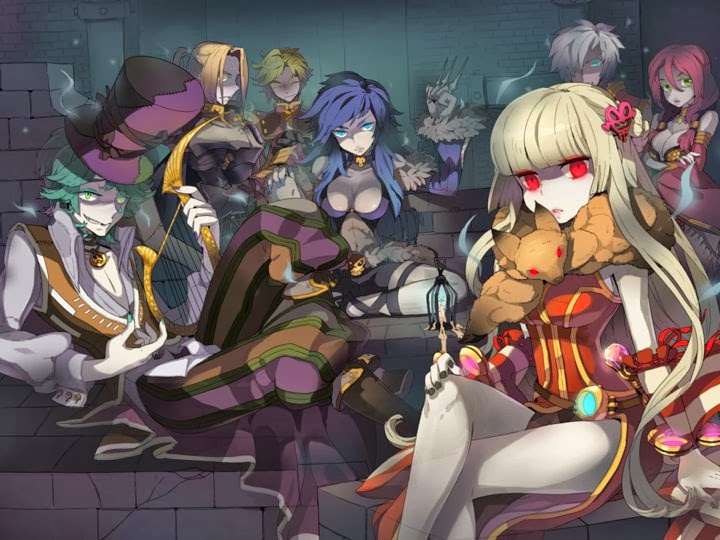
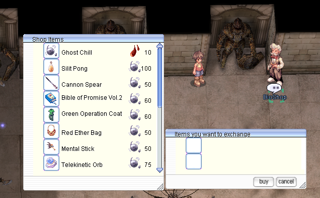
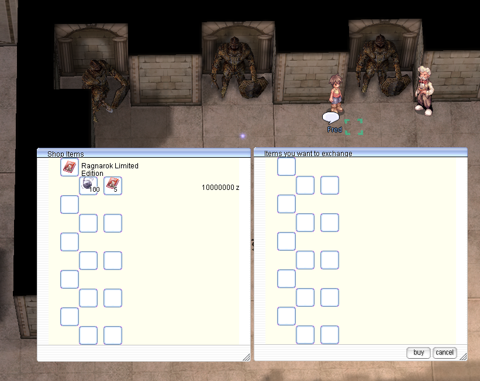

# Biolab 4
  

Bio Laboratory 4 (also known as Lighthalzen Dungeon 4) is one of the most challenging locations in Ragnarok Online, where players face clones of real characters with third job classes. It is inhabited by extremely powerful monsters with strong skills, high attack speed, and advanced AI, making it a tough challenge even for well-organized parties. The location attracts players with rare loot and the chance to obtain valuable cards.  

## How to get there

The entrance to Bio Laboratory 4 is located in the bottom-right corner of the Bio Laboratory 3 map (`/navi lhz_dun03 240/76`).

  

## Monsters  
The table includes only regular mobs; mini-bosses and MVPs are not included.  

| Monster | Quantity | In-game command |
|---------|----------|----------|
|  Randel | 42 | @mi 2221 |
|  Flamel  | 42 | @mi 2222 |
|  Celia | 81 | @mi 2223 |
|  Chen | 42 | @mi 2224 |
|  Gertie |57  | @mi 2225 |
|  Alphoccio | 42 | @mi 2226 |
|  Trentini | 42 | @mi 2227 |

## Ghost Chill and Blood Thirst  

On the first floor of Bio Lab, you’ll find an NPC called BioShop ()`/navi lhz_dun01 142/289`). He lets you trade Blood Thirst — dropped by monsters in Bio Lab 4 — for Ghost Chill and various equipment.  

  

Just a few steps away, you’ll find another NPC named Fred (`/navi lhz_dun01 137/289`), where you can exchange 100 Ghost Chill and 5 RLE (Ragnarok Limited Edition) items to get a slotted version of RLE gear.   

  