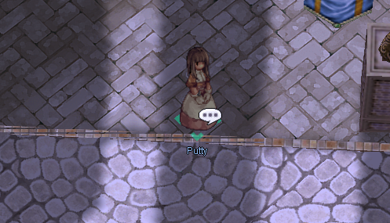

# Card Exchange

**/navi prontera 130/192** 

In Prontera nearby with Main Office (**/navi prontera 130/192**) you can find NPC Putty. You can exchange the  cards that they are no longer using. She is giving **10 points** for each  card that you bring to her. The points can be used to exchange for items that she has.

### Item List

| Item Name                 | Cost       |
|---------------------------|------------|
|  Old Card Album | **170 Points** |
|  Bloody Branch| **120 Points** |
|  7x Poring Coins| **10 Points**  |

!!! note
      Be careful when you enter the name of cards, some cards' official names will not reflect their ingame description.  

### Blacklisted cards from the Card Exchange  
 Thief Bug Card  
 Female Thief Bug Card  
 Male Thief Bug Card  
 Tarou Card  
 Plankton Card  
 Thief Bug Egg Card