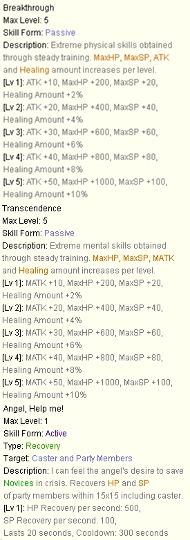

# Class Changes

!!! warning "This page is a work in progress."

## General / Shared
<div class="class-changes-table">
    <table>
        <thead>
            <tr>
                <th>Topic</th>
                <th>iRO Offical Behavior</th>
                <th>uaRO Changed Behavior</th>
            </tr>
        </thead>
        <tbody>
            <tr>
                <td>Reflected Damage: Amount</td>
                <td>When a reflection skill or behavior activates, it reflects the amount of damage listed, ie 50%.</td>
                <td>The amount of damage reflected cannot be greater than the amount of HP the user of the skill has.</td>
            </tr>
            <tr>
                <td>Reflected Damage: Safety Wall</td>
                <td>Players inside can reflect damage via skill or behavior.</td>
                <td>Players inside <strong>can not</strong> any reflect damage.
                </td>
            </tr>
            <tr>
                <td>Teleport</td>
                <td>Placeholder</td>
                <td>No longer randomly lands you in a portal.</td>
            </tr>
        </tbody>
    </table>
</div>

<!-- Dev Note: Alt text is excluded from images because it would announce duplicate skill names to screen readers. Instead, use blank alt="" for the decorative image to be skipped by assistive technology. -->


<!-------------------------------------------->
## Swordsman

### Knight / Lord Knight
<div class="class-changes-table">
    <table>
        <thead>
            <tr>
                <th>Topic</th>
                <th>iRO Offical Behavior</th>
                <th>uaRO Changed Behavior</th>
            </tr>
        </thead>
        <tbody>
            <tr>
                <td>Bowling Bash</td>
                <td>Placeholder</td>
                <td>Splash damage increased to 3. Knockback distance decreased to 0. Range increased to 2 cells. Gutterlines removed.</td>
            </tr>
            <tr>
                <td>Brandish Spear</td>
                <td>Placeholder</td>
                <td>Knockback distance decreased to 1.</td>
            </tr>
            <tr>
                <td>Charge Attack</td>
                <td>Placeholder</td>
                <td>Range fixed to 14 cells.</td>
            </tr>
            <tr>
                <td>Spear Stab</td>
                <td>Placeholder</td>
                <td>No longer double attacks.</td>
            </tr>
        </tbody>
    </table>
</div>


### Crusader / Paladin
<div class="class-changes-table">
    <table>
        <thead>
            <tr>
                <th>Topic</th>
                <th>iRO Offical Behavior</th>
                <th>uaRO Changed Behavior</th>
            </tr>
        </thead>
        <tbody>
            <tr>
                <td>Shield Swapping</td>
                <td>Swapping a shield while a skill is active cancels the skill.</td>
                <td>Swapping sheilds will no longer interrupt the skill. Removing shield will stll cancel the skill.</td>
            </tr>
            <tr>
                <td>Reflect Shield</td>
                <td>Placeholder</td>
                <td>The amount of damage cannot be greater than the amount of HP the wearer of the skill has. Reflect is not transmitted if the character is within a Safety Wall. </td>
            </tr>
            <tr>
                <td>Devotion</td>
                <td>Placeholder</td>
                <td>
                    Cannot be placed on non-guild members outside of Battlegrounds.<br><br>
                    Buff icon is displayed when active for caster and receiver.
                </td>
            </tr>
            <tr>
                <td>Grand Cross</td>
                <td>Placeholder</td>
                <td>Due to increase mob stack size, mobs on the same cell take 100% of the damage from every hit.</td>
            </tr>
            <tr>
                <td>Gospel</td>
                <td></td>
                <td>Buffs reset upon relog.</td>
            </tr>
        </tbody>
    </table>
</div>


<!-------------------------------------------->
## Mage

### Wizard / High Wizard
<div class="class-changes-table">
    <table>
        <thead>
            <tr>
                <th>Topic</th>
                <th>iRO Offical Behavior</th>
                <th>uaRO Changed Behavior</th>
            </tr>
        </thead>
        <tbody>
            <tr>
                <td>Ice Wall</td>
                <td>Placeholder</td>
                <td>Cannot be used on MVP maps. </td>
            </tr>
            <tr>
                <td>Sight Trasher</td>
                <td>Placeholder</td>
                <td>Range is 7x7 cells from player. Cannot go through walls.</td>
            </tr>
            <tr>
                <td>Gravitation Field</td>
                <td>The great difficulty of this skill prevents you from doing anything else while casting, including using items. When is active, the caster becomes immobile and cannot attack or use skills.</td>
                <!-- TODO: What does this mean??? --->
                <td>Adjusted to behave as expected for optimized gameplay.</td>
            </tr>
        </tbody>
    </table>
</div>


### Sage / Professor
<div class="class-changes-table">
    <table>
        <thead>
            <tr>
                <th>Topic</th>
                <th>iRO Offical Behavior</th>
                <th>uaRO Changed Behavior</th>
            </tr>
        </thead>
        <tbody>
            <tr>
                <td>Abracadabra</td>
                <td></td>
                <td>Can no longer can be used in towns.</td>
            </tr>
        </tbody>
    </table>
</div>


<!-------------------------------------------->
## Merchant

<div class="class-changes-table">
    <table>
        <thead>
            <tr>
                <th>Topic</th>
                <th>iRO Offical Behavior</th>
                <th>uaRO Changed Behavior</th>
            </tr>
        </thead>
        <tbody>
            <tr>
                <td>Cart Revolution</td>
                <td></td>
                <td>Cart weight requirement is removed.</td>
            </tr>
        </tbody>
    </table>
</div>

### Blacksmith / Whitesmith
<div class="class-changes-table">
    <table>
        <thead>
            <tr>
                <th>Topic</th>
                <th>iRO Offical Behavior</th>
                <th>uaRO Changed Behavior</th>
            </tr>
        </thead>
        <tbody>
            <tr>
                <td>Power Thrust</td>
                <td>There is a 0.1% chance to break your weapon with each hit.</td>
                <td>No longer breaks weapons.</td>
            </tr>
            <tr>
                <td>Adrenaline Rush</td>
                <td>Increase your attack speed with Mace and Axe type weapons by 30%. Increases attack speed of nearby party member with Mace and Axe type weapons by 20%. Changing from a Mace or Axe to any other type of weapons (including bare fists) will cancel the effect.</td>
                <td>You can use One-Handed Swords with this skill. </td>
            </tr>
            <tr>
                <td>Cart Termination</td>
                <td></td>
                <td>
                    Cost is reduced to 0z.<br><br>
                    Skill is now selectable by level.<br><br>
                    Cart weight requirement is removed.
                </td>
            </tr>
            <tr>
                <td>Maximum Power Thrust</td>
                <td>There is a 0.1% chance to break your weapon with each hit.</td>
                <td>No longer breaks weapons.</td>
            </tr>
        </tbody>
    </table>
</div>


### Alchemist / Creator
Medicine Bowls can be found at our [Inn Tool Dealers](Dealers.md#inn-tool-dealer) in addition to typical locations.

<div class="class-changes-table">
    <table>
        <thead>
            <tr>
                <th>Topic</th>
                <th>iRO Offical Behavior</th>
                <th>uaRO Changed Behavior</th>
            </tr>
        </thead>
        <tbody>
            <tr>
                <td>Twilight Alchemy III</td>
                <td>Creates 100 Alcohol, 50 Acid Bottle and 50 Bottle Grenade.</td>
                <td>Increases Acid Bottle from 50 → 100, and Bottle Grenade from 50 → 100. Increases Medicine Bowl requirement from 200 → 300.</td>
            </tr>
            <tr>
                <td>Twilight Alchemy IV</td>
                <td></td>
                <td>New skill Alchemist Link skill that allows brewing of 200 Blue Potions at once.</td>
            </tr>
        </tbody>
    </table>
</div>


<!-------------------------------------------->
## Acolyte
Blue Gems are sold at our [Inn Tool Dealers](Dealers.md#inn-tool-dealer) in additional to typical locations.


<div class="class-changes-table">
    <table>
        <thead>
            <tr>
                <th>Topic</th>
                <th>iRO Offical Behavior</th>
                <th>uaRO Changed Behavior</th>
            </tr>
        </thead>
        <tbody>
            <tr>
                <td>Warp Portal</td>
                <td>Placeholder</td>
                <td>Cannot be used on MVP maps. </td>
            </tr>
        </tbody>
    </table>
</div>

### Priest / High Priest
<div class="class-changes-table">
    <table>
        <thead>
            <tr>
                <th>Topic</th>
                <th>iRO Offical Behavior</th>
                <th>uaRO Changed Behavior</th>
            </tr>
        </thead>
        <tbody>
            <tr>
                <td>Kyrie Eleison</td>
                <td></td>
                <td>Reduces damage from Acid Demonstration.</td>
            </tr>
            <tr>
                <td>Aspersio</td>
                <td>Placeholder</td>
                <td>Can be used on members outside of your party.</td>
            </tr>
            <tr>
                <td>Magnus Exorcismus</td>
                <td>HP/SP will not regenerate naturally for 5 minutes after Asura Strike is used.</td>
                <td>SP regenerates normally upon relogging.</td>
            </tr>
            <tr>
                <td>Redemptio</td>
                <td>Placeholder</td>
                <td>Cooldown reduced from 10 minutes to 3 minutes.</td>
            </tr>
        </tbody>
    </table>
</div>

### Monk / Champion
<div class="class-changes-table">
    <table>
        <thead>
            <tr>
                <th>Topic</th>
                <th>iRO Offical Behavior</th>
                <th>uaRO Changed Behavior</th>
            </tr>
        </thead>
        <tbody>
            <tr>
                <td>Combo Fixed Target</td>
                <td></td>
                <td>Monk skills act on the current target even if the last skill was used on a different enemy.</td>
            </tr>
            <tr>
                <td>Asura Strike</td>
                <td>Any Demon family and Undead property monsters entering the area of the effect suffer Holy property damage per wave.</td>
                <td>Increases mob pool damaged by the skill. Races effected are Undead and Demon. Elements effected are Shadow, Ghost, and Undead.</td>
            </tr>
        </tbody>
    </table>
</div>


<!-------------------------------------------->
## Thief
A selection of arrows can are our [Inn Tool Dealers](Dealers.md#inn-tool-dealer). Additional speciality arrows must be crafted.

### Assassin / Assassin Cross
Venom Knife can be found at our [Inn Tool Dealers](Dealers.md#inn-tool-dealer) in addition to typical locations.

<div class="class-changes-table">
    <table>
        <thead>
            <tr>
                <th>Topic</th>
                <th>iRO Offical Behavior</th>
                <th>uaRO Changed Behavior</th>
            </tr>
        </thead>
        <tbody>
            <tr>
                <td>Soul Breaker</td>
                <td>Placeholder</td>
                <td>Range increased to 9 cells.</td>
            </tr>
        </tbody>
    </table>
</div>

### Rogue / Stalker
<div class="class-changes-table">
    <table>
        <thead>
            <tr>
                <th>Topic</th>
                <th>iRO Offical Behavior</th>
                <th>uaRO Changed Behavior</th>
            </tr>
        </thead>
        <tbody>
            <tr>
                <td>Backstab</td>
                <td>Placeholder</td>
                <td>Can be performed from any angle.</td>
            </tr>
            <tr>
                <td>Plagiarism</td>
                <td>Placeholder</td>
                <td>
                    <a href="Custom_NPC.md">Plagiarism NPC</a> allows Rogues/Stalkers to copy skills for a fee.<br><br>
                    The following skills can now be plagiarized:
                    <ul>
                        <li>Grand Cross</li>
                    </ul>
                </td>
            </tr>
        </tbody>
    </table>
</div>


<!-------------------------------------------->
## Archer
A selection of arrows can are our [Inn Tool Dealers](Dealers.md#inn-tool-dealer). Additional speciality arrows must be crafted.


### Hunter / Sniper
Traps are sold at our [Inn Tool Dealers](Dealers.md#inn-tool-dealer) in additional to typical locations.


### Dancer / Gypsy & Bard / Clown (Minstrel) 
<div class="class-changes-table">
    <table>
        <thead>
            <tr>
                <th>Topic</th>
                <th>iRO Offical Behavior</th>
                <th>uaRO Changed Behavior</th>
            </tr>
        </thead>
        <tbody>
            <tr>
                <td>Buff Icons</td>
                <td>Placeholder</td>
                <td>Song buff icons are added and with other player buffs.</td>
            </tr>
            <tr>
                <td>Buff Duration</td>
                <td>Song buffs end as soon a player exits the song area.</td>
                <td>Song buff will continue for 20 seconds after leaving the song area.</td>
            </tr>
            <tr>
                <td>Loki's Veil</td>
                <td>Placeholder</td>
                <td>Cannot be used on MVP maps. </td>
            </tr>
            <tr>
                <td>Wand of Hermode</td>
                <td>Skill is ensamble and requires both a Clown and Gypsy to perform.</td>
                <td>Skill can be performed solo.</td>
            </tr>
        </tbody>
    </table>
</div>

## Super Novice
<div class="class-changes-table">
    <table>
        <thead>
            <tr>
                <th>Topic</th>
                <th>iRO Offical Behavior</th>
                <th>uaRO Changed Behavior</th>
            </tr>
        </thead>
        <tbody>
            <tr>
                <td>Death Count</td>
                <td>Placeholder</td>
                <!-- TODO: Add NPC to custom NPCs, add location coords. -->
                <td>Super Novice death count can be reset at a special NPC south of Prontera at `/navi prt_fild08`.</td>
            </tr>
            <tr>
                <td>Soul Link</td>
                <td>Placeholder</td>
                <td>Items with restrictions equipped during Soul Link will remain equipped through logout and persist until unequipped.</td>
            </tr>
        </tbody>
    </table>
</div>


---

## Extended Classes

<!-- TODO: Add item ID, maybe images? -->
??? note "Transcendent Armor for Extended Classes: Click to expand" 
    The following equipment was previously restricted to only Transcendent classes and is now available for Extended classes.

    | Armor Name | Equip Position |
    |---|---|
    | Armor of Naga [1] | Body |
    | Bison Horn [1] | Accessory |
    | Black Leather Boots [0] | Footgear |
    | Divine Cloth [1] | Body |
    | Dragon Breath [1] | Garment |
    | Expert Ring [1] | Accessory |
    | Nydhorgg's Shadow Garb [1] | Garment |
    | Orleans's Glove [1] | Accessory |
    | Orleans's Gown [1] | Body |
    | Orleans's Server [1] | Shield |
    | Platinum Shield [0] | Shield |
    | Ring Of Flame Lord [0] | Accessory |
    | Ring Of Resonance [0] | Accessory |
    | Shadow Walk [0] |  |
    | Shield of Naga [1] | Shield |
    | Sprint Mail [1] | Body |
    | Sprint Ring [0] | Accessory |
    | Sprint Shoes [1] | Footgear |
    | Thorny Buckler [1] | Shield |
    | Tidal Shoes [1] | Footgear |
    | Valkyrian Armor [1] | Body |
    | Valkyrian Manteau [1] | Garment |
    | Valkyrian Helm [1] | Upper Headgear |
    | Valkyrian Shoes [1] | Footgear |
    | Vesper Core 01 [0] | Accessory |
    | Vesper Core 02 [0] | Accessory |
    | Vesper Core 03 [0] | Accessory |
    | Vesper Core 04 [0] | Accessory |
    | Vital Tree Shoes [0] | Accessory |
    | Wool Scarf [1] | Garment |
    | Magic Bible Vol. 1 | Accessory |


<!-------------------------------------------->
### Taekwon
<div class="class-changes-table">
    <table>
        <thead>
            <tr>
                <th>Topic</th>
                <th>iRO Offical Behavior</th>
                <th>uaRO Changed Behavior</th>
            </tr>
        </thead>
        <tbody>
            <tr>
                <td>Equipment</td>
                <td></td>
                <td>Taekwon can now equip Swordsman Medal of Honor.</td>
            </tr>
        </tbody>
    </table>
</div>


#### Star Gladiator
<div class="class-changes-table">
    <table>
        <thead>
            <tr>
                <th>Topic</th>
                <th>iRO Offical Behavior</th>
                <th>uaRO Changed Behavior</th>
            </tr>
        </thead>
        <tbody>
            <tr>
                <td>Miracle</td>
                <td></td>
                <td>Success rate increased from 0.02% to 0.1%.</td>
            </tr>
        </tbody>
    </table>
</div>


#### Soul Linker
<div class="class-changes-table">
    <table>
        <thead>
            <tr>
                <th>Topic</th>
                <th>iRO Offical Behavior</th>
                <th>uaRO Changed Behavior</th>
            </tr>
        </thead>
        <tbody>
            <tr>
                <td>Max Job Level</td>
                <td>50</td>
                <td>Increased to 70: HP/SP pool is unchanged.</td>
            </tr>
            <tr>
                <td>Soul Link Duration (Level 5)</td>
                <td>5 minutes</td>
                <td>10 minutes</td>
            </tr>
            <tr>
                <td>Equipment</td>
                <td></td>
                <td>Soul Linkers can now equip Thorny Staff of Darkness and Staff of Darkness.</td>
            </tr>
            <tr>
                <td>Esma</td>
                <td>SP Cost for Level 1–10: 8–80</td>
                <td>Decreased SP Cost for Level 1–10: 4–40</td>
            </tr>
        </tbody>
    </table>
</div>


<!-------------------------------------------->
### Ninja 
Ninja's skill materials and ammo can are sold by our [Enhanced NPC Vendors](Dealers.md#ninja-materials) in addition to their typical locations. Weapons and other gear are not sold at this NPC.

<div class="class-changes-table">
    <table>
        <thead>
            <tr>
                <th>Topic</th>
                <th>iRO Offical Behavior</th>
                <th>uaRO Changed Behavior</th>
            </tr>
        </thead>
        <tbody>
            <tr>
                <td>Throw Zeny</td>
                <td></td>
                <td>After cast delay 5 sec → 2 sec, SP cost 50 -> 25</td>
            </tr>
            <tr>
                <td>Throw Kunai</td>
                <td></td>
                <td>After cast delay 1 sec → 0.5 sec</td>
            </tr>
            <tr>
                <td>Final Strike</td>
                <td></td>
                <td>SP Cost level 1-10 is 30-50</td>
            </tr>
            <tr>
                <td>Throw Huuma Shuriken</td>
                <td></td>
                <td>After cast delay 2 sec → 1.5 sec, SP cost level 1-5 5,10,15,20</td>
            </tr>
        </tbody>
    </table>
</div>


<!-------------------------------------------->
### Gunslinger
Gunslinger's skill materials and ammo can are sold by our [Enhanced NPC Vendors](Dealers.md#gunslinger-materials) in addition to their typical locations. Weapons and other gear are not sold at this NPC.

<div class="class-changes-table">
    <table>
        <thead>
            <tr>
                <th>Topic</th>
                <th>iRO Offical Behavior</th>
                <th>uaRO Changed Behavior</th>
            </tr>
        </thead>
        <tbody>
            <tr>
                <td>Throw Zeny</td>
                <td></td>
                <td>After cast delay 5 sec → 2 sec, SP cost 50 -> 25</td>
            </tr>
            <tr>
                <td>Throw Kunai</td>
                <td></td>
                <td>After cast delay 1 sec → 0.5 sec</td>
            </tr>
            <tr>
                <td>Final Strike</td>
                <td></td>
                <td>SP Cost level 1-10 is 30-50</td>
            </tr>
            <tr>
                <td>Throw Huuma Shuriken</td>
                <td></td>
                <td>After cast delay 2 sec → 1.5 sec, SP cost level 1-5 5,10,15,20</td>
            </tr>
        </tbody>
    </table>
</div>


<!-------------------------------------------->
## Adopted
<div class="class-changes-table">
    <table>
        <thead>
            <tr>
                <th>Topic</th>
                <th>iRO Offical Behavior</th>
                <th>uaRO Changed Behavior</th>
            </tr>
        </thead>
        <tbody>
            <tr>
                <td>Maximum Stats</td>
                <td></td>
                <td>Increased to 99</td>
            </tr>
        </tbody>
    </table>
</div>

---


<!-- Placeholder -->
- **Super Novice – 3 Skills Added (Nerfed)**
!!! note "Super Novice ATK Behavior"
    The added “ATK” behaves like **Sword Mastery** (applied in damage formula) and **will not** appear on `ALT+A` Attack stat.

  

- **Gunslinger – Adjustment**:
  ```
  - SP: 15 → 10
  - Coin: 2 → 1
  - Duration: 30s → 60s
  ```
- **Preserve (Skill)**:
  ```
  - Now a toggle on/off.
  - Persists through logout.
  - Still dispellable unless Soul Linked.
  ```
- **Cart Revo / Cart Termination**: Removed **weight** from formula (acts as if cart weight is **max**).
- **Shadow Slash (Ninja)**: Correctly flagged as **physical melee**.
- **Magnus Exorcismus**: Damage ticks correctly even when caster is `Stunned / Petrified / Frozen`.
- **Sighttrasher**: Now checks for **obstructions** before applying damage.
- 
⚡ **Autospell Bolts** at max level are now **level 5.**
🛡️ **Stun status now bypasses** Safety Wall **when using Cart Termination**, as intended. Stun now properly applies **through Safety Wall**, restoring intended PvP mechanics.

Gunslinger:

| Skill Name         | Change                                |
|--------------------|---------------------------------------|
| Rapid Shot         | SP cost per level 1–10: `12–20`.     |
|                    | AfterCastDelay: `1 sec → 0.75 sec`.  |
| Full Buster        | AfterCastDelay: `2 sec`.             |
|                    | SP cost level 5–10: `35`.            |
| Triple Action      | SP cost: `20 → 12`.                  |
| Flip the Coin      | SP cost: `2 → 1`. Success Rate: `100%`.


<!-- Needs clarification -------------------------------------->
Something about "Fame Points" Decaying by 10% monthly. Is this related to rankings?

Cart term / mammo 500z when possessing a certain item? 7/4/25

- **Rapid Shower (Gunslinger):**
  ```
  - Lv 1–2 = 1 ammo
  - Lv 3–4 = 2
  - Lv 5–6 = 3
  - Lv 7–8 = 4
  - Lv 9–10 = 5
  ```
- `Throw Zeny (Ninja)`: Cost disabled in BG.
- `Isilla Card`: Now applies to both `AoE` and `Single-Target` magic.
- Amplify Magic mechanic refactored:
  > Now triggers for each damage tick during casting (`Meteor Storm`, `Storm Gust`, `LoV`).

<!-- Which monk skills? -->
Removed the fixed target from some combo skills. 

<!-- Does this mean it has zero aftercase delay? -->
Removed an incorrect afterCastActDelay from Sacrifice

<!-- Not sure what skills these are/do an internet is down -->
Lif Homunculus has been reverted to the classic version where Mental Change resets upon respawning the homunculus.

Mind Breaker skill now shows icon and updates status

Levels 6-10 Plagiarized Water Ball are no longer melee attack skills.

Cold Heart / Black Cat accessories now complete combos with Rogue Treasure

Dragon Fire Formation no longer works under Land Protector.

Edited Weapon Perfection levels 1-5 for better consistency. Client-side description updated also.

Reject sword damage cannot exceed the caster's HP.

Fixed some interactions of Ki Translation
It should fail with a skill failure message and not consume requirements when:
- being cast on Gunslinger class
- being cast on a player that already has 5 spheres
- being cast on friendly non-player units (e.g. Mercenary)


Changed Poisoning Weapon to show the type of poison used when applied

Fixed the range checks of Blade Stop:
- Fixed the target's (as in triggering attack target, and Blade Stop caster) equipped weapon wrongly affecting the skill's working range.
- Success range is changed to 2, to match the official behavior.
- In pre-re, changed it to always succeed against player attackers regardless of range.
- Changed it to always succeed for non-player casters regardless of range (custom Hercules behavior, officially only players may cast Blade Stop).
  

Fixed the stacking of Poem of The Netherworld to match the behavior described in the 2012.08.22 official patch notes.
- it cannot be placed over another instance of the skill
- when trying to do so, it should show a position error to client
  

Fixed some SC counters (including Storm Gust) not getting reset to 0 when a unit dies.


Soul Destroyer: The range of Soul Destroyer has been corrected to 9 cells. Fixed range and cast time for Soul Destroyer.


Slow Grace Effect: The Slow Grace effect will now cancel upon death.


<!-- Does this need to be included or was it just a bug? -->
Fixed some interactions of Absorb Spirit Sphere
It should fail and not consume SP when:
- the target player doesn't have spheres
- the target player is of Gunslinger class (due to teh game implementation not allowing them to have spheres)
- the target player is friendly
It should fail and consume SP when:
- used on a BOSS monster
- used on a non-boss monster, but failing the 20% check
- used on non-player units (like mercenaries)
- moved the target check to condition cast end

<!-- Battlegrounds page content -->
Devotion in Battlegrounds now works without the need for a party.

High Jump and Running Soul Linker skills now work within Battlegrounds.