# Commands

## System Commands

- `@rates`  
  Displays the server rates.  
  **Output in-game Example:**  
  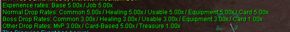

- `@time`  
  Displays the local server time, along with day/night information.  
  **Output in-game Example:**  
  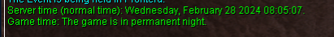

- `@uptime`  
  Show server uptime since last map server restart.  
  **Output in-game Example:**  
  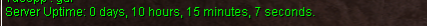

- `@refresh`  
  Synchronizes the player's position on the client with the one stored on the server.

- `!vsync`  
  Enable limit of FPS equal 60 frames per second or disable it.

- `!ping`  
  Shows statistic of connection.  
  **Output in-game Example:**  
  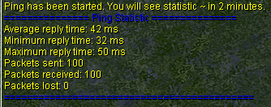

- `@showexp`  
  Toggles the display of experience gain messages.  
  **Output in-game Example:**  
  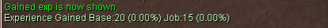

- `@showdelay`  
  Shows or hides the red "Cannot use the skills" message.  
  **Output Example:**  
  `[Storm Gust] Cannot use the skills.`

- `@noask`  
  Toggles automatic rejection of deals and invites.

- `@noks`  
  Toggles Kill Steal Protection.  
  **Note:** If a mob has the Boss flag, `@noks` doesn't work on this mob.

- `@camerainfo`  
  Displays/hides camera information from the client.  
  `@camerainfo {<range> <rotation> <latitude>}`  
  If arguments are given, sets camera position.  
  **Output in-game Example:**  
  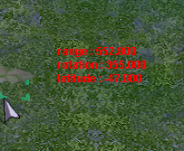

## Database Commands

- `@mobinfo <mob name or ID>`  
  Displays monster information (rates, stats, drops, MVP data).  
  **Example:** `@mobinfo Drops`  
  **Output in-game Example:**  
  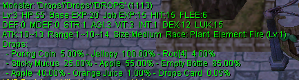

- `@iteminfo <item name or ID>`  
  Displays item information (type, price, weight, drops).  
  **Example:** `@iteminfo Fang of Hatii`  
  **Output in-game Example:**  
  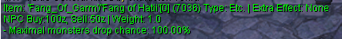

- `@whodrops <item name or ID>`  
  Displays a list of mobs which drop the specified item. Only the highest drop rates are shown.  
  **Example:** `@whodrops Hand of God`  
  **Output in-game Example:**  
  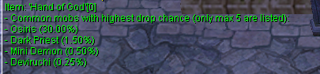

- `@lootconfig`  
Enables or disables autolooting items from killed mobs. UI for Easy Autoloot Customization.<br>
**Toggle Autoloot** – Set a drop rate & enable/disable.<br>
**Ignore Items** – Exclude unwanted loot.<br>
**Loot Groups** – Create up to 3 custom loot groups.<br>
**Quick Setup** – Manage loot easily via UI.<br>
**Saves Settings** – Preferences reload automatically on login.<br>
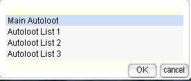

**How to Use `@lootconfig`**  
1. Type `@lootconfig` to open the UI.  
2. Choose **Main Autoloot** or **Custom Groups**.  
3. Enable/Disable **Autoloot** and set a drop rate.  
4. Add/Remove items from lists.  
5. Select and manage **loot groups**.  
6. Changes **apply instantly** and **save automatically**.  

!!! warning "Important Change"
    The `@autoloot` command has been **removed**. Use `@lootconfig` instead.

<!--TODO: Update with info from 9/1/25 update 
- **`@lootconfig` Preset Menus (Reconstructed)**:
  ```
  - Group Function added (initially displayed as List 1).
  - Groups can be renamed.
  - Max 20 groups.
  - Clear all by deleting and recreating the list.
  - Add/subtract single items within each list remains supported.
  ```
-->

- `@whereis <monster name or ID>`  
  Displays the maps in which monster normally spawns.  
  **Example:** `@whereis Demon Pungus`  
  **Output in-game Example:**  
  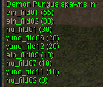

## Player Information Commands

- `@commands`  
  Displays a list of available commands to the player.

- `@help <command>`  
  Displays the help message for the specified command.

- `@exp`  
  Displays current levels and % progress.

- `@jailtime`  
  Displays remaining jail time.

- `@killcount`<br>
  Count killed monsters.<br>
The `@killcount` command has been **rewritten** and now includes a **UI-based tracking system**.  
Now allows tracking of **multiple monsters** (default: `5`).  
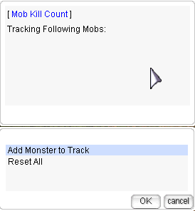

- `@mapexp`<br>
The @mapexp command introduces a rotating bonus EXP zone that updates every 48 to 72 hours. During this period, selected areas grant an additional 20–30% EXP.  

## Ranking Commands

- `@blacksmith`  
  Show top 20 blacksmiths.

- `@alchemist`  
  Show top 20 alchemists.

- `@taekwon`  
  Show top 20 taekwons.

## Action Commands

- `@autotrade` or `@at`  
  Allows you to continue vending offline.

- `@memo {<1-4>}`  
  Saves a warp point for the "Warp Portal" skill.

- `@request <message>`  
  Sends a message to all connected GMs.

- `@settings`  
  Personalize your game settings applied on login. Offering a streamlined UI for saving preferences like **autoloot, chat channels, and visibility settings**.  
 `@settings` syncs with in-game commands, so you **don't need to use the menu** separately.  

  **Output in-game Example:**  
  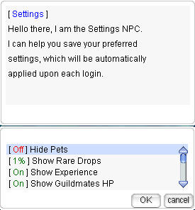

-  `@hidepet {<1-2>}`  
  Use `@hidepet 1` to hide pets except your own.  
  Use `@hidepet 2` to hide all pets.  

- `@restockconfig`and `@restock`  
   
   **Features:**  

  Create up to 20 different restock lists
  Works under 90% weight (current or target %)  
  Add/delete/rename lists easily  
  Improved management interface

  **Limitations:**  

  Must be used within a Kafra (Card or NPC)  
  Only works inside towns  
  Pulls directly from storage to restock items to preset quantities  

- `@autofeed`  
  Persists through logout  
  Account-wide, based on your setting  

## Trade Commands
Check [Vendor System](Vendor_System.md) to view up-to-date commands for locating shops.

## Guild Commands

- `@breakguild <guild_name>`  
  Breaks the guild of the attached character. You must be the guildmaster to use this command.

 - `@guildbank`  
  Permissions configurable by guild leader based on guild titles.  
  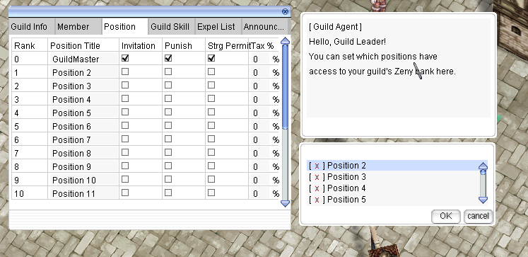

<!--TODO: ADd guild storage log from 9/1/25 update

- **Guild Storage Logs – `@guildlog` (in-game)**  
  Will be added to **Control Panel** later.  
  **Features:**
  ```
  - 150 lines per query
  - Time ranges: last 24h / 7d / 30d / all time
  - Filter: Withdraw / Deposit / Both
  ```
  **Permissions (configurable by Guild Leader):**
  ```
  - Guild Leader only
  - All storage-access members (based on in-game title)
  - All members
  ```
-->

## Homunculus Commands

- `@hominfo`  
  Displays homunculus general information and stats.  
  **Output in-game Example:**  
  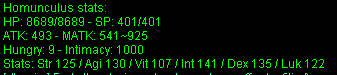

- `@homstats`  
  Displays homunculus stats in different formats.  
  **Output in-game Example:**  
  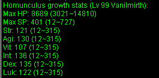

## Battleground Commands

- `@bg queue` or `@bg join`  
  Join the queue for Battleground.

- `@bg leave`  
  Leave the Battleground queue.

- `@bg shop`  
  Open the Battleground shop.

## Duel Commands

- `@duel`  

**Features:**  

- Restricted to towns (leaving town ends duel)<br>
- Target cursor selection (no name typing)<br>
- Use @duel and target another player to invite<br>
- Invited player must @duel and target you to accept<br>
- Automatic debuff removal when leaving duel  

   **Damage Modes:**

  | Command | Mode | Description |
  |---------|------|-------------|
  | `@duel` | Normal | Standard damage calculations |
  | `@duel bg` | Battleground | BG damage mode |
  | `@duel gvg` | GvG | Guild vs Guild damage mode |
  | `@duel leave` | Exit | Withdraw from duel (both players removed) |

!!! note "Duel Mechanics"
    The duel will follow the inviter's selected damage mode. Both players are automatically removed when one leaves.

## Channel Commands

- `@channel create <channel name> <channel password>`  
  Create a new channel.

- `@channel list`  
  Lists public channels.

- `@channel setcolor <channel name> <color name>`  
  Changes channel color.

- `@channel leave <channel name>`  
  Leaves the channel.

- `@channel bindto <channel name>`  
  Binds your global chat to the channel.

- `@channel ban <channel name> <character name>`  
  Bans a character from the channel.

- `@channel unban <channel name> <character name>`  
  Unbans a character from the channel.

- `@channel unbanall <channel name>`  
  Unbans everyone from the channel.

## Lite Graphics Plugin (LGP) Commands

- `@lgp`  
  Toggle the LGP feature on or off.

- `@square <on/off/1-18>`  
  Activates a square overlay around your character, with customizable size options.

- `@circle`  
  Initiates a circular overlay around your character.

- `@aoes`  
  Visualizes skill effect areas with color-coded zones for Storm Gust, Lord of Vermillion, and Meteor Storm.

- `@shake`  
  Enables or disables the screen shake effect.