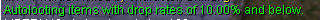
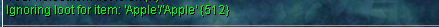
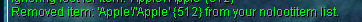
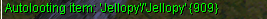
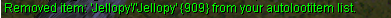
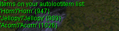
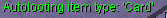
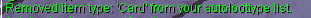
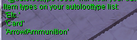
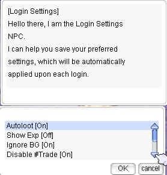

# Commands

## Contents
1. [System Commands](#system-commands)
2. [Database Commands](#database-commands)
3. [Player Information Commands](#player-information-commands)
4. [Ranking Commands](#ranking-commands)
5. [Action Commands](#action-commands)
6. [Guild Commands](#guild-commands)
7. [Homunculus Commands](#homunculus-commands)
8. [Battleground Commands](#battleground-commands)
9. [Duel Commands](#duel-commands)
10. [Channel Commands](#channel-commands)
11. [Lite Graphics Plugin (LGP) Commands](#lite-graphics-plugin-lgp-commands)

## System Commands

- `@rates`  
  Displays the server rates.  
  **Output in-game Example:**  
  

- `@time`  
  Displays the local server time, along with day/night information.  
  **Output in-game Example:**  
  

- `@uptime`  
  Show server uptime since last map server restart.  
  **Output in-game Example:**  
  

- `@refresh`  
  Synchronizes the player's position on the client with the one stored on the server.

- `!vsync`  
  Enable limit of FPS equal 60 frames per second or disable it.

- `!ping`  
  Shows statistic of connection.  
  **Output in-game Example:**  
  

- `@showexp`  
  Toggles the display of experience gain messages.  
  **Output in-game Example:**  
  

- `@showdelay`  
  Shows or hides the red "Cannot use the skills" message.  
  **Output Example:**  
  `[Storm Gust] Cannot use the skills.`

- `@noask`  
  Toggles automatic rejection of deals and invites.

- `@noks`  
  Toggles Kill Steal Protection.  
  **Note:** If a mob has the Boss flag, `@noks` doesn't work on this mob.

- `@camerainfo`  
  Displays/hides camera information from the client.  
  `@camerainfo {<range> <rotation> <latitude>}`  
  If arguments are given, sets camera position.  
  **Output in-game Example:**  
  

## Database Commands

- `@mobinfo <mob name or ID>`  
  Displays monster information (rates, stats, drops, MVP data).  
  **Example:** `@mobinfo Drops`  
  **Output in-game Example:**  
  

- `@iteminfo <item name or ID>`  
  Displays item information (type, price, weight, drops).  
  **Example:** `@iteminfo Fang of Hatii`  
  **Output in-game Example:**  
  

- `@whodrops <item name or ID>`  
  Displays a list of mobs which drop the specified item. Only the highest drop rates are shown.  
  **Example:** `@whodrops Hand of God`  
  **Output in-game Example:**  
  

- `@autoloot {<%>}`  
  Enables or disables autolooting items from killed mobs.  
  **Example:** `@autoloot 10`  
  **Output in-game Example:**  
  

- `@noloot`  
  You can have 20 items on your nolootitem list. Autoloot must be enabled to use this command.  
  **Example:**  
  - To add an item: `@nolootitem +Apple`  
      
  - To remove an item: `@nolootitem -Apple`  
      
  - Reset the nolootitem list: `@noloot reset`.

- `@alootid`  
  Starts or stops autolooting a specified item.  
  **Example:**  
  - Add an item: `@alootid +Jellopy`  
      
  - Remove an item: `@alootid -909`  
      
  - Check list: `@alootid`  
      
  - Reset the autoloot item list: `@alootid reset`.

- `@autoloottype`  
  Starts or stops autolooting a specified item type.  
  **Example:**  
  - Add an item type: `@autoloottype +card`  
      
  - Remove an item type: `@autoloottype -card`  
      
  - Check list: `@autoloottype`  
      
  - Reset the autoloottype list: `@autoloottype reset`.

- `@whereis <monster name or ID>`  
  Displays the maps in which monster normally spawns.  
  **Example:** `@whereis Demon Pungus`  
  **Output in-game Example:**  
  

## Player Information Commands

- `@commands`  
  Displays a list of available commands to the player.

- `@help <command>`  
  Displays the help message for the specified command.

- `@exp`  
  Displays current levels and % progress.

- `@jailtime`  
  Displays remaining jail time.

- `@killcount <monster ID>`  
  Count killed monsters.  
  **Example:** `@killcount 1002` to count Porings.  
  Reset: `@killcount reset`.

## Ranking Commands

- `@blacksmith`  
  Show top 20 blacksmiths.

- `@alchemist`  
  Show top 20 alchemists.

- `@taekwon`  
  Show top 20 taekwons.

## Action Commands

- `@autotrade` or `@at`  
  Allows you to continue vending offline.

- `@memo {<0-2>}`  
  Saves a warp point for the "Warp Portal" skill.

- `@request <message>`  
  Sends a message to all connected GMs.

- `@loginsettings`  
  Personalize your game settings applied on login.  
  **Output in-game Example:**  
  

## Guild Commands

- `@breakguild <guild_name>`  
  Breaks the guild of the attached character. You must be the guildmaster to use this command.

## Homunculus Commands

- `@hominfo`  
  Displays homunculus general information and stats.  
  **Output in-game Example:**  
  

- `@homstats`  
  Displays homunculus stats in different formats.  
  **Output in-game Example:**  
  

## Battleground Commands

- `@bg queue` or `@bg join`  
  Join the queue for Battleground.

- `@bg leave`  
  Leave the Battleground queue.

- `@bg shop`  
  Open the Battleground shop.

## Duel Commands

!!! Note
    Currently duels are disabled on the server.

## Channel Commands

- `@channel create <channel name> <channel password>`  
  Create a new channel.

- `@channel list`  
  Lists public channels.

- `@channel setcolor <channel name> <color name>`  
  Changes channel color.

- `@channel leave <channel name>`  
  Leaves the channel.

- `@channel bindto <channel name>`  
  Binds your global chat to the channel.

- `@channel ban <channel name> <character name>`  
  Bans a character from the channel.

- `@channel unban <channel name> <character name>`  
  Unbans a character from the channel.

- `@channel unbanall <channel name>`  
  Unbans everyone from the channel.

## Lite Graphics Plugin (LGP) Commands

- `@lgp`  
  Toggle the LGP feature on or off.

- `@square <on/off/1-18>`  
  Activates a square overlay around your character, with customizable size options.

- `@circle`  
  Initiates a circular overlay around your character.

- `@aoes`  
  Visualizes skill effect areas with color-coded zones for Storm Gust, Lord of Vermillion, and Meteor Storm.

- `@shake`  
  Enables or disables the screen shake effect.