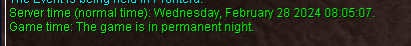
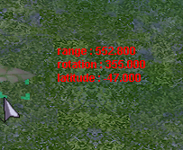
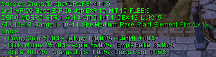
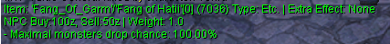
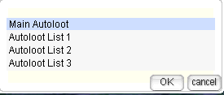
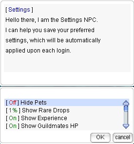
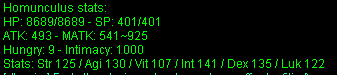

# Commands

## System Commands

- `@rates`  
  Displays the server rates.  
  **Output in-game Example:**  
  

- `@time`  
  Displays the local server time, along with day/night information.  
  **Output in-game Example:**  
  

- `@uptime`  
  Show server uptime since last map server restart.  
  **Output in-game Example:**  
  

- `@refresh`  
  Synchronizes the player's position on the client with the one stored on the server.

- `!vsync`  
  Enable limit of FPS equal 60 frames per second or disable it.

- `!ping`  
  Shows statistic of connection.  
  **Output in-game Example:**  
  

- `@showexp`  
  Toggles the display of experience gain messages.  
  **Output in-game Example:**  
  

- `@showdelay`  
  Shows or hides the red "Cannot use the skills" message.  
  **Output Example:**  
  `[Storm Gust] Cannot use the skills.`

- `@noask`  
  Toggles automatic rejection of deals and invites.

- `@noks`  
  Toggles Kill Steal Protection.  

  **Lock starts when:**  
 Damage is done outside of aggro range of mob  
 Mob locks onto a player target  

**Lock Mechanics:**

| Mechanic | Description |
|----------|-------------|
| **Idle Release** | If a player is idle for `5 seconds` or longer, aggro lock is released |
| **Lock Timer** | `15 seconds` (timer does NOT start until another player attempts to KS your mob) |
| **Hard Cap** | `30 seconds` (will release regardless of variables) |
| **MVP/Mini** | Doesn't apply to any MVP/Mini boss that has NoKS null and void |
| **Max Mob Count** | Unlimited |

**System UI Options:**

| Mode | Description |
|------|-------------|
| **Self** | Disables Party/Guild |
| **Party** | Allows party members |
| **Guild** | Allows guild members |

- `@camerainfo`  
  Displays/hides camera information from the client.  
  `@camerainfo {<range> <rotation> <latitude>}`  
  If arguments are given, sets camera position.  
  **Output in-game Example:**  
  

## Database Commands

- `@mobinfo <mob name or ID>`  
  Displays monster information (rates, stats, drops, MVP data).  
  **Example:** `@mobinfo Drops`  
  **Output in-game Example:**  
  

- `@iteminfo <item name or ID>`  
  Displays item information (type, price, weight, drops).  
  **Example:** `@iteminfo Fang of Hatii`  
  **Output in-game Example:**  
  

- `@whodrops <item name or ID>`  
  Displays a list of mobs which drop the specified item. Only the highest drop rates are shown.  
  **Example:** `@whodrops Hand of God`  
  **Output in-game Example:**  
  

## 🔧 @lootconfig — Advanced Autoloot System

The `@lootconfig` command provides a **user-friendly UI** for managing autoloot settings and custom loot lists.

---

### ✨ Key Features

- **Toggle Autoloot** – Enable/disable autoloot and set a drop-rate threshold
- **Ignore Items** – Exclude unwanted items from autoloot
- **Loot Groups** – Create and manage up to **20 custom loot groups**
- **Group Functions** – Preset list system (initially displayed as *List 1*)
- **Rename Groups** – Fully customizable group names
- **Quick Setup UI** – Easy and fast configuration via interface
- **Persistent Settings** – All preferences are saved and restored on login

---

### 📦 Loot Group Management

- Add or remove **individual items** per group
- Clear a group by **deleting and recreating** the list
- Each group operates independently
- Supports **fine-grained loot filtering** for different farming needs

---

### ▶️ How to Use `@lootconfig`

1. Type `@lootconfig` to open the configuration UI
2. Choose **Main Autoloot** or **Custom Loot Groups**
3. Enable or disable autoloot and set a drop rate
4. Add or remove items from ignore or loot lists
5. Create, rename, and manage loot groups
6. All changes **apply instantly** and **save automatically**

- `@whereis <monster name or ID>`  
  Displays the maps in which monster normally spawns.  
  **Example:** `@whereis Demon Pungus`  
  **Output in-game Example:**  
  

## Player Information Commands

- `@commands`  
  Displays a list of available commands to the player.

- `@help <command>`  
  Displays the help message for the specified command.

- `@exp`  
  Displays current levels and % progress.

- `@jailtime`  
  Displays remaining jail time.

## @killcount — Enhanced Kill Tracking System

The `@killcount` command has been **fully rewritten** and now features a modern **UI-based tracking system** with session-based monitoring and improved visual feedback.

---

### ✨ Key Features

- Track specific monster kills in your current session
- Track **multiple monsters simultaneously** (default: 5)
- Visual kill counter displayed above your character upon each kill
- Reset function for tracked kills
- “Tracked kills” indicator when using the command
- Total killcount preserved across all monsters
- Shorthand command available: `@kc`

---

### 📋 Usage

| Command | Description |
|----------|-------------|
| `@killcount` | Opens the UI-based tracking system |
| `@killcount [MobID]` | Track a specific monster |
| `@kc [MobID]` | Shorthand version of the command |

---

!!! success "System Overhaul"
    The killcount system has been completely modernized with UI integration,  
    session-based tracking, and improved real-time visual feedback.

- `@mapexp` 
The @mapexp command introduces a rotating bonus EXP zone that updates every 48 to 72 hours. During this period, selected areas grant an additional 20–30% EXP.  

## Ranking Commands

- `@blacksmith`  
  Show top 20 blacksmiths.

- `@alchemist`  
  Show top 20 alchemists.

- `@taekwon`  
  Show top 20 taekwons.

## Action Commands

- `@autotrade` or `@at`  
  Allows you to continue vending offline.

- `@event`  
  Join open registrations, see which event is currently running, and check the schedule
  of all `4` [automated events](Auto_Events.md). Replaces `@bombring` and `@dice`.

- `@exptrack`  
  Tracks EXP gained per session — start, pause and reset via `@exptrack`, quick summary
  with `@exptrack view`. Progress persists through relogs.

- `@memo {<1-4>}`  
  Saves a warp point for the "Warp Portal" skill.

- `@request <message>`  
  Sends a message to all connected GMs.

- `@settings`  
  Personalize your game settings applied on login. Offering a streamlined UI for saving preferences like **autoloot, chat channels, and visibility settings**.  
 `@settings` syncs with in-game commands, so you **don't need to use the menu** separately.  

  The **Announcement Config** menu consolidates all broadcast announcement options in one place.
  Individually turn on or off **Welcome**, **Drop**, **Battlegrounds**, **Kill**, **Community News**,
  **MVP**, and **Event** announcements, with your choices saved to your account. A new
  **Colorblind Mode** recolors server announcements to high-contrast yellow for easier reading.
  The old separate toggles and the `@ignorebg` command have been retired in favor of this menu.

  A **Mute Pets** option hides all pet talk and emotes for you only — pets still function normally
  and other players are unaffected. For classes with applicable skills, the old "Buff Yellow Effect"
  toggle is now called **Status Color Effect** (no mechanical change).

  **Output in-game Example:**  
  

-  `@hidepet {<1-2>}`  
  Use `@hidepet 1` to hide pets except your own.  
  Use `@hidepet 2` to hide all pets.  

- `@restockconfig`and `@restock`  
   
   **Features:**  

  Create up to 20 different restock lists
  Works under 90% weight (current or target %)  
  Add/delete/rename lists easily  
  Improved management interface

  **Limitations:**  

  Must be used within a Kafra (Card or NPC)  
  Only works inside towns  
  Pulls directly from storage to restock items to preset quantities   

- `@hideloot`

| Setting | Description |
|---------|-------------|
| **Function** | Blocks display of trash loot on the ground |
| **Default** | Off upon each login (prevents people from forgetting) |

## Trade Commands
Check [Vendor System](Vendor_System.md) to view up-to-date commands for locating shops.

## Guild Commands

- `@breakguild <guild_name>`  
  Breaks the guild of the attached character. You must be the guildmaster to use this command.

- `@guild`  
  All guild functions in a single command:

    - **Storage Logs** — see who accessed guild storage and when. 150 lines per query,
      time ranges (last 24h / 7d / 30d / all time), Withdraw / Deposit / Both filters
    - **Bank Logs** — guild bank activity, moved out of the **Guild Agent** NPC
    - **Request Tokens** — request WoE tokens
    - **Management** (guild leader only) — every permission setting per guild position

  Members with bank access see the current guild bank balance when the menu opens.  
  `@guildbank` and `@guildlog` have been removed — everything now lives in `@guild`.

## Homunculus Commands

- `@hominfo`  
  Displays homunculus general information and stats.  
  **Output in-game Example:**  
  

- `@homstats`  
  Displays homunculus stats in different formats.  
  **Output in-game Example:**  
  

## Battleground Commands

- `@bg queue` or `@bg join`  
  Join the queue for Battleground.

- `@bg leave`  
  Leave the Battleground queue.

- `@bg shop`  
  Open the Battleground shop.

## Duel Commands

- `@duel`  

**Features:**  

- Restricted to towns (leaving town ends duel) 
- Target cursor selection (no name typing) 
- Use @duel and target another player to invite 
- Invited player must @duel and target you to accept 
- Automatic debuff removal when leaving duel  

   **Damage Modes:**

  | Command | Mode | Description |
  |---------|------|-------------|
  | `@duel` | Normal | Standard damage calculations |
  | `@duel bg` | Battleground | BG damage mode |
  | `@duel gvg` | GvG | Guild vs Guild damage mode |
  | `@duel leave` | Exit | Withdraw from duel (both players removed) |

!!! note "Duel Mechanics"
    The duel will follow the inviter's selected damage mode. Both players are automatically removed when one leaves.

## Mail Commands

- `@rodexlog`  
  Displays your Rodex (mail) log, `10` entries per page.

!!! note "Cooldown"
    `10 second` cooldown between uses.

## Channel Commands

- `@channel create <channel name> <channel password>`  
  Create a new channel.

- `@channel list`  
  Lists public channels.

- `@channel setcolor <channel name> <color name>`  
  Changes channel color.

- `@channel leave <channel name>`  
  Leaves the channel.

- `@channel bindto <channel name>`  
  Binds your global chat to the channel.

- `@channel ban <channel name> <character name>`  
  Bans a character from the channel.

- `@channel unban <channel name> <character name>`  
  Unbans a character from the channel.

- `@channel unbanall <channel name>`  
  Unbans everyone from the channel.

!!! info "Private Channels"
    The `#channel` system is configured within in-game **Settings** with its own configuration panel.

    - **Private channels are invite only.**
    - Private channels persist, but will **auto-delete** after `30 days` of no chat activity, or if the
      channel owner does not login for `30 days`.
    - If the **channel owner leaves**, the private channel is destroyed.
    - Leaving or being kicked applies a `30 minute` delay before you can rejoin.
    - The `#trade`, `#party`, and `#recruit` channels have a `180 second` message delay.

## Lite Graphics Plugin (LGP) Commands

- `@lgp`  
  Toggle the LGP feature on or off.

- `@square <on/off/1-18>`  
  Activates a square overlay around your character, with customizable size options.

- `@circle`  
  Initiates a circular overlay around your character.

- `@aoes`  
  Visualizes skill effect areas with color-coded zones for Storm Gust, Lord of Vermillion, and Meteor Storm.

- `@shake`  
  Enables or disables the screen shake effect.