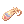

# Dimonka Headgear Quests

Dimonka is found in the [Main Office](Main_Office.md) and offers a unique selection of practical headgear to support your adventures. 

<table>
<thead>
<tr>
<th style="width: 18%;">Headgear</th>
<th style="width: 22%;">Materials</th>
<th style="width: 40%;">Description</th>
<th style="width: 20%;">Information</th>
</tr>
</thead>
<tbody>
<tr>
<td> Mitra [1]</td>
<td> Poring Coin - 1500  Handcuffs  - 1000  Margaretha Sorin Card - 1</td>
<td>A hat which is used for ceremonies by priests.  INT +1, VIT +1.  MDEF +5.  Increases Healing skills effectiveness by 5%.  Base INT at least 90:  MATK +10</td>
<td><strong>Class</strong>: Headgear <strong>Defense</strong>: 3 <strong>Position</strong>: Upper <strong>Weight</strong>: 10 <strong>Level Requirement</strong>: 90 <strong>Jobs</strong>: High Priest</td>
</tr>
<tr>
<td> Love Guard [1]</td>
<td> Poring Coin - 1500  Research Chart  - 500  Errende Ebecee Card - 1</td>
<td>A headdress worn by high level members of warrior clergy members.  Increases the effect of received healing by 5%.  Increases the effectiveness of your own healing skills by 2%.  If refined to +7 or higher, increases the effectiveness of your healing skills by an additional 3%.</td>
<td><strong>Class</strong>: Headgear <strong>Defense</strong>: 4 <strong>Position</strong>: Upper, Middle <strong>Weight</strong>: 50 <strong>Level Requirement</strong>: 30 <strong>Jobs</strong>: All</td>
</tr>
<tr>
<td> Advanced Assassin Mask [0]</td>
<td> Poring Coin - 1000  Assassin Mask - 1  Star Crumb - 50</td>
<td>Dark mask for famous assassins. Calms you down just by wearing it.  Critical +1  Increases Critical Damage by 1%.</td>
<td><strong>Class</strong>: Headgear <strong>Defense</strong>: 0 <strong>Position</strong>: Lower <strong>Weight</strong>: 10 <strong>Level Requirement</strong>: 70 <strong>Jobs</strong>: Priest and Assassin</td>
</tr>
<tr>
<td> Beer Hat</td>
<td> Poring Coin - 1200  Feather - 1000  Alcohol - 50</td>
<td>Taste of beer after a showerWow~! Drinking is prohibited for minors! Perfect dodge +5 Enable Level 3 Increase HP Recovery. Enable Level 3 Increase SP Recovery.</td>
<td><strong>Class</strong>: Headgear <strong>Defense</strong>: 2 <strong>Position</strong>: Upper <strong>Weight</strong>: 60 <strong>Level Requirement</strong>: 18 <strong>Jobs</strong>: All</td>
</tr>
<tr>
<td> Anubis Helm</td>
<td> Poring Coin - 1500  Cultish Masque - 1000  Celebrant's Mitten - 3</td>
<td>This celemonial headdress holds the likeness of Anubis, god of the underworld. Mdef +5 Reduces damage taken from Boss monsters by 10%. Increases restoration gained from Healing skills and Restorative items by 10%</td>
<td><strong>Class</strong>: Headgear <strong>Defense</strong>: 8 <strong>Position</strong>: Upper, Middle <strong>Weight</strong>: 0 <strong>Level Requirement</strong>: 65 <strong>Jobs</strong>: All</td>
</tr>
<tr>
<td> Puppy Hat</td>
<td> Poring Coin - 1000  Puppy Headband - 5  Fur - 200</td>
<td>A small brown-colored dog that sits atop your head. It's so cute you'd be barking mad to remove it. Agi +1 Randomly autocasts Level 1 Gloria when dealing physical attack. If base AGI at least 77: It will cast Level 3 Gloria instead.</td>
<td><strong>Class</strong>: Headgear <strong>Defense</strong>: 2 <strong>Position</strong>: Upper <strong>Weight</strong>: 50 <strong>Level Requirement</strong>: 30 <strong>Jobs</strong>: All Unrefineable</td>
</tr>
<tr>
<td> Umbala Spirit</td>
<td> Poring Coin - 1500  Wooden Heart - 500  Well-Dried Bone - 5</td>
<td>An accessory which is traditionally used in piercings by the Umbala tribespeople. MaxHP +1%. Increases the recovery rate of 'Meat' by 25%. Has a chance of dropping 'Meat' when defeating monsters.</td>
<td><strong>Class</strong>: Headgear <strong>Defense</strong>: 1 <strong>Position</strong>: Lower <strong>Weight</strong>: 0 <strong>Level Requirement</strong>: 1 <strong>Jobs</strong>: All</td>
</tr>
<tr>
<td> Wickebine's Black Cat Ears</td>
<td> Poring Coin - 1000  Black Cat Doll - 500  Kitty Band - 1</td>
<td>Ears of Wickebine's black cat. Increases critical attack damage by 10%. Critical +3 FLEE +10 DEF -50%</td>
<td><strong>Class</strong>: Headgear <strong>Defense</strong>: 2 <strong>Position</strong>: Upper <strong>Weight</strong>: 20 <strong>Level Requirement</strong>: 45 <strong>Jobs</strong>: All</td>
</tr>
<tr>
<td> Blush of Groom</td>
<td> Poring Coin - 1500  Blush - 1  Rouge - 10</td>
<td>A blushing impression of a bridegroom. Reduces damage from DemiHuman monster by 3%.</td>
<td><strong>Class</strong>: Headgear <strong>Defense</strong>: 0 <strong>Position</strong>: Middle <strong>Weight</strong>: 5 <strong>Jobs</strong>: All</td>
</tr>
<tr>
<td> Antique Smoking Pipe</td>
<td> Poring Coin - 1500  Pipe - 1  Matchstick - 5</td>
<td>A long smoking pipe used by gentlemen and nobility. Decreases damage from Demi Human monster by 2%</td>
<td><strong>Class</strong>: Headgear <strong>Defense</strong>: 0 <strong>Position</strong>: Lower <strong>Weight</strong>: 10 <strong>Jobs</strong>: All</td>
</tr>
<tr>
<td> Crimson Rose</td>
<td> Poring Coin - 2000  Rose Quartz - 10  Illusion Flower - 10</td>
<td>A crimson colored rose. Be sure to check for thorns before putting this in your mouth. Luk +1 When killing a monster there is a chance of a Whitherless Rose dropping.</td>
<td><strong>Class</strong>: Headgear <strong>Defense</strong>: 0 <strong>Position</strong>: Lower <strong>Weight</strong>: 10 <strong>Level Requirement</strong>: 50 <strong>Jobs</strong>: All</td>
</tr>
<tr>
<td> Vanilmirth Hat [0]</td>
<td> Poring Coin - 1000  Large Jellopy - 300  Flame Heart - 20</td>
<td>A cold, soft hat that is shaped like a Vanilmirth. Mdef +5 Randomly autocasts Level 1 Bolt magics when dealing physical attack.</td>
<td><strong>Class</strong>: Headgear <strong>Defense</strong>: 0 <strong>Position</strong>: Upper <strong>Weight</strong>: 100 <strong>Level Requirement</strong>: 30 <strong>Jobs</strong>: All Unrefineable Undestructible</td>
</tr>
<tr>
<td> Gigantic Majestic Goat (DEF)</td>
<td> Poring Coin - 1200  Majestic Goat [1] - 1  Majestic Goat - 1</td>
<td>A headgear made from the horns of Baphomet. Adds 12% tolerance against Demihuman monsters. Increases certain amount of ATK based on wearer's Job Level.</td>
<td><strong>Class</strong>: Headgear <strong>Defense</strong>: 5 <strong>Position</strong>: Upper <strong>Weight</strong>: 80 <strong>Level Requirement</strong>: 50 <strong>Jobs</strong>: All</td>
</tr>
<tr>
<td> Filir's Pinions</td>
<td> Poring Coin - 1500  Red Feather - 25  Blue Feather - 25</td>
<td>A cute headgear made in the form of Filir's wings, the most popular bird-like homunclus. Increases attack speed by 2%. Reduces cast delay by 2%.</td>
<td><strong>Class</strong>: Headgear <strong>Defense</strong>: 1 <strong>Position</strong>: Middle <strong>Weight</strong>: 10 <strong>Level Requirement</strong>: 70 <strong>Jobs</strong>: All</td>
</tr>
<tr>
<td> Pecopeco Wing Ears</td>
<td> Poring Coin - 1000  Peco Peco Feather - 500  Illusion Flower - 10</td>
<td>An ornament wing created by Morgan Stanley's. Agi +1. Mdef +2.</td>
<td><strong>Class</strong>: Headgear <strong>Defense</strong>: 1 <strong>Position</strong>: Middle <strong>Weight</strong>: 10 <strong>Level Requirement</strong>: 70 <strong>Jobs</strong>: All</td>
</tr>
<tr>
<td> Darkness Helm [1]</td>
<td> Poring Coin - 1500  Bone Helm [1] - 1  Crystal of Darkness - 500</td>
<td>A helm crafted by Demons specially for the Dark Lord. Has several powers set to Dark Lords from the past generations. Hidden ability gets activated upon the combination of certain Mid Headgear. If equipped in combination with Evil Wing Ears, STR +1, ATK +5%. If equipped in combination with Angel Wing Ears, STR +1, ASPD +5%. If equipped in combination with Pecopeco Wing Ears, AGI +1, Flee +3. If equipped in combination with Black Frame Glasses, INT +1, MATK +2%.</td>
<td><strong>Class</strong>: Headgear <strong>Defense</strong>: 3 <strong>Position</strong>: Upper <strong>Weight</strong>: 50 <strong>Level Requirement</strong>: 70 <strong>Jobs</strong>: All</td>
</tr>
<tr>
<td> Chick Hat</td>
<td> Poring Coin - 1200  Feather of Birds - 500  Egg Shell - 1  Sidewinder Card - 1</td>
<td>A hat adorned with a cute chick that brings feelings of joy to those that see it hopping. Luk +2, MaxHP +50, MaxSP +50. Enable Level 2 Double Attack. Reduces damage taken from Demihuman and Brute monsters by 3%.</td>
<td><strong>Unrefineable</strong> <strong>Class</strong>: Headgear <strong>Defense</strong>: 1 <strong>Position</strong>: Upper <strong>Weight</strong>: 10 <strong>Level Requirement</strong>: 10 <strong>Jobs</strong>: All</td>
</tr>
<tr>
<td> Rainbow Scarf</td>
<td> Poring Coin - 1200  Soft Silk - 500  Red Feather - 10  Blue Feather - 10</td>
<td>A scarf with rainbow color. Matk +1%. Int +1. Mdef +2.</td>
<td><strong>Class</strong>: Headgear <strong>Defense</strong>: 1 <strong>Position</strong>: Lower <strong>Weight</strong>: 10 <strong>Level Requirement</strong>: 90 <strong>Jobs</strong>: All</td>
</tr>
<tr>
<td> Skull Cap [1]</td>
<td> Poring Coin - 3000  Soft Feather - 200  Skull - 500  Black Dyestuffs - 1</td>
<td>A driver`s cap with a manacing skull on the band. Matk +2%. If refined to +5 or higher, adds an additional Matk +3%. If refined to +7 or higher, adds an additional Matk +3%. Special Effect: If equipped in combination with Elven Ears[0], decreases the SP cost of skill by 3%. If equipped in combination with Evil Bone Wand[0], each refine on the weapon adds Matk +1%. If the Evil Bone Wand[0] is refined to +10, reduces cast time of skill by 10%. If equipped in combination with Thorn Staff of Darkness[0], each refine on the weapon adds Matk +1%. If the Thorn Staff of Darkness[0] is refined to +10, reduces cast time of skill by 10%.</td>
<td><strong>Class</strong>: Headgear <strong>Defense</strong>: 0 <strong>Position</strong>: Upper <strong>Weight</strong>: 40 <strong>Level Requirement</strong>: 10 <strong>Jobs</strong>: All</td>
</tr>
<tr>
<td> Gangster Scarf</td>
<td> Poring Coin - 1200  Scarlet Dyestuffs - 20  Gangster Mask - 5  Pocket Watch - 2</td>
<td>A gangster's red scarf. Atk +5 [Rogue class] Enable Level 1 Gangster Paradise.</td>
<td><strong>Class</strong>: Headgear <strong>Defense</strong>: 0 <strong>Position</strong>: Lower <strong>Weight</strong>: 10 <strong>Level Requirement</strong>: 60 <strong>Jobs</strong>: All except Novice</td>
</tr>
<tr>
<td> Satanic Bone Helm [1]</td>
<td> Poring Coin - 2000  Clattering Skull - 350  Ice Scale - 5  Glacial Heart - 350</td>
<td>Made from a frost giant's bones. No confirmation of its authenticity. Dex +3 Enable use of Level 1 Frost Nova. Reduce damage from Neutral elemental attacks by 5%.</td>
<td><strong>Class</strong>: Headgear <strong>Defense</strong>: 6 <strong>Position</strong>: Upper, Middle <strong>Weight</strong>: 60 <strong>Level Requirement</strong>: 1 <strong>Jobs</strong>: All</td>
</tr>
<tr>
<td> Dark Randgris Helm [1]</td>
<td> Poring Coin - 2000  Valhalla's Flower - 50  Evil Wing Ears - 1  Angel Wing Ears - 1</td>
<td>Helm imbued with Valkyrie Randgris' power. Dex +3, Mdef +1</td>
<td><strong>Class</strong>: Headgear <strong>Defense</strong>: 2 <strong>Position</strong>: Upper, Middle <strong>Weight</strong>: 30 <strong>Jobs</strong>: All</td>
</tr>
<tr>
<td> Orc Hero Headdress [1]</td>
<td> Poring Coin - 4000  Heroic Emblem - 100  Gold - 20</td>
<td>An Orc Hero's massive headgear. Str +2 Adds 3% chance to autocast Level 3 Weapon Perfection when receiving physical damage.</td>
<td><strong>Class</strong>: Headgear <strong>Defense</strong>: 5 <strong>Position</strong>: Upper, Middle <strong>Weight</strong>: 90 <strong>Jobs</strong>: All</td>
</tr>
<tr>
<td> Little Angel Doll</td>
<td> Poring Coin - 2000  Red Feather - 50  Fur - 50</td>
<td>Angelic protector that summons holy wrath on attackers. Dex +3 Chance to cast Level 3 Grand Cross when hit by melee physical attack.</td>
<td><strong>Class</strong>: Headgear <strong>Defense</strong>: 2 <strong>Position</strong>: Upper <strong>Weight</strong>: 30 <strong>Level Requirement</strong>: 10 <strong>Jobs</strong>: All</td>
</tr>
<tr>
<td> Bunny Ears Hat</td>
<td> Poring Coin - 1200  Magician Hat - 1  Wing of Dragonfly - 350  Spring Rabbit Card - 1</td>
<td>A cute red top hat with bunny ears. Perfect for a magic show! Agi +3 Chance to cast Lv. 5 Increase Agi when user receives physical damage.</td>
<td><strong>Class</strong>: Headgear <strong>Defense</strong>: 0 <strong>Position</strong>: Upper <strong>Weight</strong>: 30 <strong>Jobs</strong>: All</td>
</tr>
<tr>
<td> Well-Chewed Pencil</td>
<td> Poring Coin - 700  Pencil Case - 7  Apple of Archer - 1  Wooden Gnarl - 450</td>
<td>A popular test snack, but probably best not left in your mouth for long. Hit +3 When equipped with 'Model Training Hat', Dex +2, DEF +2.</td>
<td><strong>Class</strong>: Headgear <strong>Defense</strong>: 0 <strong>Position</strong>: Lower <strong>Weight</strong>: 10 <strong>Level Requirement</strong>: 10 <strong>Jobs</strong>: All</td>
</tr>
<tr>
<td> Fish in Mouth</td>
<td> Poring Coin - 700  Ancient Lips - 350  Mystic Frozen - 50  Rough Wind - 50</td>
<td>A fish that won't rot in your mouth. Killing monsters grants a chance to drop Fresh Fish. Increases Fresh Fish recovery rate by 25%.</td>
<td><strong>Class</strong>: Headgear <strong>Defense</strong>: 0 <strong>Position</strong>: Lower <strong>Weight</strong>: 20 <strong>Level Requirement</strong>: 30 <strong>Jobs</strong>: All</td>
</tr>
<tr>
<td> Alice Doll [1]</td>
<td> Poring Coin - 2000  Alice's Apron - 500  Soft Apron - 3  Marionette Doll [1] - 1  Hydra Card - 1</td>
<td>A doll modeled after Alice, providing cheer from atop your head. Str +1 Increases damage to Demihumans by 10%. Inflicts Sleep status when attacking.</td>
<td><strong>Class</strong>: Headgear <strong>Defense</strong>: 0 <strong>Position</strong>: Upper <strong>Weight</strong>: 50 <strong>Level Requirement</strong>: 30 <strong>Jobs</strong>: All except Novice</td>
</tr>
<tr>
<td> Glaris Doll Hat [1]</td>
<td> Poring Coin - 2000  Alice's Apron - 500  Soft Apron - 3  Marionette Doll [1] - 1  Thara Frog Card - 1</td>
<td>Headgear inspired by Kafra Glaris, known for her teacher-like authority. Decreases damage from Demihumans by 5%. Recover 50 HP when killing a monster with a magical attack.</td>
<td><strong>Class</strong>: Headgear <strong>Defense</strong>: 0 <strong>Position</strong>: Upper <strong>Weight</strong>: 50 <strong>Level Requirement</strong>: 60 <strong>Jobs</strong>: All</td>
</tr>
<tr>
<td> Defolty Doll Hat [1]</td>
<td> Poring Coin - 2000  Alice's Apron - 500  Soft Apron - 3  Marionette Doll [1] - 1  Thara Frog Card - 1</td>
<td>So hot! A headgear with the figure of Kafra Defolty! Numerous users are using Kafra storage more than 20 times a day, fascinated by her smiling face. Decreases 5% damage from Demihuman monsters. Autocasts Lv 10 Angelus when physically attacked within short range.</td>
<td><strong>Class</strong>: Headgear <strong>Defense</strong>: 0 <strong>Position</strong>: Upper <strong>Weight</strong>: 50 <strong>Level Requirement</strong>: 60 <strong>Jobs</strong>: All</td>
</tr>
<tr>
<td> Tropical Fruit Hat [1]</td>
<td> Poring Coin - 2000  Red Prickly Fruit - 250  Prickly Fruit - 250</td>
<td>A hat made with tropical fruits. It looks delicious. Mdef +3 Auto casts Charming Wink with low chance when attacked.</td>
<td><strong>Class</strong>: Headgear <strong>Defense</strong>: 3 <strong>Position</strong>: Upper <strong>Weight</strong>: 40 <strong>Jobs</strong>: All</td>
</tr>
<tr>
<td> Dress Hat [1]</td>
<td> Poring Coin - 2000  Magician Hat - 1  Soft Feather - 500</td>
<td>A tiny and cute hat that can decorate a part of the head. This hat, along with a pretty dress, makes the wearer want to go on a picnic. Str +1, Int +1 Atk +2%, Matk +2% Mdef +7 Increases Healing skills by 5%. Refine Level +7: Atk +1%, Matk +1% Increases Healing skills by 1%.</td>
<td><strong>Class</strong>: Headgear <strong>Defense</strong>: 2 <strong>Position</strong>: Upper <strong>Weight</strong>: 20 <strong>Level Requirement</strong>: 20 <strong>Jobs</strong>: All</td>
</tr>
<tr>
<td> Rideword Hat [1]</td>
<td> Poring Coin - 2000  Bookclip in Memory - 200  Old Magicbook - 2</td>
<td>A hat designed to mimic the look of a terrible magic book which attacks people. Randomly absorbs 8% physical damage inflicted into HP. Randomly absorbs 4% physical damage inflicted into SP. Drains 10 HP every 5 seconds while equipped.</td>
<td><strong>Class</strong>: Headgear <strong>Defense</strong>: 2 <strong>Position</strong>: Upper <strong>Weight</strong>: 30 <strong>Level Requirement</strong>: 40 <strong>Jobs</strong>: All</td>
</tr>
<tr>
<td> Festival Pumpkin Hat</td>
<td> Poring Coin - 1200  Pumpkin Lantern - 1000  Four Leaf Clover - 20</td>
<td>A pumpkin hat for celebrating Halloween: wear it when you go trick-or-theating! All stats +3. Increase Physical and Magical Attack Strength against Devil monsters by 5%.</td>
<td><strong>Class</strong>: Headgear <strong>Defense</strong>: 3 <strong>Position</strong>: Upper <strong>Weight</strong>: 20 <strong>Jobs</strong>: All</td>
</tr>
<tr>
<td> Pirate Dagger</td>
<td> Poring Coin - 1200  Well-Dried Bone - 20  Wooden Heart - 120</td>
<td>A small sivler knife that is held between your teeth to allow free use of your hands. Atk +5.</td>
<td><strong>Class</strong>: Headgear <strong>Defense</strong>: 0 <strong>Position</strong>: Upper <strong>Weight</strong>: 10 <strong>Jobs</strong>: All</td>
</tr>
<tr>
<td> Purple Cowboy Hat [1]</td>
<td> Poring Coin - 1200  Corsair - 1  Soft Feather - 300</td>
<td>A hat, symbolizing western frontiers, made to celebrate, the festival. Int +2, Vit +2, MaxSP +50.</td>
<td><strong>Class</strong>: Headgear <strong>Defense</strong>: 5 <strong>Position</strong>: Upper <strong>Weight</strong>: 50 <strong>Jobs</strong>: All</td>
</tr>
<tr>
<td> Santa Poring Hat [1]</td>
<td> Poring Coin - 1200  Santa Hat - 10  Angel Wing - 1  Turquoise - 20</td>
<td>A cute hat made from a hopping Poring wearing a Santa's Hat. Increases physical damage inflicted on Shadow elemental monsters by 3%. Reduces damage taken from Shadow elemental attack by 3%.</td>
<td><strong>Class</strong>: Headgear <strong>Defense</strong>: 2 <strong>Position</strong>: Upper <strong>Weight</strong>: 10 <strong>Jobs</strong>: All</td>
</tr>
<tr>
<td> Necromancer's Hood</td>
<td> Poring Coin - 1200  Cursed Seal - 10  Evil Horn - 50</td>
<td>The Deadly Necromancer's Essence is embodied in this Hood. Add a 5% chance of auto casting Level 5 Dark Strike when player receives Physical Damage.</td>
<td><strong>Class</strong>: Headgear <strong>Defense</strong>: 2 <strong>Position</strong>: Upper, Middle <strong>Weight</strong>: 10 <strong>Level Requirement</strong>: 10 <strong>Jobs</strong>: All</td>
</tr>
<tr>
<td> Koneko Hat</td>
<td> Poring Coin - 1200  Drooping Cat - 1</td>
<td>A magical kitty hat which shows various expressions on its face. Reduces Cast Delay of all skills by 3%. Matk +3%, MaxSP +3%. Mdef +3, Int +1.</td>
<td><strong>Class</strong>: Headgear <strong>Defense</strong>: 1 <strong>Position</strong>: Upper <strong>Weight</strong>: 50 <strong>Jobs</strong>: All</td>
</tr>
<tr>
<td> Moonlight Flower Hat</td>
<td> Poring Coin - 1200  Nine Tails - 500  Topaz - 250</td>
<td>A hat inspired by the adorable Moonlight Flower. Be sure to hand-wash to prolong the soft Nine Tail Fur lining. Dex +2. Randomly autocasts Level 1 Increase Agility when dealing physical attack.</td>
<td><strong>Class</strong>: Headgear <strong>Defense</strong>: 3 <strong>Position</strong>: Upper, Middle <strong>Weight</strong>: 50 <strong>Jobs</strong>: All</td>
</tr>
<tr>
<td> Fish Head hat</td>
<td> Poring Coin - 700  Fresh Fish - 300</td>
<td>A gaping fish head fashioned into a hat. A nasty stench is released whenever it opens its mouth. Adds a low chance of automatically casting Level 1 Frost Weapon with each physical attack.</td>
<td><strong>Class</strong>: Headgear <strong>Defense</strong>: 1 <strong>Position</strong>: Upper <strong>Weight</strong>: 40 <strong>Jobs</strong>: All</td>
</tr>
</tbody>
</table>