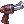
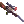
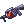
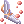
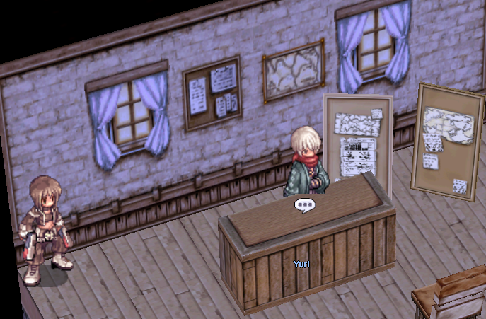

---
hide:
  - toc
---

# Expanded Class Weapons  

uaRO introduces **Expanded Class weapons** designed specifically for **Gunslinger** and **Ninja** and **Super Novice** classes.

These weapons use **Renewal-era sprites and names**, but their stats have been carefully reworked to fit a **generalized pre-renewal balance**, allowing greater flexibility and freedom in skill builds.

---

## ⚔️ Weapon Overview

### Gunslinger

| Weapon | In-game command |
|--------|-----------------|
| Bolt Revolver [2] | @ii 32303 |
| King Cobra [2] | @ii 28240 |
| Death Fire [2] | @ii 13192 |
| Avenger [2] | @ii 28226 |
| Bolt Revolver [2] | @ii 35658 |

### Ninja

| Weapon | In-game command |
|--------|-----------------|
| Fortified Dagger [2] | @ii 35659 |
| Illusion Wing Shuriken [2] | @ii 13338 |

### Super Novice

| Weapon | In-game command |
|--------|-----------------|
| Valkyrie Knife [4] | @ii 28717 |

Each weapon is tailored to support diverse playstyles without forcing rigid builds.

---

## 🧬 Acquisition System

Expanded Class weapons are obtained through a **token-based system**, allowing players to choose the weapon that best fits their class and build.

### 🎟 Weapon Token

- A **single token type** is used
- Upon exchange, players can **select the weapon** appropriate for their class/build

### 🔧 Token Creation Requirements

To create a token, you must combine:

- **1000 × Expanded Token Fragments**
- **10,000,000 Zeny**

---

## 🧩 Expanded Token Fragments

### 📍 How to Obtain

- Dropped by monsters included in **Elite-tier Hunting Mission quests**
- **Drop Rate:** 3%
- You **do NOT need** to have an active Hunting Mission to obtain fragments

### 🏛 NPC Location

All related NPCs are located in the **eastern room of the Prontera Upgrade Shop** (**/navi prt_in 90/72**)  

 
---

## 👾 Eligible Monsters

Expanded Token Fragments can be obtained from the following monsters:

- Acidus (@mi 1713)
- Acidus (@mi 1716)
- Aqua Elemental (@mi 2016)
- Banshee (@mi 1867)
- Bradium Golem (@mi 2024)
- Centipede (@mi 1987)
- Centipede Larva (@mi 1999)
- Cornus (@mi 1992)
- Dark Pinguicula (@mi 2015)
- Draco (@mi 2013)
- Hillslion (@mi 1989)
- Iara (@mi 2069)
- Imp / Fire Imp (@mi 1837)
- Kasa (@mi 1833)
- King Dramoh (@mi 2198)
- Luciola Vespa (@mi 1994)
- Medusa (@mi 1148)
- Naga (@mi 1993)
- Necromancer (@mi 1870)
- Nepenthes (@mi 1988)
- Phylla (@mi 2021)
- Pinguicula (@mi 1995)
- Piranha (@mi 2070)
- Ragged Zombie (@mi 1865)
- Rhyncho (@mi 2020)
- Salamander (@mi 1831)
- Tatacho (@mi 1986)
- Venatu (@mi 1679)
- Venatu (@mi 1677)
- Venatu (@mi 1676)
- Pot Dofle (@mi 2203)
- Sropho (@mi 2201)
- Sedora (@mi 2204)

---

## ℹ️ Notes

- Fragment drops are **independent of active quests**
- Weapon stats are balanced for **pre-renewal gameplay**
- The system is designed to support **multiple viable builds**, not a single optimal path