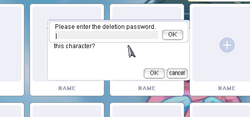
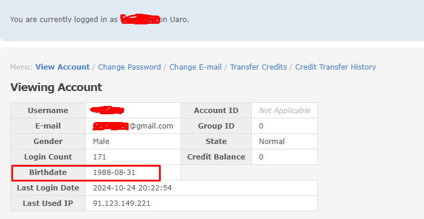

---
hide:
  - toc
---
# FAQ

## How to delete a character?

To delete a character, follow these steps:

1. Select the character in the character selection window. Press the **"Delete reservation"** button.
 
2. Wait one minute, then press the **"Delete"** button and confirm deletion. 

3. For final confirmation of deletion, you need to enter the date of birth that you specified when creating your account. The format is **YYMMDD**, where: 
**YY** - last two digits of the year, 
**MM** - month, 
**DD** - day. 
Enter the **YYMMDD** and press **OK**. 

!!! Note
    If you forgot the date of birth you entered when creating your account, you can visit the control panel on the website [here](https://uaro.net/cp/?module=account&action=login).

