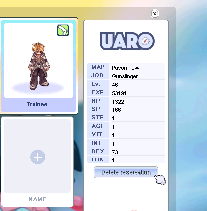
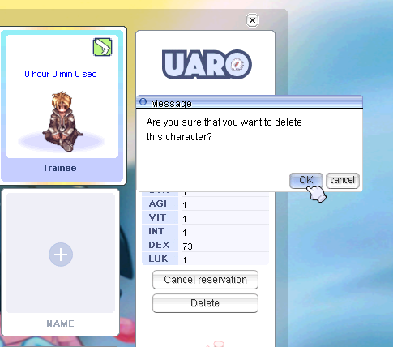
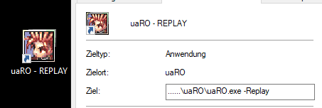

# FAQ

## How to delete a character?

To delete a character, follow these steps:

1. Select the character in the character selection window. Press the **"Delete reservation"** button.
 
2. Wait one minute, then press the **"Delete"** button and confirm deletion. 

3. For final confirmation of deletion, you need to enter the account's E-mail.

## Replay and Screenshot for Reports and Troubleshooting  

The third icon in the third row. It is a built-in video tool which requires very low space and resources. If you encounter Grief Play like kill steal you can start this tool to record it in the future. They are saved in …\uaRO\Replay  
To watch a replay, you have to open the normal uaRO.exe with the addon “…\uaRO\uaRO.exe -replay”. I recommend to create your own shortcut, name it uaRO Replay, and add it to the path.  

To make a Screenshot, press the PRINT button. It will make a screenshot with a time stamp and contain everything you see right now. They are saved in …\uaRO\ScreenShot  
If you encounter Grief Play, Insults or other breaking the rules, these are the best tools to collect proof. Go to the Discord, use the submit-ticket channel, and send your proofs to the Server Staff.  

!!! Hint
     If you encounter trouble in game, don’t deal the damage you should, don’t find a quest NPC, your mercenary behaves odd, or anything else I recommend adding a screenshot, replay or video (you can make a video of your replay later, when you have the time). This will help a lot to understand your situation and provide a proper solution.