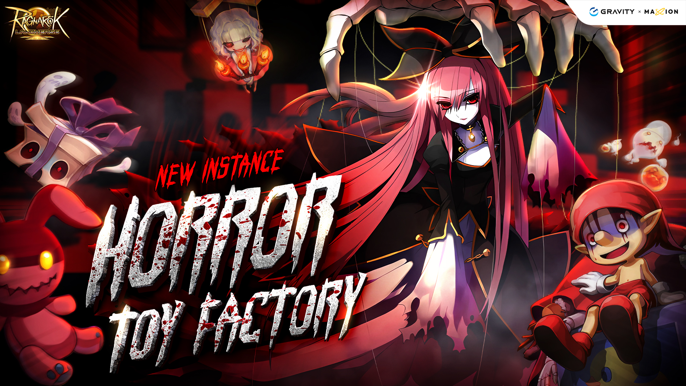
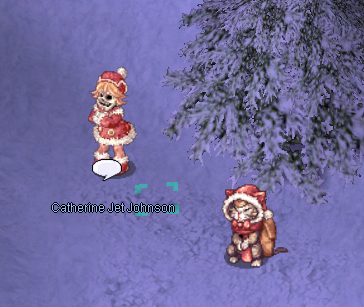
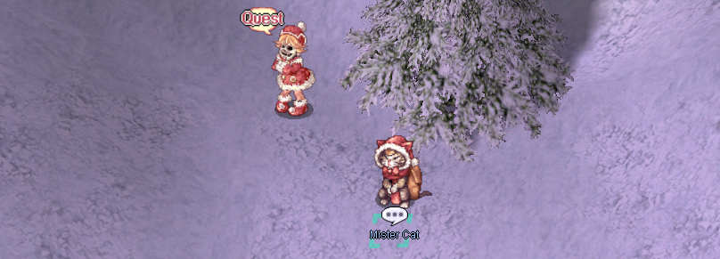

# Horror Toy Factory

Horror Toy Factory is an instance where players explore a sinister toy factory filled with aggressive monsters and ghosts. The main objective is to defeat the final boss, Celine Kimi, while overcoming traps and powerful enemies along the way.  
The instance offers unique rewards, including rare items and equipment, making it popular among players.

### Requirements
**Base Level:** 90  
**Party:** At least 3 members

!!! note "**Global reset per account** at `06:00 Server Time` every **Monday**."

### Lockout Mechanics

- Account/UniqueID locked upon start of instance initiation
- All mechanics still the same for loot, MVP structure etc.
- Upon a successful full clear of the dungeon, the UniqueID will be released
  for another run. Account will remain on cooldown (Free to utilize same PC
  but different account)
- BBG will remain blocked
- If you DO NOT follow the mechanics and fully clear, you will be locked out
  for the week

!!! warning "Anti-Circumvention Policy"
    Attempts to bypass these mechanics will result in all associated accounts banned.

### End of Instance Specific UniqueID Unlock Points

| Instance | Unlock Action |
|----------|---------------|
| **HTF** | Warp portal at end of map (Touch and exit) |

## How to get there

 
To start this instance, you need to go to Lutie and find the NPC Catherine Jet Johnson (**/navi xmas 237/303**). Talk to her and agree to help her.

!!! note " After the instance starts, the party will have one minute for each member to type the **!ready** command in general chat. Otherwise, the instance will need to be restarted."

## Storyline

Once, in a small town Lutie, there stood a toy factory, the heart of the community. All the townspeople worked there, crafting dolls and other toys. After a long workday, they would gather together, enjoying tea and gingerbread cookies. But the happy times did not last long. People began to leave the town, the factory's business became less and less profitable, and eventually, the decision was made to shut it down.

The last person to remain at the factory was the master dollmaker, a man who created the most beautiful and lifelike dolls. On the day of the factory’s closure, he finished his final creation—a stunning doll named Celine Kimi. He dressed her in the finest attire, gave her a name, and it seemed as if he was saying farewell not just to the factory, but to his dream. In that very moment, the production lines came to a halt forever.

But the story did not end there. Kimi… came to life. Whether it was the dollmaker’s craftsmanship, his heartfelt devotion, or something more mysterious, she became a living being. However, her existence was filled with sorrow and rage. She remained within the abandoned factory, as if bound to it.

One day, a former factory worker returned to the building, only to find a horrifying scene: the dollmaker lay lifeless on the ground, while Kimi stood motionless beside him, her gaze empty and hollow. Then, everything faded into darkness.

When the girl regained consciousness, she was outside… and her face had changed forever. She had no memory of what had happened, no knowledge of whether Kimi had been responsible for her transformation, but she felt one thing—she needed to uncover the truth.

Yet, fear kept her from returning alone. She needed help. And now, the choice is yours: do you have the courage to enter the factory, face Kimi, and uncover the mystery of that fateful day?

### Factory Area No.1

??? note "Storyline, click to expand"

    Once, Factory No.1 was a place where toys and dolls were stored before being gifted to children. It was always bustling with activity, and workers strictly followed the rules. If someone wasn't wearing their uniform, the guards would immediately step in and reprimand them.
    
    But now, everything had changed. The silence was suddenly broken by a loud announcement:
    
    — Wake up, toy factory working time has come…
    
    Something was wrong. Dolls and toys were now moving on their own, replacing the workers who once filled this place with life.
   
    — Waste and other debris should be kept clear from work areas. This is to keep you safe at all times.
    
    It looked as if the factory was still operating, only now, ghostly entities had taken over.
   
    — Let's make presents for every child's dream today.
    
    But this was no place for joy. Ahead lay the final section of the factory, where all production lines needed to be shut down.
   
    — Please start product line No.1. Don't forget to wear a safety helmet! This means you, Bob!
   
    What if the toys and gift boxes could be restored to their original state?
    
    — We should… return them to how they were… Yes… — the voice trembled. — But do we need to fight them? I… I don’t know how exactly…
    
    Another ominous announcement echoed through the eerie silence:

    — All employees must wear a proper uniform and identification. Please check with security if you do not have yours.

    — God… I hope the guards are still human…

    There had to be some old uniform boxes left somewhere. Yes, there they were, right behind them.

    — You’d better change into the uniform. Luckily, I still have my employee card.

    From here, everyone would have to find their own way.

    — I'll find my way around. Let’s meet near the second production line.

    The final words came with a strained smile:

    — Don’t lose hope—it’s a toy factory! It can’t be that bad… right?

1. After the introduction, speak to the Myst Case NPC to transform into a Red Cookie. You must remain in this form while exploring. Avoid interacting with other NPCs aside from the transformation Myst Case unless you are properly transformed—doing so while untransformed will trigger multiple Nightmare Cruisers to spawn. There are several Myst Case NPCs positioned around the corners of the room. Be sure to speak to one before your transformation expires to maintain your form.

2. Defeat Vicious Cookies and Evil Dwelling Boxes scattered throughout the area. Once enough enemies are eliminated, an announcement will signal completion, and any remaining monsters will disappear.

3. Next, move to the northwest section of the room and interact with the Green Cookie NPC. You must be in the Red Cookie form to proceed. If you are not transformed, the NPC will temporarily vanish before reappearing and will not respond to you until you regain the Red Cookie form.

4. After completing the dialogue, locate the new Myst Case NPC to transform into a Myst Case. You must be in this form to advance to the next area. 
5. Finally, enter the portal to the right of the Green Cookie to progress to the next phase.

| Monster | Quantity | In-game command |
|---------|----------|----------|
|  Vicious Cookie | 31 | @mi 2989 |
|  Evil Dwelling Box | 36 | @mi 2991 |

### Factory Area No.2

??? note "Storyline, click to expand"

    You made it here safely – that’s good. This place was once Factory No.2, filled with life and people. But now, everything has changed…  
    
    While I was coming here, I realized something. The children… There are many of them. Their souls look terrifying, yet there is so much sorrow in them. They are suffering, and perhaps the only way to help them is to grant them peace. If they attack you, please set them free. Luckily, they won’t harm me.  
    
    There’s one more thing. If you come across a worker toy still performing its duty, ask it about the doll maker. If it remembers him, maybe the master will finally find peace. That is our only hope…  
    
    If you manage to gather all the clues, continue searching in other areas. In the meantime, I will find the place where I last saw the doll maker.
    
    Sorry that I can't be of more help. See you soon.

1. After speaking with Catherine, interact with the Myst Case NPC again to transform into a Red Cookie. Just like in the first phase, you must remain transformed while exploring; otherwise, Cruisers will spawn in large numbers throughout the room. If you accidentally re-enter the portal you came from before completing this phase, you’ll need to return to the first room, transform into a Myst Case again, and then make your way back to the second room.

2. In this area, you will find 10 worker NPCs (Green Cookies). Speak with each of them and listen to their stories. While they are talking, you won’t be able to move, use skills, or consume items, but be aware that monsters can still target you during this time.

3. Once you’ve spoken to all 10 workers, an announcement will trigger, and all remaining monsters in the room will disappear. After that, go back through the portal you entered from, then proceed through the northern portal to advance to the next phase.

| Monster | Quantity | In-game command |
|---------|----------|----------|
|  Malicious Baby Ghost | 19 | @mi 2993 |
|  Evil Dwelling Box | 16 | @mi 2991 |
|  Abandoned Teddy bear | 22 | @mi 2995 |
|  Creepy Demon | 16 | @mi 2992 |

### Factory Area No.3

??? note "Storyline, click to expand"
    A cheerful voice echoed through the abandoned factory:

    — Listen to me, Santa… I mean, I like this factory! No one owns it, and there are so many things I can use!

    However, his companion clearly didn’t share his enthusiasm.

    — You fool! I followed you just to be sure… And now you’re stealing everything from the factory!

    — Hey, what’s the big deal if I have a few extra presents? I don’t see anything wrong with that~

    — Ugh... Fine, but think about how the children will feel when they receive these gifts. How will they feel if they find out you just handed out things that belong to no one?

    Antonio paused for a moment, then burst into laughter:

    — Hmm… Maybe they’ll be happy?! A gift is a gift, after all! Hehehe.

    — The problem isn’t the gift itself! You can’t just take whatever you want!

    Suddenly, a mechanical voice echoed through the speakers:

    "The sending preparations have finished in Factory No.3. Delivery employees, please stand by."

    Antonio’s eyes lit up with excitement.

    — Oh wow! So many presents are being delayed! How about we throw a party today?! — he exclaimed, practically jumping in excitement. — Hey, human! If you want to help, feel free to follow me. Just don’t get in my way!

    His companion sighed in frustration.

    — That guy has no ethics… Hey, maybe you should kick him out? If you hit him a few times, he might just run away. It’s not right to steal from the community!

    He turned to you, waiting for a response. Even if no one technically owned this factory, did that mean anyone could take whatever they wanted?

1. Move to the center of the room to initiate a dialogue between Santa and Antonio. Once Antonio vanishes, proceed through the left portal.

2. Inside, you'll encounter numerous monsters, but your main objective is to defeat Antonio. Upon his defeat, an announcement will be made, and all remaining enemies in the room will be eliminated.

!!! Note
    Antonio may also spawn in the room where the conversation with Santa occurred. Be sure to check that area before heading through the left portal.

3.Afterward, return to the central room and proceed through the right portal to enter the final phase.

| Monster | Quantity | In-game command |
|---------|----------|----------|
|  Dancing Marionette | 37 | @mi 2994 |
|  Decorated Evil Tree | 31 | @mi 2987 |
|  Abandoned Teddy bear | 43 | @mi 2995 |
|  Creepy Demon | 31 | @mi 2992 |
|  Antonio | 1 | @mi 2988 |

### Final Phase.

??? note "Storyline, click to expand"
    Kimi stood in the center of the room, her small figure trembling with pain and confusion.

    — Kimi! Listen to me, — the voice was soft but firm. — I didn’t come here to blame you.

    She shook her head, her eyes, filled with despair, glistening in the dim light.

    — Everyone hates me! — she whispered. — You don’t like me either? But this ugly and creepy doll... it likes me...

    — Kimi, I spoke with the other dolls. They told me about you. The doll maker loved you very much!

    Suddenly, the air grew heavier, and a dark voice echoed from the shadows.

    — Lie!

    Kimi flinched, her lips trembling.

    — If that’s true... why didn’t he look at me with love? Why didn’t he call my name? — her voice wavered with sorrow. — I longed to hear Grandpa’s voice...

    — Yes, Kimi~ He was afraid! He was terrified of you!

    — No, don’t listen to it, Kimi! He truly cherished you!

    She hesitated, doubt flickering in her eyes.

    — Did he... cherish me?

    — Yes! When you started moving, he was so hap...

    But the dark voice interrupted, drowning out the words.

    — He was horrified by your appearance, and his heart stopped, Kimi~ You killed him!

    Fear flashed in Kimi’s eyes.

    — I... I killed him?

    — No, Kimi! That’s not true! He was sick!

    But the doubt had already taken root.

    — I... I... I killed him?..

    — Look at yourself, Kimi~ Look in the mirror~ How do you feel?

    imi shuddered, her hands reaching for her face as if realizing its existence for the first time.

    — I... I...

    — Don’t you agree you’re frightening? No one loves you, Kimi~

    She swayed as if the world around her was collapsing.

    — Because of me... Grandpa is dead...

    The darkness thickened around her, feeding off her pain and sorrow.

    — Rage~ Sorrow~ No one cries for you, Kimi~

    This was getting dangerous. She couldn’t be left like this.

    — I’ll find the emergency exit! — a voice called nearby. — Run, adventurer!

    But Kimi remained frozen, consumed by fear and grief.

    — I don’t want to be abandoned... I don’t want to be left alone... — her voice faded into the encroaching darkness, slowly swallowing her figure.

1. Listen to the conversation between Catherine and Celine Kimi. Once it finishes, both Celine Kimi and her phantom will appear. 

!!! warning "Celine Kimi's Information"
    She is a Large-sized, Ghost 1 property, and Undead Race creature. Celine Kimi has a large, spongy Max HP, high DEF, and high MDEF. To defeat her efficiently, it is recommended to use high ASPD AoE (Area of Effect) skills.  

    She also casts various skills, including Dispell, Power Up, and Critical Wounds.  

    If she is separated from her phantom, the phantom will heal her for a significant amount. Therefore, always ensure the phantom stays close to her, and deal damage to both of them at the same time. If Celine Kimi is moved too far from her spawn area, the fight will reset, so avoid dragging her too far away. It’s advisable to stay near the wall where she spawns to keep her in place.  

    **Furthermore, if her HP is 1.5% (or approximately 100,000 HP lower) than her phantom’s, the phantom will heal Celine Kimi for 8x the difference in HP.**

| Monster | Quantity | In-game command |
|---------|----------|----------|
|  Celine Kimi | 1 | @mi 2996 |
|  Kimi's Phantom | 1 | @mi 2997 |

## Treasure Room

??? note "Storyline, click to expand"
    Unfortunately, persuading Kimi was unsuccessful.

    The unknown phantom voice continued to torment Kimi, filling her heart with pain and doubt. What was that voice? Why was it so cruel to her?.. Deep inside, a suspicion arose that it was because of this voice that Catherine Jet Johnson had fallen under a curse, one that had changed her face.

    Yet, despite everything, even though Kimi despised everyone around her, she had gathered many memories in this place. Now, it was necessary to see this through—to do whatever it took to help her soul find peace and prevent her from feeling abandoned.

    — Thanks to you, all my doubts have finally been resolved, — Catherine Jet Johnson said, casting a grateful glance at her companion. — If you ever decide to send her soul to Heaven, please call me.

    With those words, she opened the exit.

    — I will go first. Just follow me.

    Yet, even as she stepped beyond the factory’s threshold, an uneasy feeling lingered within her. Kimi’s soul was still bound to this place… Would the day ever come when she could finally rest in peace?

After defeating Celine Kimi, proceed through the southwest portal to the treasure room.
Inside, you'll find 10 treasure box NPCs that will drop items when interacted with.

| Chest 1 | Chest 2 | Chest 3 |
|---------|---------|---------|
|  Bloody Coin (2-10) - 100%   Gift Box - 85%   Old Purple Box - 40%   Silver Bullion - 10%   Elite Siege Supply Box - 30% |  Bloody Coin (2-10) - 100%   Old Blue Box - 60%   Old Card Album - 30%   Gold Bullion - 5%   Elite Siege Supply Box - 30% |  Bloody Coin (2-10) - 100%   Silver Bullion - 15%   Gift Box - 40%   Platinum Bullion - 5%   Elite Siege Supply Box - 30% |
| Chest 4 | Chest 5 | Chest 6 |
|  Bloody Coin (2-10) - 100%   Gold Bullion - 30%   Old Purple Box - 40%   Enriched_Elunium - 10%   Elite Siege Supply Box - 30% |  Bloody Coin (2-10) - 100%   Gift Box - 85%   Old Card Album - 30%   Enriched Oridecon - 5%   Kind Heart [1] - 1% |  Bloody Coin (2-10) - 100%   Old Blue Box - 60%   Old Purple Box - 40%   Gift Box - 5%   Hurt Mind [1] - 1% |
| Chest 7 | Chest 8 | Chest 9 |
|  Bloody Coin (2-10) - 100%   Silver Bullion - 15%   Old Purple Box - 40%   Gold Bullion - 10%   Elite Siege Supply Box - 30% |  Bloody Coin (2-10) - 100%   Gold Bullion - 30%   Old Card Album - 40%   Enriched_Elunium - 4%   Elite Siege Supply Box - 30% |  Bloody Coin (2-10) - 100%   Gift Box - 85%   Old Purple Box - 40%   Enriched Oridecon - 5%   Hurt Mind [1] - 1% |
| Chest 10 |
|  Bloody Coin (2-10) - 100%   Old Blue Box - 60%   Old Purple Box - 40%   Silver Bullion - 10%   Kind Heart [1] - 1% |

## Exchange Shop

You can exchange your Bloody Coins with NPC Mister Cat (**/navi xmas 240/300**) for unique items.

| Item Name | Bloody Coins | In-game command |
|-----------|--------------|-----------------|
|  Red Lantern | 500 | @ii 2976 |
|  Old Parasol | 500 | @ii 13442 |
|  Noble Cross | 500 | @ii 16029 |
|  Evil Glove | 600 | @ii 2980 |
|  Celine's Ribbon | 600 | @ii 18849 |
|  Costume Lush Rose | 200 |  |
|  Costume Santa Doll Headband | 200 |  |
|  Sweet Canape | 3 | @ii 11564 |
|  Hot Tea | 2 | @ii 11563 |
|  Big Defense Potion 10 Box | 3 | @ii 13749 |
|  Big Magic Defense Potion 10 Box | 3 | @ii 13755 |

**Good luck and have fun!**