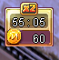
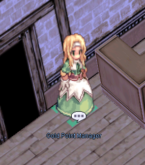
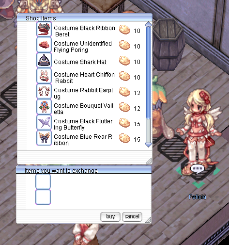

# Hourly Rewards System

In the top right corner of the screen, you will see a timer.

For every hour in the game (characters on @autotrade do not count), you will receive **10 Coins** that can be exchanged for symbolic prizes.

You can get your prizes from the NPC Gold Point Manager in Prontera Inn, or press on the timer anywhere to make the NPC Gold Point Manager appear:

| Item Name        | Cost  |
|------------------|-------|
|  Gold Coin - 1  | **120 Points** |
|  Gold Coin - 2 | **240 Points** |

Golden Coins can be exchanged for costumes in the Main Office.  
Rotation: Costumes (and possibly some consumables later) will rotate periodically.  

