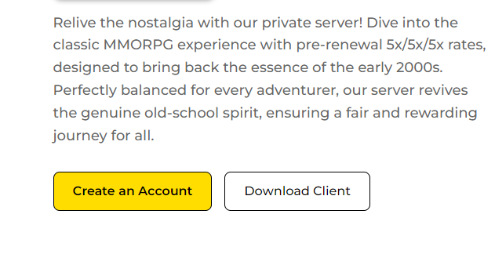
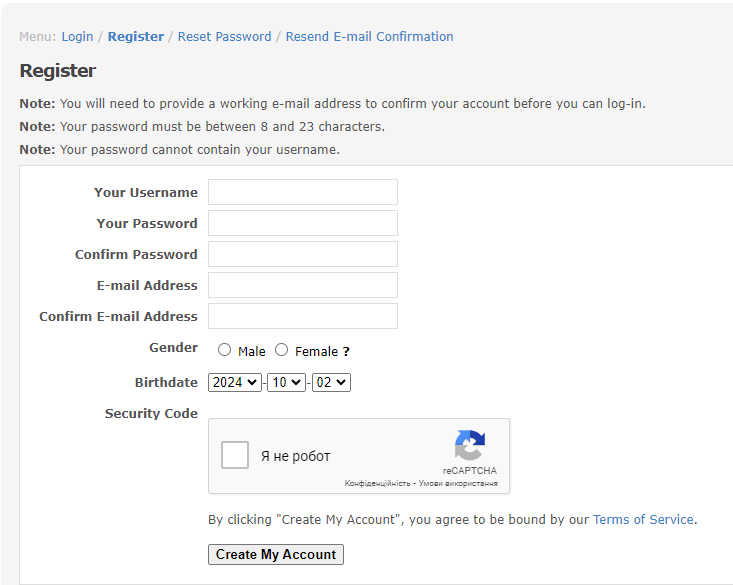

# How to Start

## **Account Creation**
Each version of Ragnarok Online has a different way to create accounts. This wiki covers the uaRO version of creating accounts.

To play on the uaRO server you must first create an account. To do this, go to the website: [https://www.uaro.net/](https://www.uaro.net/)

First, register an account. To do that, click the "Create an Account" button at the center of the screen.

You will be redirected to the page where you create an account.

You need to fill out the form and submit it. 
!!! note 
    Providing untruthful information may lead to missing out on some beneficial things.

!!! IMPORTANT
    **An e-mail to confirm the account will be sent. Confirm it, and the account will be activated. Account creation itself is free, and currently, players can create as many accounts as they want.**

The sex entered during registration will affect the sex of characters in the game. If "Male" was entered in the registration form, all in-game characters will be male. Likewise, if "Female" was entered, all in-game characters will be female. It is not possible to have both male and female characters on a single account. It is possible to change the gender later for a fee.

Make sure the ID and password are complex enough so that people won't be able to guess them. Also, sharing account information is not recommended. Doing so may place the account at risk of being compromised.
    