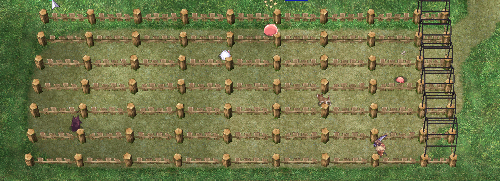
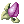
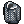

## 🏇 **Monster Race**

🐾 Monster Races — Hugel's Wildest Betting Game!

Looking for a fun way to spend some zeny in Hugel? 🎲 Try your luck with the Monster Races! Every 10 minutes, six adorable (and sometimes chaotic) monsters waddle their way toward the finish line — and you get to bet on who’ll win! 🏁

🎟️ How It Works:

Buy a Monster Ticket for 2,000z per race.

Singles win:  Prize Medals - 4

While the chances of winning singles are 1 in 6!

👾 Who’s Racing?

 Poring

 Lunatic

 Savage Babe

 Baby Desert Wolf

 Deviruchi

 Baphomet Jr.

All the racers move at about the same (kinda slow 😂) speed, but it’s never a straight shot — they stumble, they backtrack, and it’s hilarious to watch.

⚠️ But Wait — It’s Not Just Random! The track has hidden traps that can put racers to sleep 😴 or stun them 💫. Before each race, you can check out a monster's Endurance and Fortune stats — the higher they are, the better the monster can dodge those nasty obstacles. Still... don't bet the farm, because those stats don’t always matter. The monsters run using basic game AI, and sometimes they just wander around like they forgot there’s a race going on. 🤷‍♂️

!!! Important
        Bets close 30 seconds before the race starts.

        During the race: no items or skills allowed. 🛑

        Once it’s over, winners cash out at the receptionist 🎁, and everyone else gets booted out shortly after. If you stick around too long, you’ll be warped out and lose any rewards you might’ve earned. 😬

## **Prize Medal**

🎉 Rack Up Prize Medals in Hugel! 🏅

Crushing it in Hugel's minigames? Nice! Every win gets you some shiny Prize Medals as a reward. 💪🎯

💡 A few things to know about these medals:

🎒 Zero weight — so they won't slow you down!

🚫 You can’t sell, trade, or vend them — they’re soulbound.

💾 But hey, you can stash them up and swap ‘em later for cool loot! 😎✨

🛍️ What can you get?  
There’s a bunch of items you can exchange them for right in Hugel — from useful gear to fun rewards. Just find the **Wayne NPC** ( /navi hugel 71/83 ) or **Ei'felle** (/navi hugel 73/91) and start trading! 🏙️📦

**Wayne**

| Prize Medal | Reward |
|--------|--------|
| 1 Medal |  Mastela Fruit - 1  or   Witch Starsands - 5 |
| 3 Medals  |  Royal Jelly - 5 |
| 7 Medals  |  Gift Box - 5 |
| 8 Medals  |  Poring Coin - 5 |
| 16 Medals |  Old Blue Box - 5 |
| 25 Medals |  Old Purple Box - 4 |
| 42 Medals |  Taming Gift Set - 2 |
| 59 Medals |  Old Card Album - 1 |

**Ei'felle**

| Prize Medal | Reward |
|--------|--------|
| 1 Medal    | [Base or Job Experience](#base-experience) |
| 500 Medals |  Glittering Jacket [1] |
| 1000 Medals|  Aebecee's Raging Typhoon Armor [1]   Claytos Cracking Earth Armor [1]   Lucius's Fierce Armor of Volcano [1]   Saphien's Armor of Ocean [1] |

**All weapon cost 1500 Prize Medals**  

??? note "Dagger"  
     Ginnungagap  
     Grimtooth  
     Dragon Killer  
     Mail Breaker  
     Ice Pick  
     Bazerald  
     Sword Breaker  
     Sucsamad  
     Kitchen Knife  
     Azoth  
     Exorciser  
     Assassin Dagger  
     Moonlight Dagger  
     Weeder Knife  
     Cursed Dagger  
     Dagger of Counter  
     Combat Knife  
     Fortune Sword  

??? note "One Handed Sword"  
     Nagan  
     Immaterial Sword  
     Mysteltainn  
     Byeollungum  
     Star Dust Blade [1]  
     Caesar's Sword  
     Ice Falchion  
     Excalibur  
     Edge  
     Cutlus  
     Solar Sword  
     Tirfing  
     Fireblend  

??? note "Two Handed Sword"  
     Dragon Slayer  
     Masamune  
     Muramasa  
     Schweizersabel  
     Executioner  
     Zweihander  
     Katzbalger  

??? note "Axe"  
     Great Axe  
     Guillotine  
     Light Epsilon  
     Bloody Axe  
     Sabbath  
     Slaughter  
     Cleaver  
     Tomahawk  

??? note "Mace"  
     Golden Mace [1]  
     Grand Cross  
     Long Mace  
     Spike  
     Slash  
     Quadrille  

??? note "Bow"  
     Roguemaster's Bow  
     Dragon Wing  
     Rudra's Bow  
     Ballista  

??? note "Staff"  
     Wing Staff  
     Wizardry Staff  

??? note "Book"  
     Legacy of Dragon  
     Book of the Apocalypse  
     Girl's Diary [1]  
     Hardcover Book [1]  

??? note "Spear"  
     Gae Bolg  
     Gelerdria  
     Gungnir  
     Skewer  
     Longinus's Spear  
     Brionac  
     Bill Guisarme  
     Zephyrus  
     Crescent Scythe  
     Tjungkuletti  
     Hellfire  

??? note "Katar"  
     Infiltrator  
     Bloody Roar  
     Unholy Touch  

??? note "Knuckle"  
     Hatii Claw [1]  
     Berserk  
     Kaiser Knuckle  

??? note "Whip"  
     Lariat Whip  
     Rapture Rose  
     Blade Whip  
     Chemeti Whip  
    Queen's Whip  

??? note "Musical Instrument"  
     Oriental Lute  
     Electric Guitar  

## Base Experience

| Level | Exp |
|-------|-----|
| 1-20  | 300 |
| 21-30 | 600 |
| 31-40 | 4000 |
| 41-50 | 16000 |
| 51-60 | 50000 |
| 61-70 | 94000 |
| 71-80 | 110000 |
| 81-99 | 130000 |

## Job Experience

| Level | Exp |
|-------|-----|
| 1-10  | 50 |
| 11-20 | 500 |
| 21-30 | 3000 |
| 31-40 | 14000 |
| 41-50 | 40000 |
| 51-60 | 60000 |
| 61-70 | 76000 |