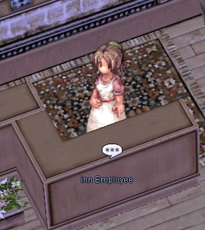

# Quality of Life Improvements

At World of Your Dream, we are dedicated to providing the ultimate gaming experience for our players. One of our top priorities is to actively listen to player feedback and use it to improve the game.

We are constantly working to add new features and improvements that will enhance the gameplay and make it even more enjoyable for everyone.

From new game modes to updates to existing content, we are committed to making World of Your Dream a truly immersive and satisfying experience for all players.

## Increased Natural Recovery

When a player is idle or not engaged in combat and has not been hit by a mob, they will experience a significant increase in HP and SP regeneration.

When a player sits, they will regain 3% of their maximum HP and SP every 1.5 seconds.

The regeneration is based on a fixed percentage, rather than a fixed value, so it will always take approximately 1 minute to fully regenerate from 0%.

### Restrictions
- When the character is overweight, recovery does not work
- Delayed after using Asura Strike for 5 minutes
- All other restrictions also apply to increased recovery

## Superior Inns

Inns have always been a safe stop between adventures, giving players a place to recover and get ready for what’s ahead. On uaRO, we’ve expanded on that idea to make inns even more useful by adding features that support both newcomers and veterans.

For **10,000z**, inns will fully restore your HP/SP and provide Blessing and Increase Agility buffs for 10 minutes. Every inn also includes Hobota for [Hunting Missions](Hunting_Mission.md) and our [Enhanced Tool Dealer](Dealers.md#enhanced-tool-dealer) for quick access to supplies.

[:octicons-arrow-right-24: Rest and recover at an inn](Inns.md)

## Enhanced Tool Dealer
Every town has a Tool Dealer located inside the inn, offering a wide range of supplies for your journey. Arrows of many types — including Iron, Silver, and Fire — plus traps are no longer limited to specific shops, so you can pick them up wherever you go. You’ll also find essentials like Berserk Potions, Yggdrasil Leaves, and Blue Gemstones, making it easy to stay stocked as you progress.

[:octicons-arrow-right-24: Check the available supplies](Dealers.md#enhanced-tool-dealer)

## Remastered Novice Location

Our server features an enhanced Training Grounds built with the latest renewal mechanics, offering a smoother and more efficient leveling experience. The Renewal version delivers the same immersive gameplay as pre-renewal, but with the added convenience of not requiring players to allocate stat points at the start.

This lets new players focus on honing skills and learning core mechanics without the stress of early complex decisions about character development. Quests from the Job NPCs provide valuable supplies and EXP for those who invest a bit of time, making it a simple and rewarding way to progress while gaining a deeper understanding of the game’s systems.

[:octicons-arrow-right-24: Start your adventure right](Dealers.md#enhanced-tool-dealer)

## RODEX Mail System
The RODEX mail system is one of the most convenient tools in uaRO, letting you stay supplied no matter where you are. For a small fee, you can send and receive items directly from the field instead of heading back to town. This makes it easy to restock consumables, free up weight, and keep hunting without interruption.

- **Fee**: 2,500z per item stack, 10,000z total for 5 item stacks
- **Weight Limit**: Items up to 2,000 total weight can be added
- **Short Term Storage**: Mail remains in your inbox for 14 days, then is deleted automatically
- **Restrictions**: Only tradeable items may be sent, check an item's *Movement Restrictions* in the item details
- **WoE Blocked**: Not available during War of Emperium

## Optimized Mechanics

| Feature | Description |
|---|---|
| **Easy Access to Prontera** | Distant cities have warp access to Prontera for 25,000z. |
| **Sensible Teleporting** | Fly Wing and Teleport will no longer randomly land you within portals, ensuring more control. |
| **Minimap Recall** | Track your previous teleport or fly wing location by configuring in `@settings`.  |
| **Stacking Monsters** | Monster stack limit is increased from 1 to 7. |
| **Rotating Bonus EXP Maps** | Two bonus areas are selected every 48-72 hours to receive an 20-30% EXP boost until the next rotation. You can check the current areas with `@mapexp`. |
| **Test Your Build** | [Target Dummy](Custom_NPC.md#combat) NPCs are available to test our your equipment and build against most scenarios. |
| **Safe Card Removal** | [Mysterious Granny](Custom_NPC.md#cards) can remove cards from equipment with 100% success for a significant fee. |
| **Buying Shop: Cards** | Buying shops can trade Cards in addition to Consumables and Etc items. | |
| **Summon Timeout** | Monsters spawned from Dead Branch, Bloody Branch, Azeroth, Abracadabra, etc will now auto-kill with no EXP or loot after 4 hours. |
| **Action Prompts** | Fishing and mining spots ask for confirmation instead of automatically activating. Default option will cancel the action. |
| **Ninja Ammo Balance** | Cost and weight rebalanced for fairer gameplay. |
| **Increased weight limit for rebirth** | Increased weight limit from 0 to 500. |

### Guild Refinements
| Feature | Description |
|---|---|
| **Guild Storage Access** | Guild storage can be accessed from most Kafras. |
| **Guild Storage Logs** | Guild leader can check `@guildlog` to see who accessed storage, when they accessed it, and permit others to see the logs based on title. |
| **Optimized WoE** | [Weekly FE and SE WoE](WoE.md) gives flexibility in guild-based war. uaRO works closely with guild war leaders to optimize the WoE experience. |
| **Pre-Trans WoE** | [Special weekly WoE mode](Pre_Trans_WoE.md) just for Pre-Trans Classes and Extended Classes. |
| **Guild Bank** | Guild Bank NPC for zeny storage and transfers. |

## Quest Improvements
In addition to the **Quest x2 EXP Bonus**, some game quests are improved or give even larger bonuses.

| Quest | Description |
|---|---|
| Nameless Island | x5 EXP Bonus |
| Rachel Sanctuary | x5 EXP Bonus |
| Curse of Gaebolg | x5 EXP Bonus |
| Continental Messenger Quest | NPCs no longer force proximity-based pop-ups. |
| Boys Cap Quest | Requires 5 Tiger's Footskin instead of 10. |

<!--- TODO: Find a home for all the info about our large selection of costumes / cosmetics.

## Cosmetic Flair

| Feature | Description |
|---|---|
| **Cash Shop Costumes** | Placeholder. |
| **Event Token Costumes** | Placeholder. |
| **Gold Coin Costumes** | Placeholder. |
| **WoE Costumes** | Placeholder. |
| **Hunting Mission Costumes** | Placeholder. |
| **Seasonal Event Costumes** | Placeholder. |
| **Poring Coin Costumes** | Placeholder. |
| **Merchant Cart Costumes** | Placeholder. |
| **Stylist** | Placeholder. |
| **New Hairstyles** | Placeholder. |
| **Hide Falcon** | Hunter and Snipers can hide their own Falcon in `@settings`. |

-->