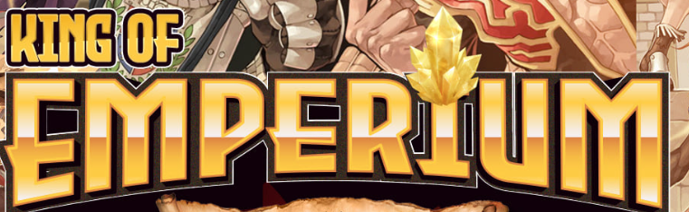
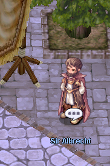

---
hide:
  - toc
---

# 🏰 King of Emperium (KoE)

**King of Emperium (KoE)** is a guild-based PvP event where guilds compete for control of the Emperium and the title of King of Emperium.

The main objective is to hold the Emperium for the longest duration during the event.

---

## ⏰ Schedule

KoE is held **three times per day** (Server Time — GMT):

- **16:00**
- **22:00**
- **06:00**

### ⏳ Duration
20 minutes

---

## 🎟 Participation

To participate, speak with the **Koeer NPC** near Prontera Inn.

### 📋 Requirements

- You must be a guild member
- Maximum **12 players (1 party)**
- You must remain inside the arena for **at least 180 seconds** to receive rewards

---

## ⚔️ Arena Mechanics

### 🏟 General Rules

- The Emperium spawns **at the center of the arena at the start of the event**
- **GvG reductions** are applied
- **Battleground restrictions** apply
- **BG consumables** are allowed
- Respawn delay after death: **30 seconds**
- Emergency Call is available (10-minute cooldown)

---

### 🧱 Barricade System

- After consecutive Emperium breaks, **4 barricades** will spawn
- Barricades function as protective walls
- Flags are placed inside the arena, allowing the owning guild to pass through the walls (with cooldown)
- For the owner's Emperium to respawn, the opposing guild must destroy **all barricades**

---

## 👑 Winning Condition

- The guild that holds the Emperium for the **longest continuous time** becomes the King of Emperium
- Defense time is **not cumulative**
- Defense must be **continuous**
- If the current Emperium holder at the end of the event is not the longest defender, ownership will transfer to the guild with the longest continuous defense time
- You can check the timer using the command: **@koerank**

---

## 🔄 Reset Rules

- At the next KoE schedule:
  - Ownership is reset
  - Rankings are reset

---

## 🎁 Rewards

Rewards are distributed as follows:

- 🥇 **1st Place — 60 Poring Coins**
- 🥈 **2nd Place — 30 Poring Coins**
- 🥉 **3rd Place — 15 Poring Coins**

Rewards will be automatically mailed to winners after the event ends.
**Good luck and have fun!**