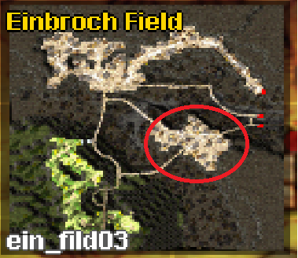

# :crossed_swords: Mercenary System Overview

Welcome to the uaRO Mercenary System guide. This page covers everything you need to know about hiring, using, and optimizing mercenaries. Whether you're a beginner or looking to master AI automation, this guide has you covered.

## :triangular_flag_on_post: Mercenary Types and Locations

There are three types of mercenaries, each found in different towns:

:crossed_swords: Swordsman – Located in Izlude, near the entrance to the Swordman job quest (`/navi izlude 47/139`).

:shield: Spearman – Found in Prontera, to the left of the Knight Guild entrance (`/navi prontera 41/337`).

:bow_and_arrow: Bowman – Available in Payon, on the right side of the Payon Cave entrance (`/navi payon 99/167`).

!!! info "Minimum Requirement"
     Mercenaries become available starting from Base Level 15.

!!! note
     1-7  level of scroll can be placed in storage. 8-10  level of scroll can not and will be locked to character

## :bar_chart: Leveling, Cost, and Loyalty

### :scroll: Contract Details

- Cost: 7,500z to 63,000z (depending on mercenary level)

- Duration: 30 minutes

- Unlimited contracts can be purchased

### :chart_with_upwards_trend: Mercenary Scaling

Higher contract level = stronger mercenary (skill set matters)

Mercenaries do not gain XP; stats increase with level and buffs

### :heart: Loyalty Points (LP)

Required from contract level 7+:

| Contract Level | Loyalty Required |
|----------------|------------------|
| 7              | 50 LP            |
| 8              | 100 LP           |
| 9              | 200 LP           |
| 10             | 300 LP           |

!!! warning "Level 10 Notice"
     Level 10 mercenaries consume only loyalty points, not zeny.

### :sparkles: Gaining Loyalty

+1 LP when contract ends successfully

+1 LP per 50 monsters killed, if:

Monster level ≥ your level / 2

Mercenary dealt at least 1 hit

!!! note "Loyalty is Separate"
     Loyalty is tracked individually per mercenary type (Sword, Spear, Bow).

### :x: Losing Loyalty

-1 LP if your mercenary dies

-1 LP if you die

In both cases, the contract is canceled

## :test_tube: Buffs and Potions

Mercenaries benefit from:

Priest buffs, chants, and Professor skills (not scrolls)

Their own:

Concentration Potions :dash:

Awakening Potions :zap:

Berserk Potions :boom:

HP/SP Potions :heart:/:droplet:

!!! tip "Potion Vendor"
     All potions are sold by the NPC next to the contract vendor.  `/navi izlude 56/139`  `/navi prontera 30/337`  `/navi payon 102/167`

!!! info "Healing"
     Heal skills work at 50% effectiveness on mercenaries.

## :joystick: Controls and Commands

### :keyboard: Manual Controls

Alt + Left Click (Monster): Queue attack

Alt + Double Left Click (Monster): Immediate attack

Alt + Left Click (Ground): Move command

Ctrl + T: Standby mode

Alt + R: Open Mercenary Info Window

Skills can be added to hotkeys and used like player skills.

### :robot: AI Configuration

Custom AI (like homunculus AI) is supported.

### :gear: AzzyAI Setup

[**AzzyAI GitHub Downloads**](https://github.com/SpenceKonde/AzzyAI)  

[**Setup Guide: AzzyAI for Private Servers**](https://fazar.net/ragnarok-online-azzyai-private-servers/)  

### :wrench: Configuration Steps

Open ...\uaRO\AI\USER_AI\AzzyAIConfig.exe

(Optional) Add shortcut to desktop

Use /merai to toggle AI modes in-game

### :repeat: AI Modes

Basic AI: Attacks only when provoked or commanded; no skill usage

Custom AI: Aggressive by default; uses skills

!!! warning "Dancing Issue"
     If issues arise, disable "dancing" behavior in AzzyAI.

## :military_medal: Skill and Stat Management

Mercenary stats depend on contract level

Temporary buffs trigger after monster kills (e.g., “HP Up!!!”)

All buffs expire with contract

View skills in the Mercenary Info Window (Ctrl + R)

## :crossed_swords: Strategy Guide

### :one: Let the Mercenary Do Everything

Best for low-level grinding

Ideal Merc: Spearman (Culverts 2, Spores)

AI Mode: Aggressive (Aggro HP: 1–10)

### :two: Mercenary Tanks & You Deal Damage

Best for ranged classes

Risk for melee users due to mob switching

### :three: You Tank & Mercenary Deals Damage

Effective with +HP gear (e.g., Pupa Card)

Best Merc: Bowman (ranged safe damage)

AI Mode: Defensive (Aggro HP: 100)

### :four: The Lazy Archer

Bowman + Geographers (or Floras < lvl 55)

Passive farming from level 55+

!!! tip "Grinding"
     Use maps with fast respawn and non-aggressive mobs for efficient EXP gain.  
     If you go for Geographer, here is an instant respawn Point:  
     

## :pill: Mercenary Potions

| Potion Type          | Effect                          |
|----------------------|----------------------------------|
| Concentration Potion | Attack speed increase           |
| Awakening Potion     | Greater speed for level 4+      |
| Red/Blue Potions     | Emergency HP/SP recovery        |

!!! note
     It's cheaper to use a potion than hire a new mercenary!

## :bookmark_tabs: Final Notes

Mercenaries are a budget-friendly way to grind and survive

Combine manual control and AI for best results

Watch your LP and adapt your strategy to your class

## :link: Related Links

[**Mercenary System on iRO Wiki**](https://irowiki.org/classic/Mercenary_System)  
 
Need help? Join us on uaRO Discord ( [**#general**](https://discord.com/channels/702960460168953946/1054186464931479552), [**#support**](https://discord.com/channels/702960460168953946/1056663954895679549), [**#merchant**](https://discord.com/channels/702960460168953946/1134730935573688401))