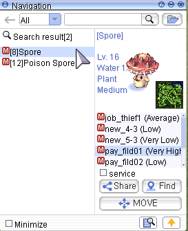
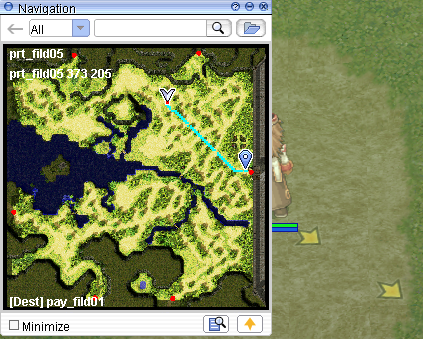
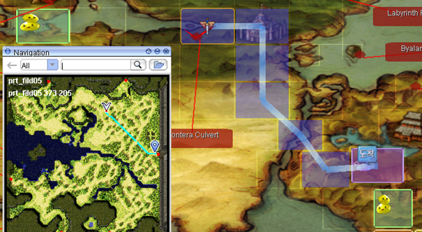
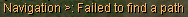

# :world_map: Navigation System and World Map

The Navigation System is a powerful feature that helps players find their way across Rune Midgard. This guide explains how to use it effectively.

## :compass: How to Use the Navigation Tool

The Navigation Tool is the fifth icon in the second row of your interface.  

Click on it to open the search interface.

Enter a monster name or map name (⚠️ NPC names are not supported).

Select your desired map and click "Find".

A window will appear with directions and yellow arrows on the ground showing the fastest path.  

!!! tip "Teleport Tip"
     Using Teleport or Fly Wings can often be faster than walking. The system calculates only walking paths and doesn't consider Kafra teleport or other means.

## :world_map: Using the World Map

To open the World Map, either:

Click the fourth icon in the second row

Or press CTRL + ´

This will show the inter-map path for your destination.

  

!!! warning "No Path Found"
     You may find it faster to teleport from Prontera to Payon first, instead of walking, as it's a much closer route.
     If you see the message:
     
     It means there's **no direct walking route**. You likely need to use an **NPC service** (e.g., **Boatman** or airship).

## :keyboard: Useful Commands

### :speech_balloon: Direct Cell Navigation

Use this format in chat to navigate to a specific cell:

/navi mapname X/Y

!!! note "Example"
     /navi prontera 41/337  
     This command guides you directly to cell 41/337 in Prontera — useful for finding NPCs.

## :satellite: External Map Tools

!!! tip "Recommended Tool"
     For more detailed world exploration, use the RMS World Map:

🌐 [RMS World Map](https://ratemyserver.net/worldmap.php)

This map shows connections, warps, and details that the in-game tool does not.

## :bookmark_tabs: Summary

| Feature               | Functionality                                    |
|-----------------------|--------------------------------------------------|
| Navigation Tool       | In-game directional tool with ground arrows      |
| World Map             | Displays multi-map path and travel flow          |
| /navi command         | Direct navigation to specific coordinates        |
| RMS World Map         | Advanced world overview via web browser          |

Make navigation part of your strategy to optimize movement, farming, and exploration in uaRO! 🧭