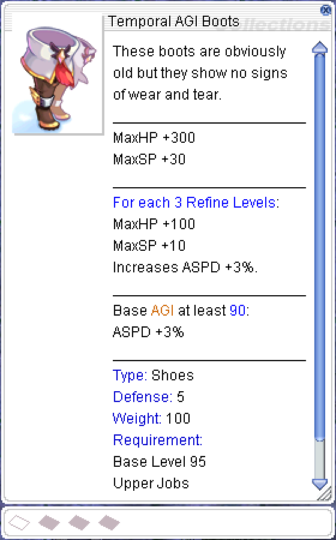
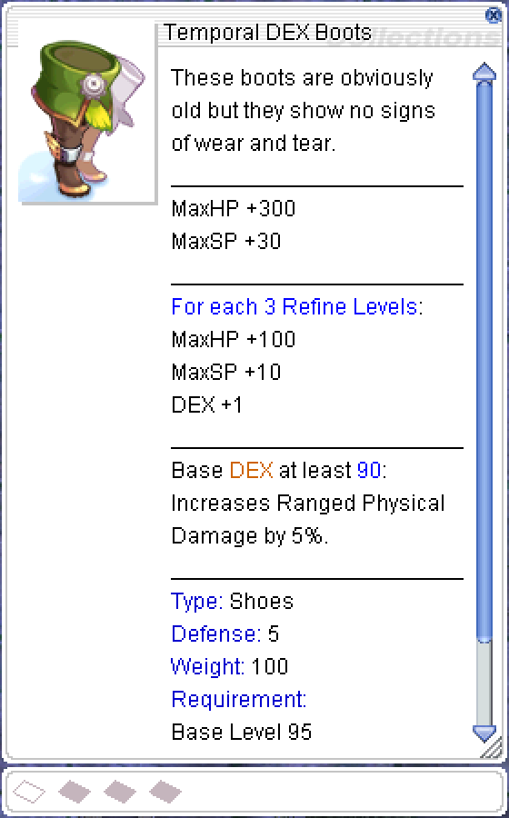
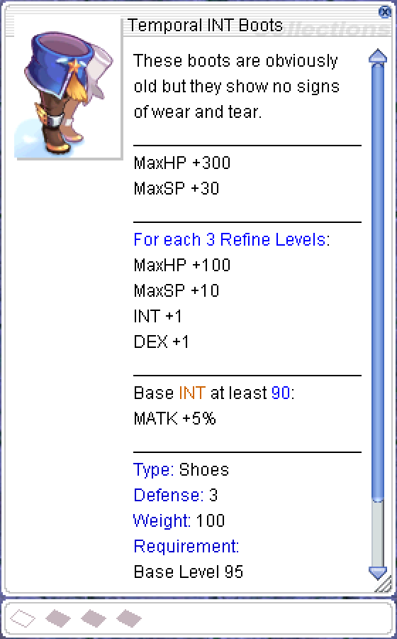
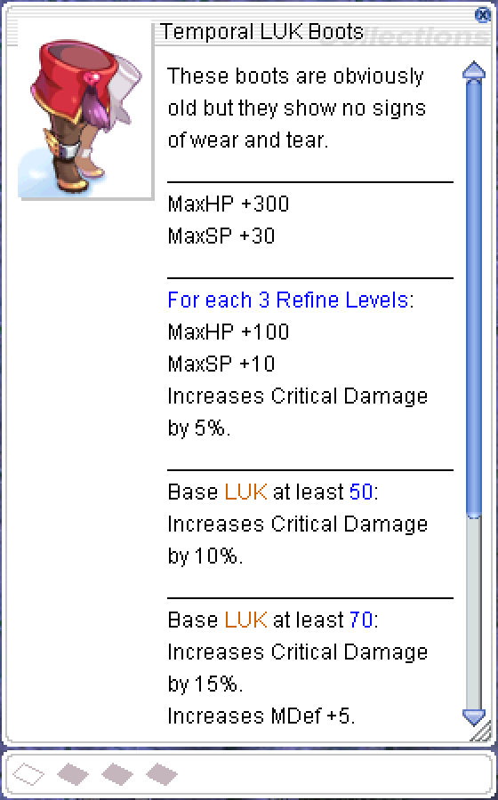
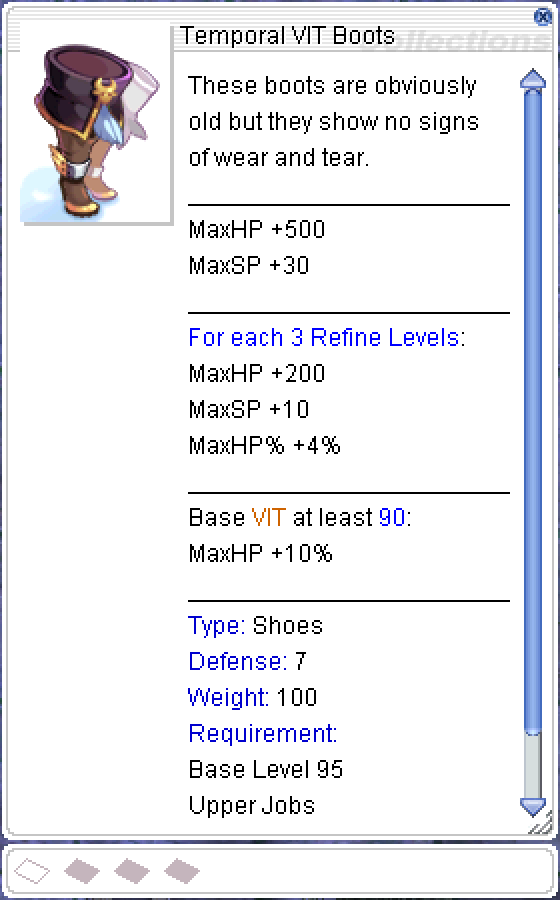

## Overview

Old Glast Heim (OGH) is a dungeon instance in Ragnarok Online designed for advanced players. It is steeped in dark, medieval fantasy aesthetics, offering a glimpse into the past of the ruined city of Glast Heim. Players are transported to a corrupted version of the city, filled with undead creatures, powerful knights, and sinister magic. The instance is notorious for its eerie atmosphere and challenging mechanics.

!!! Note
    This instance was designed for Renewal mechanics, but we adapted it for Pre-Renewal mechanics and implemented access to the instance as an open-world map without an instance cooldown.

**Required Level: 95**

## How to get to Old Glast Heim

 

To enter Old Glast Heim, you need to talk (еhe first time, you need to talk multiple times.) to the NPC Hugin in Glast Heim (**/navi glast_01 204/273**).

 

!!! Note
    On the first level, there is an NPC Hugin (**/navi old_gh01 143/18**). Talking to him will allow you to exit the dungeon.

## Monsters

 **A Dead Man** lay on ground, periodically stepping on these will spawn  maggots (The maggots die if not killed automatically every 15 minutes after spawn regardless of current HP)  

 
**Strange Crack** located at various places around the map will yield an assortment of Gemstones to one character per account, must be level 99.

### Floor 1

| Monster | Quantity | In-game command |
|---------|----------|----------|
|  Corrupt Abysmal Knight | 10 | @mi 2470 |
|  Suffered Khalitzburg | 10 | @mi 2471 |
|  Corrupted Monk | 20 | @mi 2465 |
|  Corrupted Steward | 32 | @mi 2464 |
|  Chamberlain in Pain | 27 | @mi 2466 |
|  Wandering Archer | 56 | @mi 2469 |
|  Corrupted Palace Guard | 44 | @mi 2468 |
|  1st Commander of Death | 1 | @mi 2473 |
|  2nd Commander of Death | 1 | @mi 2474 |
|  Maggot | - | @mi 2467 |
|  **Corrupted Soul (MVP)** | 1 | @mi 2475 |

### Floor 2

| Monster | Quantity | In-game command |
|---------|----------|----------|
|  Corrupted Palace Guard | 44 | @mi 2468 |
|  Wandering Archer | 30 | @mi 2469 |
|  Corrupted Monk | 20 | @mi 2465 |
|  Chamberlain in Pain | 27 | @mi 2466 |
|  Corrupt Abysmal Knight | 20 | @mi 2470 |
|  Suffered Khalitzburg | 25| @mi 2471 |
|  Suffered Bloody Knight | 23 | @mi 2472 |
|  1st Commander of Death | 3 | @mi 2473 |
|  2nd Commander of Death | 3 | @mi 2474 |
|  Maggot | - | @mi 2467 |
|  **Amdarais (MVP)** | 1 | @mi 2476 |

!!! Note
    Corrupted Soul and Amdarais have 16 hour spawn timer, 1 hour spawn variance.

## Temporal Boots

| NPC | Require | Obtain | Chance |
|-----|---------|---------|--------|
|  Hugin's Butler |  Temporal Crystal - 100 |  Temporal boots [0] | 100% |
|  Hugin's Butler |  Temporal boots - 1   Temporal Crystal - 1000 |  Upgraded Temporal boots [0] (Agi,Dex,Str,Vit,Int,Luk) | 100% |
|  Hugin's Craftsman |  Upgraded Temporal boots [0] - 1   Temporal Crystal - 1500  15.000 000 Zeny |  Upgraded Temporal boots [1] (Agi,Dex,Str,Vit,Int,Luk) | 50% |

!!! Note
    - Can slot only  Upgraded Temporal boots [0] (Agi,Dex,Str,Vit,Int,Luk)
    - The boots lose all refine when attempting slot.
    - Failure uses all mats and breaks boots.

     

## Card Trade

| NPC | Require | Obtaine | In-game command |
|-----|---------|---------|-----------------|
|  White Knight |  Coagulated Spell - 5000 or   Contaminated Magic - 2000 |  White Knight Card | @ii 4608 |
|  Khalitzburg Knight |  Coagulated Spell - 5000 or   Contaminated Magic - 2000 |  Khalitzburg Knight Card | @ii 4609 |

## Ancient Golden Coin

The MVPs **Corrupted Soul** and **Amdarais** have a **0.09%** chance to drop an Ancient Golden Coin. This coin can be exchanged at the **Hugin's Scribe NPC (/navi glast_01 188/270)** for any slotted stat Temporal Boot.  

