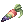
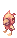
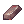
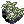
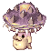
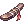
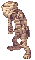

# Pet System
## **Contents**
1. [Available Pets](#available_pets)
2. [Taming Items](#taming-items)
3. [Pet Evolution](#pet-evolution)
4. [Available Evolved Pets](#available-evolved-pets)

## **Available Pets**

| Pets              | Food              | Taming Item                   | Accessory            | Equip Bonus                       |
|-------------------|-------------------|-------------------------------|----------------------|-----------------------------------|
|       |       |       |  | LUK +3, CRIT +1                  |
|       |       |        |  | HIT +3, ATK +3                   |
|     |        |         |  | LUK +2, Poison Resistance +10%   |
|      |      |      |  | ATK +3, CRIT +3                |
|        |          |  |  | STR +1, ATK +5                |
|    |         |         |  | AGI +2, FLEE +3             |
|  |  |  |  | FLEE +6, AGI -1           |
|   |  |       |  | FLEE -5, Perfect Dodge +2  |
|  |        |         |  | VIT +1, Max HP +50             |
|  |        |  |  | INT +1, Max SP +50  |
|        |         |      |  | HP Recovery +8%, Max HP +38 |
|         |         |      |  | HIT +5, ATK -2                |
|  |         | |  | STR +1, INT +1                |
|      |         |  |  | Max HP +200                   |
|        |         |        |  | AGI +1, Perfect Dodge +1       |
|          |      |     |  | CRIT +5                      |
|   |         |         |  | ATK +15                      |
|         |         |        |  | INT +1, DEF +1                |
|        |         |          |  | MATK +2%                      |
|         |         |  |  | STR +1, DEX +1                |
|          |         |  |  | ATK +2%                      |
|   |         |       |  | ASPD +1                      |
|     |            |  |  | ATK & MATK +1                  |
|   |            |   |  | DEF & MDEF +1, Stun Resistance -1% |
|        |         |          |  | VIT +2, Stun Resistance +2%  |
|      |   |  | None | Damage & Magic Damage to Demi Human +2% |
|         |     |         | None | MDEF +1, Demi Human Resistance +1% |
|      |  |  |  | CRIT DMG +5                    |
|    |     |   |  | Max SP +45, Increases SP Recovery by 8% |
|  |     |  | None | None |
|  |     |  | None | None |
|  |    |  | None | None |
|  |       |  |  | Increases damage to Demi-Human monsters by 3% |
|     |     |   |  | Max HP +3%, may autocast Heal Lv. 1 when physically attacked |
|         |    |  |  | FLEE -5, Max HP +100          |
|                    |          | None                                 | DEF +1, Demi Human Resistance +1%                                           |
|         |          |          |            | Fire Resistance +2%, Physical damage to Fire monster +2%                    |
| |       |            |          | Max SP +10                                                                  |
|                |     |         |             | Max SP +5%, 5% chance to restore 4% of damage as SP during a physical attack |
|               |     |        |         | Increases Brute Resistance by 3%                                            |
|             |       |   |       | Increases SP Recovery by 3%                                                 |
|                 |           |        |         | VIT +1, Stone Resistance +5%                                                |
|            |      |            |              | INT +1, Cast Time -3%                                                       |
|       |            |          |            | Sleep Resistance +100%                                                      |
|                |       |                |     | AGI +2                                                                      |
|          |         |        |                    | Fire resistance +3%                                                         |
|               |        |       |    | 5% chance to leech 5% of damage as HP during a physical attack               |
|        |               | 2023 Halloween Event Special        | None                                 | Increases recovery rate of Fresh Fish consumables by 70%                    |
|       |                    | 2023 Christmas Event Special        | None                                 | Max HP +150, +5% damage against Water Element                               |
|                | None                                |        | None                                 | DEX +2, HIT +1                                                              |
|              |      |              | None                                 | HIT +3, CRIT +2                                                             |
|                  |                  |      | None                                 | HIT +5                                                                      |
|             |           |      | None                                 | Max SP +100                                                                 |
|    |     | None                                | None                                 | None                                                                        |

## **Taming Items**

