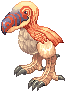
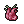
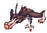
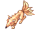
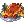
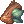
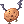
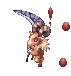

# Cute Pet System
<!--TODO: Add intro flavor text -->
<!--TODO: Add Familiar pet -->

## Feeding
Automatic feeding (Auto-feed) is available for evolved pets or pets without an evolution. Pets that starve will return to their egg with intimacy at Awkward, instead of running away.

!!! warning "Remember to enable auto-feed before leaving your pet unattended!"

Auto-feed command `@autofeed` is enabled account-wide and persists through logout. If you have a pet currently equipped that cannot be autofed with auto-feed enabled, a message will appear to remind you.

| Type | Feeding |
|---|---|
| Evolvable Pet | Only manual. Example: Poring evolves into Mastering, so it does not have auto-feed. |
| Evolved Pet | Can be auto-fed. Example: Angeling is an evolved pet, so it can use auto-feed. |
| Pet without Evolution | Can be auto-fed. Example: Incubus does not have an evolution tree, so it can use auto-feed. |

### Exceptions
| Pet | Type | Feeding |
|---|---|---|
| Leaf Cat | Evolvable | Auto-feed Available |

## Non-evolved Pets

| Pets                   | Food                     | Taming Item                   | Accessory                   | Equip Bonus                      | Capture Rates |
|------------------------|--------------------------|-------------------------------|-----------------------------|----------------------------------|---------------|
|  Poring |  Apple Juice |  Unripe Apple |  Backpack | LUK +3, CRIT +1 | 20% |
|  Drops        |  Yellow Herb      |  Orange Juice      |  Backpack      | HIT +5, ATK +5                         | 15% |
|  Poporing  |  Green Herb       |  Bitter Herb       |  Backpack      | LUK +2, Poison Resistance +10%         | 10% |
|  Lunatic    |  Carrot Juice   |  Rainbow Carrot |  Silk Ribbon | ATK +3, CRIT +3                        | 15% |
|  Picky        |  Red Herb          |  Earthworm the Dude |  Tiny Egg Shell | STR +1, ATK +5             | 20% |
|  Chonchon |  Pet Food         |  Rotten Fish      |  Monster Oxygen Mask | AGI +2, FLEE +3 | 15% |
|  Steel Chonchon |  Iron Ore |  Rusty Iron        |  Monster Oxygen Mask | FLEE +6, AGI -1 | 10% |
|  Hunter Fly  |  Red Gemstone |  Monster Juice  |  Monster Oxygen Mask | FLEE -5, Perfect Dodge +2  | 5% |
|  Savage Babe |  Pet Food       |  Sweet Milk        |  Green Lace | VIT +1, Max HP +50             | 15% |
|  Baby Desert Wolf |  Pet Food       |  Well-Dried Bone |  Transparent Head Protector | INT +1, Max SP +50 | 10% |
|  Rocker      |  Pet Food          |  Singing Flower |  Rocker Glasses | HP Recovery +8%, Max HP +38 | 15% |
|  Spore        |  Pet Food          |  Dew Laden Moss |  Bark Shorts | HIT +5, ATK -2                | 15% |
|  Poison Spore |  Pet Food       |  Deadly Noxious Herb |  Bark Shorts | STR +1, INT +1                | 10% |
|  PecoPeco  |  Pet Food          |  Fatty Chubby Earthworm |  Battered Pot | Max HP +200 | 10% |
|  Smokie      |  Pet Food          |  Sweet Potato    |  Red Scarf | AGI +1, Perfect Dodge +1       | 10% |
|  Yoyo          |  Banana Juice  |  Tropical Banana |  Monkey Circlet | CRIT +5 | 10% |
|  Orc Warrior |  Pet Food       |  Orc Trophy        |  Wild Flower | ATK +15 | 5% |
|  Munak        |  Pet Food          |  No Recipient    |  Punisher | INT +1, DEF +1                | 5% |
|  Dokebi      |  Pet Food          |  Old Broom         |  Wig | MATK +2%                      | 5% |
|  Sohee        |  Pet Food          |  Silver Knife of Chastity |  Golden Bell | STR +1, DEX +1 | 5% |
|  Isis          |  Pet Food          |  Armlet of Obedience |  Queen's Hair Ornament | ATK +2% | 5% |
|  Green Petite |  Pet Food       |  Shining Stone  |  Stellar Hairpin | ASPD +1 | 5% |
|  Deviruchi |  Shoot               |  Contract in Shadow |  Pacifier | ATK & MATK +1                  | 5% |
|  Baphomet Jr.   |  Honey       |  Book of the Devil |  Skull Helmet | DEF & MDEF +1, Stun Resistance -1% | 2% |
|  Bongun              |  Pet Food |  Her Heart |  Grave Keeper's Sword | VIT +2, Stun Resistance +2%  | 5% |
|  Zealotus          |  Immortal Heart |  Forbidden Red Candle | None                                | Damage & Magic Damage to Demi Human +2% | 3% |
|  Alice                |  White Potion |  Soft Apron | None                                | MDEF +1, Demi Human Resistance +1%     | 10% |
|  Dullahan          |  Sunset On The Rock |  Luxury Whisky Bottle |  Ring of Death | CRIT DMG +5          | 2% |
|  Evil Nymph      |  Morning Dew |  Charming Lotus |  Jade Trinket | Max SP +45, Increases SP Recovery by 8% | 10% |
|  Knife Goblin  |  Green Apple |  Knife Goblin Ring | None                                | None                                  | 10% |
|  Flail Goblin  |  Green Apple |  Flail Goblin Ring | None                                | None                                  | 10% |
|  Hammer Goblin |  Green Apple |  Hammer Goblin Ring | None                                | None                                  | 10% |
|  Goblin Leader |  Big Cell |  Staff Of Leader |  Beautiful Badges | Increases damage to Demi-Human monsters by 3% | 5% |
|  Loli Ruri        |  Pumpkin Pie |  Very Red Juice |  Fashionable Glasses | Max HP +3%, may autocast Heal Lv. 1 when physically attacked | 2% |
|  Golem                |  Mystic Stone |  Magical Lithography |  Spring | FLEE -5, Max HP +100                   | 5% |
|  Chung E / Green Maiden |  Bun |  Tantan Noodle | None                                | DEF +1, Demi Human Resistance +1%      | 20% |
|  Imp / Fire Imp |  Flame Gemstone |  Ice Fireworks |  Horn Barrier | Fire Resistance +2%, Physical damage to Fire monster +2% | 2% |
|  Civil Servant / Mao Guai |  Flavored Alcohol |  Fan Of Wind |  Golden Earring | Max SP +10                   | 5% |
|  Incubus            |  Yellow Vital Flower |  Girl's Naivety |  Masked Ball | Max SP +5%, adds a 5% chance of restoring 4% of damage as SP when performing a physical attack | 0,5% |
|  Leaf Cat          |  Fish With Blue Back |  Very Soft Plant |  Green Jewel Bag | Increases Brute Resistance by 3%     | 2% |
|  Marionette      |  Small Snow Flower |  Delicious Shaved Ice |  Hairband Of Stars | Increases SP Recovery by 3%           | 5% |
|  Medusa              |  Apple Pudding |  Splendid Mirror |  Queen's Coronet | VIT +1, Stone Resistance +5%         | 2% |
|  Miyabi Doll    |  Well Ripened Berry |  Girl's Doll |  Summer Fan | INT +1, Cast Time -3%                  | 2% |
|  Nightmare Terror |  Fresh Plant |  Hell Contract |  Horn Of Hell | Sleep Resistance +100%                 | 2% |
|  Shinobi            |  Grilled Rice Cake |  Kuloren |  Tassel for Durumagi | AGI +2                                | 5% |
|  Stone Shooter |  Plant Neutrient |  Oilpalm Coconut |  Afro | Fire resistance +3%                    | 5% |
|  Succubus          |  Blue Vital Flower |  Boy's Pure Heart |  Black Butterfly Mask | 5% chance to leech 5% of the damage as HP when performing a physical attack | 2% |
|  Scatleton  |  Fresh Fish | 2023 Halloween Event Special        | None                                | Increases the recovery rate of Fresh Fish consumables by a whopping 70% | Event |
|  Christmas Goblin |  Scell | 2023 Christmas Event Special        | None                                | Max HP +150, Damage resistance Water Element +5% | Event |
|  Gremlin            |  Pet Food | Airship Part | None                                | DEX +2, HIT +1                         | 5% |
|  Nine Tail      |  Suspicious Bottle |  Sap Jelly  | None                                | HIT +3, CRIT +3                     | 10% |
|  Mummy              |  Memento         |  Spiritual Bandage | None                                | HIT +5                              | 10% |
|  Teddy Bear    |  Cotton Tufts |  Small Doll Needle | None                                | Max SP +100                         | 5% |
|  Bacsojin/White Lady |  Luxurious Pet Food | None                                | None                                | None                                | 0.01% |
|  Domovoi |  Luxurious Pet Food |  None | None | Increases Physical Damage against enemies of Demihuman by 3%. Increases Magical Damage against Demihuman by 3%. Decreases physical damage from Demihuman by 3%. | Event |
|  Willow |  Pet Food |  Old Tree's Dew | None | INT +3. | 10% |
|  Wanderer |  Pet Food |  Vagabond's Skull | None | AGI +3, DEX +1. | 10% |
|  Whisper | - |  Ghost Coffin | - | FLEE + 7, DEF -3. | 5% |
|  Christmas Snow Rabbit |  Candy | 2024 Christmas Event Special | None | Increases EXP by 3% from all mobs. | Event |
|  Wandering Duck Doll |  Pet Food | 2025 Summer Event Special | None | Perfect Hit +10  | Event |
|  Mutating White Knight |  Pet Food | None | None | ATK +2%, MATK +2% | Exchange |
|  Roween |  Pet Food | None | None | MATK +3%. | Obtained from monsters |
|  Dark Priest |  Pet Food | None | None | INT +4. | Obtained from monsters |
|  Familiar |  Pet Food | None | None | INT +4, Prevents Hallucination status. | Obtained from monsters |
|  Hornet |  Pet Food | None | None | Decreases Cast Time by 2%. Increases Magical Damage with Wind element by 2%. | 2% |

!!! Intimacy
    HungerDecrement        = 3 (all) 
    OwnerDeathDecrement    = 5 (all) 

    FeedIncrements: 
    - Evolved (1st tier)         = 40 
    - Evolved (2nd or final)     = 30 
    - Evolved (3rd and final)    = 20 
    - Non-evolvable              = 30 

    Exceptions: 
    - Phreeoni (MVP, final)      = 20 
    - Incubus / Succubus         = 20 

!!! note
    Pet Capture Rates 
    - Lower HP of the mob, higher chance of success (2x success rate @ <1% HP). 
    - All Non-evolved pet taming items are within Taming Gift Set. 
    - Taming Non-evolved pet via AbraCadabra skill have same chance of success as taming items. 
    - All Evolved pets have a 0.01% chance of being taming via AbraCadabra skill. 

!!! warning
    The pet **Bacsojin/White Lady**, which was tamed using the skill Abracadabra, **does not have any bonuses**.

    This pet is used as a costume.If you evolve the pet **Evil Nymph** into a **Bacsojin/White Lady**, the pet **will have all the bonuses.**

    **Please be mindful when buying this pet. Check if it comes with a bonus!**

---

## Taming Items

The vast majority of taming items drop from monsters according to the RMS database or from  [**Taming Gift Set**](Taming_Gift_Set.md), but there are exceptions for our server that are described in this section:

| **Taming Item**                                  | **Obtained From**                             |
|--------------------------------------------------|-----------------------------------------------|
|  Sap Jelly | Moonlight Flower with a 9% chance. |
|  Airship Part | Gloom Under Night with a 4.5% chance. |
|  Spiritual Bandage | Evil Druid with a 0.5% chance. |
|  Small Doll Needle | RSX-0806 with a 9% chance. |
|  Old Tree's Dew | Wooden Golem with a 0.1% chance. |
|  Vagabond's Skull | Vagabond with a 12% chance. |
|  Ghost Coffin | Ghostring with a 6% chance. |
|  Beehive Box | Hornet with a 1% chance. |

| **Egg**                                           | **Obtained From**                             |
|---------------------------------------------------|-----------------------------------------------|
|  Phreeoni Egg | Phreeoni with a 0.09% chance                  |
|  Wandering Duck Doll Egg | 3 Event Token (**2025 Twilight Festival**) at "Robert" Event token NPC redemption in Main Office |
|  Mutating White Knight Egg | [NPC Pascal](Old_Glast_Heim.md#npc-pascal) |
|  Roween Egg | Galion with a 0.03% chance |
|  Dark Priest Egg | Dark illusion with a 0.09% and Dark Lord with a 0.9% chance |
|  Familiar Egg | Dracula with a 0.45% chance |

---

## Pet Evolution

To evolve a pet, it must be in Loyal intimacy state and require the following items below:

| Pet                  | Required Items                                                                                                    | Evolved Pet             |
|----------------------|--------------------------------------------------------------------------------------------------------------------|-------------------------|
|  Poring    |  Yggdrasil Leaf - 10    Unripe Apple - 3                                    |  Mastering     |
|  Mastering |  Yellow Potion - 20    Halo [0]    White Herb - 50    Jellopy - 200 |  Angeling       |
|  Rocker    |  Singing Plant - 3    Grasshopper's Leg - 777    Yellow Herb - 200    Metaller Card |  Metaller |
|  Orc Warrior|  Orc Trophy - 3    Orcish Sword [0]    Orcish Voucher - 500    Cigarette [0]    Orc Warrior Card |  High Orc | 
|  High Orc |  Orc Warrior Card - 10    Orc Baby Card - 5    Heroic Emblem - 100   Poring Coin - 1000 |  Orc Hero |
|  Pecopeco  |  Pet Food - 10    Fatty Chubby Earthworm - 3    Peco Peco Feather - 300    Peco Peco Card    Mastela Fruit - 10 |  Grand Peco |
|  Bongun    |  Hyegun Hat [1]    Munak Doll - 100    Old Portrait - 50    Yao Jun Card |  Yao Jun |
|  Dokebi    |  Old Broom - 3    Violet Dyestuffs - 3    Dokebi Horn - 300    Gold - 3 |  Am Mut |
|  Yoyo      |  Tropical Banana -3    Yoyo Doll - 2    Cacao - 300    Yoyo Card |  Choco |
|  Scatleton |  Scatleton Memory - 2    Delicious Meat - 100    Cookie Bat - 100 |  Skelion |
|  Green Petite |  Shining Stone - 3    Petite's Tail - 100    Aloevera - 150    Earth Deleter Card |  Earth Deleter |
|  Drops     |  Piece of Egg Shell - 20    Old Frying Pan - 10    Apple Juice - 3    Eggring Card |  Eggring |
|  Drops     |  Sweets Festival Coin - 500    Candy - 50    Candy Cane - 50    Drops Card |  Sweet Drops |
|  Isis      |  Shining Scale - 300    Armlet of Obedience - 3    3carat Diamond - 6    Queen's Hair Ornament |  Little Isis |
|  Savage Babe |  Meat - 100    Pet Food - 10    Sweet Milk - 3    Feather - 50 |  Savage |
|  Deviruchi |  Contract in Shadow - 3    Little Evil Wing - 250    Hand of God - 30    Deviruchi Card |  Diabolic |
|  Evil Nymph |  Mao Guai Card - 10    Jing Guai Card - 10    Zhu Po Long Card - 10    Poring Coin - 1000 |  Bacsojin/White Lady |
|  Nine Tail |  Sap Jelly - 3    Nine Tails - 999    Punisher    Nine Tail Card |  Cat o' Nine Tails |
|  Cat o' Nine Tails |  Nine Tail Card - 10    Sohee Card - 10    Munak Card - 10    Poring Coin - 1000 |  Moonlight Flower |
|  Gremlin   |  Airship Part - 3    Damp Darkness - 50    Will of the Darkness - 200    Hodremlin Card |  Hodremlin |
|  Hodremlin |  Hodremlin Card - 10   Isilla Card - 10   Agav Card - 10   Poring Coin - 1000 |  Gloom Under Night |
|  Lunatic   |  Huge Leaf - 100    Clover - 25    Four-Leaf Clover - 30    Lunatic Card - 5 |  Leaf Lunatic
|  Mummy     |  Spiritual Bandage - 3    Rune of the Darkness - 200    Gold - 30    Ancient Mummy Card |  Ancient Mummy |
|  Teddy Bear |  Small Doll Needle - 3    Cursed Seal - 300    Cursed Ruby - 50    Teddy Bear Card |  Abandoned Teddy Bear |
|  Teddy Bear |  Rusty Screw - 500   Honey - 100   Opal - 10   Teddy Bear Card |  Aliot |
|  Aliot |  Alicel Card - 10    Aliza Card - 10    Aliot Card - 5    Poring Coin - 1000 |  Kiel D-01 |
|  Teddy Bear |  Rusty Screw - 500   Honey - 100   Bloody Page - 50   Teddy Bear Card |  Alicel |
|  Alice |  Alice's Apron - 500   Green Herb - 200   Elunium - 30   Alice Card |  Aliza |
|  Baphomet Jr.   |  Evil Horn - 300   Brigan - 300   Yellow Herb - 100    Bapho Jr Card - 2 |  Chaotic Bapho Jr |
|  Chaotic Bapho Jr |  Bapho Jr Card - 5   Majestic Goat[1]   Poring Coin - 1000 |  Baphomet |
|  Loli Ruri |  Loli Ruri Card - 3   Bat Cage - 500   Loki's Whisper - 1   Blue Herb - 50 |  Blue Moon Loli Ruri |
|  Baby Desert Wolf |  Desert Wolf Card - 1   Well-Dried Bone - 3   Claw of Desert Wolf - 300   Animal Skin - 20 |  Desert Wolf |
|  Nightmare Terror |  Burning Horseshoe - 1000   Blue Herb - 100   Shell - 100   Nightmare Terror Card - 10 |  Rigid Nightmare Terror |
|  Wanderer |  Wanderer card - 3   Skull - 500   Hand of God - 50   Fabric - 100 |  Contaminated Wanderer |
|  Mutating White Knight |  Poring Coin - 1000   Abysmal Knight card - 3   Blade Lost in Darkness - 100   Reins - 1000  |  White Knight |
|  Mutating White Knight |  Poring Coin - 1000   Abysmal Knight card - 3   Blade Lost in Darkness - 100   Reins - 1000  |  Abysmal Knight |
|  Leaf Cat |  Huge Leaf - 500   Black Cat Doll - 200   Fish Tail - 200   Leaf Cat Card - 10 |  Wild Rose |
|  Wild Rose |  Leaf Cat Card - 10    Wild Rose Card - 10    Tiger's Footskin - 20    Poring Coin - 1000 |  Eddga |
|  Dark Priest |  Poring Coin - 1000   Skull - 1000   Wraith Card - 5   Ghoul Card - 5  |  Dark Illusion |
|  Dark Illusion |  Poring Coin - 1000   Evil Druid Card - 10   Wraith Card - 10   Ghoul Card - 10  |  Dark Lord |
|  Golem |  Poring Coin - 1000   Magical Lithography - 3   Blood Red - 50   Golem Card - 3 |  Fire Golem |
|  Hornet |  Poring Coin - 1000   Royal Jelly - 200   Hornet Card - 5 |  Giant Hornet |
|  Giant Hornet |  Poring Coin - 2000   Driller Card - 10   Mantis Card - 10   Side Winder Card - 10   Young Twig - 1 |  Misteress |

## Evolved Pets

| Pets                      | Food                   | Accessory | Awkward/Shy                     | Neutral                          | Cordial                                   | Loyal                                |
|---------------------------------|-------------------------------|-------------------|--------------------------------|----------------------------------|-------------------------------------------|---------------------------------------|
|  Mastering |  Pet Food | None              | LUK +2, CRIT +1                 | LUK +3, CRIT +1                   | LUK +3, CRIT +2                         | LUK +3, CRIT +3                       |
|  Angeling  |  Pet Food | None              | MaxHP +1%, Heal effectiveness +2% | MaxHP +1%, Heal effectiveness +4% | MaxHP +2%, Heal effectiveness +6%       | MaxHP +2%, Heal effectiveness +8%     |
|  Metaller  |  Pet Food | None              | Max HP +25, HP Recovery +5%     | Max HP +38, HP Recovery +10%     | Max HP +55, HP Recovery +15%, Physical damage to plant monster increased by 3%,   Magical damage to plant monster increased by 3%            | Max HP +70, HP Recovery +20%, Physical damage to plant monster increased by 6%,   Magical damage to plant monster increased by 6%          |
|  High Orc |  Pet Food | None              | ATK +10                         | ATK +15                           | ATK +20                                 | ATK +25                               |
|  Grand Peco |  Pet Food | None              | MaxHP +150                      | MaxHP +200                        | MaxHP +300                              | MaxHP +400                            |
|  Yao Jun   |  Pet Food | None              | VIT +1, Stun Resistance +1%     | VIT +2, Stun Resistance +2%       | VIT +3, Increases tolerance to Stun by 3%, 1% chance to restore 1% damage as SP on physical atk | VIT +4, Increases tolerance to Stun by 4%, 1% chance to restore 1% damage as SP on physical atk |
|  Am Mut      |  Pet Food | None              | MATK +1%                        | MATK +2%                          | MATK +3%                                | MATK +4%                              |
|  Bacsojin/White Lady |  Luxurious Pet Food | None          | SP +2%                           | SP +3%, After Cast Delay -1%      | SP +4%, After Cast Delay -2%, Heal Power +10%             | SP +5%, After Cast Delay -3%, Heal Power +15%          |
|  Choco        |  Pet Food | None              | CRIT +3 | CRIT +5, Increases long-ranged physical damage +1% | CRIT +7, Increases long-ranged physical damage +2% | CRIT +9, Increases long-ranged physical damage +3% |
|  Skelion |  Delicious Meat |  Dark Mane | None | None | Doubles Fresh Fish recovery rate! | Doubles Fresh Fish recovery rate! |
|  Earth Deleter |  Pet Food | None              | Increases ASPD by 1%            | AGI +1, Increases ASPD by 1%       | AGI +2, Increases ASPD by 2%             | AGI +3, Increases ASPD by 3%          |
|  Eggring    |  Pet Food | None              | None                             | None                              | None                                     | HIT +15, ATK +15                      |
|  Sweet Drops |  Candy | None              | None                             | None                              | None                                     | EXP +5% from all monsters             |
|  Little Isis |  Pet Food | None              | ATK +1%                          | ATK +2%                            | ATK +3%                                 | ATK +4%                               |
|  Savage      |  Pet Food | None              | VIT +1, MaxHP +50                | VIT +2, MaxHP +50                  | VIT +2, MaxHP +100                      | VIT +2, MaxHP +200                    |
|  Diabolic  |  Pet Food | None              | ATK +1%, MATK +1%                | ATK +1%, MATK +1%   MaxHP + 1% MaxSP + 1%               | ATK +2%, MATK +2%, MaxHP +1%, MaxSP +1% | ATK +2%, MATK +2%, MaxHP +2%, MaxSP +2% Autocast Fire Bolt lv. 3 when attacking |
|  Cat o' Nine Tails |  Pet Food | None              | CRI +2, HIT +2                   | CRI +3, HIT +3                     | CRI +4, HIT +4,  Chance to recover 300 HP per second for 5 seconds on physical damage                         | CRI +5, HIT +5, Chance to recover 400 per second for 5 seconds on physical damage                         |
|  Moonlight Flower |  Luxurious Pet Food | None         | CRIT +3, HIT +3                  | CRIT +4, HIT +4,   1% chance to recover 300 HP per second for 5 seconds on physical attack                   | CRIT +5, HIT +6,   2% chance to recover 400 HP and 10 SP per second for 5 seconds on physical attack | CRIT +5, HIT +6,   3% chance to recover 500 HP and 20 SP per second for 5 seconds on physical attack |
|  Hodremlin |  Pet Food | None              | HIT +1, DEX +1                   | HIT +1, DEX +2                     | CRIT DMG +7%, HIT +2, DEX +2             | CRIT DMG +9%, HIT +2, DEX +2          |
|  Leaf Lunatic |  Pet Food | None              | CRIT +2, ATK +2                  | CRIT +3, ATK +3                    | CRIT +4, ATK +4, Damage against formless race monsters increased by 3%                           | CRIT +5, ATK +5, Damage against formless race monsters increased by 6% |
|  Ancient Mummy |  Pet Food | None              | HIT +4                           | HIT +5                             | HIT +6, Damage against dragon race monsters increased by 3% | HIT +6, Damage against dragon race monsters increased by 6% |
|  Abandoned Teddy Bear |  Pet Food | None              | Max SP +50                       | Max SP +100                        | Max SP +150, Chance to restore 30 SP per 5 seconds for dealing magic damage | Max SP +150, Chance to restore 40 SP per 5 seconds for dealing magic damage |
|  Phreeoni |  Luxurious Pet Food | None          | HIT +6                            | HIT +10,     Perfect Hit+5                          | HIT+14,  Perfect Hit+10                      | HIT +18, Perfect Hit +15              |
|  Aliza |  Pet Food | None | None | None | MDEF +6. Increases Healing skills effectiveness by 4%. | MDEF +7. Increases Healing skills effectiveness by 6%. |
|  Aliot |  Pet Food | None | None | None | ASPD +4%.  HIT +9. | ASPD +5%.  HIT +12. |
|  Alicel |  Pet Food | None | None | None | Reduces Variable Cast Time by 4%.  Increases Neutral Magic Damage by 3%. | Reduces Variable Cast Time by 5%.  Increases Neutral Magic Damage by 5%. |
|  Chaotic Bapho Jr |  Pet Food | None | None | None |  FLEE +12, MaxSP +2%. | FLEE +15, MaxSP +3%. |
|  Baphomet |  Luxurious Pet Food | None | None | None | Flee + 16, MaxSP + 5%, increases long ranged physical damage by 3%. | Flee + 20, MaxSP + 7%, increases long ranged physical damage by 5%. |
|  Blue Moon Loli Ruri |  Pet Food | None | None | None | VIT +3, MaxHP +3%. Random chance to autocast Level 2 Kyrie Eleison on yourself when recieving physical damage.(If you learned a higher Level, it will auto cast that Level instead.) | VIT +4, MaxHP +5%. Random chance to autocast Level 2 Kyrie Eleison on yourself when recieving physical damage.(If you learned a higher Level, it will auto cast that Level instead.) |
|  Desert Wolf |  Pet Food | None | None | None | INT +1, MaxSP +50.  Increases Earth Property Magical Damage by 3%. | INT +2, MaxSP +75.  Increases Earth Property Magical Damage by 5%. |
|  Gloom Under Night |  Luxurious Pet Food | None | None | None | MATK +30.  Increases magical damage with Ghost and Fire element by 5%. | MATK +40.  Increases magical damage with Ghost and Fire element by 7%. |
|  Kiel D-01 |  Luxurious Pet Food | None | None | None | ASPD +5%, HIT +15  Increases melee physical damage by 3%. | ASPD +7%, HIT +18  Increases melee physical damage by 5%. |
|  Orc Hero |  Luxurious Pet Food | None | None | None | ATK +40.  Increases critical damage by 1%. | ATK +50.  Increases critical damage by 3%. |
|  Rigid Nightmare Terror |  Pet Food | None | None | None | INT +3, MaxSP +1%.  Prevents Sleep status. | INT +4, MaxSP +3%.  Prevents Sleep status. |
|  Contaminated Wanderer |  Pet Food | None | None | None | AGI +4, CRIT +2.  Increases critical damage by 5%. | AGI +4, CRIT +3.  Increases critical damage by 7%. |
|  White Knight |  Pet Food | None | None | None | MATK +4%, Increase magic damage on Boss monster by 3%.  | MATK +5%, Increase magic damage on Boss monster by 5%. |
|  Abysmal Knight |  Pet Food | None | None | None | ATK +4%, Increase physical damage on Boss monster by 3%.  | ATK +5%, Increase physical damage on Boss monster by 5%. |
|  Wild Rose |  Pet Food | None | None | None | Increases ASPD by 3%, CRIT +5. | Increases ASPD by 5%, CRIT +7. |
|  Eddga |  Luxurious Pet Food | None | None | None | Increases ASPD by 8%, CRIT +12. | Increases ASPD by 10%, CRIT +15. |
|  Dark Illusion |  Pet Food | None | None | None | INT +3, Reduces Variable Cast Time by 3%. | INT +4, Reduces Variable Cast Time by 5%. |
|  Dark Lord |  Luxurious Pet Food | None | None | None | INT +4, Reduces Variable Cast Time by 7%, Reduces After Cast Delay by 5%. | INT +5, Reduces Variable Cast Time by 10%, Reduces After Cast Delay by 10%.|
|  Fire Golem |  Pet Food | None | None | None | MAXHP +400, Increases magical damage with Fire element by 3%. | MAXHP +500, Increases magical damage with Fire element by 5%. |
|  Giant Hornet |  Pet Food | None | None | None | Decreases Cast Time by 4%. Increases Magical Damage with Wind element by 3%. | Decreases Cast Time by 5%. Increases Magical Damage with Wind element by 5%. |
|  Misteress |  Luxurious Pet Food | None | None | None | Increases Physical Damage against monsters of Non-Boss class by 5%. | Increases Physical Damage against monsters of Non-Boss class by 5%. Nullifies Weapon Size Penalty. |