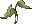

# Poring Coins System

uaRO: World of Your Dream introduce **Poring Coins System**

Each monster on our server drops  Poring Coin with a 5% chance.

You can also get them for completing various in-game quests and participating in events.

Poring Coins are not tied to an account or a character, you can sell them, exchange them with other players, and use them for certain quests.

## Details

**PC drop decreased from mobs:**  
 Orc Zombie  
 Thief Bug Female  
 Thief Bug Male  
 Familiar  

**PC drop removed from mobs:**  
 Hydra  
 Thief Bug Egg  
 Peco Peco Egg  
 Ant Egg  
 Blue Plant  
 Green Plant  
 Yellow Plant  
 White Plant  
 Shining Plant  
 Black Mushroom  
 Red Mushroom  
 Thief Bug  
 Tarou  
 Plankton  

## Exchange

Poring Coins can be exchanged for you by Lydia, she is in the main office of Prontera.

### **Consumable items**

| Item Name                                | Description                                                                                                                                                                                                                                          | Cost |
|------------------------------------------|------------------------------------------------------------------------------------------------------------------------------------------------------------------------------------------------------------------------------------------------------|------|
|  **Field Manual 100%**      | A manual that explains the effective way of the battle. It is a very detailed and well composed manual. Exp rate is increased to 100% for 30 minutes.                                       | 40   |
|   **Bubble Gum**             | Sweet, tasty bubble gum. Item drop rate +100% for 30 minutes.                                                                                                                             | 700  |
|  **LV10 Blessing Scroll**      | A scroll in which a single use of Level 10 Blessing has been recorded. Caution-- This item won't work while your character is casting a spell or skill.                                    | 2    |
|  **LV10 Agi Scroll**           | A scroll in which a single use of Level 10 Increase AGI has been recorded. Caution-- This item won't work while your character is casting a spell or skill. This item consumed 15HP and will be ineffective if the character has fewer than 15 HP. | 2    |
|  **Kafra Card**                | A Kafra name card issued by the Kafra Headquarters. Open kafra storage.                                                                                                                     | 20   |
|  **Kafra Card 10 Box**         | A box containing 10 Kafra Name Cards. Kafra Name Card - summons the Kafra Service when used.                                                                                                 | 200  |
|   **Blessing Scroll 10 Box**   | A box containing 10 Level 10 Blessing Scrolls. Once this item is purchased, termination of contract is impossible. Also, this item is not refundable.                                      | 20  |
|  **Increase Agility Scroll 10 Box** | A box containing 10 Level 10 Increase Agility Scrolls. Once this item is purchased, termination of contract is impossible. Also, this item is not refundable.                            | 20   |
|  **Dead Branch 10 Box**      | A box containing 10 Dead Branches that evokes an impending sense of danger.                                                                                                                | 50   |
|  **Bloody Branch**           | An ancient, gnarled branch with a contract written in blood upon the bark that can summon stronger creatures than regular Dead Branches. Using it summons 1 Boss monster.               | 300  |
|  **Gym Pass**                   | A visit will increase your skill level by 1 boosting your weight capacity by 200 per level. To a maximum of level 10. Increase Carrying Weight skill has 10 levels, and once learned, it is permanent. It isn't reset once you transcend.           | 70   |
|  **Giant Fly Wing 50 Box**     | A light box containing 50 Giant Fly Wings. Giant Fly Wing - Allows to teleport many people at once to random areas when used by party master.                                              | 30   |
|   **Green Butterfly 5 Box**   | A box containing 5 Green Butterfly Wing. Allows teleportation to any Schwartzvalt city. Available cities are Yuno, Lighthalzen, Einbroch, and Hugel. | 50 |
|   **Blue Butterfly 5 Box**   | A box containing 5 Blue Butterfly Wing. Allows teleportation to any off continent localized city. Available cities are Ayothaya, Amatsu, Louyang, and Kunlun. | 50 |
|   **Red Butterfly 5 Box**   | A box containing 5 Red Butterfly Wing. Allows teleportation to any Arunafeltz city.vAvailable cities are Rachel, and Veins. | 50 |
|   **Gym Pass 10 Box**          | A box containing 10 Gym Membership Cards.                                                                                                                                                    | 700  |
|   **Infinite Flywing**         | The wings cut from fly to be made into enchanted item. Enables character to move to random spot on map.                                                                                      | 700  |
|  **Infinite Butterfly Wing** | An enchanted Infinite butterfly's wing that instantly sends its user to his Save Point when waved in the air. | 600 | 
|   **Speed Potion 10 Box**    | A box containing 10 Speed Potions.                                                                                                                                                           | 5    |
|  **Life Insurance**          | If the character dies within the 30 minutes duration, no loss of EXP will be made. Corrected display supposed to be will not lose any experience the first time you KO'ed.                 | 3    |
|   **Medium Life Potion**     | A small bottle of Yggdrasil Tree Sap that is effective in healing wounds. For 10 minutes, you regenerate 7% of your Maximum HP every 4 seconds. Can not be used while in Frenzy.            | 15   |
|  **Medium Life Potion 10 Box**| A box containing 10 Large Life Potions. For 10 minutes, you regenerate 7% of your Maximum HP every 4 seconds. Can not be used while in Frenzy.                                           | 150  |
|  **Regeneration Potion**      | A magic potion made with alchemy and magic. A Rosary is rumored to be one of the secret ingredients in making this potion. For 30 minutes, the recovery amount from all heal, recovery items, and Sanctuary is increased by 20% on your character. | 15   |
|  **Regeneration Potion 10 Box**| A box containing 10 Regeneration Potions.                                                                                                                                                      | 150  |
|   **Tyr's Blessing**            | Increases ATK & 20 MATK for 5 minutes. HIT + 30, Flee Rate + 30                                                                                                                               | 25   |
|  **Barricade Repair Kit** | A box contains the necessary items to repaired demolished Fortress Gates. It contains 30 Trunks, 10 Steel, 10 Envertacon, 5 Oridecon. | 75 |
|  **Mysterious Dyestuff** | Various colors are mixed into this mysterious dye mixture. Can be used to dye a Beanie, Drooping Cat, Mage Hat, or Deviruchi Hat to a different color. | 500 |