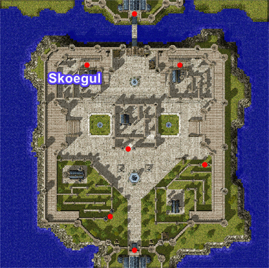
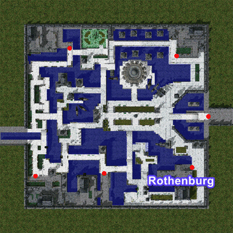

---
hide:
  - toc
---

# Pre-Trans WoE

## Contents

1. [Overview](#overview)
2. [Schedule](#schedule)
3. [Treasure Chest Drop](#treasure-chest-drop)
4. [Token System](#token-system)
5. [WoE Mechanics](#woe-mechanics)
6. [Item Block Lists](#item-block-lists)

## Overview

Pre-Trans WoE in Ragnarok Online is a guild-based PvP event where only second jobs and below can participate, creating a unique and balanced battlefield. Without transcendent skills, strategy and teamwork become even more crucial. Guilds must break the Emperium to claim castles while fending off enemy attacks. Holding a castle grants access to Guild Dungeons and valuable treasures, making competition fierce. The absence of overpowered buffs and gear encourages classic gameplay, where skill rotations, positioning, and proper class synergy matter most. Tanks, wizards, assassins, and supports all have key roles, ensuring a dynamic and engaging experience.

For many players, Pre-Trans WoE brings a strong sense of nostalgia, reminding them of the early days of Ragnarok Online, when guild wars were more about tactics than raw power. Additionally, preparing for this type of WoE is much easier, as the required gear is more accessible compared to WoE FE or WoE SE. This makes it a great option for both new and returning players looking to experience WoE without the heavy grind.

## Schedule

On our server, WoE takes place every Sunday and lasts for one hour. 

### Saturday

| Server Time (UTC)  | CET (UTC +1)    | EET (UTC +2)       |  IST (UTC +5)          | PST (UTC -8)          | MST (UTC -7)         | CST (UTC -6)         | EST (UTC -5)         |
|--------------------|-----------------|--------------------|------------------------|-----------------------|----------------------|----------------------|----------------------|
| 15:00              | 16:00           | 17:00              | 20:00                  | 07:00                 | 08:00                | 09:00                | 10:00                |

#### Available Castles

| Castle Name. Town  | Location   | Emperium Room       |  Guild Dangeous        |
|--------------------|------------|---------------------|------------------------|
| Skoegul. Prontera |  | - |  |
| Rothenburg. Aldebaran |  | - |  |
|
!!! note
    Castle rotations happen periodically as well as total active castle numbers based on WoE population and is subject to change.

## Treasure Chest Drop

| Castle Name. Town  | Treasure Chest 1 | Treasure Chest 2 |
|--------------------|------------------|------------------|
| Skoegul. Prontera |  Poring Coin - 100%   Bloody Branch - 10%   Thorny Buckler [1] - 5%   Pauldron [1] - 5%   Tidal Shoes [1] - 5%   Enriched Oridecon - 15%   Old Card Album - 20% |  Poring Coin - 100%   Stone Buckler [1] - 5%   Enriched Elunium - 15%   Yggdrasil Berry - 100%   Hat of the Sun God - 0.1%   Mystical Card Album - 0.01% |
| Rothenburg. Aldebaran |  Poring Coin - 100%   Bloody Branch - 10%   War Axe [1] - 3.75%   Chai Mail [1] - 40%   Enriched Oridecon - 15%   Mirror Shield [1] - 50%   Old Card Album - 20%  |  Poring Coin - 100%   Dead Branch - 100%   Enriched Elunium - 15%   Yggdrasil Berry - 100%   Muffler [1] - 40%   Zeny Knife - 9%   Mystical Card Album - 0.01% |

## Token System

One chest from the "Hot Location" castle will drop a "Token of Honor" at 0.25% base percentage. Current zone = Prontera. When 3 of one type are collected, they can be redeemed for one of the packages of choice listed below via GM. These tokens are non guild-storable or tradeable and must be collected by your designated woe/guild lead.

| Package 1           | Package 2         | Package 3            |
|---------------------|-------------------|----------------------|
|  Bloody Branch - 25 |  Bloody Branch - 50 |  Bloody Branch - 50 |
|  Old Card Album - 15 |  Old Card Album - 25 |  Old Card Album - 25 |
|  Mystical Card Album | AD Bottle Sets - 2k | Enriched Elunium - 40 |
|                     |                   |  Enriched Oridecon - 40 |

## WoE Mechanics

- 24 member cap within any given castle (Recall prioritizes top most rank downwards until number met) Extended, Baby and Trans classes will yield no movement  
- All MVP cards render no effect within WoE Castles (Still equipable, but have no effect)  
- If you equip an item on the block list, it will yield 0 effect within castles  
- Buffs received by Trans / Extended classes will automatically be removed upon entry into castle (Portal or E-Call)  
- Issuing FCP as a creator to members outside of castles prior to entrance into Pre-Trans WoE castles is strictly forbidden and will yield an account ban
- @GuildHP is now toggleable through @settings (Allows you to view Guild member HP even outside of party)  
- Guild Emblems must be visible and clearly identifiable to participate  

## Item Block Lists

### Card Restrictions:

??? note "Card List, click to expand"
    | Card        | Item Id  |
    |-------------|----------|
    | Osiris Card | 4144 |
    | Baphomet Card | 4147 |
    | Mistress Card | 4132 |
    | Golden Bug Card | 4128 |
    | Orc Hero Card | 4143 |
    | Drake Card | 4137 |
    | Eddga Card | 4123 |
    | Maya Card | 4146 |
    | Moonlight Flower Card | 4131 |
    | Pharaoh Card | 4148 |
    | Phreeoni Card | 4121 | 
    | Orc Load Card | 4135 |
    | Knight Windstorm Card | 4318 | 
    | Garm Card | 4324 |
    | Dark Lord Card | 4168 |
    | Turtle General Card | 4305 |
    | Lord Of Death_Card | 4276 |
    | Dracula Card | 4134 |
    | Dark Snake Lord_Card | 4330 |
    | Samurai Spector Card | 4263 |
    | Amon Ra Card | 4236 |
    | Tao Gunka Card | 4302 |
    | Rsx-0806 Card | 4342 |
    | White Lady Card | 4372 |
    | Lord Knight Card | 4357 |
    | Assassin Cross Card | 4359 |
    | MasterSmith Card | 4361 |
    | High Priest Card | 4363 | 
    | Sniper Card | 4367 |
    | High Wizard Card | 4365 | 
    | General Egnigem Cenia Card | 4352 |
    | Vesper Card | 4374 |
    | Lady Tanee Card | 4376 |
    | Memory of Thanatos Card | 4399 |
    | Detardeurus Card | 4386 |
    | Kiel-D-01 Card | 4403 |
    | Randgris Card | 4407 | 
    | Gloom Under Night Card | 4408 | 
    | Ktullanux Card | 4419 | 
    | Atroce Card | 4425 |
    | Ifrit Card | 4430 | 
    | Fallen Bishop Card | 4441 |
    | Berzebub Card | 4145 | 
    | Corruption Root Card | 4603 |
    | Amdarais Card | 4601 | 
    | Ghostring Card | 4047 |
    | Angeling Card | 4054 |
    | Deviling Card | 4174 |
    | Maya Puple Card | 4198 |
    | Gemini-S58 Card | 4354 |
    | Errende Ebecee Card | 4349 |
    | Noxious Card | 4334 |
    | Teddy Bear Card | 4340 |
    | Seyren Windsor Card | 4358 |
    | Eremes Guile Card | 4360 |
    | Howard Alt-Eisen Card | 4362 |
    | Margaretha Sorin Card | 4364 |
    | Kathryne Keyron Card | 4366 |
    | Cecil Damon Card | 4368 |
    | Drosera Card | 4421 |
    | Galion Card | 4423 |
    | Roween Card | 4422 |
    | Stapo Card | 4424 | 
    | Metaling Card | 4341 |
    | Beholder Card | 4356 |
    | Vanberk Card | 4411 |
    | Isilla Card | 4412 |
    | Hodremlin Card | 4413 |
    | Seeker Card | 4414 |
    | Agav Card | 4409 |
    | Echio Card | 4410 |
    | Sky Deleter Card | 4158 |
    | Mole Card | 4343 |
    | Earth Deleter Card | 4279 |
    | Lady Solace Card | 4394 | 
    | Death Word Card | 4388 |
    | Ancient Mimic Card | 4387 | 
    | Mistress of Shelter Card | 4393 |
    | Dame of Sentinel Card | 4392 |
    | Dolor of Thanatos Card| 4398 |
    | Maero of Thanatos Card | 4395 |
    | Despero of Thanatos Card | 4397 |
    | Odium of Thanatos Card | 4396 |
    | Sword Guardian Card | 4427 |
    | Bow Guardian Card | 4428 |
    | Salamander Card | 4429 |
    | Kasa Card | 4431 |
    | Imp Card | 4433 |
    | Magmaring Card | 4432 |
    | Zombie Slaughter Card | 4435 |
    | Ragged Zombie Card | 4436 |
    | Hell Poodle Card | 4437 |
    | Banshee Card | 4438 |
    | Flame Skull Card | 4439 |
    | Necromancer Card | 4440 |
    | Alicel Card | 4401 |
    | Aliot Card | 4402 |
    | Aliza Card | 4400 |
    | Skogul Card | 4404 |
    | Frus Card | 4405 |
    | Cornus Card | 4448 |
    | Luciola Vespa Card | 4445 |
    | Centipede Card | 4447 |
    | Hilsrion Card | 4453 |
    | Centipede Larva Card | 4452 | 
    | Tatacho Card | 4442 |
    | Aqua Elemental Card | 4443 |
    | Dark Shadow Card | 4449 |
    | Draco Card | 4444 |
    | Red Ferus Card | 4380 |
    | Green Ferus Card | 4381 |
    | Blue Acidus Card | 4379 |
    | Gold Acidus Card | 4378 |
    | Hydrolancer Card | 4384 |
    | Wickebine Tres Card | 4348 |
    | Laurell Weinder Card | 4350 |
    | Egnigem Cenia Card | 4346 |
    | Kavach Icarus Card | 4351 |

### Consumables Restrictions:

??? note "Block List, click to expand"
     Yggdrasil Berry 
     Yggdrasil Seeds 
     Pumpkin Pie 
	 Speed Potion 
	 Grace Moon Cake 
	 Fireproof Potion 
	 Coldproof Potion 
	 Earthproof Potion 
	 Thunderproof Potion 
	 Buche De Noel 
	 Arunafeltz Desert Sandwich 
	 Rune Strawberry Cake 
	 Schwarzwald Pine Jubilee 
    - All Stats Foods

### Gear Restrictions:

??? note "Gear List, click to expand"
	| Gear Name   | Item Id  |
    |-------------|----------|
    | Gigantic Majestic Goat [0] | 5374 |
	| Aebecee's Raging Typhoon Armor [0] | 2348 |
	| Aebecee's Raging Typhoon Armor [1] | 2349 |
	| Lucius's Fierce Armor of Volcano [0] | 2344 |
	| Lucius's Fierce Armor of Volcano [1] | 2345 |
	| Saphien's Armor of Ocean [0] | 2346 |
	| Saphien's Armor of Ocean [1] | 2347 |
	| Claytos Cracking Earth Armor [0] | 2350 |
	| Claytos Cracking Earth Armor [1] | 2351 | 
	| Valkyrja's Shield [1] | 2115 |
	| Skin of Ventus [1] | 2536 |
	| Veteran Sword [1] | 1188 |
	| Hermode Cap [1] | 5481 |
	| Specialty Jur [4] | 1264 |
	| Krishna [2] | 1284 |
	| Vecer Axe [2] | 1311 |
	| Croce Staff [1] | 1647 |
	| Hardcover Book [1]  | 1561 |
	| Falken Blitz [2]  | 1745 |
	| La'cryma Stick [2]  | 1646 |
	| Magic Eyes [0] | 5138 |
	| Hurricane's Fury [1] | 1377 |
	| Dragon Wing [0] | 1724 |
	| Dragon Slayer [2] | 1180 |
	| Moonlight Dagger [0] | 1234 |
	| Bloody Roar [0] | 1265 |
	| Tomahawk [0] | 1368 |
	| Ice Pick [1] | 13017 |
	| Sage's Diary [2] | 1560 |
	| Luna Bow [2] | 1723 |
	| Robe of Cast [0] | 2343 |
	| Cursed Dagger [0] | 1241 |
	| Dagger of Counter [0] | 1242 |
	| Ulle's Cap [1] | 5123 |
	| Atlas Weapon [1] | 1175 |
	| Ulfhedinn [1] | 2531 |
	| Combo Battle Glove [4] | 1822 |
	| Seismic Fist [3] | 1821 |
	| High Fashion Sandals [1] | 2422 |
	| Beret [0] | 5172 |
	| Divine Cloth [1] | 2366 |
	| Gust Bow [1] | 1733 |
	| Frozen Bow [1] | 1731 |
	| Burning Bow [1] | 1730 |
	| Earth Bow [1] | 1732 |
	| Orc Archer Bow [0] | 1734 |
	| Vidar's Boots [0] | 2418 |
	| Fricco's Shoes [0] | 2417 |
	| Goibne's Armor [0] | 2354 |
	| Goibne's Greaves [0] | 2419 |
	| Goibne's Helm [0] | 5128 |
	| Goibne's Spaulders [0] | 2520 |
	| Eagle Wing [1] | 2515 |
	| Bloodied Shackle Ball [0] | 2655 |
	| Morrigane's Manteau [0] | 2519 |
	| Morrigane's Belt [0] | 2650 |
	| Morrigane's Helm [0] | 5127 |
	| Morrigane's Pendant [0] | 2651 |
	| Doom Slayer [0] | 1370 |
	| 2122 | Platinum_Shield  | 
	| 2680 | Lesser_Elemental_Ring  | 
	| 1270 | Drill_Katar  | 
	| 2677 | Spiritual_Ring  | 
	| 13404 | Platinum_Shotel  | 
	| 1565 | Death_Note  | 
	| 2730 | Morroc_Seal  | 
	| 2732 | Morroc_Ring  | 
	| 2731 | Morroc_Charm_Stone  | 
	| 1631 | Holy_Stick  | 
	| 1130 | Nagan  | 
	| 2719 | Iron_Wrist  | 
	| 1630 | Release_Of_Wish  | 
	| 1573 | Ancient_Magic  | 
	| 1572 | Principles_Of_Magic  | 
	| 2517 | Valis_Manteau  | 
	| 1810 | Claw_  | 
	| 13405 | Curved_Sword  | 
	| 2516 | Falcon_Robe  | 
	| 2518 | Morpheuss_Shawl  | 
	| 1618 | Survival_Rod_  | 
	| 1271 | Blood_Tears  | 
	| 2001 | Divine_Cross  | 
	| 2353 | Odins_Blessing  | 
	| 1643 | Dead_Tree_Cane  | 
	| 2783 | Eyes_Stone_Ring  | 
	| 1548 | Veteran_Hammer  | 
	| 1384 | Veteran_Axe  | 
	| 5122 | Magni_Cap  | 
	| 2114 | Stone_Buckler  | 
	| 1269 | Inverse_Scale  | 
	| 5126 | Morpheuss_Hood  | 
	| 5124 | Fricca_Circlet  | 
	| 2648 | Morpheuss_Ring  | 
	| 2649 | Morpheuss_Armlet  | 
	| 5401 | Black_Glasses  | 
	| 5325 | Robo_Eye  | 
	| 5592 | Sigruns_Wing  | 
	| 5170 | Feather_Beret  | 
	| 5800 | Blush_Of_Groom  | 
	| 5377 | Antique_Pipe  | 
	| 5393 | Valentine_Hat  | 
	| 5360 | Whikebain_Ears  | 
	| 2319 | Glittering_Clothes  | 

??? note "BG Gear List, click to expand"
    13036 BF_Dagger1  
    13037 BF_Dagger2  
    13411 BF_Sword2  
    13410 BF_Sword1  
    1183 BF_Two_Handed_Sword1  
    1425 BF_Spear1  
    1482 BF_Lance1  
    1632 BF_Staff1  
    1633 BF_Staff2  
    1634 BF_Staff3  
    1635 BF_Staff4  
    1543 BF_Morning_Star2  
    1542 BF_Morning_Star1  
    1380 BF_Two_Handed_Axe2  
    1379 BF_Two_Handed_Axe1  
    13305 BF_Huuma_Shuriken1  
    13306 BF_Huuma_Shuriken2  
    1739 BF_Bow2  
    1738 BF_Bow1  
    1279 BF_Katar1  
    1280 BF_Katar2  
    1924 BF_Instrument2  
    1923 BF_Instrument1  
    1978 BF_Whip2  
    1977 BF_Whip1  
    1574 BF_Book1  
    1575 BF_Book2  
    1824 BF_Knuckle2  
    1823 BF_Knuckle1  
    13108 BF_Pistol1  
    13171 BF_Rifle1  
    13172 BF_Gatling_Gun1  
    13173 BF_Shotgun1  
    13174 BF_Launcher1  
    2538 Commander_Manteau  
    2539 Commander_Manteau_  
    2540 Sheriff_Manteau  
    2435 Battle_Greave  
    2436 Combat_Boots  
    2437 Battle_Boots  
    2376 Assaulter_Plate  
    2377 Elite_Engineer_Armor  
    2378 Assassin_Robe  
    2379 Warlock_Battle_Robe  
    2380 Medic_Robe  
    2381 Elite_Archer_Suit  
    2382 Elite_Shooter_Suit  
    2733 Medal_Gunner  
    2720 Medal_Swordman  
    2721 Medal_Thief  
    2722 Medal_Acolyte  
    2723 Medal_Mage  
    2724 Medal_Archer  
    2725 Medal_Merchant  

??? note "Dimonka Headgear List, click to expand"
    5548 Scarlet_Rose  
	5289 Vanilmirth_Hat  
	5518 L_Magestic_Goat2  
	5664 Filir_Wing  
	5358 Pecopeco_Wing_Ears  
	5653 Darkness_Helm_J  
	5283 Chick_Hat  
	5463 Rainbow_Scarf  
	18539 Skull_Cap  
	5361 Gang_Scarf  
	5529 Evils_Bone_Hat  
	5373 Darkness_Helm  
	5375 L_Orc_Hero_Helm  
	5324 Little_Angel_Doll  
	5378 Rabbit_Ear_Hat  
	5574 Pencil_In_Mouth  
	5403 Fish_In_Mouth  
	5137 Alice_Doll  
	5341 Claris_Doll_Hat  
	5340 Deprotai_Doll_Hat  
	5307 Carmen_Mirandas_Hat  
	5211 Dress_Hat  
	5208 Rideword_Hat  
	5356 Pumpkin_Hat_H  
	5305 Pirate_Dagger  
	5409 New_Cowboy_Hat  
	5381 Santa_Poring_Hat  
	5515 Pisces_Crown  
	5514 Pisces_Diadem  
	5502 Necromencers_Hood  
	5372 Drooping_White_Kitty  
	5214 Moonlight_Flower_Hat  
	5380 Fish_Head_Hat  

??? note "Slotted item blocks List, click to expand"
    1568 Book_Of_Billows_  
	1569 Book_Of_Mother_Earth_  
	1570 Book_Of_Blazing_Sun_  
	1571 Book_Of_Gust_Of_Wind_  
	1309 Orcish_Axe_  
	1538 Spike_  
	1726 Hunter_Bow_  
	1171 Zweihander_  
	1149 Flamberge_  
	1266 Infiltrator_  
	1727 Balistar_  
	1532 Stunner_  
	1816 Berserk_  
	1172 Claymore_  
	13030 Dragon_Killer_  
	1275 Katar_Of_Cold_Icicle_  
	1276 Katar_Of_Thornbush_  
	1277 Katar_Of_Raging_Blaze_  
	1278 Katar_Of_Piercing_Wind_  
	1539 Golden_Mace_  
	1922 Oriental_Lute_  
	1955 Wire_  
	1976 Queens_Whip_  
	1479 Spectral_Spear_  
	1480 Gae_Bolg_  
	1178 Schweizersabel_  
	1418 Gungnir_  
	13016 Poison_Knife_  
	13018 Sucsamad_  
	13019 Ginnungagap_  
	13400 Cutlas_  
	1481 Zephyrus_  
	13031 Sword_Breaker_  
	13032 Mail_Breaker_  
	1180 Dragon_Slayer_  
	13033 Assasin_Dagger_  
	1540 Grand_Cross_  
	1179 Executioner__  
	5347 Ph_D_Hat_  
	5348 Big_Sis_Ribbon_  
	5349 Boys_Cap_  
	5168 Bongun_Hat_  
	2715 Skul_Ring_  
	2432 Spiky_Heel_  
	2412 Grave_  
	2514 Pauldron  
	5120 Fedora_  
	2121 Memorize_Book_  
	5093 Blue_Coif_  
	2359 Ninja_Suit_  
	5157 Viking_Helm_  
	2525 Cape_Of_Ancient_Lord_  
	5158 Holy_Bonnet_  
	5159 Golden_Gear_  
	5167 Munak_Turban_  
	5350 Pirate_Bandana_  
	5161 Sharp_Gear_  
	5160 Magestic_Goat_  
	5163 Corsair_  
	5164 Tiara_  
	5165 Crown_  
	5166 Spinx_Helm_  
	2360 Robe_Of_Casting_  
	2671 Thimble_Of_Archer_  
	2372 Mage_Coat_  
	2373 Holy_Robe_  
	2128 Herald_Of_GOD_  
	2523 Undershirt_  
	2371 G_Strings_  
	5353 Helm_Of_Sun_  

??? note "Horror Toy Item List, click to expand"
    Hot_Tee  
	Sweet_Canape  
	Vicious_Cookie_Card  
	Evil_Dwelling_Box_Card  
	Creepy_Demon_Card  
	Malicious_Baby_Ghost_Card  
	Dancing_Marionette_Card  
	Abandoned_Teddy_Bear_Card  
	Celine_Kimi_Card  
	Decorated_Evil_Tree_Card  
	B_Def_Potion   
	B_Mdef_Potion  

### Skill Restrictions:

 Loki's Veil 
 High Jump 
 Assumptio 