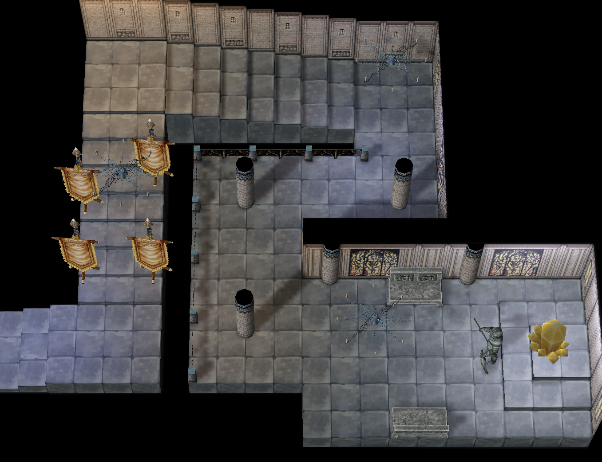

# Pre-Trans WoE

Pre-Trans WoE in Ragnarok Online is a guild-based PvP event where only second jobs and below can participate, creating a unique and balanced battlefield. Without transcendent skills, strategy and teamwork become even more crucial. Guilds must break the Emperium to claim castles while fending off enemy attacks. Holding a castle grants access to Guild Dungeons and valuable treasures, making competition fierce. The absence of overpowered buffs and gear encourages classic gameplay, where skill rotations, positioning, and proper class synergy matter most. Tanks, wizards, assassins, and supports all have key roles, ensuring a dynamic and engaging experience.

For many players, Pre-Trans WoE brings a strong sense of nostalgia, reminding them of the early days of Ragnarok Online, when guild wars were more about tactics than raw power. Additionally, preparing for this type of WoE is much easier, as the required gear is more accessible compared to WoE FE or WoE SE. This makes it a great option for both new and returning players looking to experience WoE without the heavy grind.

## Schedule

On our server, WoE takes place every Sunday and lasts for one hour. 

### Saturday

| Server Time (UTC)  | CET (UTC +1)    | EET (UTC +2)       |  IST (UTC +5)          | PST (UTC -8)          | MST (UTC -7)         | CST (UTC -6)         | EST (UTC -5)         |
|--------------------|-----------------|--------------------|------------------------|-----------------------|----------------------|----------------------|----------------------|
| 15:00              | 16:00           | 17:00              | 20:00                  | 07:00                 | 08:00                | 09:00                | 10:00                |

#### Available Castles

| Castle Name. Town  | Location   | Emperium Room       |  Guild Dangeous        |
|--------------------|------------|---------------------|------------------------|
| Yesnelph. Geffen |  | [{width=500 height=400}](img/WoE/Geffen-Yesnelph-EmpRoom.jpg) |  |
<!--| Skoegul. Prontera |  | [{width=500 height=400}](img/WoE/Prontera-Skoegul-EmpRoom.png) |  |
| Rothenburg. Aldebaran |  | [{width=500 height=400}](img/Rothenburg-EmpRoom.png) |  | -->

!!! note
    Castle rotations happen periodically as well as total active castle numbers based on WoE population and is subject to change.

## Treasure Chest Drop

| Castle Name. Town  | Treasure Chest 1 | Treasure Chest 2 |
|--------------------|------------------|------------------|
| Yesnelph. Geffen |  Poring Coin - 100%   Poring Coin - 100%   Poring Coin - 100%   Bloody Branch - 15%   Jewelry Box - 2%   Enriched Oridecon - 15%   Old Card Album - 25% |  Poring Coin - 100%   Poring Coin - 100%   Poring Coin - 100%   Bloody Branch - 15%   Token of Honor - 0.25%   Silit Pong - 0.03%   Enriched Elunium - 15%   Mystical Card Album - 0.01% |
<!--| Skoegul. Prontera |  Poring Coin - 100%   Bloody Branch - 10%   War Axe [1] - 3.75%   Chai Mail [1] - 40%   Enriched Oridecon - 15%   Mirror Shield [1] - 50%   Old Card Album - 20% |  Poring Coin - 100%   Token of Honor - 0.25%   Two-Handed Sword [2] - 35%   Shoes [1] - 40%   Enriched Elunium - 15%   Yggdrasil Berry - 100%   Muffler [1] - 40%   Mystical Card Album - 0.01% |
| Rothenburg. Aldebaran |  Poring Coin - 100%   Bloody Branch - 10%   War Axe [1] - 3.75%   Chai Mail [1] - 40%   Enriched Oridecon - 15%   Mirror Shield [1] - 50%   Old Card Album - 20%  |  Poring Coin - 100%   Dead Branch - 100%   Enriched Elunium - 15%   Yggdrasil Berry - 100%   Muffler [1] - 40%   Zeny Knife - 9%   Mystical Card Album - 0.01% | -->

## Token System

One chest from the "Hot Location" castle will drop a "Token of Honor" at 0.25% base percentage. Current zone = Prontera. When 3 of one type are collected, they can be redeemed for one of the packages of choice listed below via GM. These tokens are non guild-storable or tradeable and must be collected by your designated woe/guild lead.

| Package 1           | Package 2         | Package 3            |
|---------------------|-------------------|----------------------|
|  Bloody Branch - 25 |  Bloody Branch - 50 |  Bloody Branch - 50 |
|  Old Card Album - 15 |  Old Card Album - 25 |  Old Card Album - 25 |
|  Mystical Card Album | AD Bottle Sets - 2k | Enriched Elunium - 40 |
|                     |                   |  Enriched Oridecon - 40 |

## WoE Mechanics

- 24 member cap within any given castle (Recall prioritizes top most rank downwards until number met) Extended, Baby and Trans classes will yield no movement  
- All MVP cards render no effect within WoE Castles (Still equipable, but have no effect)  
- If you equip an item on the block list, it will yield 0 effect within castles  
- Buffs received by Trans / Extended classes will automatically be removed upon entry into castle (Portal or E-Call)  
- Issuing FCP as a creator to members outside of castles prior to entrance into Pre-Trans WoE castles is strictly forbidden and will yield an account ban
- @GuildHP is now toggleable through @settings (Allows you to view Guild member HP even outside of party)  
- Guild Emblems must be visible and clearly identifiable to participate  

!!! warning "The following changes apply only within Pre-Trans castles and during active Pre-Trans WoE:"
    - Traps are no longer friendly fire — they do not affect guild members or the caster.  
    - Monks can no longer snap/body relocate past or out of traps.  
    - Magnum Break reverted to Pre-Ep8: 3×3 cell range (affects only your cell, not nearby traps).  
    - **Rodex** menu cannot be used to send/receive mail.

## Item Block Lists

### Card Restrictions:

??? note "Card List, click to expand"
    | Card        | Item Id  |
    |-------------|----------|
    | Osiris Card | 4144 |
    | Baphomet Card | 4147 |
    | Mistress Card | 4132 |
    | Golden Bug Card | 4128 |
    | Orc Hero Card | 4143 |
    | Drake Card | 4137 |
    | Eddga Card | 4123 |
    | Maya Card | 4146 |
    | Moonlight Flower Card | 4131 |
    | Pharaoh Card | 4148 |
    | Phreeoni Card | 4121 | 
    | Orc Load Card | 4135 |
    | Knight Windstorm Card | 4318 | 
    | Garm Card | 4324 |
    | Dark Lord Card | 4168 |
    | Turtle General Card | 4305 |
    | Lord Of Death_Card | 4276 |
    | Dracula Card | 4134 |
    | Dark Snake Lord_Card | 4330 |
    | Samurai Spector Card | 4263 |
    | Amon Ra Card | 4236 |
    | Tao Gunka Card | 4302 |
    | Rsx-0806 Card | 4342 |
    | White Lady Card | 4372 |
    | Lord Knight Card | 4357 |
    | Assassin Cross Card | 4359 |
    | MasterSmith Card | 4361 |
    | High Priest Card | 4363 | 
    | Sniper Card | 4367 |
    | High Wizard Card | 4365 | 
    | General Egnigem Cenia Card | 4352 |
    | Vesper Card | 4374 |
    | Lady Tanee Card | 4376 |
    | Memory of Thanatos Card | 4399 |
    | Detardeurus Card | 4386 |
    | Kiel-D-01 Card | 4403 |
    | Randgris Card | 4407 | 
    | Gloom Under Night Card | 4408 | 
    | Ktullanux Card | 4419 | 
    | Atroce Card | 4425 |
    | Ifrit Card | 4430 | 
    | Fallen Bishop Card | 4441 |
    | Berzebub Card | 4145 | 
    | Corruption Root Card | 4603 |
    | Amdarais Card | 4601 | 
    | Ghostring Card | 4047 |
    | Angeling Card | 4054 |
    | Deviling Card | 4174 |
    | Maya Puple Card | 4198 |
    | Gemini-S58 Card | 4354 |
    | Errende Ebecee Card | 4349 |
    | Noxious Card | 4334 |
    | Teddy Bear Card | 4340 |
    | Seyren Windsor Card | 4358 |
    | Eremes Guile Card | 4360 |
    | Howard Alt-Eisen Card | 4362 |
    | Margaretha Sorin Card | 4364 |
    | Kathryne Keyron Card | 4366 |
    | Cecil Damon Card | 4368 |
    | Drosera Card | 4421 |
    | Galion Card | 4423 |
    | Roween Card | 4422 |
    | Stapo Card | 4424 | 
    | Metaling Card | 4341 |
    | Beholder Card | 4356 |
    | Vanberk Card | 4411 |
    | Isilla Card | 4412 |
    | Hodremlin Card | 4413 |
    | Seeker Card | 4414 |
    | Agav Card | 4409 |
    | Echio Card | 4410 |
    | Sky Deleter Card | 4158 |
    | Mole Card | 4343 |
    | Earth Deleter Card | 4279 |
    | Lady Solace Card | 4394 | 
    | Death Word Card | 4388 |
    | Ancient Mimic Card | 4387 | 
    | Mistress of Shelter Card | 4393 |
    | Dame of Sentinel Card | 4392 |
    | Dolor of Thanatos Card| 4398 |
    | Maero of Thanatos Card | 4395 |
    | Despero of Thanatos Card | 4397 |
    | Odium of Thanatos Card | 4396 |
    | Sword Guardian Card | 4427 |
    | Bow Guardian Card | 4428 |
    | Salamander Card | 4429 |
    | Kasa Card | 4431 |
    | Imp Card | 4433 |
    | Magmaring Card | 4432 |
    | Zombie Slaughter Card | 4435 |
    | Ragged Zombie Card | 4436 |
    | Hell Poodle Card | 4437 |
    | Banshee Card | 4438 |
    | Flame Skull Card | 4439 |
    | Necromancer Card | 4440 |
    | Alicel Card | 4401 |
    | Aliot Card | 4402 |
    | Aliza Card | 4400 |
    | Skogul Card | 4404 |
    | Frus Card | 4405 |
    | Cornus Card | 4448 |
    | Luciola Vespa Card | 4445 |
    | Centipede Card | 4447 |
    | Hilsrion Card | 4453 |
    | Centipede Larva Card | 4452 | 
    | Tatacho Card | 4442 |
    | Aqua Elemental Card | 4443 |
    | Dark Shadow Card | 4449 |
    | Draco Card | 4444 |
    | Red Ferus Card | 4380 |
    | Green Ferus Card | 4381 |
    | Blue Acidus Card | 4379 |
    | Gold Acidus Card | 4378 |
    | Hydrolancer Card | 4384 |
    | Wickebine Tres Card | 4348 |
    | Laurell Weinder Card | 4350 |
    | Egnigem Cenia Card | 4346 |
    | Kavach Icarus Card | 4351 |

### Consumables Restrictions:

??? note "Block List, click to expand"
     Yggdrasil Berry 
     Yggdrasil Seeds 
     Pumpkin Pie 
	 Speed Potion 
	 Grace Moon Cake 
	 Fireproof Potion 
	 Coldproof Potion 
	 Earthproof Potion 
	 Thunderproof Potion 
	 Buche De Noel 
	 Arunafeltz Desert Sandwich 
	 Rune Strawberry Cake 
	 Schwarzwald Pine Jubilee 
    - All Stats Foods

### Gear Restrictions:

??? note "Gear List, click to expand"
	| Gear Name   | Item Id  |
    |-------------|----------|
    | Gigantic Majestic Goat [0] | 5374 |
	| Aebecee's Raging Typhoon Armor [0] | 2348 |
	| Aebecee's Raging Typhoon Armor [1] | 2349 |
	| Lucius's Fierce Armor of Volcano [0] | 2344 |
	| Lucius's Fierce Armor of Volcano [1] | 2345 |
	| Saphien's Armor of Ocean [0] | 2346 |
	| Saphien's Armor of Ocean [1] | 2347 |
	| Claytos Cracking Earth Armor [0] | 2350 |
	| Claytos Cracking Earth Armor [1] | 2351 | 
	| Valkyrja's Shield [1] | 2115 |
	| Skin of Ventus [1] | 2536 |
	| Veteran Sword [1] | 1188 |
	| Hermode Cap [1] | 5481 |
	| Specialty Jur [4] | 1264 |
	| Krishna [2] | 1284 |
	| Vecer Axe [2] | 1311 |
	| Croce Staff [1] | 1647 |
	| Hardcover Book [1]  | 1561 |
	| Falken Blitz [2]  | 1745 |
	| La'cryma Stick [2]  | 1646 |
	| Magic Eyes [0] | 5138 |
	| Hurricane's Fury [1] | 1377 |
	| Dragon Wing [0] | 1724 |
	| Dragon Slayer [2] | 1180 |
	| Moonlight Dagger [0] | 1234 |
	| Bloody Roar [0] | 1265 |
	| Tomahawk [0] | 1368 |
	| Ice Pick [1] | 13017 |
	| Sage's Diary [2] | 1560 |
	| Luna Bow [2] | 1723 |
	| Robe of Cast [0] | 2343 |
	| Cursed Dagger [0] | 1241 |
	| Dagger of Counter [0] | 1242 |
	| Ulle's Cap [1] | 5123 |
	| Atlas Weapon [1] | 1175 |
	| Ulfhedinn [1] | 2531 |
	| Combo Battle Glove [4] | 1822 |
	| Seismic Fist [3] | 1821 |
	| High Fashion Sandals [1] | 2422 |
	| Beret [0] | 5172 |
	| Divine Cloth [1] | 2366 |
	| Gust Bow [1] | 1733 |
	| Frozen Bow [1] | 1731 |
	| Burning Bow [1] | 1730 |
	| Earth Bow [1] | 1732 |
	| Orc Archer Bow [0] | 1734 |
	| Vidar's Boots [0] | 2418 |
	| Fricco's Shoes [0] | 2417 |
	| Goibne's Armor [0] | 2354 |
	| Goibne's Greaves [0] | 2419 |
	| Goibne's Helm [0] | 5128 |
	| Goibne's Spaulders [0] | 2520 |
	| Eagle Wing [1] | 2515 |
	| Bloodied Shackle Ball [0] | 2655 |
	| Morrigane's Manteau [0] | 2519 |
	| Morrigane's Belt [0] | 2650 |
	| Morrigane's Helm [0] | 5127 |
	| Morrigane's Pendant [0] | 2651 |
	| Doom Slayer [0] | 1370 |
	| Platinum Shield [0] | 2122 |
	| Lesser Elemental Ring [0] | 2680 |
	| Drill Katar [1] | 1270 |
	| Spiritual Ring [0] | 2677 |
	| Platinum Shotel [1] | 13404 |
	| Ledger of Death [2] | 1565 |
	| Seal of Continental Guard [1] | 2730 |
	| Death Loop [1] | 2732 |
	| Rune Spellstone [1] | 2731 |
	| Holy Stick [1] | 1631 |
	| Nagan [0] | 1130 |
	| Iron Wrist [0] | 2719 |
	| Release of Wish [0] | 1630 |
	| Ancient Magic [2]  | 1573 |
	| Principles of Magic [2] | 1572 |
	| Vali's Manteau [0] | 2517 |
	| Claw [2] | 1810 |
	| Curved Sword [2] | 13405 |
	| Falcon Muffler [0] | 2516 |
	| Morpheus's Shawl [0] | 2518 |
	| Survivor's Rod [1] | 1618 |
	| Blood Tears [2] | 1271 |
	| Divine Cross [0] | 2001 |
	| Odin's Blessing [1] | 2353 |
	| Dead Tree Cane [0] | 1643 |
	| Eye Stone Ring [1] | 2783 |
	| Veteran Hammer [2] | 1548 |
	| Veteran Axe [2] | 1384 |
	| Magni's Cap [0] | 5122 |
	| Stone Buckler [1] | 2114 |
	| Inverse Scale [0] | 1269 |
	| Morpheus's Hood [0] | 5126 |
	| Fricca's Circlet [0] | 5124 |
	| Morpheus's Ring [0] | 2648 |
	| Morpheus's Bracelet [0] | 2649 |
	| Black Frame Glasses [0] | 5401 |
	| Robo Eye [0] | 5325 |
	| Sigrun's Wings [0] | 5592 |
	| Feather Beret [0] | 5170 |
	| Blush of Groom [0] | 5800 |
	| Gentleman's Pipe [0] | 5377 |
	| Love Valentine's Hat [0] | 5393 |
	| Hyuke's Black Cat Ears [0] | 5360 |
	| Glittering Jacket [1] | 2319 |

??? note "BG Gear List, click to expand"
	| Gear Name   | Item Id  |
    |-------------|----------|
    | Brave Assassin's Damascus [0] | 13036 |
    | Valorous Assassin's Damascus [0] | 13037 |
    | Brave Gladiator Blade [0] | 13411 |
    | Valorous Gladiator Blade [0] | 13410 |
    | Brave Assaulter's Katzbalger [0] | 1183 |
    | Assaulter Spear [0] | 1425 |
    | Assaulter Lance [0] | 1482 |
    | Warlock's Magic Wand [0] | 1632 |
    | Warlock's Battle Wand [0] | 1633 |
    | Strong Recovery Wand [0] | 1634 |
    | Speedy Recovery Wand [0] | 1635 |
    | Brave Battlefield Morning Star [0] | 1543 |
    | Valorous Battlefield Morning Star [0] | 1542 |
    | Brave Insane Battle Axe [0] | 1380 |
    | Valorous Insane Battle Axe [0] | 1379 |
    | Brave Huuma Front Shuriken [0] | 13305 |
    | Valorous Huuma Front Shuriken [0] | 13306 |
    | Brave Battle CrossBow [0] | 1739 |
    | Valorous Battle CrossBow [0] | 1738 |
    | Brave Carnage Katar [0] | 1279 |
    | Valorous Carnage Katar [0] | 1280 |
    | Brave Battlefield Guitar [0] | 1924 |
    | Valorous Battlefield Guitar [0] | 1923 |
    | Brave Battle Lariat [0] | 1978 |
    | Valorous Battle Lariat [0] | 1977 |
    | Brave Battle Strategy Book [0] | 1574 |
    | Valorous Battle Strategy Book [0]  | 1575 |
    | Brave Battle Fist [0] | 1824 |
    | Valorous Battle Fist [0] | 1823 |
    | Soldier Revolver [0] | 13108 |
    | Soldier Rifle [0] | 13171 |
    | BF_Gatling_Gun1 | 13172 |
    | Soldier Gatling Gun [0] | 13173 |
    | Soldier Grenade Launcher [0] | 13174 |
    | Captain's Manteau [1] | 2538 |
    | Commander's Manteau [1] | 2539 |
    | Sheriff's Manteau [1] | 2540 |
    | Battle Greaves [1] | 2435 |
    | Combat Boots [1] | 2436 |
    | Battle Boots [1] | 2437 |
    | Assaulter Plate [1] | 2376 |
    | Elite Engineer Armor [1] | 2377 |
    | Assassin Robe [1] | 2378 |
    | Warlock_Battle_Robe | 2379 |
    | Medic's Robe [1] | 2380 |
    | Elite Archer Suit [1] | 2381 |
    | Elite Shooter Suit [1] | 2382 | 
    | Sheriff Badge [0] (Swordman) | 2733 |
    | Medal of Honor [0] | 2720 |
    | Medal of Honor [0] (Thief) | 2721 |
    | Medal of Honor [0] (Acolyte) | 2722 |
    | Medal of Honor [0] (Mage) | 2723 |
    | Medal of Honor [0] (Archer) | 2724 |
    | Medal of Honor [0] (Merchant) | 2725 |

??? note "Dimonka Headgear List, click to expand"
	| Gear Name   | Item Id  |
    |-------------|----------|
    | Scarlet Rose [0] | 5548 |
	| Vanilmirth Hat [0] | 5289 |
	| Gigantic Majestic Goat [0] | 5518 |
	| Filir's Pinions [0] | 5664 |
	| Peco Ears [0] | 5358 |
	| Darkness Helm [1] | 5653 |
	| Chick Hat [0] | 5283 |
	| Rainbow Scarf [0] | 5463 |
	| Skull Cap [1] | 18539 |
	| Gangster Scarf [0] | 5361 |
	| Satanic Bone Helm [1] | 5529 |
	| Dark Randgris Helm [1] | 5373 |
	| Orc Hero Headdress [1] | 5375 |
	| Little Angel Doll [0] | 5324 |
	| Bunny Top Hat [0] | 5378 |
	| Well-Chewed Pencil [0] | 5574 |
	| Fish In Mouth [0] | 5403 |
	| Alice Doll [1] | 5137 |
	| Glaris Doll Hat [1] | 5341 |
	| Defolty Doll Hat [1] | 5340 | 
	| Carmen Miranda's Hat [0] | 5307 |
	| Dress Hat [1] | 5211 |
	| Rideword Hat [1] | 5208 |
	| Festival Pumpkin Hat [0] | 5356 |
	| Pirate Dagger [0] | 5305 |
	| Purple Cowboy Hat [1] | 5409 |
	| Santa Poring Hat [1] | 5381 |
	| Pisces Crown [0] | 5515 |
	| Pisces Diadem [0] | 5514 |
	| Necromancer's Hood [0] | 5502 |
	| Koneko Hat [0] | 5372 |
	| Moonlight Flower Hat [0] | 5214 |
	| Fish Head Hat [0] | 5380 |

??? note "Slotted item blocks List, click to expand"
	| Gear Name   | Item Id  |
    |-------------|----------|
    | Book of Billows [3] | 1568 |
	| Book of Mother Earth [3] | 1569 |
	| Book of Blazing Sun [3] | 1570 |
	| Book of Gust of Wind [3] | 1571 |
	| Orcish Axe [4] | 1309 |
	| Spike [2] | 1538 |
	| Hunter Bow [1] | 1726 |
	| Zweihander [2] | 1171 |
	| Flamberge [2] | 1149 |
	| Infiltrator [1] | 1266 |
	| Ballista [1] | 1727 |
	| Stunner [2] | 1532 |
	| Berserk [1] | 1816 |
	| Claymore [2] | 1172 |
	| Dragon Killer [2] | 13030 |
	| Katar of Frozen Icicle [3] | 1275 |
	| Katar of Quaking [3] | 1276 |
	| Katar of Raging Blaze [3] | 1277 |
	| Katar of Piercing Wind [3] | 1278 |
	| Golden Mace [2] | 1539 |
	| Oriental Lute [2] | 1922 |
	| Wire Whip [3] | 1955 |
	| Queen's Whip [2] | 1976 |
	| Spectral Spear [1] | 1479 |
	| Gae Bolg [2] | 1480 |
	| Schweizersabel [2] | 1178 |
	| Gungnir [2] | 1418 |
	| Poison Knife [2] | 13016 |
	| Sucsamad [1] | 13018 |
	| Ginnungagap [1] | 13019 |
	| Cutlus [1] | 13400 |
	| Zephyrus [3] | 1481 |
	| Swordbreaker [3] | 13031 |
	| Mailbreaker [3] | 13032 |
	| Dragon Slayer [2] | 1180 |
	| Assassin Dagger [1] | 13033 |
	| Grand Cross [1] | 1540 |
	| Executioner [1] | 1179 |
	| Ph.D Hat [1] | 5347 |
	| Big Ribbon [1] | 5348 |
	| Boy's Cap [1] | 5349 |
	| Bongun Hat [1] | 5168 |
	| Skull Ring [1] | 2715 |
	| High Heels [1] | 2432 |
	| Greaves [1] | 2412 |
	| Pauldron [1] | 2514 |
	| Bucket Hat [1] | 5120 |
	| Memory Book [1] | 2121 |
	| Coif [1] | 5093 |
	| Ninja Suit [1] | 2359 |
	| Orc Helm [1] | 5157 |
	| Ancient Cape [1] | 2525 |
	| Monk Hat [1] | 5158 |
	| Golden Gear [1] | 5159 |
	| Munak Hat [1] | 5167 |
	| Pirate Bandana [1] | 5350 |
	| Spiky Band [1] | 5161 |
	| Majestic Goat [1] | 5160 |
	| Corsair [1] | 5163 |
	| Tiara [1] | 5164 |
	| Crown [1] | 5165 |
	| Sphinx Hat [1] | 5166 |
	| Robe of Cast [1] | 2360 |
	| Bow Thimble [1] | 2671 |
	| Mage Coat [1] | 2372 |
	| Holy Robe [1] | 2373 |
	| Sacred Mission [1] | 2128 |
	| Undershirt [1] | 2523 |
	| Pantie [1] | 2371 |
	| Hat of the Sun God [1] | 5353 |

??? note "Horror Toy Item List, click to expand"
	| Gear Name   | Item Id  |
    |-------------|----------|
    | Hot Tea | 11563 |
	| Sweet Canape | 11564 |
	| Vicious Cookie Card | 31017 |
	| Evil Dwelling Box Card | 31018 |
	| Creepy Demon Card | 31019 |
	| Malicious Baby Ghost Card | 31020 |
	| Dancing Marionette Card | 31021 |
	| Abandoned Teddy Bear Card | 31022 |
	| Celine Kimi Card | 31023  |
	| Decorated Evil Tree Card | 31016 |
	| Big Defense Potion | 14542 |
	| Big Magic Defense Potion | 14544 |

### Skill Restrictions:

 Loki's Veil 
 High Jump 
 Assumptio 