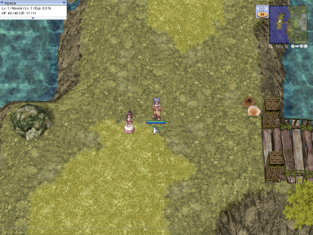

---
hide:
  - toc
---

# Remastered Novice Location

Training Ground in World of Your Dream is a special area designated for players who have just created a new character, also known as Novice.

This area is designed to help new players get familiar with the game's mechanics and controls.

The Novice Training Ground features a tutorial that guides new players through the basic controls and features of the game, such as character movement, combat, and item use.

The Novice Training Ground is also a safe place for new characters to level up, as the monsters in this area are very weak and don't pose much of a threat to the new players.

The area also features NPCs that offer helpful advice and guidance to new players.

Once the player finishes the tutorial and reaches job level 10, they can choose to become a swordsman, mage, or archer in the next step, or leave the Novice Training Ground and enter the main game world.

 *Novice Training ground*

## Training Ground Improvements

Our server features a training ground that has been specifically designed to utilize the latest and most advanced renewal mechanics, providing players with a more efficient and streamlined leveling experience.

The Renewal Training Grounds offer the same immersive and engaging gameplay experience as the pre-renewal version, but with the added convenience of not requiring players to allocate stat points initially.

This allows new players to focus on honing their skills and mastering the game's mechanics, without the added stress of having to make complex decisions about character development.

Furthermore, completing the various quests provided by the Job NPCs in the Renewal Training Grounds can provide new players with valuable supplies and EXP, if they are willing to invest a small amount of time and effort into the process.

This is a great way for new players to quickly and easily advance their characters, and gain a deeper understanding of the game's mechanics and systems.

 *Improved Training ground*

## Rewards Obtained Upon Completion of the Training Grounds

| Item | Description |
|------|-------------|
|  | 10x LV10 Blessing Scroll |
|  | 10x LV10 Agil Scroll |
|  | 2x Field Manual |
|  | 400x Novice Potion |
|  | 50x Novice Fly Wing |
|  | 20x Novice Butterfly Wing |
|  | 20x Free Ticket for Kafra Storage |
|  | 30x Free Ticket for Kafra Transportation |
|  | Novice Cutter |
|  | Novice Adventurer's Suit [1] |
|  | Novice Guard |
|  | Novice Slippers |
|  | Somber Novice Hood |
|  | Novice False Eggshell |

