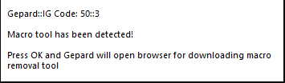

# Troubleshooting

### Client problems

!!! Important 
    Always make sure you open **`uaRO.exe`**, **`Setup.exe`**, or **uaRO `Patcher.exe`** as an administrator.

- Right-click on **`uaRO.exe`** and set its Compatibility mode to Windows 7 if you're running Windows 10 or Windows XP Service Pack 3.
- Right-click on **`uaRO.exe`** and tick the box next to **Run as Administrator**.
- Right-click on **uaRO `Patcher.exe`** and tick the box next to **Run as Administrator**.
- Be sure to grab the **latest patch** through **uaRO `Patcher.exe`**.
- Avoid installing the game to Program Files. Try to install it to somewhere like **`C:\Games\`**.
- **Disable Anti Virus AND Firewall** software before installing and/or patching. (Especially in the case of Avast and McAfee)
- If you use Warsaw (a bank software popular in Brazil), you will need to uninstall it.


### My antivirus recognizes uaRO.exe and uaRO Patcher.exe as insecure software or virus.
It is possible that certain files within the client, particularly those that pertain to anti-cheat and anti-bot systems, may be flagged as viruses or potentially harmful software. Add game client folder, uaRO.exe or uaRO Patcher.exe as an exception for your antivirus.

### Gepard Shield is stuck on the loading screen and is not showing any error messages.
Run Setup.exe from the uaRO folder and try different options:

- Choose the Resolution and Graphic Device.
- Remove checkbox from **Play in Full Screen**.
- Deactivate sound.
- Select checkbox **Delete all Ragnarok-related settings (factory reset)**.


### There is a Gepard Shield error stating that illegal software is being used.

**Image**



**Message**
```
Gepard::IG Code 50::3 

Macro tool has been detected! 

Press OK and Gepard will open browser for downloading macro removal tool
```

**Solution**

Some mouse and keyboard software may be identified as prohibited macros or other types of unauthorized software.

In order to enter a game, it may be necessary to close this software. The list of approved software is constantly updated and added to the whitelist.


### I got an error: Gepard can't validate license on the server.

**Image**


**Message**
```
Gepard::GT Code 1

Gepard can't validate license on the server!

If you use firewall, you have to allow connection to license server.
```

**Solution**

- Check your internet connection
- Add game client folder, **`uaRO.exe`**, or **uaRO `Patcher.exe`** as an exception for your antivirus and firewall

**SEA Players**: Some ISP providers in this region block certain ports by default. These variables are used by Gepard for their firewall licensing server.

1. Manually unblock or allow `Port 6700`
2. Verify the following IPs are unblocked, or set a rule to unblock: `185.61.138.117` and `139.99.40.25`


### There are low FPS or freezes occurring in the game client on a Windows 10/11 system with Nvidia graphics.
To fix low FPS or freezes in the game client on a Windows 10 system with Nvidia graphics, follow these steps.

Go to the Nvidia Control Panel and adjust the 3D settings for `uaRO.exe`:

- Set the Max Frame Rate to 60 FPS
- Set the Monitor Technology to Fixed Refresh
- Set the Preferred Refresh Rate to Application-controlled
- Set Vertical Sync to Use the 3D-application setting

If you do not see these options, make sure to update your NVIDIA drivers. You can do this through the GeForce Experience application or by downloading the latest drivers from NVIDIA's website.

### Cannot init d3d OR grf file has problem


- Run `Setup.exe` with administrator privileges
- Select DirectX7 in the Graphics API option
- Save the changes

