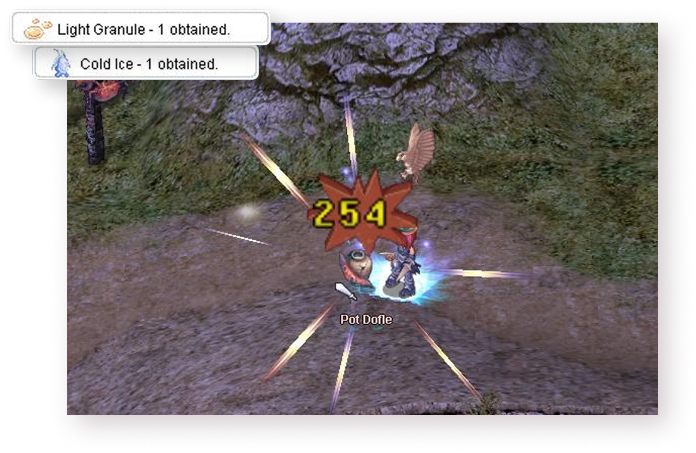
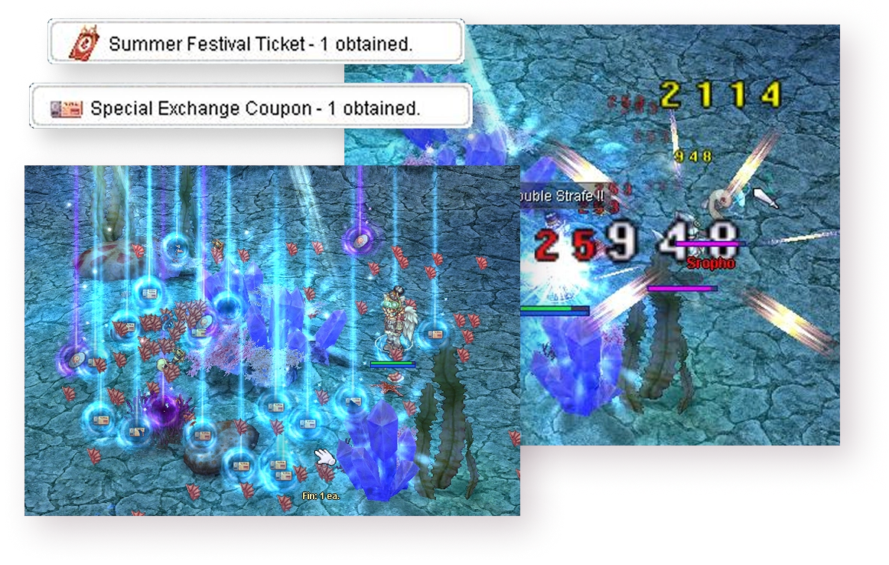
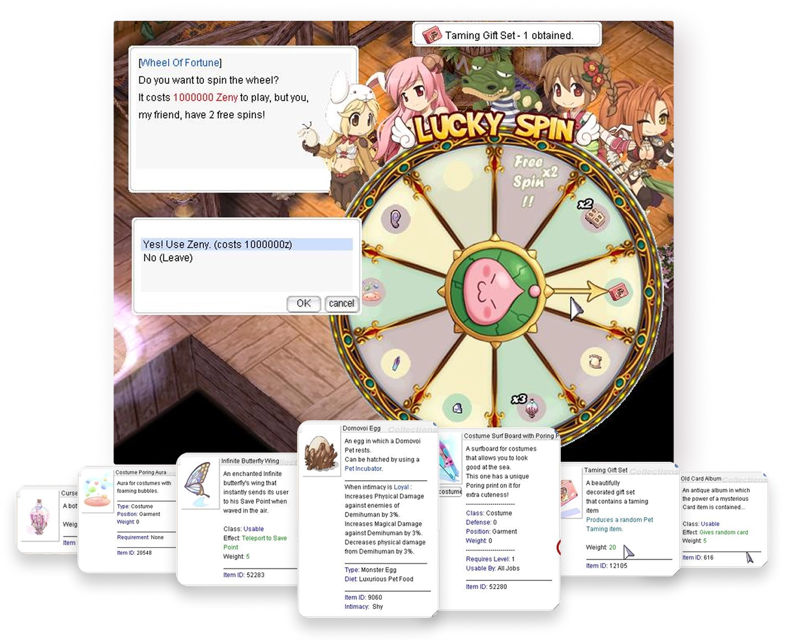

# The Twilight Festival

---

The Twilight Festival invites adventurers to explore an underwater-themed playground filled with monsters, tickets and special prizes.

!!! tip "Event Highlights"
    - **Event Warper** at `/navi prontera 212/192` teleports you to the festival map.
    - The **Wheel of Fortune** activates every three hours and remains open for 30 minutes.

---

## 1. Farm for Rental Access Gear
Hunt mobs in caves and on beaches to collect materials for the **Rental Scuba Mask** and **Rental Oxygen Tank**.

---

## 2. Craft the Boxes
Visit the **Box Crafter NPC** in the event area.

**Items Needed:**
- 200× Cold Ice
- 200× Light Granule

**Rewards:**
- Scuba Mask Box
- Oxygen Tank Box

---

## 3. Enter the Lasagna Dungeon

**Requirements:**
- Equip both Rental Scuba Mask and Rental Oxygen Tank
- 10,000 Zeny per warp

!!! note "PvP Enabled"
    You won't lose experience if you die in this dungeon.

---

## 4. Farm Tickets and Loot
Defeat mobs in the Twilight Dungeon to collect tickets for event shops and the **Wheel of Fortune**.

**No Penalties:**
- You won't lose experience if you die.

---

## 5. Spin the Wheel of Fortune
Use special Festival Tickets dropped from mobs to spin the Wheel and earn exclusive items, pets, and costumes.

!!! info "Wheel Cost"
    Each spin costs **1,000,000 Zeny** and **1 Festival Ticket**. Free spins can also drop from the wheel.

??? note "Wheel Schedule"
    Spins begin at the following hours (server time):
    - **06:00**
    - **09:00**
    - **12:00**
    - **15:00**
    - **18:00**
    - **21:00**
    - **00:00**
    - **03:00**

---

## 6. Visit Event Shops
Exchange your tickets for powerful items and costumes. Multiple event shops are available in the event area.

Enjoy the festival and happy hunting!

