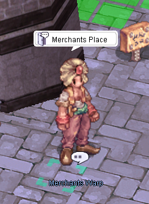
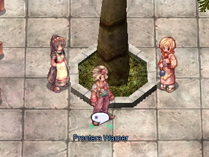
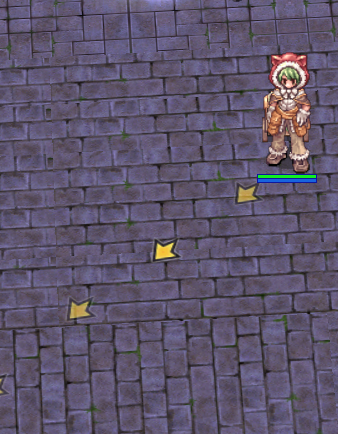
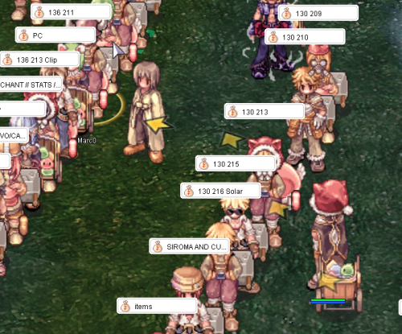
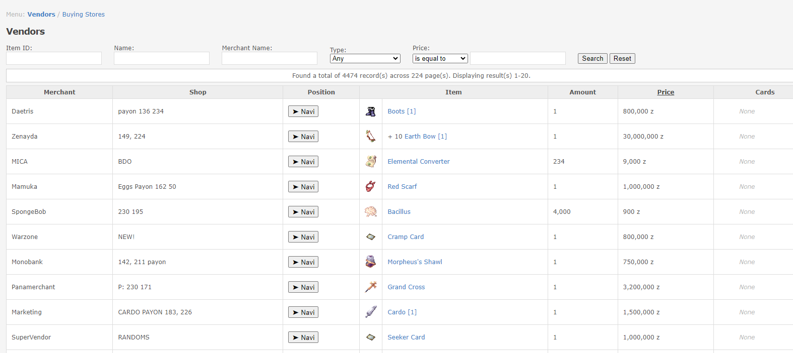
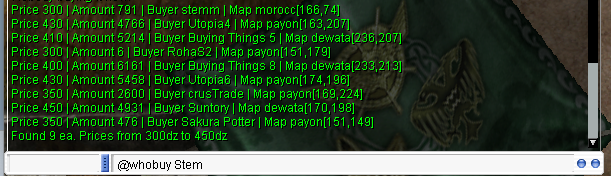
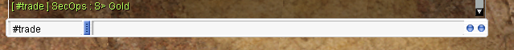
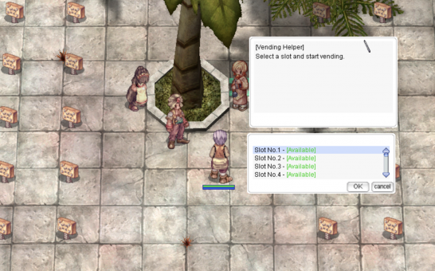

# Vendor System

## Contents
1. [Overview](#overview)
2. [How to get to Dewata](#how-to-get-to-dewata)
3. [How to find a store](#how-to-find-a-store)
    1. [Use command @whosell](#use-command-whosell)
    2. [Use command @searchstore](#use-command-searchstore)
    3. [Use Merchants List page on website](#use-merchants-list-page-on-website)
    4. [Use trade channel in-game](#use-trade-channel-in-game)
    5. [Use discord channel](#use-discord-channel)
4. [How to find a buying store](#how-to-find-a-buying-store)
    1. [Use command @whobuy](#use-command-whobuy)
    2. [Use command @searchstore](#use-command-searchstore)
    3. [Use trade channel](#use-trade-channel)
    4. [Use discord channel](#use-discord-channel)
5. [Vendor Manager System](#vendor-manager-system)
6. [How to create a buying store](#how-to-create-a-buying-store)

## Overview
The server provides a diverse range of options for players to find, purchase, and trade items. Additionally, it implements specialized mechanisms to ensure the stability of the server's economy.

## How to get to Dewata
Dewata is a key trading area. To access Dewata, speak to the **Merchants Warp NPC** (`/navi prontera 139/171`) located in Prontera near the Main Office.

To return to Prontera, speak to the **Prontera Warper** (`/navi dewata 199/185`).

## How to find a store
There are several ways to find and buy items.

### Use command @whosell
Example:  
@whosell Gold

Next, head to the merchant's location and execute the `/navi` command.

Example:  
I decided to buy gold from Pedro's seller, so I'm entering his coordinates into the command:  
/navi payon 136/210

  

### Use command @searchstore
*Information coming soon...*

### Use Merchants List page on website
You can visit the [Merchants List Page](https://uaro.net/cp/?module=merchants&action=vendors), log in, and search for items.

  

### Use trade channel in-game
In the game, you can write in the `#trade` channel what you need to buy, as in the example below:

### Use discord channel
Our Discord server has a selling channel where you can search for what you need.

## How to find a buying store
There are several ways to sell items.

### Use command @whobuy
You can use an item name or item ID to find buyers.  
Example:  
@whobuy Gold

### Use command @searchstore
*Information coming soon...*

### Use trade channel
In the game, you can write in the `#trade` channel what you need to sell.

### Use discord channel
Our Discord server has a buying channel where you can search for buyers.

## Vendor Manager System
Stores can only be opened in towns and authorized locations. It is prohibited to open stores in unauthorized locations, such as dungeons.

To streamline the process, we have introduced the **Vendor Management System**:

- **Spot Picker NPC**: Easily select a designated spot for your shop, ensuring no overlaps with other vendors.
- **Kafra NPC**: Access Kafra services at the marketplace for added convenience.

!!! Note
    Autotrading merchants are allowed while playing on another account.

## How to create a buying store
Any player can create a Buying Store. Here are the main requirements for creating a store:

1. **Possession of the item**: You must possess the item you wish to purchase. Only certain items (e.g., Etc. items, non-brewed consumables) can be purchased.
2. **Sufficient Zeny**: You must have enough Zeny to cover the cost of the desired amount of loot.
3. **Weight Capacity**: Ensure your weight capacity is sufficient to accommodate the loot.
4. **Designated Location**: The Buying Store must be placed in an authorized location.

Buying stores are created differently depending on your character class:

### For Non-Merchant Classes:
- Head to **Morroc Pub** and find the **Black Marketeer** (`/navi morocc 45/108`).

- Purchase **Black Market Buyer Shop Licenses** for 500 Zeny each (up to 10 at a time).

### For Merchant Classes:
- Visit the **Merchant Guild** in Alberta (`/navi alberta 35/42`).
- Talk to the **Purchasing Team NPC**.

  

- Pay 10,000 Zeny to unlock the "Open Buying Store" skill, which allows you to open permanent buying shops. You'll also receive 5 free **Bulk Buyer Shop Licenses**.
- Purchase additional licenses for 200 Zeny each (up to 50 at a time).

!!! Note
    Autotrading merchants are allowed while playing on another account.  
    You must have learned the Vending skill to at least level 1!