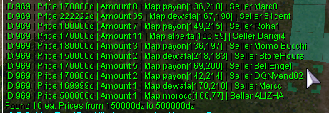
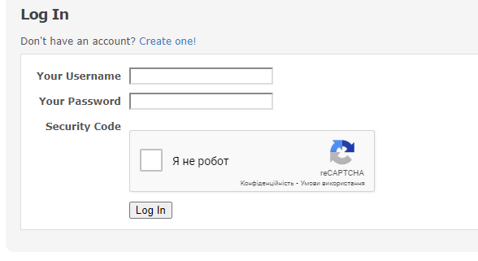
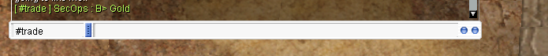
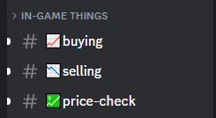
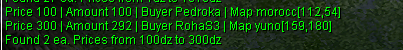
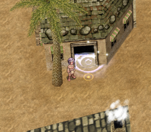
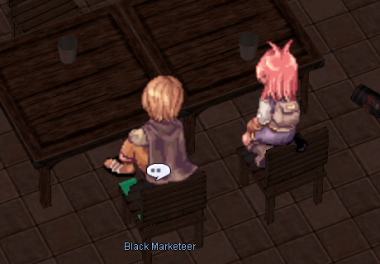
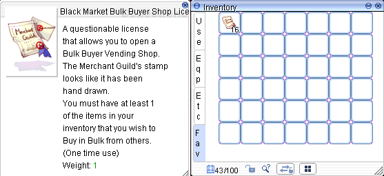
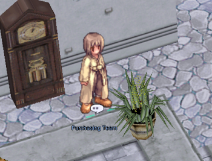
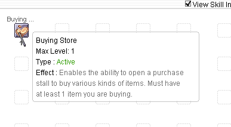

# Vendor System
The server provides a diverse range of options for players to find, purchase, and trade items. Additionally, it implements specialized mechanisms to ensure the stability of the server's economy.

!!! note "Use @ws2 and @wb2"

    Regular commands @ws and @wb are currently unavailable. The team is working on fixing this, for now use @ws2 and @wb2.

## How to get to Dewata
Dewata is a key trading area. To access Dewata, speak to the **Merchants Warp NPC** (`/navi prontera 139/171`) located in Prontera near the Main Office.

To return to Prontera, speak to the **Prontera Warper** (`/navi dewata 199/185`).

## Vendor Manager System
Stores can only be opened in towns and authorized locations. It is prohibited to open stores in unauthorized locations, such as dungeons.

To streamline the process, we have introduced the **Vendor Management System**:

- **Spot Picker NPC**: Easily select a designated spot for your shop, ensuring no overlaps with other vendors.
- **Kafra NPC**: Access Kafra services at the marketplace for added convenience.

!!! note
    Autotrading merchants are allowed while playing on another account.

## Find a store
There are several ways to find and buy items.

### Use @ws2 command
You can use an item name or item ID to find sellers.  

**Example:** `@ws2 Gold` or `@ws2 969`

Next, head to the merchant's location and execute the `/navi` command.

**Example:** I decided to buy gold from Pedro's seller, so I'm entering his coordinates into the command: `/navi payon 136/210`

  

### Use Merchants List page on website
You can visit the [Merchants List Page](https://uaro.net/cp/?module=merchant&action=vendors), log in, and search for items.

  

### Use #trade channel in-game
In the game, you can write in the `#trade` channel what you need to buy or see if someone is already selling it. You might say `B> Gold` and list an amount and price.

### Use Discord
Our Discord server has a [#selling](https://discord.com/channels/702960460168953946/1198723464526319706) channel where you can search if someone is already selling what you want to buy. You can also post in [#buying](https://discord.com/channels/702960460168953946/1198723441872863272) to request it.

## Find a buying store
There are several ways to sell items to other players.

### Use @wb2 command
You can use an item name or item ID to find buyers.  

**Example:** `@wb2 Gold` or `@wb2 969`

### Use trade channel
In the game, you can write in the `#trade` channel what you need to sell. You might say `S> Gold` and list an amount and price.

### Use Discord
Our Discord server has a [#buying](https://discord.com/channels/702960460168953946/1198723441872863272) channel where you can search for buyers, or post directly in the [#selling](https://discord.com/channels/702960460168953946/1198723464526319706) channel.

## Create a buying store
Any class can create a buying store. Here are the main requirements for creating a store:

- **Possession of the item**: You must possess the item you wish to purchase. 
- **Allowed items**: Only "Etc" items and non-brewed consumables can be purchased via a buying store. "Equips" and brewed consumables cannot be purchased this way.
- **Sufficient zeny**: You must have enough zeny to cover the cost of the desired items.
- **Weight capacity**: Your weight capacity must be sufficient to accommodate the purchased items.
- **Designated location**: The buying store must be placed in an authorized location.

Buying stores are created differently depending on your character class:

### For Non-Merchant Classes:
1. Head to **Morroc Pub** and find the **Black Marketeer** (`/navi morocc 45/108`).
2. Purchase **Black Market Bulk Buyer Shop License** for 500z each (up to 10 at a time).
3. Navigate to a designated vending spot and use the license item from your consumables tab. You can now set up your shop.

### For Merchant Classes:
- Visit the **Merchant Guild** in Alberta (`/navi alberta 35/42`).
- Talk to the **Purchasing Team NPC**.

  

- Pay 10,000z to unlock the "**Open Buying Store**" skill, which allows you to open permanent buying shops. You'll also receive 5 free **Bulk Buyer Shop Licenses**.
- Purchase additional licenses for 200z each (up to 50 at a time).
- Licenses are required to use the skill.
- You must have learned the Vending skill to at least level 1.

!!! note
    Autotrading merchants are allowed while playing on another account.  