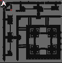
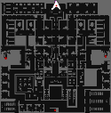
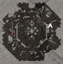
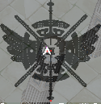
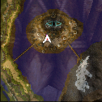
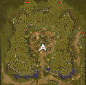

# Warper System

Quest warper has been introduced to the game, providing players with the convenience of opening access to quest locations for all characters linked to their account. This feature simplifies the gameplay process by eliminating the need for players to manually complete quests or travel to quest locations, saving time and enhancing the overall gaming experience.

| Town       | Coordinates          |
|------------|-----------------------|
| Prontera   | /navi prontera 160/191 |
| Izlude     | /navi izlude 134/91    |
| Geffen     | /navi geffen 182/132   |
| Payon      | /navi payon 179/106    |
| Morroc     | /navi morocc 160/97    |
| Alberta    | /navi alberta 39/240   |
| Aldebaran  | /navi aldebaran 135/119|

To ensure the warp is saved for all characters on your account, locate a designated NPC and utilize their services to save the warp.

## **List of Warpa Helpers**

| Location                                | Map                |
|---------------------------------------------------------|--------------------|
| **Amatsu dungeon** /navi ama_dun02 31/47            |  |
| **Ayothaya dungeon** /navi ayo_dun02 255/112        |  |
| **Kiel dungeon** /navi kh_dun01 14/224              |  |
| **Bio Laboratory** /navi lhz_dun01 153/287          |  |
| **Thanatos tower** /navi tha_t03 223/165            |  |
| **Moscovia dungeon** /navi mosk_dun01 195/270       |  |
| **Nameless Island (Abbey)** /navi nameless_n 158/179 |  |
| **Rachel Sanctuary** /navi ra_san01 133/139         |  |
| **Midgard camp (New World)** /navi mid_camp 186/242 |  |
| **Splendide (New World)** /navi splendide 203/173    |  |
| **Manuk (New World)** /navi manuk 275/146            |  |
| **Nidhogg's Dungeon (New World)** /navi nyd_dun01 141/150 |  |