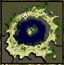
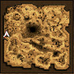

---
hide:
  - toc
---

# Warper System

The ***"Warpra"***, quest warper has been introduced to the game. This provides players with the convenience of opening access to quest locations, for all characters linked to their account. This feature simplifies travel gameplay, by eliminating the need for players to manually complete quests or travel to quest locations with each character on the same account. Warpra dungeon teleporting services cost 5,000z each.

| Town       | Coordinates          |
|------------|-----------------------|
| Prontera   | /navi prontera 160/191 |
| Izlude     | /navi izlude 134/91    |
| Morroc     | /navi morocc 160/97    |
| Geffen     | /navi geffen 126/64   |
| Payon      | /navi payon 163/96    |
| Alberta    | /navi alberta 39/240   |
| Aldebaran  | /navi aldebaran 135/119|
| Lutie      | /navi xmas 142/13 |
| Сomodo     | /navi comodo 193/158 |
| Yuno       | /navi yuno 166/187 |
| Amatsu     | /navi amatsu 102/143 |
| Gonryun    | /navi gonryun 165/117 |
| Umbala     | /navi umbala 88/150 |
| Louyang    | /navi louyang 231/100 |
| Ayothaya   | /navi ayothaya 194/176 |
| Einbroch   | /navi einbroch 232/208 |
| Lighthalzen | /navi lighthalzen 153/85 |
| Einbech    | /navi einbech 194/133 |
| Hugel      | /navi hugel 98/165 |
| Rachel     | /navi rachel 109/145 |
| Veins      | /navi veins 208/120 |
| Moscovia   | /navi moscovia 227/191 |
| Brasilis   | /navi brasilis 194/221 |

To ensure the warp is saved **for all characters on your account**- locate a designated NPC, and speak to them.

## **List of Warpa Helpers**

| Location                                | Map                |
|---------------------------------------------------------|--------------------|
| **Amatsu dungeon** /navi ama_dun02 31/47            |  |
| **Ayothaya dungeon** /navi ayo_dun02 19/27          |  |
| **Kiel dungeon** /navi kh_dun01 14/224              |  |
| **Bio Laboratory** /navi lhz_dun01 153/287          |  |
| **Thanatos tower** /navi tha_t03 223/165            |  |
| **Moscovia dungeon** /navi mosk_dun01 195/270       |  |
| **Nameless Island (Abbey)** /navi nameless_n 158/179|  |
| **Rachel Sanctuary** /navi ra_san01 133/139         |  |
| **Midgard camp (New World)** /navi mid_camp 186/242 |  |
| **Splendide (New World)** /navi splendide 203/173   |  |
| **Manuk (New World)** /navi manuk 275/146           |  |
| **Nidhogg's Dungeon (New World)** /navi nyd_dun01 141/150 |  |
| **Abyss Lake Dungeon Entrance** /navi hu_fild05 163/308 |  |
| **Morocc Field** /navi moc_fild21 30/214            |  |
| **Brasilis Dungeon** /navi bra_dun01 207/42 |  |