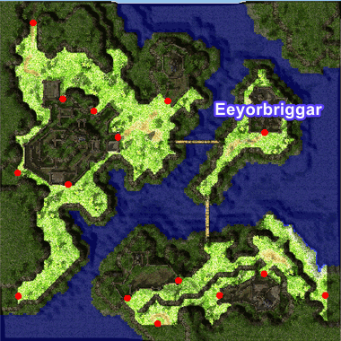

---
hide:
  - toc
---

# WoE

## Contents
1. [Overview](#overview)
2. [Schedule](#schedule)
3. [Castles](#castles)
4. [Treasure Chest Drop](#treasure-chest-drop)
5. [Token System](#token-system)
6. [WoE Mechanics](#woe-mechanics)

## Overview
The War of Emperium is a game feature where guilds compete to conquer a castle, which then becomes the guild’s headquarters and grants various bonuses and advantages.
Owning a castle provides several benefits for the guild. First, it unlocks access to a special Guild Dungeon available to all guild members. These dungeons contain powerful monsters that are often not found in the regular world. Additionally, every night, 4 or more treasure chests (depending on the castle’s economy level) appear in the castle, offering valuable items and equipment. Owning a castle raises the guild's prestige.

## Schedule

On our server, WoE takes place every Saturday and lasts for one hour. 

| Server Time (UTC)  | CET (UTC +1)    | EET (UTC +2)       |  IST (UTC +5)          | PST (UTC -8)          | MST (UTC -7)         | CST (UTC -6)         | EST (UTC -5)         |
|--------------------|-----------------|--------------------|------------------------|-----------------------|----------------------|----------------------|----------------------|
| 16:00              | 17:00           | 18:00              | 21:00                  | 08:00                 | 09:00                | 10:00                | 11:00                |

## Castles

| Castle Name. Town  | Location   | Emperium Room       |  Guild Dangeous        |
|--------------------|------------|---------------------|------------------------|
|Swanhild. Prontera|  | scrin |  |
|Scarlet Palace. Payon|  | scrin |  |
|Eeyolbriggar. Geffen|   | scrin |  |
|Hohenschwangan. Aldebaran|  | scrin |  |

!!! note
    Castle rotations happen periodically as well as total active castle numbers based on WoE population and is subject to change.

## Treasure Chest Drop

## Token System

One chest from the "Hot Location" castle will drop a "Token of Honor" at 0.25% base percentage. Current zone = Prontera. When 3 of one type are collected, they can be redeemed for one of the packages of choice listed below via GM. These tokens are non guild-storable or tradeable and must be collected by your designated woe/guild lead.

| Package 1           | Package 2         | Package 3            |
|---------------------|-------------------|----------------------|
| 50 Bloody Branch    | 50 Bloody Branch  | 50 Bloody Branch     |
| 25 Old Card Album   | 25 Old Card Album | 25 Old Card Album    |
| Mystical Card Album | 2k AD Bottle Sets | 40 Enriched Elunium  |
|                     |                   | 40 Enriched Oridecon |

## WoE Mechanics

-30 member cap within any given castle (Recall prioritizes top most rank downwards until number met). 
-All MVP cards render no effect within WoE Castles (Still equippable, but have no effect). 
-The following mini-boss cards render no effect within WoE Castles (Ghostring, Angeling, Deviling and Maya Purple). 
-Alliances are abolished. 
-@GuildHP is now toggleable through @loginsettings (Allows you to view Guild member HP even outside of party). 

Item Restrictions: 
-Yggdrasil Berry 
-Yggdrasil Seeds 

Skill Restrictions: 
-Loki's Veil 
-High Jump 