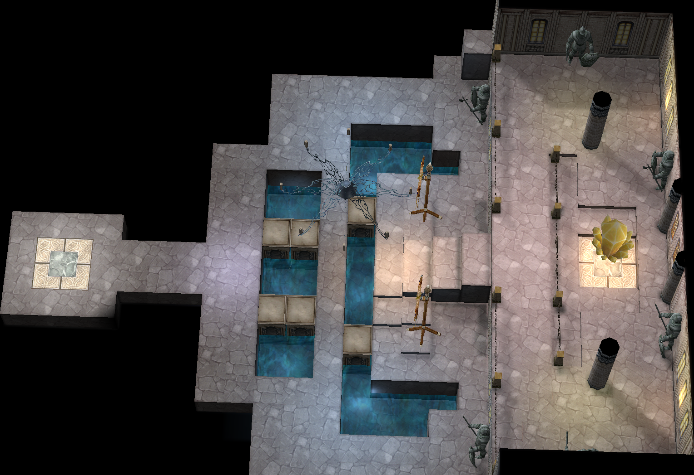
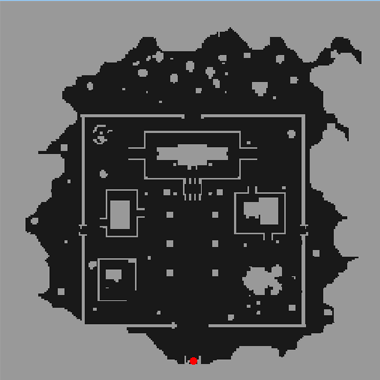
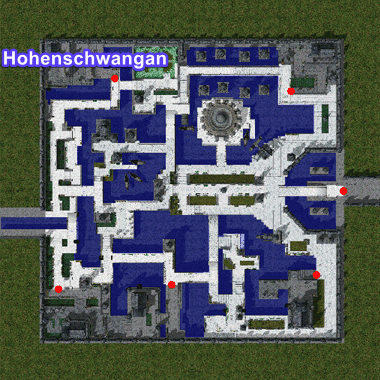

---
hide:
  - toc
---

# WoE

## Contents

1. [Overview](#overview)
2. [Schedule](#schedule)
3. [Treasure Chest Drop](#treasure-chest-drop)
4. [WoE Mechanics](#woe-mechanics)

## Overview

The War of Emperium is a game feature where guilds compete to conquer a castle, which then becomes the guild’s headquarters and grants various bonuses and advantages.
Owning a castle provides several benefits for the guild. First, it unlocks access to a special Guild Dungeon available to all guild members. These dungeons contain powerful monsters that are often not found in the regular world. Additionally, every night, 4 or more treasure chests (depending on the castle’s economy level) appear in the castle, offering valuable items and equipment. Owning a castle raises the guild's prestige.

## Schedule

On our server, WoE takes place every Saturday and lasts for one hour. 

### Saturday

| Server Time (UTC)  | CET (UTC +1)    | EET (UTC +2)       |  IST (UTC +5)          | PST (UTC -8)          | MST (UTC -7)         | CST (UTC -6)         | EST (UTC -5)         |
|--------------------|-----------------|--------------------|------------------------|-----------------------|----------------------|----------------------|----------------------|
| 16:00              | 17:00           | 18:00              | 21:00                  | 08:00                 | 09:00                | 10:00                | 11:00                |

#### Available Castles

| Castle Name. Town  | Location   | Emperium Room       |  Guild Dangeous        |
|--------------------|------------|---------------------|------------------------|
| Swanhild. Prontera |  | [{width=500 height=400}](img/Swanhild-EmpRoom.png) |  |
| Holy Shadow. Payon |   | [{width=550 height=384}](img/Holy%20Shadow-EmpRoom.png) |  |
| Hohenschwangau. Aldebaran |  | [{width=284 height=384}](img/Hohenschwangau-EmpRoom.png) |  |

!!! note
    Castle rotations happen periodically as well as total active castle numbers based on WoE population and is subject to change.

## Treasure Chest Drop

| Castle Name. Town  | Treasure Chest 1 | Treasure Chest 2 |
|--------------------|------------------|------------------|
| Swanhild. Prontera |  Poring Coin - 100%   Bloody Branch - 10%   Yggdrasil Berry - 100%   Muffler [1] - 40%   Shoes [1] - 40%   Chai Mail [1] - 40%   Enriched Oridecon - 15%   Old Card Album - 20%  |  Poring Coin - 100%   Dead Branch - 100%   Enriched Elunium - 15%   Boots [1] - 40%   Jeweled Sword - 10%   Mystical Card Album - 0.01% |
| Holy Shadow. Payon |  Poring Coin - 100%   Bloody Branch - 10%   Yggdrasil Berry - 100%   Enriched Oridecon - 15%   Shoes [1] - 40%   Chain Mail [1] - 40%   Buckler [1] - 40%   Old Card Album - 20% |  Poring Coin - 100%   Dead Branch - 100%   Enriched Elunium - 15%   Glove [1] - 1%   Elven Ears - 1%   Mystical Card Album - 0.01% |
| Hohenschwangau. Aldebaran |  Poring Coin - 100%   Bloody Branch - 10%   War Axe [1] - 3.75%   Chai Mail [1] - 40%   Enriched Oridecon - 15%   Mirror Shield [1] - 50%   Old Card Album - 20%  |  Poring Coin - 100%   Shoes [1] - 50%   Enriched Elunium - 15%   Yggdrasil Berry - 100%   Buckler [1] - 40%   Hat of the Sun God - 0.1%   Mystical Card Album - 0.01% |

<!-- ## Token System

One chest from the "Hot Location" castle will drop a "Token of Honor" at 0.25% base percentage. Current zone = Geffen. When 3 of one type are collected, they can be redeemed for one of the packages of choice listed below via GM. These tokens are non guild-storable or tradeable and must be collected by your designated woe/guild lead.

| Package 1           | Package 2         | Package 3            |
|---------------------|-------------------|----------------------|
|  Bloody Branch - 50 |  Bloody Branch - 50 |  Bloody Branch - 50 |
|  Old Card Album - 25 |  Old Card Album - 25 |  Old Card Album - 25 |
|  Mystical Card Album | AD Bottle Sets - 2k | Enriched Elunium - 40 |
|                     |                   |  Enriched Oridecon - 40 |
-->
## WoE Mechanics

- 30 member cap within any given castle (Recall prioritizes top most rank downwards until number met). 
- All MVP cards render no effect within WoE Castles (Still equippable, but have no effect). 
- The following mini-boss cards render no effect within WoE Castles (Ghostring, Angeling, Deviling and Maya Purple). 
- Alliances are abolished. 
- @GuildHP is now toggleable through @loginsettings (Allows you to view Guild member HP even outside of party). 
- Guild Emblems must be visible and clearly identifiable to participate 

### Item Restrictions:

 Yggdrasil Berry 
 Yggdrasil Seeds 
 Pumpkin Pie 

### Skill Restrictions:

 Loki's Veil 
 High Jump 
 Assumptio 