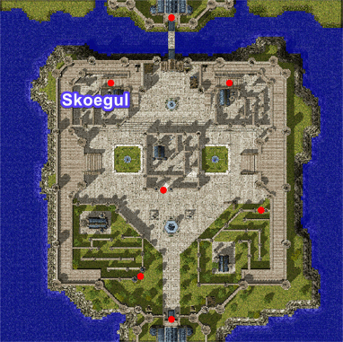
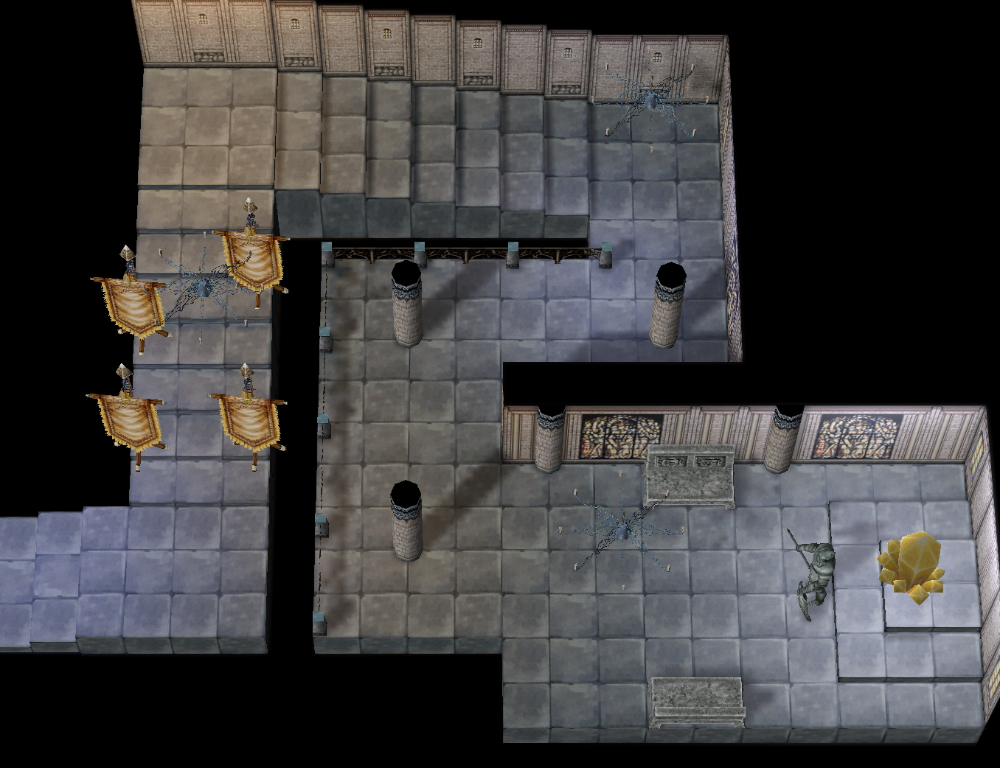
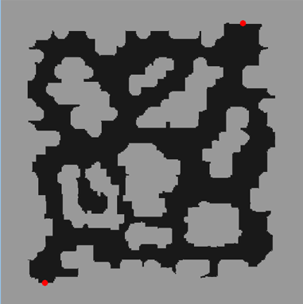
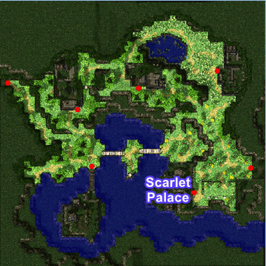
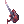
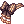
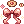
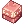

# WoE — War of Emperium

The War of Emperium is a game feature where guilds compete to conquer a castle, which then becomes the guild’s dominion and grants various bonuses and advantages.

Owning a castle provides several benefits for the guild. First, it unlocks access to a special Guild Dungeon available to all guild members. These dungeons contain powerful monsters that are often not found in the regular world. 

Additionally, every night, 4 or more treasure chests (depending on the castle’s economy level) appear in the castle, offering valuable items and equipment. Owning a castle raises the guild's prestige.

You can also participate in [Pre-Trans WoE](Pre-Trans-WoE.md).

## WoE Signs
WoE information signs can be found in these cities. When WoE is active, these signs can transport you directly into battle.

| Town | Coordinates |
|---|---|
| Prontera | `/navi prontera 217/178` |
| Alberta | `/navi alberta 58/248` |
| Morocc | `/navi morocc 212/72` |
| Aldebaran | `/navi aldebaran 207/66` |
| Gonryun | `/navi gonryun 118/140` |

## WoE Mechanics

- 36 member cap within any given castle (Recall prioritizes top most rank downwards until number met)
- All MVP cards render no effect within WoE Castles (Still equippable, but have no effect)
- The following mini-boss cards render no effect within WoE Castles: Ghostring, Angeling, Deviling and Maya Purple
- Alliances are limited to one guild (1 out of Guild bridge character allowed)
- `@guildhp` is now toggleable through `@settings` (Allows you to view Guild member HP even outside of party)
- Guild Emblems must be visible and clearly identifiable to participate
- RODEX Mail is blocked during WoE within castles

### Item Restrictions

 Yggdrasil Berry 
 Yggdrasil Seeds 
 Pumpkin Pie 
 Kafra Card  

### Skill Restrictions

 Loki's Veil 
 High Jump 
 Assumptio 

## Schedule
On our server, WoE takes place every **Saturday** and lasts for **one hour**. These times are in **Standard Time** (non-DST). Please verify if your area is using Daylight Savings Time (DT) seasonally. 
 

| Server (UTC+0) | CET (UTC+1) | EET (UTC+2) | IST (UTC+5:30) | PST (UTC-8) | MST (UTC-7) | CST (UTC-6) | EST (UTC-5) |
|---|---|---|---|---|---|--|---|
| 15:00 | 16:00 | 17:00 | 20:30 | 08:00 | 09:00 | 10:00 | 11:00 |

You can check the current server time in-game with `@time`, or [in you browser on Daypedia](https://dayspedia.com/time/zones/utc+0/).

## Available Castles

| Castle Name, Town | Location | Emperium Room |  Guild Dungeon |
|---|---|---|---|
| Skoegul, Prontera |  | [{width=284 height=384}](img/WoE/castles/Prontera-Skoegul-EmpRoom.png) |  |
| Scarlet Palace, Payon |  | [{width=284 height=384}](img/WoE/castles/Payon-Scarlet-Palace-EmpRoom.png) |  |
| Repherion, Geffen |  | [{width=284 height=384}](img/WoE/castles/Geffen-Repherion-EmpRoom.png) |  |
<!-- | Hohenschwangau, Aldebaran |  | [{width=284 height=384}](img/WoE/Aldebaran-Hohenschwangau-EmpRoom.png) |  | -->
<!-- | Kriemhild, Prontera |  | [{width=284 height=384}](img/WoE/Prontera-Kriemhild-EmpRoom.png) |  | -->
<!-- | Sacred Alter, Payon |  | [{width=284 height=384}](img/WoE/Payon-SacredAlter-EmpRoom.jpg) |  | -->
<!--| Himinn. Yuno |  | [{width=500 height=400}](img/Himinn-Yuno-EmpRoom.png) |  |
| Bergel. Geffen |  | [{width=284 height=384}](img/Bergel-Geffen-EmpRoom.png) |  |
 | Holy Shadow. Payon |   | [{width=550 height=384}](img/Holy%20Shadow-EmpRoom.png) |  | -->

!!! note
    Castle rotations happen periodically as well as total active castle numbers based on WoE population and is subject to change.

## Treasure Chest Drop

| Castle Name, Town  | Treasure Chest 1 | Treasure Chest 2 |
|--------------------|------------------|------------------|
| Hohenschwangau, Aldebaran |  Poring Coin - 100%   Poring Coin - 100%   Poring Coin - 100%   Poring Coin - 100%   Poring Coin - 100%   Bloody Branch - 20%   Jewelry Box - 2.5%   Enriched Oridecon - 20%   Old Card Album - 30%  |  Poring Coin - 100%   Poring Coin - 100%   Poring Coin - 100%   Poring Coin - 100%   Poring Coin - 100%   Token of Honor - 0.25%   Bloody Branch - 20%   Enriched Elunium - 20%   Silit Pong - 0.05%   Mystical Card Album - 0.02% |
<!-- | Kriemhild, Prontera |  Poring Coin - 100%   Poring Coin - 100%   Poring Coin - 100%   Bloody Branch - 15%   Treasure Box - 10%   Silit Pong - 0.03%   Enriched Oridecon - 15%   Old Card Album - 20%  |  Poring Coin - 100%   Poring Coin - 100%   Poring Coin - 100%   Bloody Branch - 15%   Enriched Elunium - 15%   WoE Material Box - 10%   Heroic Token - 0.15%   Mystical Card Album - 0.01% | -->
<!-- | Sacred Alter, Payon |  Poring Coin - 100%   Poring Coin - 100%   Bloody Branch - 10%   Enriched Oridecon - 10%   Treasure Box - 5%   WoE Material Box - 10%   Old Card Album - 15% |  Poring Coin - 100%   Poring Coin - 100%   WoE Material Box - 10%   Treasure Box - 5%   Bloody Branch - 10%   Silit Pong - 0.01%   Enriched Elunium - 10%  | -->
<!-- | Himinn. Yuno |  Poring Coin - 100%   Yggdrasil Berry - 100%   Yggdrasil Berry - 100%   Bloody Branch - 20%   Enriched Oridecon - 25%   Glove [1] - 2.3%   Elven Ears - 1.25%   Mystical Card Album - 0.01% |  Poring Coin - 100%   Heroic Token - 0.25%   Stone Buckler [1] - 5%   Wool Scarf [1] - 5%   Odin Blessing [1] - 5%   Enriched Elunium - 25%    Old Card Album - 50% | -->
<!-- | Bergel. Geffen |  Poring Coin - 100%   Bloody Branch - 10%   Yggdrasil Berry - 100%   Enriched Oridecon - 15%   Shoes [1] - 40%   Chai Mail [1] - 40%   Buckler [1] - 40%   Old Card Album - 20%  |  Poring Coin - 100%   Dead Branch - 100%   Enriched Elunium - 15%   Gaia Sword - 2.5%   Grimtooth - 1.88%   Crown - 0.12%   Mystical Card Album - 0.01% | -->
<!-- | Swanhild. Prontera |  Poring Coin - 100%   Bloody Branch - 10%   Yggdrasil Berry - 100%   Muffler [1] - 40%   Shoes [1] - 40%   Chai Mail [1] - 40%   Enriched Oridecon - 15%   Old Card Album - 20%  |  Poring Coin - 100%   Dead Branch - 100%   Enriched Elunium - 15%   Boots [1] - 40%   Jeweled Sword - 10%   Mystical Card Album - 0.01% | -->
<!-- | Holy Shadow. Payon |  Poring Coin - 100%   Bloody Branch - 10%   Yggdrasil Berry - 100%   Enriched Oridecon - 15%   Shoes [1] - 40%   Chain Mail [1] - 40%   Buckler [1] - 40%   Old Card Album - 20% |  Poring Coin - 100%   Dead Branch - 100%   Enriched Elunium - 15%   Glove [1] - 1%   Elven Ears - 1%   Mystical Card Album - 0.01% | -->

## Hot Location Rewards
One chest from the "Hot Location" castle will drop a "Token of Honor" at 0.25% base percentage. When 3 of one type are collected, they can be redeemed for one of the packages of choice listed below via GM. These tokens are non guild-storable or tradeable and must be collected by your designated WoE Leader or Guild Leader. Hot Locations are communicated to leaders ahead of time.

| Package 1 | Package 2 | Package 3 |
|---|--|---|
|  Bloody Branch - 25 |  Bloody Branch - 50 |  Bloody Branch - 50 |
|  Old Card Album - 15 |  Old Card Album - 25 |  Old Card Album - 25 |
|  Mystical Card Album | AD Bottle Sets - 2k |  Enriched Elunium - 40 |
|   |   |  Enriched Oridecon - 40 |

## WoE Token Rewards
Participating guild members can receive special prizes for joining the fight.

- Guild must have a minimum 10 members to receive tokens
- WoE video post is required in the `#woe-videos` channel within the week (before the next WoE) in order to qualify
- 1× WoE Token awarded per member, per WoE attendance 

 

| NPC | Location |
|:---:|---|
|  **Joseph** | `/navi prontera 217/173` |

| Reward | Cost |
|---|---|
|  Costume Diabloic Rock Guitar |  10 WoE Token |
|  Costume Big Ribbon Manteau (White) |  10 WoE Token |
|  Costume War Princess Ribbon |  10 WoE Token |
|  Costume Drooping Elven Ears |  10 WoE Token |
|  Costume Cookie Ribbon |  10 WoE Token |
|  Blue Herb Box (500) |  2 WoE Token |
|  White Herb Box (1000) |  1 WoE Token |
|  Witch Starsand Box (1250) |  2 WoE Token |
|  Alcohol Box (200) |  2 WoE Token |

## Discord
[Join us on Discord](https://discord.com/channels/702960460168953946/1292191638936096788) in `#emperium-echos`, `#war-room`, and `#woe-videos` for discussion. The latest information on WoE can be found in `#woe-information`.
 
 