# WoE

The War of Emperium is a game feature where guilds compete to conquer a castle, which then becomes the guild’s headquarters and grants various bonuses and advantages.
Owning a castle provides several benefits for the guild. First, it unlocks access to a special Guild Dungeon available to all guild members. These dungeons contain powerful monsters that are often not found in the regular world. Additionally, every night, 4 or more treasure chests (depending on the castle’s economy level) appear in the castle, offering valuable items and equipment. Owning a castle raises the guild's prestige.

## WoE Signs

| Town       | Coordinates          |
|------------|-----------------------|
| Prontera | /navi prontera 217/178 |
| Alberta | /navi alberta 58/248 |
| Morocc | /navi morocc 212/72 |
| Aldebaran | /navi aldebaran 207/66 |
| Gonryun | /navi gonryun 118/140 |

## Schedule

On our server, WoE takes place every Saturday and lasts for one hour. 

### Saturday

| Server Time (UTC)  | CET (UTC +1)    | EET (UTC +2)       |  IST (UTC +5)          | PST (UTC -8)          | MST (UTC -7)         | CST (UTC -6)         | EST (UTC -5)         |
|--------------------|-----------------|--------------------|------------------------|-----------------------|----------------------|----------------------|----------------------|
| 15:00              | 16:00           | 17:00              | 20:00                  | 07:00                 | 08:00                | 09:00                | 10:00                |

#### Available Castles

| Castle Name. Town  | Location   | Emperium Room       |  Guild Dangeous        |
|--------------------|------------|---------------------|------------------------|
| Andlangr. Yuno | 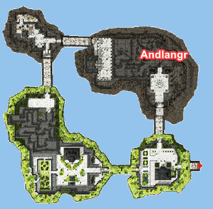 | [{width=500 height=400}](img/WoE/Yuno-Andlangr-EmpRoom.png) |  |
| Neuschwanstein. Aldebaran | 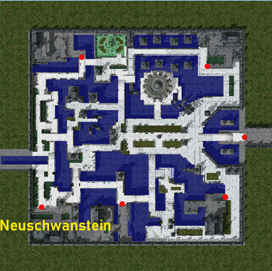 | [{width=284 height=384}](img/WoE/Aldebaran-Neuschwanstein-EmpRoom.png) |  |
| Kriemhild. Prontera | 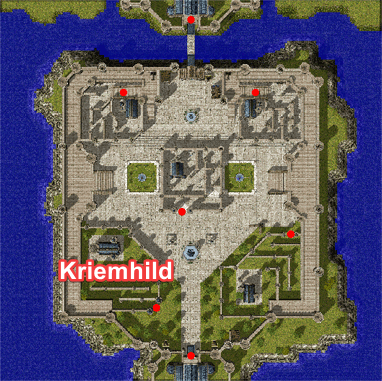 | [{width=284 height=384}](img/WoE/Prontera-Kriemhild-EmpRoom.png) |  |
<!--| Mardol. Rachel | 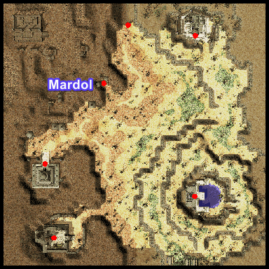 | [{width=284 height=384}](img/WoE/Rachel-Mardol-Emp-Room.png) |  |
| Mersetzdeitz. Gefen | 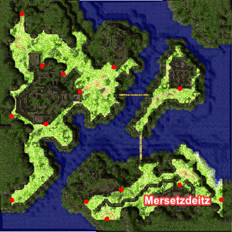 | [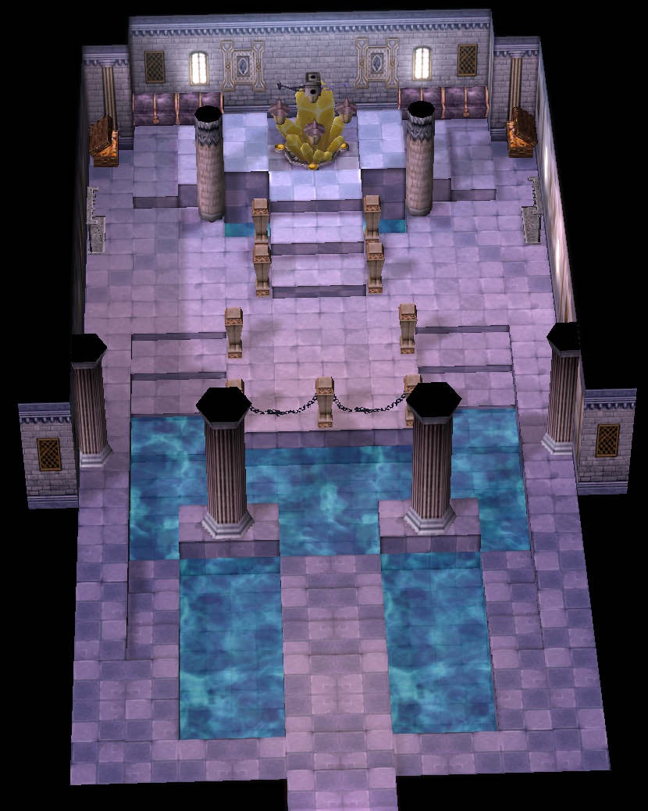{width=284 height=384}](img/WoE/Gefen-Mersetzdeitz-EmpRoom.png) |  |
| Bright Arbor. Payon |  | [{width=284 height=384}](img/WoE/Payon-Bright%20Arbor-EmpRoom.jpg ) |  |
| Repherion. Gefen | 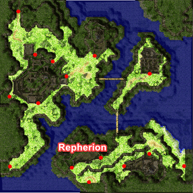 | [{width=284 height=384}](img/WoE/Aldebaran-Hohenschwangau-Emp) |  |
| Scarlet Palace. Payon |  | [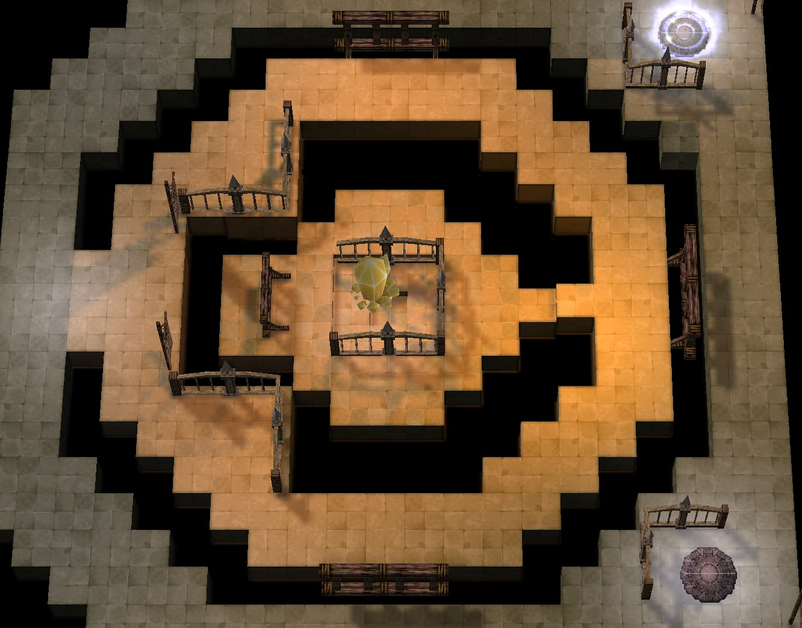{width=284 height=384}](img/WoE/Payon-Holy%20Shadow-EmpRoom.png) |  |
| Skoegul. Prontera |  | [{width=284 height=384}](img/WoE/Prontera-Skoegul-EmpRoom.png) |  |
| Hohenschwangau. Aldebaran |  | [{width=284 height=384}](img/WoE/Aldebaran-Hohenschwangau-EmpRoom.png) |  |
| Kriemhild. Prontera |  | [{width=284 height=384}](img/WoE/Prontera-Kriemhild-EmpRoom.png) |  |
| Sacred Alter. Payon |  | [{width=284 height=384}](img/WoE/Payon-SacredAlter-EmpRoom.jpg) |  |
| Himinn. Yuno |  | [{width=500 height=400}](img/Himinn-Yuno-EmpRoom.png) |  |
| Bergel. Geffen | 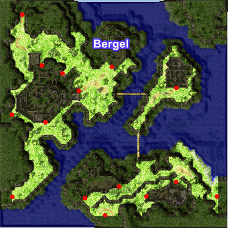 | [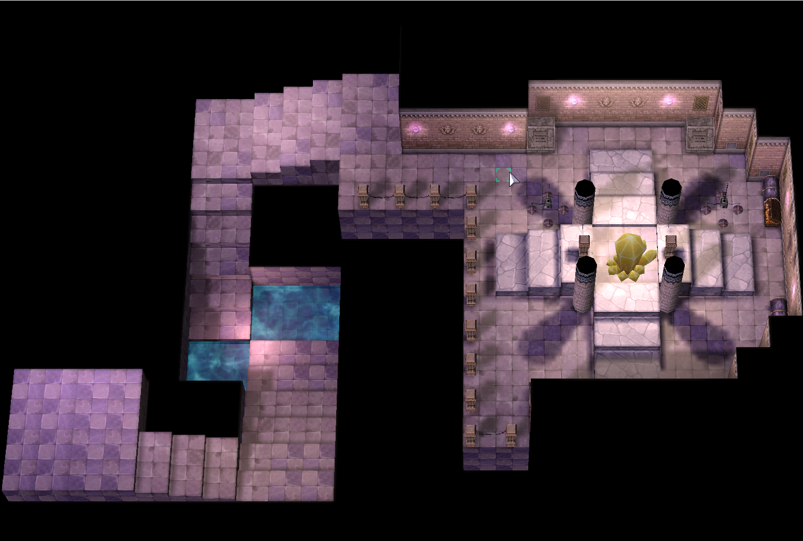{width=284 height=384}](img/Bergel-Geffen-EmpRoom.png) |  |
 | Holy Shadow. Payon |   | [{width=550 height=384}](img/Holy%20Shadow-EmpRoom.png) |  | -->

!!! note
    Castle rotations happen periodically as well as total active castle numbers based on WoE population and is subject to change.  If you possess an FE version of Saturday castles, upon breaking an SE castle you will automatically abandon your FE castles.

## Treasure Chest Drop

| Castle Name. Town  | Treasure Chest 1 | Treasure Chest 2 |
|--------------------|------------------|------------------|
| Andlangr. Yuno | ! Poring Coin - 100%   Poring Coin - 100%   Poring Coin - 100%   Poring Coin - 100%   Poring Coin - 100%   Bloody Branch - 20%   Jewelry Box - 2.5%   Enriched Oridecon - 20%   Old Card Album - 30%  |  Poring Coin - 100%   Poring Coin - 100%   Poring Coin - 100%   Bloody Branch - 15%   Enriched Elunium - 15%   WoE Material Box - 10%   Heroic Token - 0.15%   Mystical Card Album - 0.01% |
| Kriemhild. Prontera |  Poring Coin - 100%   Poring Coin - 100%   Bloody Branch - 10%   Enriched Oridecon - 10%   Treasure Box - 5%   WoE Material Box - 10%   Old Card Album - 15% |  Poring Coin - 100%   Poring Coin - 100%   WoE Material Box - 10%   Treasure Box - 5%   Bloody Branch - 10%   Silit Pong - 0.01%   Enriched Elunium - 10% |
| Neuschwanstein. Aldebaran | ! Poring Coin - 100%   Poring Coin - 100%   Poring Coin - 100%   Poring Coin - 100%   Poring Coin - 100%   Bloody Branch - 20%   Jewelry Box - 2.5%   Enriched Oridecon - 20%   Old Card Album - 30%  |  Poring Coin - 100%   Poring Coin - 100%   Poring Coin - 100%   Poring Coin - 100%   Poring Coin - 100%   Bloody Branch - 20%   Token of Honor - 0.25%   Silit Pong - 0.05%   Enriched Elunium - 20%   Mystical Card Album - 0.02% |
<!--| Mardol. Rachel |  Poring Coin - 100%   Poring Coin - 100%   Poring Coin - 100%   Bloody Branch - 15%   Treasure Box - 10%   Silit Pong - 0.03%   Enriched Oridecon - 15%   Old Card Album - 20%  |  Poring Coin - 100%   Poring Coin - 100%   Poring Coin - 100%   Bloody Branch - 15%   Enriched Elunium - 15%   WoE Material Box - 10%   Heroic Token - 0.15%   Mystical Card Album - 0.01% |
| Mersetzdeitz. Gefen |  Poring Coin - 100%   Poring Coin - 100%   Poring Coin - 100%   Poring Coin - 100%   Poring Coin - 100%   Bloody Branch - 20%   Jewelry Box - 2.5%   Enriched Oridecon - 20%   Old Card Album - 30%  |  Poring Coin - 100%   Poring Coin - 100%   Poring Coin - 100%   Poring Coin - 100%   Poring Coin - 100%   Bloody Branch - 20%   Token of Honor - 0.25%   Silit Pong - 0.05%   Enriched Elunium - 20%   Mystical Card Album - 0.02% |
| Bright Arbor. Payon |  Poring Coin - 100%   Poring Coin - 100%   Poring Coin - 100%   Bloody Branch - 15%   Treasure Box - 10%   Silit Pong - 0.03%   Enriched Oridecon - 15%   Old Card Album - 20% |  Poring Coin - 100%   Poring Coin - 100%   Poring Coin - 100%   Bloody Branch - 15%   Enriched Elunium - 15%   WoE Material Box - 10%   Heroic Token - 0.15%   Mystical Card Album - 0.01% |
| Himinn. Yuno |  Poring Coin - 100%   Yggdrasil Berry - 100%   Yggdrasil Berry - 100%   Bloody Branch - 20%   Enriched Oridecon - 25%   Glove [1] - 2.3%   Elven Ears - 1.25%   Mystical Card Album - 0.01% |  Poring Coin - 100%   Heroic Token - 0.25%   Stone Buckler [1] - 5%   Wool Scarf [1] - 5%   Odin Blessing [1] - 5%   Enriched Elunium - 25%    Old Card Album - 50% |
| Bergel. Geffen |  Poring Coin - 100%   Bloody Branch - 10%   Yggdrasil Berry - 100%   Enriched Oridecon - 15%   Shoes [1] - 40%   Chai Mail [1] - 40%   Buckler [1] - 40%   Old Card Album - 20%  |  Poring Coin - 100%   Dead Branch - 100%   Enriched Elunium - 15%   Gaia Sword - 2.5%   Grimtooth - 1.88%   Crown - 0.12%   Mystical Card Album - 0.01% |
| Swanhild. Prontera |  Poring Coin - 100%   Bloody Branch - 10%   Yggdrasil Berry - 100%   Muffler [1] - 40%   Shoes [1] - 40%   Chai Mail [1] - 40%   Enriched Oridecon - 15%   Old Card Album - 20%  |  Poring Coin - 100%   Dead Branch - 100%   Enriched Elunium - 15%   Boots [1] - 40%   Jeweled Sword - 10%   Mystical Card Album - 0.01% |
| Holy Shadow. Payon |  Poring Coin - 100%   Bloody Branch - 10%   Yggdrasil Berry - 100%   Enriched Oridecon - 15%   Shoes [1] - 40%   Chain Mail [1] - 40%   Buckler [1] - 40%   Old Card Album - 20% |  Poring Coin - 100%   Dead Branch - 100%   Enriched Elunium - 15%   Glove [1] - 1%   Elven Ears - 1%   Mystical Card Album - 0.01% |
| Hohenschwangau. Aldebaran |  Poring Coin - 100%   Bloody Branch - 10%   War Axe [1] - 3.75%   Chai Mail [1] - 40%   Enriched Oridecon - 15%   Mirror Shield [1] - 50%   Old Card Album - 20%  |  Poring Coin - 100%   Shoes [1] - 50%   Enriched Elunium - 15%   Yggdrasil Berry - 100%   Buckler [1] - 40%   Hat of the Sun God - 0.1%   Mystical Card Album - 0.01% | -->

## Token System

One chest from the "Hot Location" castle will drop a "Token of Honor" at 0.15% base percentage. When 3 of one type are collected, they can be redeemed for one of the packages of choice listed below via GM. These tokens are non guild-storable or tradeable and must be collected by your designated woe/guild lead.

| Package 1           | Package 2         | Package 3            |
|---------------------|-------------------|----------------------|
|  Bloody Branch - 25 |  Bloody Branch - 50 |  Bloody Branch - 50 |
|  Old Card Album - 15 |  Old Card Album - 25 |  Old Card Album - 25 |
|  Mystical Card Album | AD Bottle Sets - 2k |  Enriched Elunium - 40 |
|                                         |                   |  Enriched Oridecon - 40 |

## WoE Token

WoE Tokens are awarded to guilds that actively participate in WoE and contribute community content.

To qualify, the guild must meet **all requirements** listed below.

---

### 📋 Eligibility Requirements

- A **minimum of 10 guild members** must participate in WoE
- A **WoE video** (a few minutes long) must be posted in the appropriate **#echoes** Discord channel
- The video must be submitted **within the same week**, **before the next WoE**
- Tokens are distributed **manually by the Game Masters**
- The **Guild Master** receives the tokens **on behalf of the entire guild**

### 🎁 Rewards

- **1 × WoE Token per participating member**

---

### 📍 NPC Locations

WoE Tokens can be exchanged with the following NPCs, located **under the WoE sign**, outside the **East Prontera Inn**:

 **Joseph NPC** — `/navi prontera 217/173`  
 **Sabrina NPC** — `/navi prontera 214/173`  

---

### 🎭 Costumes

| NPC | Item | Cost (WoE Tokens) |
|-----|------|-------------------|
| Joseph | 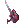 Costume Diabolic Rock Guitar | 10 |
| Joseph |  Costume Big Ribbon Manteau (White) | 10 |
| Joseph | 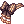 Costume War Princess Ribbon | 10 |
| Joseph |  Costume Drooping Elven Ears | 10 |
| Joseph | 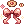 Costume Cookie Ribbon | 10 |

---

### 🛡 Equipment

| NPC | Item | Cost (WoE Tokens) |
|-----|------|-------------------|
| Sabrina |  Yellow Bandana | 15 |

---

### 🧪 Consumables

| NPC | Item | Cost (WoE Tokens) |
|-----|------|-------------------|
| Joseph |  Blue Herb Box | 2 |
| Joseph |  White Herb Box | 1 |
| Joseph |  Witch Starsand Box | 2 |
| Joseph |  Alcohol Box | 2 |

## WoE Mechanics

- 36 member cap within any given castle (Recall prioritizes top most rank downwards until number met). 
- All MVP cards render no effect within WoE Castles (Still equippable, but have no effect). 
- The following mini-boss cards render no effect within WoE Castles (Ghostring, Angeling, Deviling and Maya Purple). 
- Alliances are allowances with one Guild. 
- @GuildHP is now toggleable through @loginsettings (Allows you to view Guild member HP even outside of party). 
- Guild Emblems must be visible and clearly identifiable to participate 
- RODEX is now blocked 

### Item Restrictions:

 Yggdrasil Berry 
 Yggdrasil Seeds 
 Pumpkin Pie 
 Kafra Card  

### Skill Restrictions:

 Loki's Veil 
 High Jump 
 Assumptio 