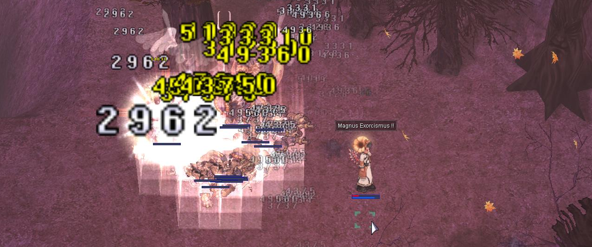
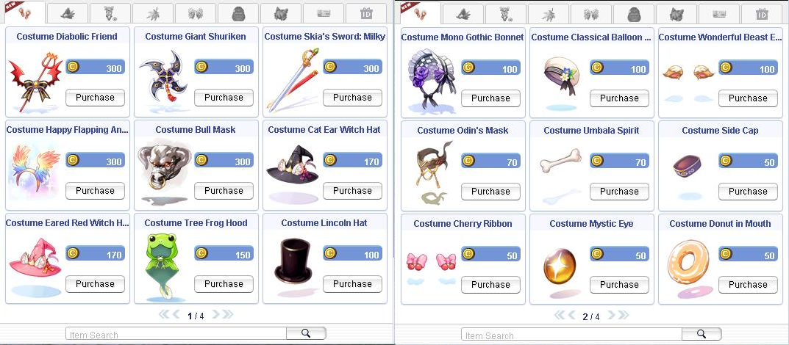

# Patch Notes - October 30, 2024

---
## 👻 **Halloween Event Guide: Trick-or-Treat Begins!**

Dive into the Halloween festivities with our special **Halloween Event**! Collect **Halloween Tickets**, summon spooky monsters, and earn exclusive event rewards.

### 🎩 **1. Start the Pumpkin Hat Quest**

**Location**: **Niflheim** (Coordinates: `niflheim,202,189`)  
**Requirements**: Base Level 45+  
**Objective**: Collect **100 Halloween Tickets** to receive a **Weird Pumpkin Hat**.

#### Steps to Complete the Pumpkin Hat Quest
1. **Talk to the Pumpkin Hat Researcher** and hear his story.
2. Collect `100 Halloween Tickets` from monsters or events.
3. Return to exchange your tickets for the `Weird Pumpkin Hat`.

---

### 🧙 **2. Play a Trick with the Halloween Wizard**

Unleash chaos in nearby towns by summoning Halloween monsters with the **Halloween Wizard**!

**Location**: Available in all major towns (Prontera, Geffen, Payon, Alberta, Aldebaran)  
**Objective**: Use `Worn Cloth Pieces` or `Crushed Pumpkin Heads` to summon spooky `Halloween Whisper` and `Dark Lord` monsters.

#### Steps to Summon Monsters
1. Speak with the **Halloween Wizard** in any main town to initiate the event.
2. Select a town to summon monsters: **Geffen**, **Payon**, **Alberta**, or **Aldebaran**.
3. Bring `Worn Cloth Piece` or `Crushed Pumpkin Head` items to complete the summoning.
4. Watch the monsters spawn and spread chaos in the selected town!

> **Note:** You can summon up to 100 monsters at once. An announcement will notify players when more than 10 monsters are unleashed in a town.

> 💡 **Tip:** Start farming `Worn Cloth Pieces` and `Crushed Pumpkin Heads` in **Niflheim fields**! Spawn rates have been increased, giving you a better chance to gather the items quickly.

> ⚠️ **Important:** `autoloot` is disabled in event locations to ensure fair play for all participants.

  

---

### 🎃 **3. Halloween Shop**

**Location**: **Halloween Trader** in **Niflheim** (Coordinates: `niflheim,180,202`)  
**Currency**: Halloween Tickets

#### Available Items:
- **`C_Jack_Castle_Bat`** - 500 Tickets
- **`Jjakk`** - 200 Tickets
- **`Halloween Poring Bag`** - 150 Tickets
- **`Zombie Mask`** - 150 Tickets
- **`C_Witch's Hat`** - 100 Tickets
- **`Scatelon Egg`** - 1,000 Tickets
- **`Bloody Dead Branch`** - 250 Tickets
- **`Old Card Album`** - 500 Tickets
- **`Hallow Ring Box`** - 400 Tickets

---

## 🎃 **1. Spooky New Pet Evolutions for Halloween!**

We’re thrilled to introduce new pets that can now evolve! These spooky companions are ready to join you in battle. Here’s the list of available evolutions:

| Pet Name               | Notes                                |
|------------------------|--------------------------------------|
| **Alicel**             |                                      |
| **Aliot**              |                                      |
| **Aliza**              |                                      |
| **Kiel**               | *Slightly nerfed from the original*  |
| **Chaotic Baphomet Jr.** |                                   |
| **Baphomet**           |                                      |
| **Blue Moon Loli**     |                                      |
| **Contaminated Wanderer** |                                  |
| **Desert Wolf**        | *Slightly nerfed from the original*  |
| **Gloom Under Night**  |                                      |
| **Orc Hero**           |                                      |
| **Rigid Nightmare Terror** |                                |
| **Willow**             |                                      |

> 🎃 *Evolution materials have been adjusted and will reflect correctly in the pet evolution window. Stay tuned for updates in the wiki!*

---

## 🧹 **2. New & Improved Halloween Updates**

### **Endless Cellar Global Reset**
- Endless Cellar now correctly resets across the server at specified times, ensuring a fresh experience for all players.
  
### **Monster Adjustments**
- Monsters spawned by skills/items like `Abra Cadabra`, `Azeroth`, `Branches`, etc., will now auto-kill with no exp or loot after **4 hours**.
- The first set of monsters spawned by a host now grant **EXP and loot**.

---

## 🏹 **3. Skill & Mechanic Tweaks**

### **Magnus Exorcismus**
- Now inflicts damage on monsters of **Undead, Demon** races or **Shadow, Ghost, Undead** elements.

### **Improved Portal Mechanics**
- `Fly Wing` and `Teleport` will no longer randomly land you within portals, ensuring more control.

### **Skill Adjustments**
- **Backstab:** Now correctly registers damage at **0 cell range**.
- **Asura Strike:** SP regenerates correctly upon relogging.
- **Gravitation Field (High Wizard):** Adjusted to behave as expected for optimized gameplay.

---

## 🛠️ **4. Bug Fixes & Quality of Life Improvements**

### **Visual and Equipment Updates**
- **Sigrun Wings**: Now grants +1 STR to the **Star Gladiator** class when equipped.
- **Wedding Dress**: Grants +15 MDEF upon equipping.
- **Blowing Scattered Sakura Costume**: Fixed graphic display issues.

### **Restored Features**
- **Map Channel (#map):** Back in action for communication ease.
- **BG EDP Box:** Now yields 20 bottles.
  
---

## 📦 **5. Additional Updates and New NPC Exchanges**

- **Lydia NPC (Poring Coin Exchange)**: Transformed to a **barter NPC**, showing requirements for each item.
- **Angel Spirit Mid Gear**: Added to **Valkyrie Randgris** with a 2% drop rate.
- **Vanilmirth Hat**: Now available for exchange with **Dimonka** in the main office.
  
---

## 💎 **New Costumes Available in Cash Shop!**

Exclusive Halloween costumes are now available in the **Cash Shop**! Look for the **new spooky items** to complete your Halloween look.

---

## ℹ️ **Additional Information**

To fully enjoy these updates, we recommend downloading the latest client from our [Discord](https://discord.com/channels/702960460168953946/1212198011330105355/1301076676133916673) for the best experience.

> **Note:** Please ensure you’re using the latest client version to avoid any compatibility issues.

*Thank you for being part of our community, and we hope you have a spook-tacular Halloween season with us!*

