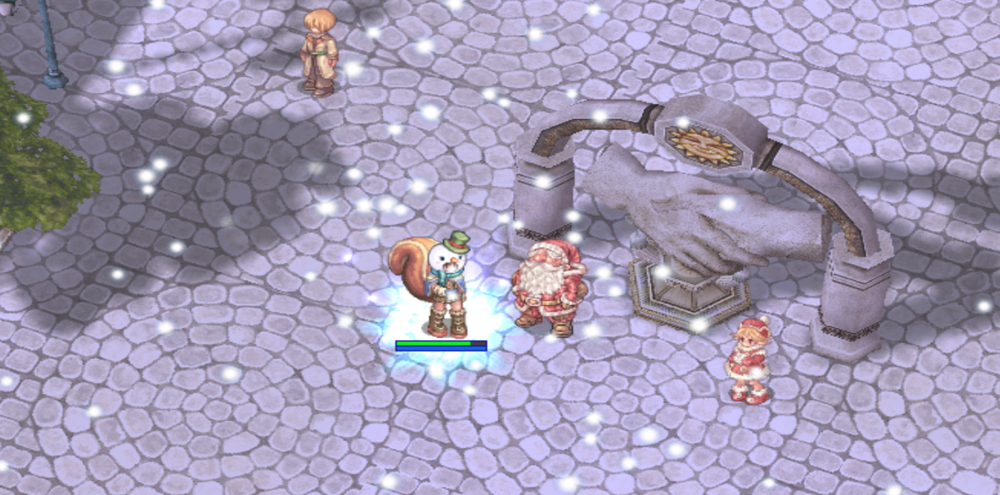

# 🎄 **Patch Notes - December 24, 2024**

---

## 🎁 **Holiday Event is Now Live!**

- NPC locations are at the **arch in Northern Prontera**, offering a variety of redeemable items through the **barter NPC** in conjunction with a **card game**!
- **Cookies** drop from all mobs, with a few exceptions.
- **Snow Crystals** drop from event mobs, which are now added to **Winter areas**, including:
  - **Christmas Jakk**
  - **Christmas Cookie**
  - **Christmas Goblin**
  - **Antonio**
- The **Santa Suit** sprite script is now removable upon **Death/Dispell** and no longer provides a **move speed bonus**.

---

## ⚔️ **Battlegrounds**

- Fixed reward tier system to yield ample badges for **win/loss/draw** outcomes within time frames.
- **Asura Strike** no longer deals full damage to the Emperium in **Rush Mode**.
- Resolved an intermittent issue that visually displayed **2x Emperiums** in **Rush Mode**.
- **Magic Classes** can no longer damage their own team's Emperium while in possession.
- Players who die from their own reflect damage can now use the **heal/storage NPC** again.
- Fixed an issue where players were intermittently not assigned to teams in multiple modes.

---

## 🔥 **Endless Cellar Adjustments**

- Members can now freely leave and re-join their party from **Levels 1-76**.
- Changed weekly cooldown to **6 days, 16 hours**, allowing teams to maintain a consistent schedule.
- Removed global **MVP kill announcements** from Endless Cellar.
- **Party re-entry restricted to Level 77**:
  - Only original party members who joined at the beginning can re-enter during the cooldown.
  - Ensure the entire party enters via the party leader at the dungeon start to avoid access issues.

---

## 🗼 **Endless Tower Updates**

- **Level skip mechanic/NPC** is now removed (via Ashes of Darkness).
- Added **party follow mechanic** similar to Endless Cellar:
  - Original members can leave and re-join within the allotted **4-hour time limit**, allowing restocks and quick returns without manual climbing.
- Removed global **MVP kill announcements**.
- Re-entry restricted to original party members:
  - Ensure all members enter via the party leader at the start of the dungeon.

---

## 🏰 **Old Glast Heim Updates**

- Adjusted loot tables for all mobs to include a wider range of rewards.
- Increased slotting chance for Temporal Boots from **25% → 50%**.
- **Corrupted Soul MVP**:
  - Fixed stacking adds.
  - Reduced HP.
  - Adjusted **Teleport Mechanic** upon Rude Attacks.
- Disabled **Ice Wall skill** on both OGH Levels 1 and 2, aligning with other griefable MVP maps.
- Corrected Commander spawn behavior on Level 1.
- Reduced Maggot defense from **121 → 60**.

---

## 🎉 **Event Token NPC Exchange**

- Refreshed rewards for multiple **headgear and costume options**.

---

## 🌟 **Extended Class Changes**

- **Soul Linker** max job level extended to **70**.
  - HP/SP pools remain the same as Job 50.
- All **Soul Links** (Level 5) now last **10 minutes** (previously 5 minutes).

---

## 🔧 **Miscellaneous Changes**

- **#Main Chat** now has a **15-second delay** between messages to prevent spam.
- Items for extended class use are now restricted from **1-1 and 1-2 classes**, preparing for **Pre-Trans WoE**.
- **Mysterious Dyestuffs** added to the **Main Office Barter NPC**, allowing headgear dye customization (available in SW Prontera).
- **Leaf Cat Pet** now supports autofeed functionality.
- Removed constant slaves from **Wounded Morroc (G_MORROC_2)** spawns.
- **Bio 3 Level 99 Mini-bosses** are now griefable with the removal of the **@noks function** for these mob IDs.
- Leftover **Halloween event drops** removed from Niff mob loot tables.

---

## 🛍️ **New Cash Shop Costumes**

- A new fashion line of **18 costumes** is now available in the Cash Shop!
  - Don't forget to update your client to avoid errors.

---

## 🚀 **Coming Soon**

- **Horror Toy Factory** is nearing completion and will be released with the **New Year Patch**! ❤️
- **Pre-Transcendent WoE configuration settings** are in the final stages, ensuring a fair and competitive old-school battle experience.
