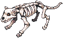
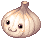
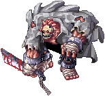
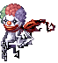
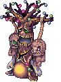

# Halloween Event 2025

**Level Required:** 50+
**Location:** Niflheim

!!! note "Event Balancing"
    Event rewards, drop rates, and difficulty may be adjusted during the event based on server statistics and
    player feedback to ensure the best experience for everyone.

---

## Getting There

!!! info "Free Warps Available"
    **Lude NPCs** in major towns offer **free warps** to Niflheim!

**Warp NPC Locations:** `/navi prontera 147/171`, Geffen, Payon, Morocc, Alberta, Aldebaran

---

## Main Quest

Talk to **Grave-Herald** `/navi niflheim 288/269` to start.

**Step 1:** Hunt in Fields (nif_fild01/02)

- 60 Garling
- 20 Skelion

**Step 2:** Hunt in Dungeon F1

- 30 Ghost Cube
- 20 Gan Ceann
- 15 Brutal Murderer

**Rewards:** 90 Halloween Coins, 35 Deviling Coins, EXP

!!! info "Quest Limit"
    One per account

---

## Daily Quests

Talk to **Event Wizard** `/navi nif_fild01 233/227` after completing main quest.

- 4 quests per day | Hunt 30 random monsters | Choose Normal or Hard mode

**Normal Mode (Lv 70-90)** - Fields/Dungeon F1 monsters - Rewards: 35-49 Halloween Coins, 15-22 Deviling Coins, 12-19 Black Soul

**Hard Mode (Lv 95+)** - Dungeon F2 only (25k zeny entrance) - Rewards: 50-70 Halloween Coins, 25-35 Deviling Coins, 18-28 Black Soul - Very strong! Bring a party!

---

## Hunting Spots & Monsters

### Fields (nif_fild01/02)
**Spawns:** ~40-50 per field

 **Skelion** (Lv 82, ~10/field) - Drops:  Skelion Bone Fragment,  Captured Soul,  Pumpkin Cake,  Halloween Coin

 **Garling** (~30-40/field) - Drops:  White Thin Stem,  Pumpkin Decor,  Cookie Bat,  Halloween Coin

### Dungeon F1 (nif_dun01)
**Spawns:** ~60-70 total | **Entry:** Free

 **Ghost Cube** (~15-20) - Drops:  Black Soul,  Halloween Coin,  Deviling Coin

 **Lude Gal** (~10-15) - Drops:  Pumpkin Cake,  Halloween Coin

 **Gan Ceann** (~8-12) - Drops:  Pumpkin Decor,  Halloween/ Deviling Coins

 **Brutal Murderer** (~5-8) - Drops:  Cookie Bat,  Halloween/ Deviling Coins

### Dungeon F2 (nif_dun02)
**Spawns:** ~80-100 + Boss Zones | **Entry:** 25k Zeny from F1 | **Warning:** Lv 108-115! Party recommended!

 **Disguiser** (Lv 108+, ~20-25) - Drops:  Black Soul,  Halloween/ Deviling Coins

 **Blue Moon** (Lv 110+, ~15-20) - Drops:  Transform Candy (Blue),  Halloween/ Deviling Coins

 **Grote** (Lv 112+, ~12-18) - Drops:  Pumpkin Cake,  Halloween/ Deviling Coins

 **Pierrotzoist** (Lv 115+, ~10-15) - Drops:  Black Soul,  Transform Candy (Red),  Halloween/ Deviling Coins

---

## Scatelon Pet Quest

!!! tip "Legendary Pet Available"
    Talk to **Old Sage of Bones** `/navi alberta 218/30` for the exclusive Scatelon pet!

**Required:** 120  Skelion Bone Fragment, 300  Halloween Coins, 100  Deviling Coins, 250  Black Soul, 25  Captured Soul, 200  Pumpkin Cake, 500k Zeny

!!! info "Quest Limit"
    One per account only!

---

## Costume Shop

!!! note "Exclusive Halloween Costumes"
    **Costume Crafter** `/navi niflheim 180/202` - 13+ unique Halloween costumes!

**Crafting:**  Halloween Coins +  Deviling Coins + monster drops | 3 tiers: Budget (65-95 coins), Normal (110-160 coins), Premium (180-200 coins)

---

## Halloween Gacha Machine

!!! warning "Try Your Luck!"
    Spin for exclusive rewards! Server-wide announcements for jackpots and ultra-rare drops!

**Locations:** `/navi niflheim 213/187`, `/navi prontera 218/195`, `/navi alberta 130/60`

**Cost:** 5  Deviling Coins + 5  Halloween Coins + 100k Zeny

**Rewards:** Ultra Rare (Old Card Album, Accessory Box), Very Rare (Battle Manuals, Kafra Cards, Enriched Ores), Rare (Siegfried Tokens, Convex Mirrors, Buffs), Common (Poring Coins, Potions, Event materials), **JACKPOT (0.05%):** 1000 Poring Coins!

---

## Key NPCs

| NPC | Location | Purpose |
|-----|----------|---------|
| Grave-Herald | `/navi niflheim 288/269` | Main Quest |
| Event Wizard | `/navi nif_fild01 233/227` | Daily Quests |
| Old Sage | `/navi alberta 218/30` | Scatelon Pet |
| Costume Crafter | `/navi niflheim 180/202` | Costumes |
| Gacha Machines | `/navi niflheim 213/187`, `/navi prontera 218/195`, `/navi alberta 130/60` | Gacha Spins |

---

**Happy Halloween!** 🎃
