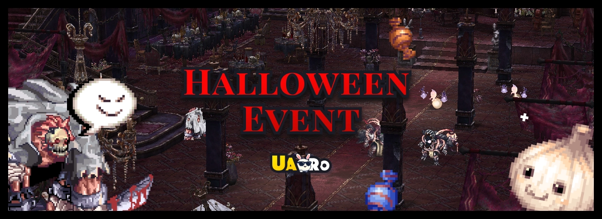
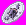
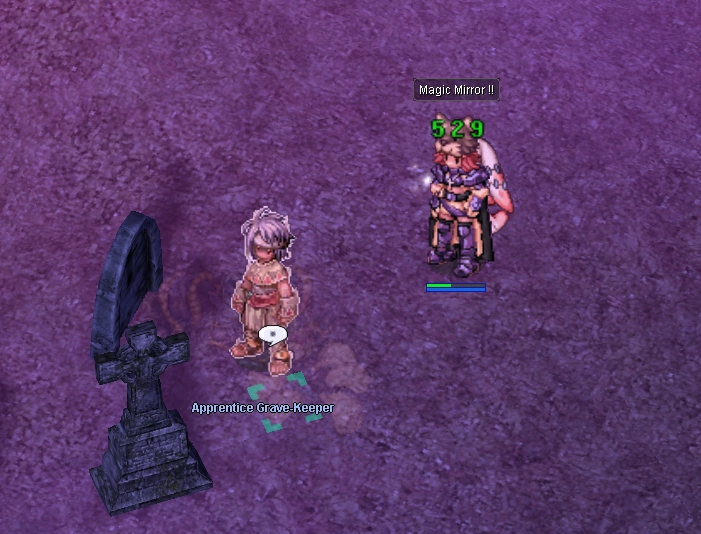
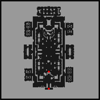
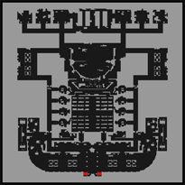
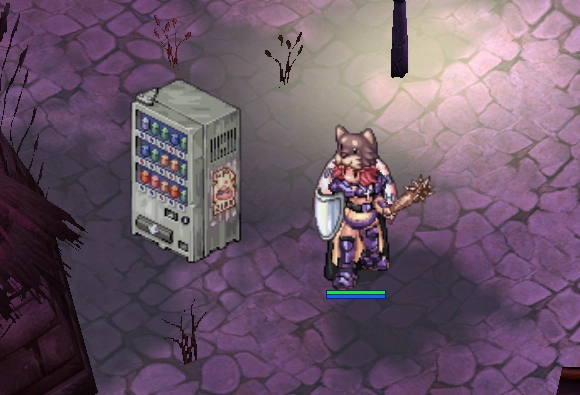

# Halloween Event 2025

**Event Date:** End of November
**Level Required:** 70+
**Location:** Niflheim

---

## Getting There

!!! info "Free Warps Available"
    **Lude NPCs** in major towns offer **free warps** to Niflheim!

**Warp NPC Locations:** `/navi prontera 147/171`, Geffen, Payon, Morocc, Alberta, Aldebaran

---

## Main Quest

Talk to **Grave-Herald** `/navi niflheim 288/269` to start.

**Step 1:** Hunt in Fields (nif_fild01/02)

- 60 Garling
- 20 Skelion

**Step 2:** Hunt in Dungeon F1

- 30 Ghost Cube
- 20 Gan Ceann
- 15 Brutal Murderer

**Rewards:** 90 Halloween Coins, 35 Deviling Coins, EXP

!!! info "Quest Limit"
    One per account

---

## Daily Quests

Talk to **Event Wizard** `/navi nif_fild01 233/227` after completing main quest.

- 4 quests per day
- Hunt 30 random monsters each
- Choose Normal or Hard mode

### Normal Mode (Lv 70-90)

- **Hunting Zones:** Fields (nif_fild01/02) or Dungeon F1
- **Rewards:**
    - 35-49 { width="20" } Halloween Coins
    - 15-22 { width="20" } Deviling Coins
    - 12-19 { width="20" } Black Soul

### Hard Mode (Lv 95+)

- **Hunting Zones:** Dungeon F2 only
- **Entry Cost:** 25k Zeny
- **Rewards:**
    - 50-70 { width="20" } Halloween Coins
    - 25-35 { width="20" } Deviling Coins
    - 18-28 { width="20" } Black Soul

!!! danger "Very Strong Monsters!"
    Party recommended for Hard Mode!

---

## Hunting Spots & Monsters

### Fields (nif_fild01/02)

**Spawns:** ~40-50 per field

| Monster | Level | Spawn Count | Drops |
|---------|-------|-------------|-------|
| { width="60" } **Skelion** | Lv 82 | ~10/field | { width="20" } Skelion Bone Fragment { width="20" } Captured Soul { width="20" } Pumpkin Cake { width="20" } Halloween Coin |
| { width="60" } **Garling** | - | ~30-40/field | { width="20" } White Thin Stem { width="20" } Pumpkin Decor { width="20" } Cookie Bat { width="20" } Halloween Coin |

### Dungeon F1 (nif_dun01)

**Spawns:** ~60-70 total | **Entry:** Free

| Monster | Level | Spawn Count | Drops |
|---------|-------|-------------|-------|
| { width="60" } **Ghost Cube** | - | ~15-20 | { width="20" } Black Soul { width="20" } Halloween Coin { width="20" } Deviling Coin |
| { width="60" } **Lude Gal** | - | ~10-15 | { width="20" } Pumpkin Cake { width="20" } Halloween Coin |
| { width="60" } **Gan Ceann** | - | ~8-12 | { width="20" } Pumpkin Decor { width="20" } Halloween Coin { width="20" } Deviling Coin |
| { width="60" } **Brutal Murderer** | - | ~5-8 | { width="20" } Cookie Bat { width="20" } Halloween Coin { width="20" } Deviling Coin |

### Dungeon F2 (nif_dun02)

**Spawns:** ~80-100 + Boss Zones | **Entry:** 25k Zeny from F1

!!! warning "High Level Content"
    Level 108-115 monsters! Party recommended!

| Monster | Level | Spawn Count | Drops |
|---------|-------|-------------|-------|
| { width="60" } **Disguiser** | Lv 108+ | ~20-25 | { width="20" } Black Soul { width="20" } Halloween Coin { width="20" } Deviling Coin |
| { width="60" } **Blue Moon** | Lv 110+ | ~15-20 | { width="20" } Transform Candy (Blue) { width="20" } Halloween Coin { width="20" } Deviling Coin |
| { width="60" } **Grote** | Lv 112+ | ~12-18 | { width="20" } Pumpkin Cake { width="20" } Halloween Coin { width="20" } Deviling Coin |
| { width="60" } **Pierrotzoist** | Lv 115+ | ~10-15 | { width="20" } Black Soul { width="20" } Transform Candy (Red) { width="20" } Halloween Coin { width="20" } Deviling Coin |

---

## Scatelon Pet Quest

!!! tip "Legendary Pet Available"
    Talk to **Old Sage of Bones** `/navi alberta 218/30` for the exclusive Scatelon pet!

**Required Materials:**

- 120 { width="20" } Skelion Bone Fragment
- 300 { width="20" } Halloween Coins
- 100 { width="20" } Deviling Coins
- 250 { width="20" } Black Soul
- 25 { width="20" } Captured Soul
- 200 { width="20" } Pumpkin Cake
- 500k Zeny

!!! info "Quest Limit"
    One per account only!

---

## Costume Shop

!!! note "Exclusive Halloween Costumes"
    **Costume Crafter** `/navi niflheim 180/202` - 13+ unique Halloween costumes!

**Crafting Materials:**

- { width="20" } Halloween Coins
- { width="20" } Deviling Coins
- Monster drops

**Cost Tiers:**

- **Budget:** 65-95 coins
- **Normal:** 110-160 coins
- **Premium:** 180-200 coins

---

## Halloween Gacha Machine

!!! warning "Try Your Luck!"
    Spin for exclusive rewards! Server-wide announcements for jackpots and ultra-rare drops!

**Locations:** `/navi niflheim 213/187`, `/navi prontera 218/195`, `/navi alberta 130/60`

**Cost per Spin:**

- 5 { width="20" } Deviling Coins
- 5 { width="20" } Halloween Coins
- 100k Zeny

**Reward Tiers:**

- **Ultra Rare:** Old Card Album, Accessory Box
- **Very Rare:** Battle Manuals, Kafra Cards, Enriched Ores
- **Rare:** Siegfried Tokens, Convex Mirrors, Buffs
- **Common:** Poring Coins, Potions, Event materials
- **JACKPOT (0.05%):** 1000 Poring Coins!

---

## Key NPCs

| NPC | Location | Purpose |
|-----|----------|---------|
| Grave-Herald | `/navi niflheim 288/269` | Main Quest |
| Event Wizard | `/navi nif_fild01 233/227` | Daily Quests |
| Old Sage | `/navi alberta 218/30` | Scatelon Pet |
| Costume Crafter | `/navi niflheim 180/202` | Costumes |
| Gacha Machines | `/navi niflheim 213/187`, `/navi prontera 218/195`, `/navi alberta 130/60` | Gacha Spins |

---

**Happy Halloween!** 🎃
