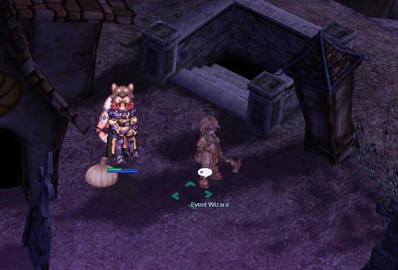
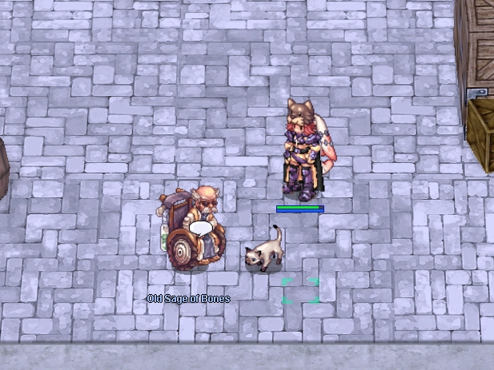
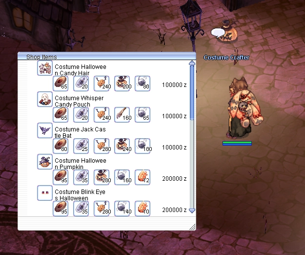

# Halloween Event 2025

**Level Required:** 50+
**Location:** Niflheim

!!! note "Event Balancing"
    Event rewards, drop rates, and difficulty may be adjusted during the event based on server statistics and
    player feedback to ensure the best experience for everyone.

---

## Getting There

!!! info "Free Warps Available"
    **Lude NPCs** in major towns offer **free warps** to Niflheim!

**Warp NPC Locations:**

- Prontera (147, 171)
- Geffen, Payon, Morocc, Alberta, Aldebaran

---

## Main Quest

Talk to **Grave-Herald** in Niflheim town to start.

**Step 1:** Hunt in Fields (nif_fild01/02)

- 60 Garling
- 20 Skelion

**Step 2:** Hunt in Dungeon F1

- 20 Ghost Cube
- 20 Lude Gal
- 15 Gan Ceann
- 15 Brutal Murderer

**Rewards:** 90 Halloween Coins, 35 Deviling Coins, EXP

!!! info "Quest Limit"
    One per account

---

## Daily Quests

After completing main quest, talk to **Event Wizard** at nif_fild01.

- 4 quests per day
- Hunt 30 random monsters
- Choose Normal or Hard mode

**Normal Mode (Lv 70-90)**

- Fields/Dungeon F1 monsters
- Rewards: 35-49 Halloween Coins

**Hard Mode (Lv 95+)**

- Dungeon F2 monsters only - Very strong! Bring a party!
- Rewards: 50-70 Halloween Coins
- F2 entrance costs 25,000 zeny

---

## Scatelon Pet Quest

!!! tip "Legendary Pet Available"
    Talk to the **Old Sage of Bones** in Alberta (218, 30) to obtain the exclusive Scatelon pet!

**Required Materials:**

- 120 Skelion Bone Fragment
- 300 Halloween Coins
- 100 Deviling Coins
- 250 Black Soul
- 25 Captured Soul
- 200 Pumpkin Cake
- 500,000 Zeny

**Reward:** Scatelon Pet Egg

!!! info "Quest Limit"
    One per account - This is an account-wide exclusive pet!

---

## Costume Shop

!!! note "Exclusive Halloween Costumes"
    Visit the **Costume Crafter** in Niflheim (180, 202) to craft 13+ unique Halloween costumes!

**Crafting Information:**

- Costs vary by costume rarity
- Requires: Halloween Coins + Deviling Coins + monster drops
- 3 difficulty tiers (Basic, Normal, Premium)

---

## Halloween Gacha Machine

!!! warning "Try Your Luck!"
    Spin the Halloween Gacha for a chance at exclusive rewards! Server-wide announcements for jackpots and
    ultra-rare drops!

**Gacha Machine Locations:**

- Niflheim (213, 187)
- Prontera (218, 195)
- Alberta (130, 60)

**Cost per Spin:**

- 5 Deviling Coins
- 5 Halloween Coins
- 100,000 Zeny

**Reward Tiers:**

- **Ultra Rare:** Old Card Album, Accessory Box
- **Very Rare:** Battle Manuals, Kafra Cards, Enriched Ores
- **Rare:** Siegfried Tokens, Convex Mirrors, Buffs
- **Common:** Poring Coins, Potions, Event materials
- **JACKPOT (0.05%):** 1000 Poring Coins!

---

## Key NPCs

| NPC | Location | Purpose |
|-----|----------|---------|
| Grave-Herald | Niflheim (288, 269) | Main Quest |
| Event Wizard | nif_fild01 (233, 227) | Daily Quests |
| Old Sage | Alberta (218, 30) | Scatelon Pet |
| Costume Crafter | Niflheim (180, 202) | Costume Shop |
| Gacha Machine | Niflheim (213, 187) | Gacha Rewards |
| Gacha Machine | Prontera (218, 195) | Gacha Rewards |
| Gacha Machine | Alberta (130, 60) | Gacha Rewards |

---

**Happy Halloween!** 🎃
