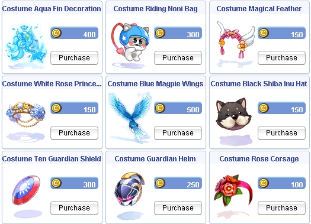

# Patch Notes - October 31, 2025

---

## 🎃 Halloween Event 2025 - Now Live!

!!! success "Event Now Active"
    The spooky season has arrived in Niflheim! Face terrifying challenges, collect exclusive rewards, and test your luck at the Halloween Gacha!

### Quick Overview

**Event Location:** Niflheim & Niflheim Dungeon
**Recommended Level:** 50+ (Main Quest), 70+ (Daily Quests), 90+ (Hard Mode)
**Event Duration:** Limited Time

**What's New:**
```
✨ New Halloween Dungeon Maps (F1 & F2)
🎰 Halloween Gacha Machine (Niflheim, Alberta, Prontera)
👻 13 New Event Monsters with unique drops
🎭 13 Exclusive Halloween Costumes (8 NEW 2025 designs!)
🎁 Main Quest, Daily Quests, and Special Side Quest
🐾 Legendary Scatelon Pet (Account-wide exclusive)
```

### Getting Started

1. **Travel to Niflheim**
   Talk to **Lude NPCs** in major cities (Prontera, Geffen, Payon, etc.) for free warp.

2. **Start the Main Quest**
   Find the **Grave-Herald** in Niflheim town (Level 50+ required).

3. **Complete Daily Quests**
   After finishing the main quest, visit the **Event Wizard** at nif_fild01 for repeatable daily hunts.

4. **Collect Event Currency**
   Hunt event monsters to obtain **Halloween Coins** and **Deviling Coins**.

5. **Visit the Event Shop**
   Craft exclusive costumes at the **Costume Crafter** in Niflheim.

### Event Highlights

!!! tip "Halloween Gacha Machine"
    Try your luck for rare rewards! Each spin costs **5 Deviling Coins + 5 Halloween Coins + 100k Zeny**.

    - 28 unique rewards (Ultra Rare to Common tiers)
    - **0.3% Jackpot chance** for full refund!
    - Server-wide announcements for ultra-rare drops

!!! info "Costume Shop"
    **13 Halloween Costumes** available in 3 difficulty tiers:

    - **Priority 1 (Basic):** Field farming - 3 costumes
    - **Priority 2 (Normal):** Field + F1 dungeon - 4 costumes
    - **Priority 3 (Premium):** F2 endgame content - 6 costumes

!!! warning "Event Exclusive Materials"
    All event materials are obtained exclusively from Halloween mobs. Stock up while the event is active!

### Need More Information?

📖 **[Read the Full Halloween Event Guide](halloween2025.md)**

For detailed information about:

- Complete monster drop tables
- Optimal farming routes
- Quest walkthroughs and strategies
- Costume crafting requirements
- Gacha rewards and probabilities
- Tips and tricks

---

---

## 🎮 Gameplay

### Instance Improvements

- **ET/EC Instance Refactor**
  Improved party readiness system for Endless Tower and Endless Cellar:
  ```
  - Only party leader can initiate instance entry
  - All members must type !ready within 60 seconds
  - Instance begins only when all members are ready
  - Disconnected players can rejoin and ready up
  - Automatic party return to save point if readiness fails
  - Safeguards and cooldowns remain unchanged
  ```

### Duel System Returns

- **@duel Command Overhaul**
  The duel system has been completely refactored with QoL improvements:

  **Features:**
  ```
  - Restricted to towns (leaving town ends duel)
  - Target cursor selection (no name typing)
  - Use @duel and target another player to invite
  - Invited player must @duel and target you to accept
  - Automatic debuff removal when leaving duel
  ```

  **Damage Modes:**

  | Command | Mode | Description |
  |---------|------|-------------|
  | `@duel` | Normal | Standard damage calculations |
  | `@duel bg` | Battleground | BG damage mode |
  | `@duel gvg` | GvG | Guild vs Guild damage mode |
  | `@duel leave` | Exit | Withdraw from duel (both players removed) |

!!! note "Duel Mechanics"
    The duel will follow the inviter's selected damage mode. Both players are automatically removed when one leaves.

### Card Drop System

- **Card Drop Announcements**
  Improved card drop messaging:
  ```
  - Shortened announcement text to prevent two-line spillage
  - Filtered through "Public" chat tab only
  - Prevents announcement duplication in separate chat tabs
  ```

### Storage Improvements

- **Extended Stack Capacity**
  Storage now accepts and creates new stacks for items exceeding 30,000 quantity limit.

---

## 🛡️ Skills & Combat

### Super Novice Overhaul

!!! success "Major Rebalancing"
    Super Novice has received significant changes to improve viability and gameplay experience.

**New Equipment Access:**
```
- Gentle Heart
- Wounded Heart
- Orlean's Glove
- Linen Glove
- Valkyrie Knife (new addition to Expanded Weapon NPC)
```

**Skill Changes:**

**Removed Skills:**
```
- Inc Agi
- Blessing
- Enlarge Weight Limit
- Identify
- Transcendence
- Owl's Eye
```

**New Platinum Skills:**
- **Angel, Help Me** (retrieved from NPC)
- **Breakthrough** (combines Breakthrough + Transcendence)
  - Max level: 5 → 1
  - Stats: ATK +50, MATK +50, Max HP +2000, Max SP +200, Healing +20%
- **Super Blessing** (NEW)
  - Grants Inc Agi and Blessing status
  - Does not stack with other Inc Agi/Blessing skills or scrolls

**Stat Adjustments:**
```
- Base max weight increased by 2000
- Job levels 1-50 grant +10 additional DEX total
```

**Doridori Enhancement:**
```
- Now affects HP regeneration in addition to SP
- Grants status icon when active
- Force-ends when standing up
```

!!! info "Skill Reset"
    All Super Novice characters received a free skill reset to restructure points after the update.

### Assassin Changes

- **Create Elemental Deadly Poison (Create EDP)**
  SP cost reduced: **50 → 10**

### Reflect Damage Adjustments

- **Boss Monster Immunity**
  ```
  - Reflect damage no longer affects Boss-type monsters (MVPs)
  - Eske no longer affects Boss-type monsters
  ```

!!! warning "PvP Impact"
    This change only affects Boss monsters. Player vs Player reflect mechanics remain unchanged.

### Skill Improvements

- **Storm Gust Persistence**
  Storm Gust now carries through its mechanics when touching Land Protector, maintaining its effect instead of immediately dissipating.

- **Magnum Break Status Icon**
  Added status icon for active Magnum Break fire damage increase.

---

## 🎒 Items

### New Items

- **Defense Stone (Mid-tier)**
  New mid-tier defense item added to Halloween event drops.

- **New Healing Items**
  Additional healing items integrated into Halloween event reward tables.

### Item Protection

- **Expanded Token Fragment**
  Enabled Expanded Token Fragment for buystore purposes (can now be bought/sold in personal shops).

### Refining System

- **Universal Refiner Interface**
  All refiners now offer interface selection:

  === "Pre-Renewal Interface"

      ```
      - Classic interface with bulk refine options
      - Gear must be equipped to utilize
      - Ideal for bulk armor refines
      - Same success/fail rates (RateMyServer standards)
      ```

  === "Renewal Interface"

      ```
      - Visual success rate display
      - Catalyst selection (Enriched ores, etc.)
      - Singular refines with animation
      - No equipment requirement
      - Same success/fail rates (RateMyServer standards)
      ```

!!! note "Rate Consistency"
    All refinement success/fail rates remain identical across both interfaces and follow RateMyServer standards.

---

## 🏪 NPC Changes

### Vending Restrictions

- **Ayothaya Vending**
  Limited vending options added around central Ayothaya (specific spots designated).

### NPC Relocations

- **Multiple NPC Updates**
  Various NPC repositioning for improved accessibility and reduced crowding.

### WoE Costume Restrictions

- **Halloween Costumes**
  Halloween-themed costumes are now restricted in GvG/WoE maps to maintain visual clarity during combat.

---

## ⚙️ Quality of Life

### Client Settings

- **Day/Night Cycle Control**
  New client-side option for time of day settings:

  | Option | Description |
  |--------|-------------|
  | **World Cycle** | Follow server day/night cycle |
  | **Permanent Night** | Always display night mode |
  | **Permanent Day** | Always display day mode |

### @restock Overhaul

- **@restock Refactored**
  Complete rewrite to function similar to @lootconfig:
  ```
  - Create up to 20 different restock lists
  - Add/delete/rename lists easily
  - Improved management interface
  - Auto-migration from old system
  ```

### Guild System

- **Guild Bank Logs**
  Added ability to filter guild logs by specific Item ID for improved tracking and auditing.

---

## 🎪 Events

### King of Emperium

- **New Event System**
  King of Emperium event system implemented:
  ```
  - Dedicated event map
  - Updated mechanics and announcements
  - Cleanup and optimization
  - Main event logic finalized
  ```

### Dice Event

- **Dice Event Enhanced**
  ```
  - Added 3-minute announcement before event start
  - Improved player notification system
  ```

### Disguise Event

- **Event Refactor**
  Complete disguise event refactoring for improved performance and reliability.

---

## 🐾 Homunculus

### Homunculus Updates

!!! info "AFK Protection"
    Homunculus owners will no longer receive rewards while idle to prevent AFK farming.

**Changes:**
```
- Autofeed now enabled for all homunculi
- Owner EXP / Homunculus EXP / Monster loot yield disabled when owner is AFK (60 seconds idle)
- No exp and loot yield if homunculus master is idle when mob is killed by homunculus
```

---

## 🛠️ Fixes

### Combat Fixes

- **Training Dummy**
  Training dummies can no longer be warped or teleported.

- **Ghost Effect**
  Fixed and added ghost visual effect for specific skills/items.

- **Firewall Scrolls**
  Reverted Fire Wall scroll consumption timing to `delayconsume` mechanic.

### System Fixes

- **KS Protection**
  ```
  - Added null checks for KS (Kill Steal) protection
  - Fixed IgnoreNoKS flagged mobs and @noks interaction
  ```

- **Guild Log Fixes**
  Fixed guild logs getting stuck on certain operations.

- **Impersonation Block**
  Added and optimized impersonation blocking system to prevent character name spoofing.

### Item Fixes

- **Angelic Ring**
  Fixed issues with Angelic Ring equipment functionality.

- **Rental Item ID**
  Fixed rental item ID conflicts.

- **Safe Item Protection**
  Added safe item check for Color Wing boxes to prevent accidental loss.

### Announcement Fixes

- **Package Announce**
  Fixed package announcement formatting and display issues.

- **Dynamic Drop Announce**
  Improved dynamic drop announcement system for better player notification.

### Event Fixes

- **Random Map Bonus**
  Fixed issue where last map indices don't get cleared properly in random map bonus system.

- **Endless Tower**
  Removed useless announcements from Endless Tower to reduce chat spam.

---

## 📦 Database Changes

### Cash Shop Updates

- **Item Removals:**
  ```
  - Protect Cloth removed from Hunting Mission rewards
  - Protect Cloth removed from Cash Shop
  ```

- **Item Additions:**
  ```
  - Scorpion King Card added to OCA pool
  - Multiple new costume items added
  ```

### New Cash Shop Costumes

!!! info "New Costumes Available"
    Fresh costume designs have been added to the Cash Shop! Check out the latest fashion items to customize
    your character's appearance.

**Featured Costumes:**




- Wide variety of new costume options available

Visit the Cash Shop in-game to browse the complete collection!
