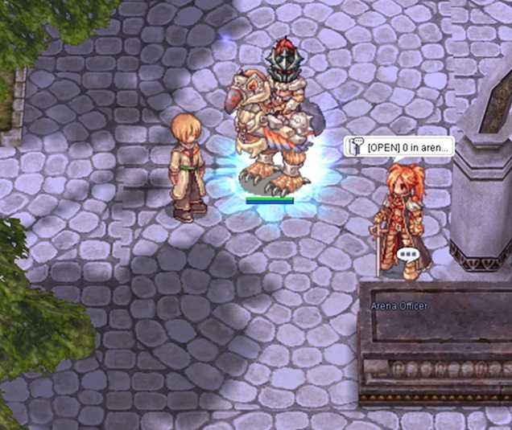
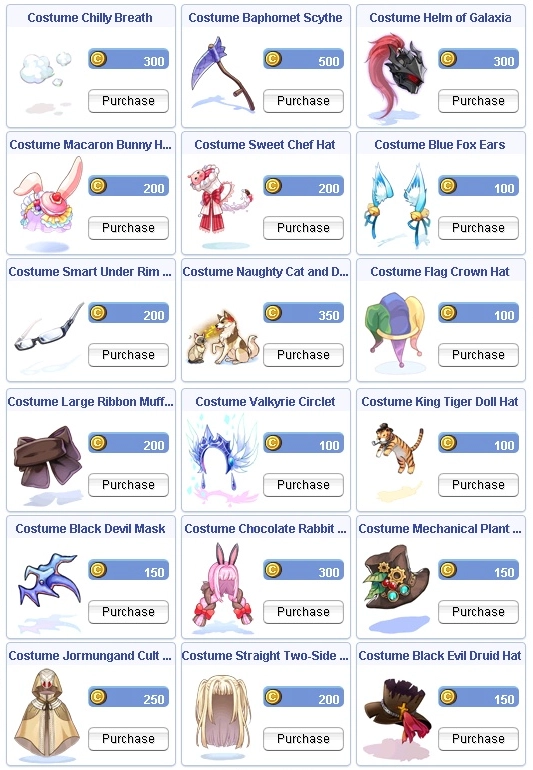

# Patch Notes - March 3, 2026

---

## 🎮 Gameplay

### PvP Deathmatch

!!! success "New PvP Deathmatch Arena"
    Scheduled free-for-all PvP deathmatch. No items, no potions, pure skill.
    Runs `4x` daily, `45` minutes each. Players earn Arena Coins for kills.

- **NPC Location:** Arena Officer `150,288` — Join arena, view rules.
- **Available commands:** `@pvparena` and `@arenarank`

**Rules:**

| Rule | Detail |
|------|--------|
| **Level required** | `80+` |
| **Level gap** | `+/-15` levels for points (kills outside = no points) |
| **Kill cooldown** | `60` sec per same target |
| **Same victim cap** | `3` scoring kills per target per session |
| **Party kills** | No points |
| **Logout in arena** | Counts as death + `30s` re-entry delay |
| **Death penalty** | `-3` points per death |
| **Re-entry delay** | `30` seconds after dying |

**Scoring:**

| Type | Value |
|------|-------|
| **Base** | `10` points per kill |
| **Level mod** | `+1%` per level victim is above killer (capped `70%-130%`) |
| **Death** | `-3` points |

**Rewards:**

| Detail | Value |
|--------|-------|
| **Currency** | Arena Coin (item ID `52291`) |
| **Earn rate** | `1` coin per `10` points |
| **Minimum** | `1` coin for participating (if score > `0`) |
| **Winner bonus** | `+5` extra coins |
| **Delivery** | Sent via RODEX mail after session ends |

!!! warning "Trial Mode"
    PvP arena deathmatch is currently running in trial mode. The Arena Coin Shop is
    disabled for now. We want to make sure the feature works properly and cannot be abused
    before releasing the shop. You are free to collect and store coins, but there is no
    guarantee they will remain — we may reset all coins before the official shop release.
    We're waiting for your feedback and suggestions regarding this feature.

---

| Change | Description |
|--------|-------------|
| **Performer Mute Option** | Added client side option to mute performer songs |

| Change | Description |
|--------|-------------|
| **Cooking Mastery** | Added `@cooking` command to view cooking mastery exp |
| **@clearroom Command** | No exp or loot will be granted when clearing. Confirmation message occurs to ensure this action |
| **Thanatos MVP** | Now properly announces globally |
| **Soul Link Status** | Status icon now properly displays remaining time when hovering mouse cursor over status icon |

### Star Gladiator Soul Link

- Star Gladiator soul link now has a standalone status icon that isn't shared and removed when miracle is active
- When miracle occurs, the character's appearance is no longer blue like soul link status
- New visual effect surrounds Star Gladiator with miracle active in its place

---

## ⌨️ Commands

| Command | Description |
|---------|-------------|
| **@mi** | Using `@mi` without a number variable will display the most previously killed monster's info |
| **@nokscheck** | Can be used by anyone within the party. Displays a list of players within the party and their current `@noks` setting |
| **@autoloot** | `@lootconfig` is now `@autoloot`. Same functionality and tables (pre-existing loot lists untouched). `autoloot` with a number variable will change your overall loot % (also syncs within the menu option for "Main Autoloot" and vice versa) |

---

## 🛠️ Fixes

| Fix | Description |
|-----|-------------|
| **Bubble Gum** | Fixed original Hercules Bubble Gum script using +200% (300% total) drop rate instead of the intended +100% (200% total). This corrects the drop rate to properly double as intended |
| **Client Side Settings** | Client side settings such as hotbar location + information now properly store serverside |
| **Autobonus Refine Variables** | Fixed an issue with refine variables on autobonus scripts not properly triggering (ex. Shield of Naga) |
| **Smokie Pet Autofeed** | Added autofeed option client side for Smokie pet to reflect properly |
| **Job EXP Manuals** | Fixed job exp portion in manuals to reflect properly |

### Rodex Fixes

- Fixed issue causing client disconnections when changing client side option for rodex

- Fixed multiple rodex issues:
    - Issues dealing with sending pet eggs that are stored back to egg while rodex interface is open,
      causing items to flag and mail to not show up
    - Fail safe check on users retrieving item attachments in conjunction with packet loss and losing
      some/all items

### Party Kick with Buffs

- Party leaders can now kick members that have buff identifiers within their name in party menu list
- Members with buffs will still be required to leave party via the menu icon if buff modifier
  identifiers are active or use `/leave`

---

## 🏪 NPC

### Build Manager NPC

!!! success "New Build Manager NPC"
    Save and load pre-determined stat/skill builds! Conveniently located next to the reset NPC
    in the Main Office.

| Feature | Description |
|---------|-------------|
| **Save Builds** | Save up to 10 Skill and Stat builds per character |
| **Custom Tabs** | Ability to name your tabs and delete if no longer needed |
| **Location** | Next to reset NPC in Main Office |

| Functionality / Safeguards | Description |
|-----------------------------|-------------|
| **Skill Build Class Check** | Skill build is deleted if the saved skill build is no longer the same class (Transcend/Upgraded job) |
| **Stat Build Level Check** | Stat build is hidden if the player is no longer the same or higher base level (will re-appear when level is reached) |

### Advanced Hunting Missions

Removed the following mobs from Advanced Hunting Missions:

!!! warning "Clear before patch or abandon and re-collect following patch"

- Grizzly
- Zhu Po Long
- Phendark
- Gazeti
- Gig
- Gremlin
- Hylozoist
- Joker

### Enriched Ore Refine UI

| Change | Description |
|--------|-------------|
| **Enriched Ore Safe Upgrades** | Removed renewal refine UI option for Enriched ores if safe upgrades |
| **HD Ori/Elu Option** | Also removed default HD Ori/Elu option that doesn't exist from default UI |

---

## ⚔️ Battlegrounds

| Change | Description |
|--------|-------------|
| **AFK Penalty** | Reduced from `20` to `15` minutes |
| **BG Box Checks** | Added weight/itemcount check on BG related boxes (food, EDP, AD bottles) |

---

## 🎒 Items

### New Priest Items

!!! info "Two New Priest Items Added"
    Old Mitra and Valkyrie Drop have been added to the game!

| Item | Drops From |
|------|------------|
| **Old Mitra** | Margaretha Sorin |
| **Valkyrie Drop** | High Priest Margaretha |

---

## 🛒 Cash Shop

### New Costumes

!!! tip "New Costumes Available!"
    A new set of costumes has been added to the Cash Shop and is available for purchase
    with Cash Points.

---

## 🌟 **We Need Your Support!**

We kindly ask everyone to take **`5 minutes`** to leave a review for our server on **RMS**! Your feedback is
crucial to helping us reclaim the **top spot** and showing why we're the **best server in the world**.

Leave your review here: [Rate our server on RMS!](https://ratemyserver.net/index.php?page=detailedlistserver&serid=22102&itv=6&url_sname=UARO%20World%20of%20your%20dream)

---
