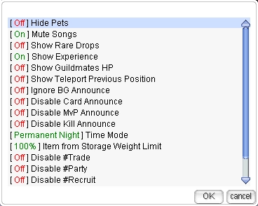
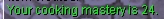
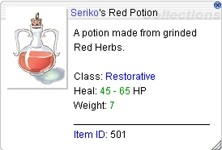
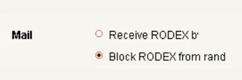
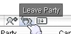
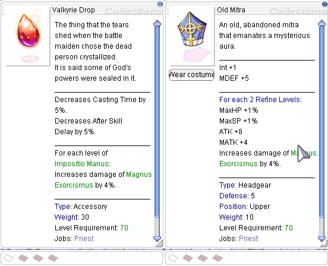

# Patch Notes - March 3, 2026

---

## 🎮 Gameplay

| Change | Description |
|--------|-------------|
| **Performer Mute Option** | Added client side option to mute performer songs |

| Change | Description |
|--------|-------------|
| **Cooking Mastery** | Added `@cooking` command to view cooking mastery exp |

| **@clearroom Command** | No exp or loot will be granted when clearing. Confirmation message occurs to ensure this action |
| **Thanatos MVP** | Now properly globally announce |
| **Soul Link Status** | Status icon now properly displays remaining time when hovering mouse cursor over status icon |

### User Tagged Items

- User tagged items fixed to reflect proper format on front end on all items:
    - Forged
    - Alchemy
    - Item Signer NPC

### Star Gladiator Soul Link

- Star Gladiator soul link now has a standalone status icon that isn't shared and removed when miracle is active
- When miracle occurs, the character's appearance is no longer blue like soul link status
- New visual effect surrounds Star Gladiator with miracle active in its place

---

## 🛠️ Fixes

| Fix | Description |
|-----|-------------|
| **Autobonus Refine Variables** | Fixed an issue with refine variables on autobonus scripts not properly triggering (ex. Shield of Naga) |
| **Smokie Pet Autofeed** | Added autofeed option client side for Smokie pet to reflect properly |
| **Job EXP Manuals** | Fixed job exp portion in manuals to reflect properly |

### Rodex Fixes

- Fixed issue causing client disconnections when changing client side option for rodex

- Fixed multiple rodex issues:
    - Issues dealing with sending pet eggs that are stored back to egg while rodex interface is open,
      causing items to flag and mail to not show up
    - Fail safe check on users retrieving item attachments in conjunction with packet loss and losing
      some/all items

### Party Kick with Buffs

- Party leaders can now kick members that have buff identifiers within their name in party menu list
- Members with buffs will still be required to leave party via the menu icon if buff modifier
  identifiers are active or use `/leave`

---

## 🏪 NPC

### Build Manager NPC

!!! success "New Build Manager NPC"
    Save and load pre-determined stat/skill builds! Conveniently located next to the reset NPC
    in the Main Office.

| Feature | Description |
|---------|-------------|
| **Save Builds** | Save up to 10 Skill and Stat builds per character |
| **Custom Tabs** | Ability to name your tabs and delete if no longer needed |
| **Location** | Next to reset NPC in Main Office |

| Functionality / Safeguards | Description |
|-----------------------------|-------------|
| **Skill Build Class Check** | Skill build is deleted if the saved skill build is no longer the same class (Transcend/Upgraded job) |
| **Stat Build Level Check** | Stat build is hidden if the player is no longer the same or higher base level (will re-appear when level is reached) |

### Advanced Hunting Missions

Removed the following mobs from Advanced Hunting Missions:

!!! warning "Clear before patch or abandon and re-collect following patch"

- Grizzly
- Zhu Po Long
- Phendark
- Gazeti
- Gig
- Gremlin
- Hylozoist
- Joker

### Enriched Ore Refine UI

| Change | Description |
|--------|-------------|
| **Enriched Ore Safe Upgrades** | Removed renewal refine UI option for Enriched ores if safe upgrades |
| **HD Ori/Elu Option** | Also removed default HD Ori/Elu option that doesn't exist from default UI |

---

## ⚔️ Battlegrounds

| Change | Description |
|--------|-------------|
| **AFK Penalty** | Reduced from `20` to `15` minutes |
| **BG Box Checks** | Added weight/itemcount check on BG related boxes (food, EDP, AD bottles) |

---

## 🎒 Items

### New Priest Items

!!! info "Two New Priest Items Added"
    Old Mitra and Valkyrie Drop have been added to the game!

| Item | Drops From |
|------|------------|
| **Old Mitra** | Margaretha Sorin |
| **Valkyrie Drop** | High Priest Margaretha |

---

## 🛒 Cash Shop

### New Costumes

!!! tip "New Costumes Available!"
    A new set of costumes has been added to the Cash Shop and is available for purchase
    with Cash Points.

<!-- TODO: Add screenshot -->

---

## 🌟 **We Need Your Support!**

We kindly ask everyone to take **`5 minutes`** to leave a review for our server on **RMS**! Your feedback is
crucial to helping us reclaim the **top spot** and showing why we're the **best server in the world**.

Leave your review here: [Rate our server on RMS!](https://ratemyserver.net/index.php?page=detailedlistserver&serid=22102&itv=6&url_sname=UARO%20World%20of%20your%20dream)

---
