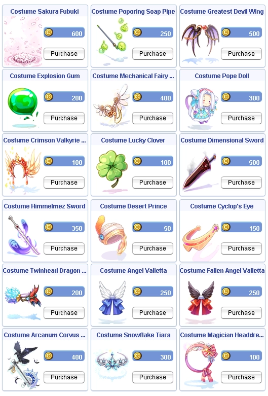

# Patch Notes - January 21, 2026

---

## 💻 New Client Release

!!! success "Major Client Update"
    The new client supports DirectX 9, enabling native GPU utilization for improved performance!

**Key Improvements:**

| Feature | Description |
|---------|-------------|
| **DirectX 9 Support** | Native GPU utilization (old DX7 client ran on CPU emulation on modern systems) |
| **Performance** | Reduced lag and graphic artifacts, better rendering, smoother gameplay |
| **High Resolution** | Native support for 1440p and above without requiring dgVoodoo2 wrapper |
| **Security** | Improved client security to reduce bot/macro/GRF modification abuse |
| **Patcher** | No longer flagged by antivirus software, ensuring you stay up to date |

!!! note "Important Notes"
    - Equipment property stats displayed are client-side defaults based on pre-renewal formulas. Modified items on
      UaRO may not currently display correct stats - a fix is in progress to cover all custom item variables.
    - The Roulette feature is currently locked and in testing stage, and will be released in upcoming updates.

We will be collecting data and feedback about the new client, so we may release some patches over the next few weeks.

---

## 🎮 Gameplay

### Vending System Overhaul

!!! info "Major Vending Changes"
    Dewata is now the main vending town with improved spot management!

**Dewata Vending Changes:**

| Feature | Description |
|---------|-------------|
| **Available Spots** | 2,610 usable spots map-wide with proper spacing |
| **Bulletin Boards** | Removed |
| **Vending Skill** | "Dewata only" - ports you to the closest available vend spot to your current position |
| **@market Command** | "Dewata only" - ports you to center of map for quick transport |
| **Vending Helper** | Now has "Find random vending spot" option (similar to old bulletin system) |
| **Prontera Warper** | Merged with Vending Helper NPC (Prontera return option included) |
| **Idle Timer** | If vend shop not set up within 5 minutes, player will be kicked |
| **Geffen Tower** | Entrance vend spot block cleaned up |

**Non-Dewata Town Vending:**

The following maps are the ONLY options to vend outside of Dewata:

- Payon
- Morocc
- Alberta
- Comodo
- Ayothaya

!!! warning "All other maps have been removed from vending"
    Utilize `@wb` and `@ws` interface for quick QoL vending as always!

### Party Egg Notifications

- All eggs obtained through party members on a successful capture will now trigger "party member obtains" item
  listed within text chat

### @noks Edits

- Aggro lock is now immediately released upon death of owning player

### New Command: @hideloot

!!! info "Hide Trash Loot"
    New command to reduce screen clutter!

| Setting | Description |
|---------|-------------|
| **Function** | Blocks display of trash loot on the ground |
| **Default** | Off upon each login (prevents people from forgetting) |

---

## 🏰 Instances/Dungeons

### Bio 3/4 MVP Changes

- Bio 3/4 MVP kills intermittently announcing globally upon kill - **Fixed**
- Static MVP spawn points for Bio 3/4 MVPs removed and now spawns randomly throughout their respective maps

### Wolfchev Laboratory Changes

!!! success "New Completion Reward!"
    Upon successful completion of the instance (after boss kill), exiting via NPC will award you with
    1 "Wolfchev Complete Box"!

**Wolfchev Complete Box Rewards:**

=== "Common"

    - Ghost Chill
    - Blood Thirst
    - Particle Box

=== "Rare"

    - Herald of GOD [1]
    - Giant Shield [1]
    - Ancient Dagger
    - Enriched Oridecon Box 5
    - Enriched Elunium Box 5
    - Ygnus Stale [1]
    - End Sektura [1]
    - Giant Axe [1]
    - Ragnarok Limited Ed
    - Alchemy Glove [1]
    - Dragon Manteau [1]
    - Chakram [2]
    - Kaiser Knuckle
    - Berserk [1]
    - Aztoe Nail
    - Scarletto Nail
    - Dragon Vest [1]
    - Mystic Bow
    - Oriental Lute [2]
    - Queens Whip [2]

=== "Very Rare"

    - Ragnarok Limited Ed [1]

!!! warning "Trade Restriction"
    100% trade restriction on box - must be opened by user.

---

## ⚔️ Battlegrounds

### Player Count Increase

| Setting | Before | After |
|---------|--------|-------|
| **Max Players** | 60 (30v30) | 80 (40v40) |

### Entry Requirements

- Pre-trans characters can no longer join battlegrounds (Extended/Trans only)

### Spawn Point Changes

- Added two spawn point variations to mitigate spawn camping

### BG Fixes

- Berserk skill status is dispelled upon end of BG mode, allowing immediate access to requeue using `@bg` queue

---

## 🛡️ Skills

### Create Skill QoL Improvements

!!! success "Mass Production Available!"
    Create Deadly Poison and Create Elemental Converter can now mass produce up to 300 at a time!

**Create Deadly Poison & Create Elemental Converter:**

| Feature | Description |
|---------|-------------|
| **HP Loss Mechanic** | Removed (no longer lose HP on failure) |
| **Mass Production** | Up to 300 at a time |
| **Calculation** | Calculates each singular craft but yields all successful at the same time |
| **Result Display** | Lists your success vs total attempts |
| **Material Cost** | Same variables as singular crafts |

### Quagmire Changes

- Now properly reflects pre-renewal behavior - no longer affects boss type monsters (any boss, not just MVPs)

### Autospell Changes

- When bolts are triggered, will cast max level learned up to level 5 (Non-Linked)

---

## 🏪 NPC

### Gem Converter

!!! info "System Reverted"
    Gem Converter reverted back to test script (Barter system weight calculations prevented large amount
    transfers).

**New System Features:**

| Feature | Description |
|---------|-------------|
| **Auto Detection** | Automatically detects gems on hand |
| **Conversion Options** | Convert single or max depending on auto-detected quantities |
| **Weight Restrictions** | Removed prior weight restrictions (will convert as many as you can hold) |

---

## 🐾 Homunculus Changes

### Lif Homunculus

!!! info "Skill Description Updated"
    Updated skill description to reflect after-cast delay timers.

**Mental Change Skill Timers:**

| Level | Duration | Cooldown |
|-------|----------|----------|
| **Level 1** | 1 minute | 5 minutes |
| **Level 2** | 3 minutes | 5 minutes |
| **Level 3** | 5 minutes | 5 minutes |

**Additional Changes:**

- Skill effects now carry through Fly Wing / Teleport throughout its duration
- Skill will remain uncastable and follow normal mechanics for HP/SP requirements, preventing abuse for
  auto-healing after every skill use

---

## 🏯 WoE

### Castle Rotation

- Both Trans and Pre-Trans WoE castles rotated
- Ownership and economy adjusted to match with correct variables

### Castle Ownership Rules

- If you possess an FE version of Saturday castles, upon breaking an SE castle you will automatically abandon
  your FE castles

---

## 🛠️ Fixes

| Fix | Description |
|-----|-------------|
| **Gym Pass** | Added coordinates for Gym Pass use in item description |
| **Skull Exchanger** | Added warp out function in center of map on Izlude PvP Arena |
| **Vicious Cookie Card** | Fixed script to reflect properly |
| **Pet Eggs in Search** | Fixed issue with pet eggs appearing while searching for card IDs on whobuy/sell |
| **Thorn Staff Combo** | Fixed combo issue with Thorn Staff of Darkness [1] and Skull Cap |
| **LK Visual Effect** | Added client-side option to turn off yellow effect for Concentration + Two-Hand Quicken |

---

## 🛒 Cash Shop

### New Costumes

!!! tip "New Costumes Available!"
    A new collection of Cash Shop costumes has been added!

### Accessory Costume Slot Repositioning

The following no-sprite, effect-only costumes have been repositioned to Accessory Costume Slot for costume setup
variation:

| Item ID | Costume Name |
|---------|--------------|
| 20285 | Costume Dancing Fallen Sakura |
| 20535 | Costume Digital Space |
| 20240 | Costume Gift of Snow |
| 20515 | Costume Magic Circle |
| 20522 | Costume Spiritual Blessings |
| 20548 | Costume Poring Aura |
| 31391 | Costume Floating Stone of Sage |
| 20439 | Costume New Year Shine |
| 400149 | Costume Black Thunder |
| 410231 | Costume Wonderland Tea Party |
| 480298 | Costume Wonderland Magic Circle |
| 410295 | Costume Winter Night Bell |
| 420242 | Costume Fluttering Haze |

---

## 🌐 Website Update

!!! info "Coming Soon"
    Our current priority is the website, which is going through the final development phase and will be released
    soon.

The new website will bring:

- Fresh new look
- Improved UX and UI
- WoE kill stats
- BG rankings
- And more!

---

## 🌟 **We Need Your Support!**

We kindly ask everyone to take **`5 minutes`** to leave a review for our server on **RMS**! Your feedback is
crucial to helping us reclaim the **top spot** and showing why we're the **best server in the world**.

Leave your review here: [Rate our server on RMS!](https://ratemyserver.net/index.php?page=detailedlistserver&serid=22102&itv=6&url_sname=UARO%20World%20of%20your%20dream)

---
