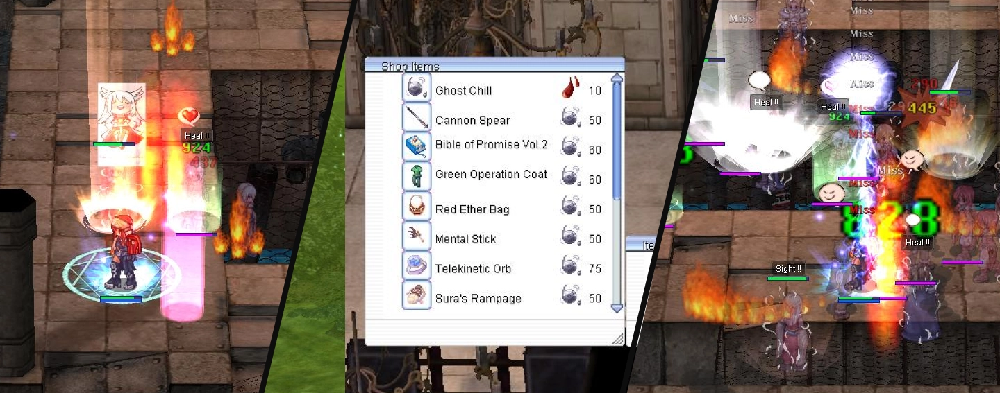
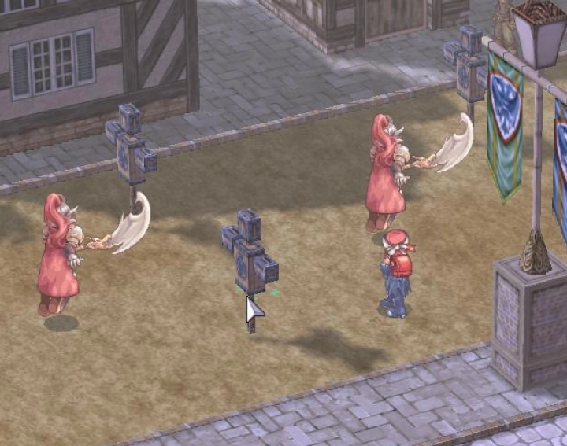
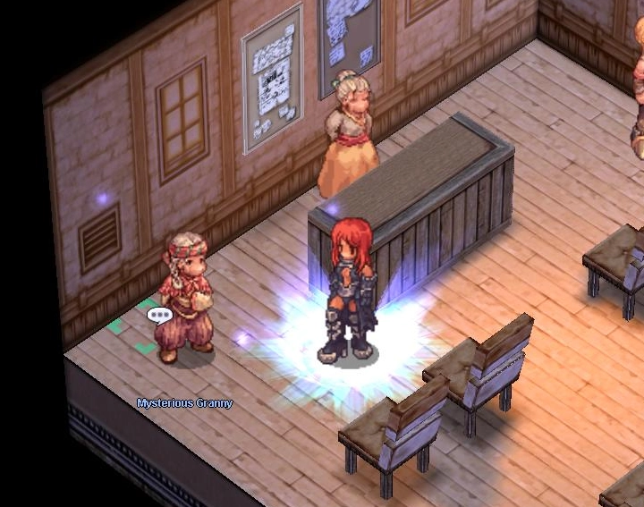

# 📅 Patch Notes – May 12, 2025

---

## 🔬 Biolab 4 Revamp

Biolab 4 monsters' skills and stats have been reviewed and improved.  
Monster drops have also been adjusted, with **a bunch of new items** to look into.

- Farming and leveling in `Biolab 4` will now be **more challenging**.
- You can now exchange `Blood Thirst` and `Chills of Death` for powerful equipment at `Biolab 1`.
- A slotted version of `RLE` can now be crafted.

---

## 🌀 Rotating Bonus EXP Areas

Introducing a **rotating bonus EXP area** that changes every `48–72 hours`.

- Selected areas receive a **20–30% EXP boost**.
- Use the command ``@mapexp`` to check current bonus EXP areas.

---

## ⚔️ New 6th BG Arena

A new `~8-minute` Battleground mode is now available:

- Each team spawns in separate rooms.
- An `MVP` spawns at the start and changes **race/element every 2 minutes** (up to Stage 3).
- Includes **pre-stage announcements** and a **20-second prep timer**.
- Player damage increases by `20%` at Stage 2 and `40%` at Stage 3.
- The team that deals the **highest total damage** to the MVP wins.

---

## 🎯 Target Dummy

`Target Dummy` NPCs have been added to **southeastern Prontera**.

- Configure settings like `size`, `race`, `element`, and more.
- Useful for testing your `build` and `equipment`.

---

## 🏰 GvG PvP Room

A dedicated `GvG PvP Room` is now available:

- NPC is located near the `Prontera Hotel`.
- Only two guilds can register at a time.
- Only registered members can enter the `GvG Arena`.
- Use of `BG Consumables` is allowed.

---

## 🛡️ WoE Castle Rotation & Gameplay Changes

We’ve made several updates to `War of Emperium`:

- Changes to the **guild cap**.
- Updates to **alliance allowances**.
- Further improvements posted in `#war-room` on Discord.

### 🏟️ WoE Rotation

**Regular WoE Castles:**
- `aldeg_cas02` – Hohenschwangau
- `prtg_cas01` – Kriemhild
- `payg_cas04` – Scarlet Palace

**Pre-Trans Castle:**
- `gefg_cas03` – Yesnelph

> ⚠️ *Castle ownership, economy, and defense have been reset.*

---

## 🃏 Safe Card Remover

Find the NPC `Mysterious Granny` at coordinates `prt_in,23,72`.

- Removes cards safely.
- Cost: `10,000,000 Zeny` + `1,000,000 Zeny` per card.

---

## ⚙️ Gameplay Changes

- `RODEX` is now blocked in all `WoE` modes.
- Added a `2-second delay` after using `Pharmacy` or `Weapon Refine` to prevent accidental movement.
- Removed `ra_fild08` and `ra_fild12` to prevent PK near Ice Dungeon.
- Moved the `Stylist` and `Cash Shop Stylist` to the left side of the `Main Office`.
- Removed `Poring Coin` drop from `Thief Bug`, `Tarou`, and `Plankton`.
- Reduced drop rate for `Male Thief Bug` and `Familiar`.
- Blacklisted cards from the `Card Exchanger`: `Thief Bug`, `Female Thief Bug`, `Male Thief Bug`, `Tarou`, `Plankton`.
- `Elemental Bullets` can now be purchased from `Magazine Dealer Kenny`.

---

## 🛠️ Fixes

- Fame Points now decay by `10% monthly`.
- Crafted potions now correctly retrieve from storage when using ``@restock``.
- Fixed bug where `Dual Monster Race` stayed in `Cooldown` and never started.
- Fixed incorrect display for `Amplify Magic` status icon.
- Added weight check for `Elite Sage Supply Box`.
- `Costume Converter` now:
  - Works with `refined headgear`.
  - Removes `class restrictions`.
- Added `Guild Storage` support to ``@restock``.
- Fixed issue where `OGH ground AOE skills` failed to cancel on portal use.
- Improved logic to prevent `Fly Wing` portal collision.
- `Longing for Freedom` now appears in the correct skill tab.
- BG `Split Job` function now works correctly.
- Corrected multiple `item description` errors.
- Added weight and item checks to various `item boxes`.

---

## 🎭 New Costumes

A large batch of new **costumes** has been added to the `Cash Shop`.

Don’t forget to check them out!

---

## ❤️ Support the Server!

If you love the server, please consider **leaving a review on RMS**.  
Your feedback helps us grow and keeps the community thriving! 🚀

👉 [**Rate Our Server on RMS**](https://ratemyserver.net/index.php?page=detailedlistserver&serid=22102&itv=6&url_sname=UARO%20World%20of%20your%20dream)

---
