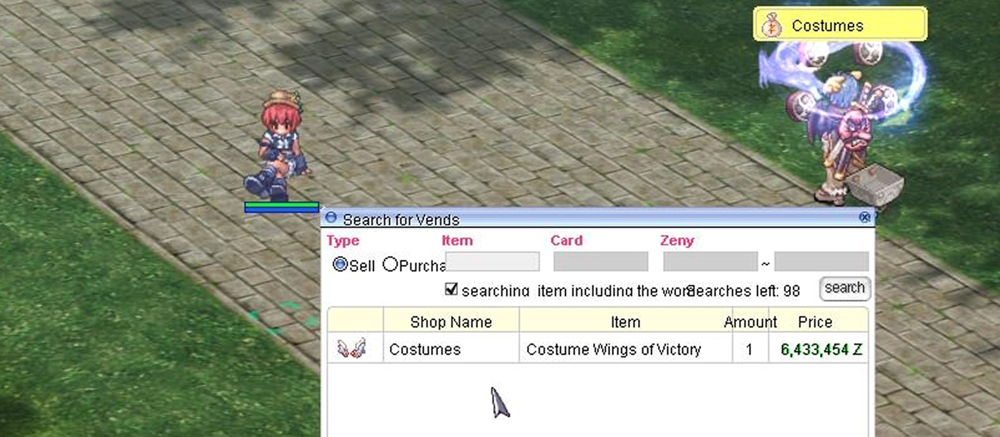

# Patch Notes – June 25, 2025

---

## 🌊 Twilight Festival

As part of the summer event, join the **Twilight Event** and enjoy the season.
During this event, you'll gain access to a special map (**Lasagna Dungeon**) filled with mobs where you can farm **tickets** that can be exchanged for **quest items** and spins on the **Wheel of Fortune** for unique rewards.

### Event Map Mechanics
- On death, there's a small chance to drop **1 Poring Coin** or **1 ticket** from your inventory.
- You will **not lose EXP** on death.
- **Kraken MVP** is available to hunt.

!!! info "Event Duration"
    The event runs until the end of summer. Wheel of Fortune prizes rotate with each maintenance. [Guide and item list](Twilight_Festival.md).

---

## 📊 Hunting Mission Revamp

- Integrated point system (no loss).
- Choose mission tier based on mob level.
- Party support (mob count scales with party size).
- Missions can be dropped at 50k.
- 8-hour cooldown, character-bound.
- Progress shown in the quest tooltip on the right panel.

---

## 🏩 New Vending Interface

- `@whobuy` and `@whosell` now open a vending list window.
- View **item prices across shops** in a unified window.
- **Double-click** to view any shop.
- **Buy directly** from your location if you're in town.
- Outside town, it shows the **vendor’s location**.

---

## ⚔️ Battlegrounds Updates

- **6th BG Mode** "Time & Space Anomaly" now includes **PvP mechanics**.
- **Valorous Assaulter's Katzbalger** added to BG weapon shop.
- **Auras** added to BG **team leaders**.
- **BG rental items** added in **box form**.
> 📌 *Note: BG rental items grant their effects only on **Battlegrounds** and the **PvP Izlude map**.*
---

## 🐾 New Pets

**Newly tamable companions:**

- Wandering Duck
- Abysmal Knight
- Mutated White Knight
- Roween
- Eddga
- Wild Rose
- Dark Lord
- Dark Illusion
- Dark Priest
- Fire Golem

!!! note "More details"
    Page with detailed pet abilities and mechanics is currently in progress.

---

## ⚙️ Gameplay Changes

- **Biolab 4** monsters now use **enhanced skills and AI**. Bio Lab 3 is **more challenging**.
- **Rotating Bonus EXP** areas now apply to full regions (e.g., all GH maps excluding OGH).
- **Old Glast Heim** access now requires **level 99**.
- **Repeatable Kill Quests** (Lv 70+) now give **increased EXP**.

!!! tip "Newly enchantable items"
    - `Ninja Suit [1]`
    - `Novice Breastplate`
    - `Angelic Protection`

- **Medicine Bowl** now sold by **major tool dealers**.
- **Shinobi Sash [1]** added via **S-Tier Leablem** (5% success, 1m zeny + 1 elunium).
- Ninja Suit combo works with **slotted and non-slotted** versions.
- **Umbala Spirit (0)** added to **Dimonka**.
- **Magazine Dealer NPC** no longer restricts bullets by class.
!!! warning "Pre-Trans WoE"
    Restriction list has been updated.
- **Inverse Scale [3]** added via **S-Tier socket crafting**.

### Equipment Adjustments

- **Knuckle weapons** size penalty adjusted:
  - **Old:** 100/75/50
  - **New:** 100/100/75

- **Manuk** and **Splendid Coins** now **sellable** to NPCs.
- **Royal Jelly** sell price reverted to **3500z**.
- **Acorn** price reverted.
- **GH entrance** moved to **top of dungeon warper list**.

---

## 🛠️ Fixes

- Fixed BG debuff bug from *Please Don’t Forget Me*.
- **Monocle** re-added to **Prontera tool dealer**.
- **Treasure Boxes** blacklisted from **Disguise Event**.
- Updated **NPC dialogues**.
- Fixed **Twilight 3 skill** description to reflect 100 bottles each (alcohol, acid, grenade).
- Adjusted **Prontera Inn** warp coordinates.
- **Red Butterfly Wing Box** opens without confirmation.
- Corrected **item descriptions** to match server mechanics.
- **Lord of Vermillion** now hits **1x per tick** on barriers/emp.
- More fixes to **website merchant list**.

---

## 🔪 Skill Changes

### Gunslinger
- **Madness Canceller:** SP 30 → 15, Coins 4 → 2
- **Increasing Accuracy:** SP 30 → 15, Coins 4 → 2

### Ninja
- **Crimson Fire Blossom (Lv 7–10):** SP 30
- **Lightning Spear of Ice (Lv 6–10):** SP 30

### Other
- **EDP** duration extended by **30 seconds** at max level.
- **Blast Mine** and **Claymore Trap** reverted to **pre-renewal** behavior.

---

## 🎭 Costumes

- New **donation costumes** now available in the **Cash Shop**.
- **Valkyrie Helm Costume** introduced with **multiple color variants**.

---

## ⭐ Leave Us a Review!

If you enjoy playing here, please take a moment to **leave us a review on RMS**.
Your feedback helps us grow and keeps the community thriving!
It only takes a minute and really helps us reach more players.

👉 [**Rate Our Server on RMS**](https://ratemyserver.net/index.php?page=serverstat&serid=22526&itv=6&url_sname=UARO)

---
