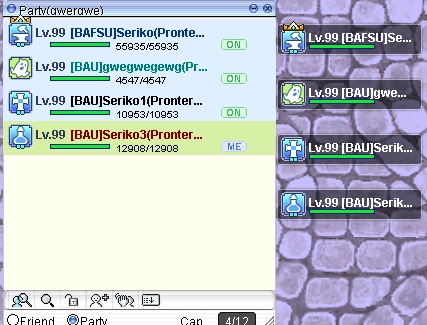
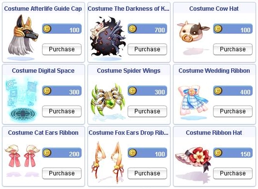

# Patch Notes - 09/01/2025

## General

- **Client Proxies**
  Added built-in proxy tunnels for smoother gameplay outside the server’s region.

  **Available locations:**
    - `New York`
    - `São Paulo`
    - `Singapore` (preferred for Asia players)
    - `Tokyo`
    - `Sydney`

  > **Note**  
  > Proxies will be tested during the month; locations/behavior may be adjusted based on performance.

- **Gold Point System / Redemption Revamp**  
  Instead of exchanging for Gift/Blue Boxes, you now redeem **Virtual Points** for **Golden Coins**:

  | Virtual Points | Reward                | Notes                             |
  |----------------|-----------------------|-----------------------------------|
  | `120`          | `1 × Golden Coin`     |                                   |
  | `240`          | `1 × Gold Coin Box`   | Contains `2 × Golden Coin`        |
  
  Golden Coins can be exchanged for **costumes** in the **Main Office**.  
  **Rotation:** Costumes (and possibly some consumables later) will rotate periodically.

- **Spawn Table Updates**
  - Added non-boss mobs from `Bio4`, `HTF`, `OGH` to the DB spawn table.
  - Added **auras** to mini-bosses in `Bio3/4`.

- **Thor Volcano Quest**
  - Added **iRO Thor Volcano Level 2 Access Quest**.  
    Rewards: `200k` Base EXP / `150k` Job EXP.

---

## Quality of Life (QoL)

- **Barter NPC**: `Dusty Tomb Volumes → 20 × Temporal Crystals` each.
- **Party Menu Buff Letters**: `B` = Blessing, `A` = Agi Up, `F` = FCP, `S` = Soul Link, `U` = Assumptio.
  

- **Party Loot**: Added `Enriched Elu/Ori Box` to party member loot display message.
- **Guarana Candy**: Bulk purchase up to `300` each from the quest NPC.
- **Cursed Water**: Bulk conversion at **Niff Fountain**; choose `Singular` or `All` (based on empty bottles). Includes
  weight check.
- **Drop Identifiers**: Added `Incubus` + `Succubus` egg identifiers to party drop messages.
- **Guild MOTD Visibility**: Moved to bottom of login list for visibility.
- **Minimap Recall**: Added “previous position” marker when using `Teleport`, `Fly Wing`, `Infinite Fly Wing`.  
  Marked as a blinking `+` on the minimap.  
  Configurable client-side via `@settings`.

---

## Items

- **Bag of Gold Coins**: Weight reduced `1500 → 500`.

  > **Note**  
  > Remains **untradeable** with **move restrictions** limited to **personal storage**.

- **Poring Coin**: No longer sellable to NPCs.
- **Snake Hat [0]**: Added as a rare drop from **Evil Snake Lord** MVP at `0.9%`.

  > **Note**  
  > **Chick Hat** remains available as a quicker alternative via the
  > **Dimonka Questable Headgear** in the **Main Office**.

- **Anubis Hat**: Now refinable.
- **Wanderer’s Skull (taming item)**: Move restrictions lifted.
- **Fallen Bishop**: Added **Crown of Deceit** to drop table; `INT` adjusted `4 → 3`.
- **Event Costumes**: Added new event costumes and removed a few from the **Event Ticket** shop
  (Event Token NPC in Main Office).
- **OCA Pool Cleanup**: Removed blocked **Culvert** mob cards that do not exchange at the card NPC:
  - `Thief Bug`
  - `Male Thief Bug`
  - `Female Thief Bug`
  - `Tarou`
  - `Plankton`

---

## NPC

- **New Hairstyles**: Released `42` styles for each gender.

  > **Warning**  
  > Styles `38–42` may only have default colors; additional colors are bugged and may not apply.

- **Manual Exchange (100%) – Main Office**: Added `x1` exchanges for:
  - `Level 10 Blessing Scroll Box (10 scrolls)`
  - `Level 10 Agi Scroll Box (10 scrolls)`
  - `Kafra Card ×1`

- **Expanded Tool Dealers**: Added `Meat`.
- **Katryn (PC 500x Costumes, Main Office)**: Added `10` costumes.
  
- **Inn Updates**:
  - Added **Inn** to **Eastern Izlude**.
  - Relocated **Payon Inn** NPC to a more convenient position.
  - Added **Hobota Daily Mission NPC** to **all Inns**.

- **PC Exchange Headgear NPC “Katryn”**: Added **Zodiac Crown** + **Diadem** costumes.
- **Headgears Added (Nerfed)**:
  - `Mercury Riser [1]`
  - `Blood Sucker` (Lower)

---

## Commands

- **`@lootconfig` Preset Menus (Reconstructed)**:
  - **Group Function** added (initially displayed as `List 1`).
  - Groups can be **renamed**.
  - Max **20** groups.
  - **Clear all** by deleting and recreating the list.
  - Add/subtract **single items** within each list remains supported.

- **Guild Storage Logs – `@guildlog` (in-game)**  
  Will be added to **Control Panel** later.  
  **Features:**
  - `150` lines per query
  - Time ranges: `last 24h / 7d / 30d / all time`
  - Filter: `Withdraw / Deposit / Both`
  **Permissions (configurable by Guild Leader):**
  - `Guild Leader only`
  - `All storage-access members` (based on in-game title)
  - `All members`

---

## Skills

- **Cart Revo / Cart Termination**: Removed **weight** from formula (acts as if cart weight is **max**).
- **Shadow Slash (Ninja)**: Correctly flagged as **physical melee**.
- **Magnus Exorcismus**: Damage ticks correctly even when caster is `Stunned / Petrified / Frozen`.
- **Sighttrasher**: Now checks for **obstructions** before applying damage.
- **Stat/Skill Reset NPC Improvements**:
  - First reset for **New and Existing** players is **server-wide (character-based)** for each of `Stat / Skill / Both`.
    Prices unchanged.
  - Added **confirmation** prompts before reset.

- **Preserve (Skill)**:
  - Now a **toggle** on/off.
  - **Persists** through logout.
  - Still **dispellable** unless **Soul Linked**.

- **Super Novice – 3 Skills Added (Nerfed)**

  > **Note**  
  > The added “ATK” behaves like **Sword Mastery** (applied in damage formula) and **will not** appear on `ALT+A`
  > Attack stat.
  

- **Gunslinger – Adjustment**:
  - `SP`: `15 → 10`
  - `Coin`: `2 → 1`
  - `Duration`: `30s → 60s`

---

## Pre-Trans WoE Changes

- **Guild Menu Warp**: Disabled **during Pre-Trans WoE**; re-enabled outside WoE (warps next to lever).
- **Guild Flag Warp**: Relocated to **castle entrance** to prevent ultra-fast defender returns.
- **Traps**: Limited to **10 per Hunter**. Using an 11th destroys the **oldest** active trap (even if Snare is active).
- **Dispel & Traps**: Players are **no longer removed** from Snare effects by Dispel (friendly or non-Sages).
- **Gym Pass**: Enlarge Weight Limit has **no effect** in Pre-Trans WoE.  
  Merchant class still retains base skill behavior.
- **Blocked Gear**: **Icepick** / **Combat Knife** and **enchants** are blocked **inside the castle**.

  > **Important**  
  > These restrictions apply **inside the castle only**. Adjust `@restock` and manage weight **before** entering.

---

## BG (Battlegrounds)

- Fixed: **Leather of Tendrilion** garment now equipable.
- Fixed: **Indestructible** status on **BG Chest – Elite Engineering Armor** now works.

---

## Pets

**Edited Pet Intimacy Tables** (Autofeed unchanged):

```
HungerDecrement        = 3 (all)
OwnerDeathDecrement    = 5 (all)

FeedIncrements:
- Evolved (1st tier)         = 40
- Evolved (2nd or final)     = 30
- Evolved (3rd and final)    = 20
- Non-evolvable              = 30

Exceptions:
- Phreeoni (MVP, final)      = 20
- Incubus / Succubus         = 20
```

---

## Fixes

- Acolyte job change quest NPC name standardized to **Father Yosuke**.
- **Atque Poenitenia** costume effect fixed.
- **Poporing Egg** autofeed fixed.
- **Phiagasia Scarf** effect fixed.
- **Enriched Mission Point Boxes**: Added **item + weight checks** to prevent use at max items/weight.
- **Gym Pass Box**: Added **count/weight checks** to prevent accidental use.
- **Wild Beast Claw** (Katar): Now properly procs on **physical attacks**.

---

## Refactoring

**“The Sign” Quest – Flow Simplification**

- **Time-gate removals**:
  - **Sir Jore**: time frame disabled (turn in freely).
  - **Pirupiru**: time frame disabled.
  - **Engel** & **Archeologist (Metz)**: turn-in/pickup windows changed to a **static 2+ hours**.  
    Drop off items → wait **2 hours** → pick up **any time after** to progress.

- **Action prompts**:
  - Added **confirmation** before fishing/mining animations at pools.
  - Default dialog option now **cancels** animation immediately (`OK` / `Enter`).

---

## Cash Shop

- **Cart Sprites**: Added `5` new cart sprites unlockable via **Cash Shop Voucher**
  (tradeable; Merchant classes only).

  

- **Costumes**: Small set of new costumes added.
  

---

## ❤️ Support the Server!


If you love the server, please consider **leaving a review on RMS**.
Your feedback helps us grow and keeps the community thriving! 🚀

👉 [**Rate Our Server on RMS**][rms-link]

[rms-link]: https://ratemyserver.net/index.php?page=detailedlistserver&serid=22102&itv=6&url_sname=UARO%20World%20of%20your%20dream

---
